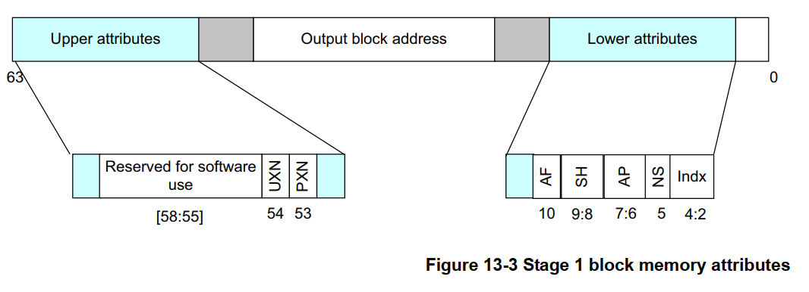
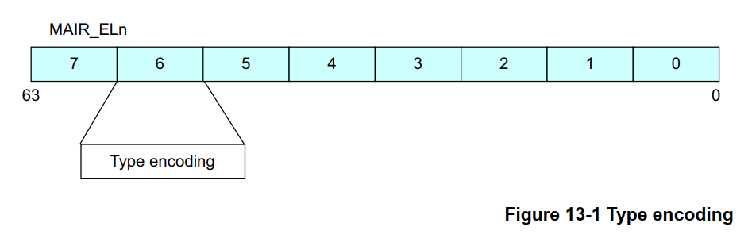
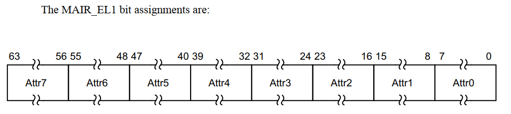
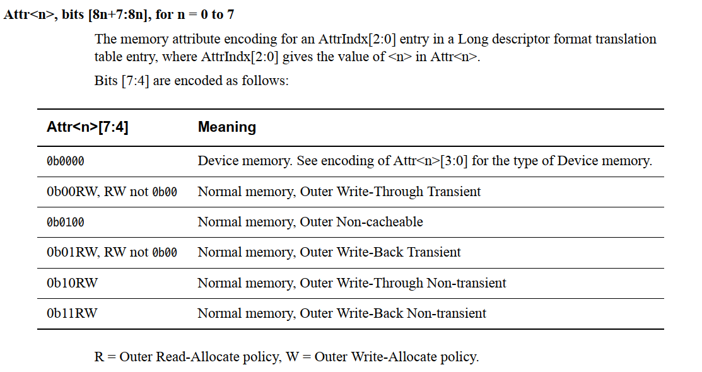
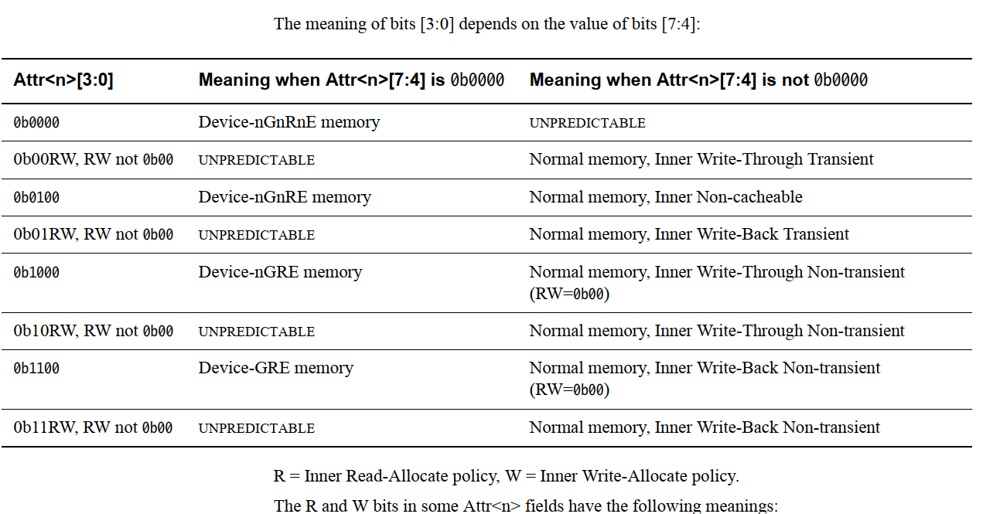

# ARM64之内存属性

**一、ARM64 PTE表项构成**

ARM页表表项主要有几个功能：

1、地址映射，通过虚拟地址找到对应的物理页面

2、控制内存的访问权限，内核空间和用户空间等的内存访问权限不同

3、控制内存的访问属性，即本章节主要内容。其中bit\[4:2\] 指向了该pte所具备的属性值

4、其他



**二、不同内存映射接口或映射方式使用不同的内存属性**

内核中ARM64定义的属性如下，每种属性实质上是一个索引值，这个索引值表示了MAIR\_ELn寄存器中具体的属性区域：

```
#define PROT_DEVICE_nGnRnE      (PROT_DEFAULT | PTE_PXN | PTE_UXN | PTE_DIRTY | PTE_WRITE | PTE_ATTRINDX(MT_DEVICE_nGnRnE))
#define PROT_DEVICE_nGnRE       (PROT_DEFAULT | PTE_PXN | PTE_UXN | PTE_DIRTY | PTE_WRITE | PTE_ATTRINDX(MT_DEVICE_nGnRE))
#define PROT_NORMAL_NC          (PROT_DEFAULT | PTE_PXN | PTE_UXN | PTE_DIRTY | PTE_WRITE | PTE_ATTRINDX(MT_NORMAL_NC))
#define PROT_NORMAL_WT          (PROT_DEFAULT | PTE_PXN | PTE_UXN | PTE_DIRTY | PTE_WRITE | PTE_ATTRINDX(MT_NORMAL_WT))
#define PROT_NORMAL             (PROT_DEFAULT | PTE_PXN | PTE_UXN | PTE_DIRTY | PTE_WRITE | PTE_ATTRINDX(MT_NORMAL))

/*
* Memory types available.
*/
#define MT_DEVICE_nGnRnE        0
#define MT_DEVICE_nGnRE         1
#define MT_DEVICE_GRE           2
#define MT_NORMAL_NC            3
#define MT_NORMAL               4
#define MT_NORMAL_WT            5
```

例如ioremap使用的不同内存属性，这些属性决定了CPU对内存的访问特征

```
#define ioremap(addr, size)             __ioremap((addr), (size), __pgprot(PROT_DEVICE_nGnRE))
#define ioremap_nocache(addr, size)     __ioremap((addr), (size), __pgprot(PROT_DEVICE_nGnRE))
#define ioremap_wc(addr, size)          __ioremap((addr), (size), __pgprot(PROT_NORMAL_NC))
#define ioremap_wt(addr, size)          __ioremap((addr), (size), __pgprot(PROT_DEVICE_nGnRE))
```

页面默认的映射方式

```
#define _PAGE_DEFAULT           (_PROT_DEFAULT | PTE_ATTRINDX(MT_NORMAL))
```

内核页面映射方式

```
#define PROT_NORMAL             (PROT_DEFAULT | PTE_PXN | PTE_UXN | PTE_DIRTY | PTE_WRITE | PTE_ATTRINDX(MT_NORMAL))

#define PAGE_KERNEL             __pgprot(PROT_NORMAL)
#define PAGE_KERNEL_RO          __pgprot((PROT_NORMAL & ~PTE_WRITE) | PTE_RDONLY)
#define PAGE_KERNEL_ROX         __pgprot((PROT_NORMAL & ~(PTE_WRITE | PTE_PXN)) | PTE_RDONLY)
#define PAGE_KERNEL_EXEC        __pgprot(PROT_NORMAL & ~PTE_PXN)
#define PAGE_KERNEL_EXEC_CONT   __pgprot((PROT_NORMAL & ~PTE_PXN) | PTE_CONT)
```

三、ARM64 中MAIR\_ELn寄存器中定义了索引对应的具体属性值

1、MAIR\_ELn有8个8bit组成，每个区域表示一组属性，linux内核在\_\_cpu\_setup 函数中初始化：





2、\_\_cpu\_setup 初始化时设置mair\_el1

```
        /*
         * Memory region attributes for LPAE:
         *
         *   n = AttrIndx[2:0]
         *                      n       MAIR
         *   DEVICE_nGnRnE      000     00000000
         *   DEVICE_nGnRE       001     00000100
         *   DEVICE_GRE         010     00001100
         *   NORMAL_NC          011     01000100
         *   NORMAL             100     11111111
         *   NORMAL_WT          101     10111011
         */
        ldr     x5, =MAIR(0x00, MT_DEVICE_nGnRnE) | \
                     MAIR(0x04, MT_DEVICE_nGnRE) | \
                     MAIR(0x0c, MT_DEVICE_GRE) | \
                     MAIR(0x44, MT_NORMAL_NC) | \
                     MAIR(0xff, MT_NORMAL) | \
                     MAIR(0xbb, MT_NORMAL_WT)
        msr     mair_el1, x5
```

pte页表项entry的bit\[4:2\]表示具体的属性索引，指向具体的mair\_eln的8个区域中的一个，即决定了该pte表项对应的内存访问属性

**四、MAIR\_ELn寄存器属性值详细**

ATTR\<7:0\>组成如下，每个属性区域为8bit，分成两部分bit\[7\-4\] 和bit\[3\-0\]，具体分布如下：





**五、内存属性可以分为normal和device两种type**

1、normal memory

对于normal memory，可以是non\-cacheable的，也可以是cacheable的，这样就需要进一步了解Cacheable和shareable atrribute

（1）是否cacheable

（2）write through or write back

（3）Read allocate or write allocate

（4）transient or non\-transient cache

2、device memory

对于device type，其总是non cacheable的，而且是outer shareable，因此它的attribute不多，主要有下面几种附加的特性：

（1）Gathering 或者non Gathering \(G or nG\)。

         这个特性表示对多个memory的访问是否可以合并，如果是nG，表示处理器必须严格按照代码中内存访问来进行，不能把两次访问合并成一次。例如：代码中有2次对同样的一个地址的读访问，那么处理器必须严格进行两次read transaction。

（2）Re\-ordering \(R or nR\)。

        这个特性用来表示是否允许处理器对内存访问指令进行重排。nR表示必须严格执行program order。

（3）Early Write Acknowledgement \(E or nE\)。

        PE访问memory是有问有答的（更专业的术语叫做transaction），对于write而言，PE需要write ack操作以便确定完成一个write transaction。为了加快写的速度，系统的中间环节可能会设定一些write buffer。nE表示写操作的ack必须来自最终的目的地而不是中间的write buffer。
