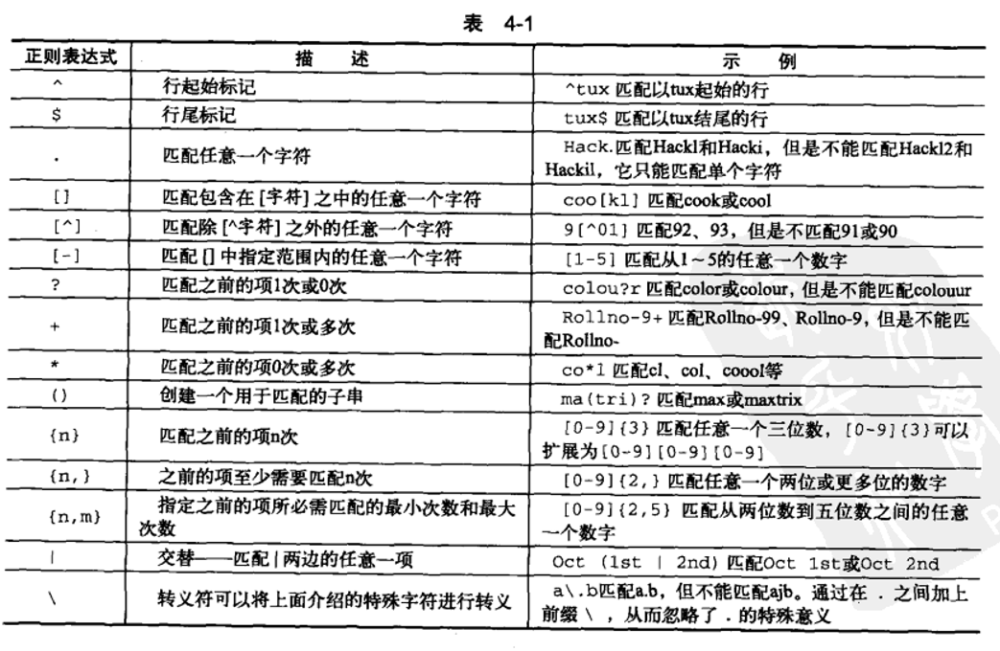
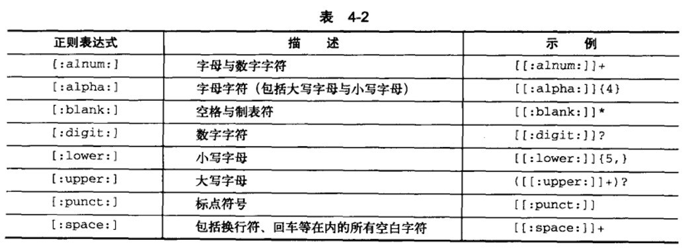

# Linux命令之shell学习

`shell`

**第一�**�

1、bash中每个命令或命令序列是以换行符或分号来分隔

2、 \#\!是对脚本的解释器程序路径，脚本的内容是由解释器解释的  通常脚本第一句是\#\!/bin/bash

3、字符\#作为注释，一直延续到行尾

4、echo之无引号，单引号以及双引号：  echo每次调用后都会默认添加一个换行符

     无用引号：不能打印分号，分号是分隔符，像感叹号也是会做特殊处理的

     单引号：bash不会对单引号中的变量求值，而是原样显示

     双引号： 两个双引号包围起来的字符串，部分特殊字符将起到它们的作用.  这些特殊字符有: 美元符$, 反斜杠\\, 反引号,  感叹号\!

     反引号（ESC下面的键）： 两个反引号包围起来的字符串，将作为命令来运行，执行的输出结果作为该反引号的内容，称为命令替换，

5、printf在bash中和C中一样做格式化输出

6、echo 彩色打印        echo \-e "\\e\[1;31m lilong \\e\[0m"

7、在bash中，每个变量的值都是字符串，并且不需要预先声明变量

8、查看当前进程的环境变量，cat /proc/$PID/environ    （测试发现当前进程也没有PID环境变量）

     lilong@ubuntu:~/shell$ pgrep bash

     2990

     使用pgrep命令查看某一进程的ID

9、进程的环境变量形式：PWD=/home/lilong   变量间以'\\0'结束，

 cat /proc/2990/environ | tr '\\0' '\\n'

     将\\0替换成换行符，就能一行打印一条环境变量了，跟uboot下面环境变量形式是一样的

10、变量初始化，加双引号可以解决空格等特殊符号的问题的问题，变量本质上就是一个字符串

     NAME=lilong

     CITY="hangzhou binjiang"

     单引号应该和双引号是一样的作用

11、通常当前环境变量是未在当前进程中定义的，而是从父进程中继承而来。

      export用来设置环境变量，至此之后从当前shell脚执行的程序都将继承该环境变量，可以根据需要在应用程序或者shell脚本中导出环境变量

      export应该是把环境变量设置到当前进程的环境变量中去，使得该环境变量在该进程启动的进程中都有效

12、bash自动在PATH环境变量中所指的路径下寻找命令，PATH环境变量路径间以：分隔

     通常用法：export PATH="$PATH:/home/user/bin"

13、获取变量长度：echo ${\#SHELL}   =\>  9

       当前使用的shell类型：$SHELL  

14、bash中可以通常使用的计算工具有：let   \(\( \)\) \[ \] expr  bc

15、文本重定向

          \> 和 \>\>  都是重定向，但是前者会先清除文本内容，后者直接追加

          重定向符前面加文件描述符，可以指定重定向的文件，不加默认为1，标准输出

          可以使用&\>  和2\>&1  这样的方法输出到一个文件中去

16、命令执行成功之后会返回0，否则返回1，在下一个命令中用个$?取变量值可以取出这个值

17、  tee可以把从标准输入来的数据，保存一份到文件中去，并把一份数据传递到表准输出，这样就可以同时做到保存到文件和到标准输出

           cat test1.sh   | tee test2.sh | cat

 18、 linux shell的here document用法\(cat \<\< EOF\)

   Here Document 是在Linux Shell 中的一种特殊的重定向方式，它的基本的形式如下   

     cmd \<\< delimiter

     Here Document Content

     delimiter

  它的作用就是将两个 delimiter 之间的内容\(Here Document Content 部分\) 传递给cmd 作为输入参数。

          \#\!/bin/bash

          cat \<\<EOF\> log.txt

          LOG FILE HEADER

          This is a test file

          EOF

这个命令可以同时将content内容重定向到log.txt中去

19、一定要用array\_xxx来定义数组变量名否则应该就不是数组了，

在Shell中，用括号来表示数组，数组元素用“空格”符号分割开。定义数组的一般形式为：

    array\_name=\(value1 ... valuen\)

例如：

array\_name=\(value0 value1 value2 value3\)

还可以单独定义数组的各个分量：

[纯文本](http://c.biancheng.net/cpp/view/7002.html#)[复制](http://c.biancheng.net/cpp/view/7002.html#)

array\_name\[0\]=value0

array\_name\[1\]=value1

array\_name\[2\]=value2

可以不使用连续的下标，而且下标的范围没有限制。

读取数组元素值的一般格式是：

  ${array\_name\[index\]}

例如：

valuen=${array\_name\[2\]}

使用@ 或 \* 可以获取数组中的所有元素，例如：

${array\_name\[\*\]}

${array\_name\[@\]}

获取数组长度的方法与获取字符串长度的方法相同，例如：

\- \# 取得数组元素的个数

\- length=${\#array\_name\[@\]}

\- \# 或者

\- length=${\#array\_name\[\*\]}

\- \# 取得数组单个元素的长度

\- lengthn=${\#array\_name\[n\]}

操作实例：

var=\(1 2 3 4\)

echo ${var\[0\]}

echo ${var\[1\]}

20、关联数组，类似于c语言中的枚举作用，将类型关联起来

操作实例：

\#先声明

declare \-A first\_value

first\_value=\(\[apple\]='100' \[orange\]='150'\)

echo "${first\_value\[apple\]}"

echo "${first\_value\[orange\]}"

21、tput和stty是两款用于收集和处理终端设置的工具

     控制输出位置颜色时非常有用

22、shell脚本延时

          sleep s    \#s为秒

23、shell脚本调试

      sh \-x test2.sh  \#加\-x参数，可以把脚本中命令和参数也一行行打印出来

 24、bash支持函数

     语法：   

\[ function \] funname \[\(\)\]

{

     action;

     \[return int;\]

}

可以带function fun\(\) 定义，也可以直接fun\(\) 定义,不带任何参数。

参数返回，可以显示加：return 返回，如果不加，将以最后一条命令运行结果，作为返回值。 return后跟数值n\(0\-255）

命令里面获得参数方法可以通过：$0…$n得到。 $0代表函数本身

  bash函数支持递归调用，以下是一个fuck脚本，不停的递归调用

\#\!/bin/bash

fuck\(\)

{

    echo "$0";

    fuck ;

    sleep 1;

}

fuck

bash函数也可以和变量一样用export来导出，使得子进程也能调用

export \-f fname

25、read是bash脚本中一个重要的命令，其可以从键盘或标准键盘中读取输入，有很多种用法

       read \-n  number\_of\_chars  var\_name   \#读取number\_of\_chars 个字符var\_name中去

        read \-n 2 var   \#读取两个字符到变量var

26、IFS是一个存储界定符的环境变量，默认值为空格。和for循环语句配合使用

27、bash循环

 for循环， ”for” 循环总是接收 “in” 语句之后的某种类型的字列表。在本例中，指定了四个英语单词，但是字列表也可以引用磁盘上的文件，甚至文件通配符。

\#\!/bin/bash

for x in one two three four

do

        echo number $x

done

\#对目录中的文件循环访问

for x in /var/log/\*

do

        \#echo "$x is a file living in /var/log"

        echo $\(basename $x\) is a file living in /var/log

done

\#通过seq来产生固定次数的循环

echo "for: Traditional form: for var in ..."

for j in $\(seq 1 5\)

do

        echo $j

done

\#C语言形式的循环  在ubuntu上以./的形式运行没问题，但是以sh命令启动的形式运行有问题

echo "for: C language form: for \(\( exp1; exp2; exp3 \)\)"

for \(\( i=1; i\<=5; i\+\+ \)\)

do

        echo "i=$i"

done

\#{a..z}  {1..10}  都可以表示一长串字符

for i in {a..z};do echo "$i"; done;

while循环   只要值为真，就循环

\#\!/bin/bash

myvar=1

while \[ $myvar \-le 10 \]

do

        echo $myvar

        myvar=$\(\( $myvar \+ 1 \)\)

done

until循环    “Until” 语句提供了与 “while” 语句相反的功能：只要特定条件为假，它们就重复。

\#\!/bin/bash

myvar=1

until \[ $myvar \-gt 10 \]

do

        echo $myvar

       myvar=$\(\( $myvar \+ 1 \)\)

done

bash中自增变量的形式有这么多

1. i=\`expr $i \+ 1\`;

2. let i\+=1;

3. \(\(i\+\+\)\);

4. i=$\[$i\+1\];

5. i=$\(\( $i \+ 1 \)\)

28、比较测试

if条件:

if condition;

then

commands;

fi

在这里会以fi结尾用于提示if的结束。

else if和else：

if condition;

then

commands;

elif condition;

then

   commands;

else

   commands

fi

在if判断的条件中我们也可以使用逻辑运算符进行组合判断

\[ condition \]&& action;\#如果condition为真，则执行action

\[ condition \]|| action;\#如果为假，则执行action。

在这里注意\[和\]两个符号之间和中间的condition都会有个空格。

算数比较

在shell中有几个比较重要的比较符:

\-eq:等于

\-ne:不等于

\-gt:大于

\-lt:小于

\-ge:大于或等于

\-le:小于或等于

\-a:逻辑与

\-o：逻辑或

文件系统相关测试

我们可以使用不同的条件标志测试不同的文件系统相关属性。

\[ \-f  $file\_var \]:如果给定的变量包含正常的文件路径或文件名，则返回真。

\[ \-x $var \]:如果给定的变量包含文件可执行，则返回真。

\[ \-d $var \]:如果给定的变量是目录则返回真。

\[ \-e $var \]:如果给定的变量包含的文件存在，则返回真

\[ \-c $var \]:如果给定的变量包含的是一个字符设备文件的路径，则返回真

\[ \-b $var \]:如果给定的变量包含的是一个块设备文件的路径，则返回真

\[ \-w $var \]:如果给定的变量包含的文件可写，则返回真

\[ \-r $var \]:如果给定的变量包含的文件可读，则返回真

\[ \-L $var \]:如果给定的变量包含一个符号链接，则返回真

举例测试:

\#\! /bin/bash

fpath="/etc/passwd"

if \[ \-e $fpath \];

then

     echo File exits;

else

     echo dose not exits;

fi

输出File exits

字符串比较

使用字符串比较时，最好使用双中括号，防止使用单个中括号会产生错误，所以最好避开它们。

可以检查两个字符串，看看它们是否相同。

在shell中=和==在比较的时候都是一样的

\[\[ $str1 = $str2 \]\]和\[\[ $str1 == $str2 \]\]一样，如果相等就返回true。

\[\[ $str1 \> $str2 \]\]如果str1字母序比str2大就返回真。

\[\[ \-z $str1 \]\]:如果str1包含的是空字符串，则返回真。

\[\[ \-n $str1 \]\]:如果str1包含的是非空字符串，则返回真。

举例如下:

\#\! /bin/bash

str1="not empty"

str2=""

if \[\[ \-n $str1 \]\] && \[\[ \-z $str2 \]\];

then

echo ok;

fi

输出OK

tar czvf test.tar.gz    .\[\!.\]\*    \*   tar压缩隐藏和非隐藏文件

**第二�**�

1、shell中总是用 \- 符号来表示标准输入

2、正则表达式是通配符的高级形式

3、script  \-t 2\>timing.log \-a output.session        录制会话

     scriptreplay  timing.log   output.session         播放会话

 4、find 命令

用法: find \[\-H\] \[\-L\] \[\-P\] \[\-Olevel\] \[\-D help|tree|search|stat|rates|opt|exec\] \[path...\] \[expression\]

find . \\\( \-name "\*.txt" \-o \-name "\*.sh" \\\)

find .  \-regex ".\*\\\(\\.py\\|\\.sh\\\)$"   正则表达式

find . \-path "\*sh\*"

find . \! \-name  "\*.sh"         否定参数， 加！表示查找非.sh结尾的文件

find . \-mindepth 4 \-name "\*.sh"   指定最小深度

find . \-maxdepth 3 \-name "\*.sh"     指定最大深度

find .  \-type d

find . \-atime \+7     最近访问大于7天的文件

find . \-type f  \-size \+2k     查找大于2k的普通文件

find . \-type f  \-size \-2c     查找小于2个字节的文件

find . \-user lilong     查找用户是lilong的文件

find . \-name "\*.sh" \-exec ls {} \\;    \-exec执行命令动作     {} 表示匹配文件    \\;应该是结束符

find . \-name "\*.sh" \-exec ./cmd.sh  {} \\;     将多个命令放到cmd.sh中，实现\-exec运行多个命令

5、xargs命令

find . \-name "\*.sh" | xargs ls

find . \-name "\*.sh" | xargs \-I {}  ls {}   操作每一个文件，ls命令执行若干次

总结：管道符后不加xargs相当于先将xargs后面的命令回车执行一下再从键盘里输入

管道符前面命令执行的结果内容

加上xargs 相当于直接从键盘输入管道符前面命令执行的结果内容再回车

再总结一下，就是回车的先后顺序不太一样。

6、tr命令

tr \[选项\]... SET1 \[SET2\]

  \-c, \-C, \-\-complement        首先补足SET1

  \-d, \-\-delete            删除匹配SET1 的内容，并不作替换

  \-s, \-\-squeeze\-repeats    如果匹配于SET1 的字符在输入序列中存在连续的

SET 是一组字符串，一般都可按照字面含义理解。解析序列如下：

  \\NNN    八进制值为NNN 的字符\(1 至3 个数位\)

  \\\\        反斜杠

  \\a        终端鸣响

  \\b        退格

  \\f        换页

  \\n        换行

  \\r        回车

  \\t        水平制表符

  \\v        垂直制表符

  字符1\-字符2    从字符1 到字符2 的升序递增过程中经历的所有字符

  \[字符\*\]    在SET2 中适用，指定字符会被连续复制直到吻合设置1 的长度

  \[字符\*次数\]    对字符执行指定次数的复制，若次数以 0 开头则被视为八进制数

  \[:alnum:\]    所有的字母和数字

  \[:alpha:\]    所有的字母

  \[:blank:\]    所有呈水平排列的空白字符

  \[:cntrl:\]    所有的控制字符

  \[:digit:\]    所有的数字

  \[:graph:\]    所有的可打印字符，不包括空格

  \[:lower:\]    所有的小写字母

  \[:print:\]    所有的可打印字符，包括空格

  \[:punct:\]    所有的标点字符

  \[:space:\]    所有呈水平或垂直排列的空白字符

  \[:upper:\]    所有的大写字母

  \[:xdigit:\]    所有的十六进制数

  \[=字符=\]    所有和指定字符相等的字符

cat test1.sh   |  tr '1'   '2'     将SET1字符替换成SET2字符

cat test1.sh   |  tr  \-d   '1'     删除字符1

test1.sh   |  tr  \-d  \-c  '0\-9'     将非0\-9的数字都删除，即删除0\-9的补集

7、md5sum命令     生成32个字符16进制校验和数据

md5sum test1.sh \> test1.sh.sum

root@ubuntu:/home/lilong/shell\# md5sum  \-c  test1.sh.sum

test1.sh: 确定

md5sum  \*.sh \> test.md5

SHA1和md5sum使用方式相同，只需把md5sum命令换成sha1sum就可以了

可以使用md5deep命令来对文件夹求md5值

8、sort命令实现从文本或stdin排序、uniq命令实现从文本或stdin查找重复数据

    sort  sort\_test.txt  | uniq \-c

9、split     分割文件，生成多个文件

10、rename     重命名文件

rename \[ \-v \] \[ \-n \] \[ \-f \] perlexpr \[ files \]     perlexpr正则表达式

rename 'y/A\-Z/a\-z/' \*     

11、read命令

read: 用法: read \[\-ers\] \[\-a 数组\] \[\-d 分隔符\] \[\-i 缓冲区文字\] \[\-n 读取字符数\] \[\-N 读取字符数\] \[\-p 提示符\] \[\-t 超时\] \[\-u 文件描述符\] \[名称 ...\]

read \-p "input:"  no; echo $no

12、chown命令

a\-所有用户

u\-user

g\-group

o\-other

“\+”表示添加权限     “\-”表示删除权限

chmod a\+rx log.txt

13、chattr修改扩展属性，只能在（ext2、ext3、ext4）

14、grep命令

用法: grep \[选项\]... PATTERN \[FILE\]...

在每个 FILE 或是标准输入中查找 PATTERN。

默认的 PATTERN 是一个基本正则表达式\(缩写为 BRE\)。

\-e, \-\-regexp=PATTERN      用 PATTERN 来进行匹配操作

grep \-E "\[a\-z\]\+" . \-r \-\-include=\*.txt     只在txt文件中搜索

grep \-E "\[a\-z\]\+" . \-r \-\-exclude=\*.session     在排除session的文件中搜索

15、cut命令

cut \-f 2 cut.tst     打印第二列

 \-d, \-\-delimiter=分界符    使用指定分界符代替制表符作为区域分界     默认定界符为制表符（tab）

 cut \-f 2 \-\-complement  cut.tst     打印除第2列之外的列

cut \-c1\-3,18\-20  iostat.info     选中1\-3,18\-20这些字符 

\-\-output\-delimiter=";"         指定选中的分解符

每种参数格式表示范围如下：

    N    从第1 个开始数的第N 个字节、字符或域

    N\-    从第N 个开始到所在行结束的所有字符、字节或域

    N\-M    从第N 个开始到第M 个之间\(包括第M 个\)的所有字符、字节或域

    \-M    从第1 个开始到第M 个之间\(包括第M 个\)的所有字符、字节或域

16、sed命令

sed 's/tps/Tps/' iostat.info     将文件中tps替换成Tps

sed \-i 's/tps/Tps/' iostat.info     \-i选项修改原文件

17、awk命令

awk是一个强大的文本分析工具，相对于grep的查找，sed的编辑，awk在其对数据分析并生成报告时，显得尤为强大。简单来说awk就是把文件逐行的读入，以空格为默认分隔符将每行切片，切开的部分再进行各种分析处理。

 awk \-F: 'BEGIN {count=0} {count=count\+1} END{print count}' /etc/passwd     统计行数

 awk \-F: 'BEGIN {count=0} {if\($4\>=100\){count=count\+1}} END{print count}' /etc/passwd

**第四�**�

1、正则表达式可以生成我们所需的如过滤、剥离、替换、搜索等各类输出结果。

2、正则表达式

    

[LINUX\_SHELL脚本攻略\(中文版带书签\).pdf](./file/LINUX_SHELL脚本攻略(中文版带书签).pdf)
