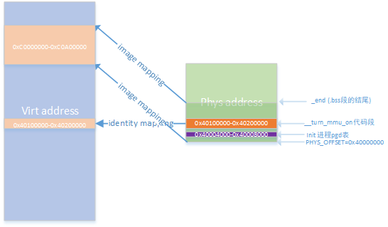

# Linux基础之arm32启动汇编分析

uImage的生成流程：

1、根据vmlinux.lds生成\-》根目录vmlinux    

2、去掉vmlinux调试信息\-》Arch/arm/boot/Image

3、将Image进行lzma压缩，末尾4个字节代表Image大小，汇编代码通过input\_data\_end获取\-》Arch/arm/boot/compressed/piggy.lzma

4、根据vmlinux.lds，将压缩内核、引导代码、自解压代码等重新组成新的vmlinx，Arch/arm/boot/compressed/piggy.lzma.o\+head.o\+misc.o\+ decompress.o                                \-》Arch/arm/boot/compressed/vmlinux

5、将新的vmlinux通过objcopy生成zImage\-》Arch/arm/boot/zImage

6、添加64字节头生成uImage\-》Arch/arm/boot/uImage

内核启动的两种情况

1、内存中内核镜像未压缩Image

Linux 非压缩内核的入口位于文件/arch/arm/kernel/head.S 中的stext，如果系统中加载的内核是非压缩的Image，那么bootloader将内核从 Flash中拷贝到 RAM 后将直接跳到stext地址处进行运行。

2、内存中内核镜像有压缩zImage，需要自解压运行。 

如果是压缩内核zImage，其主要分成两部分解压功能且未压缩的的组件代码和Image，一、boot先跳转到解压代码运行，进行自解压zImage至内存 二、跳转到解压后的stext运行。

进入stext运行时CPU状态是：MMU, D\-cache, 关闭; r0 = 0, r1 = machine nr, r2 = atags prointer

以下详细分析ARM Linux启动汇编代码，分析环境：

1、用户空间与内核空间内存 3:1  内核空间，PAGE\_OFFSET=0xC0000000

2、DDR的起始偏移0x40000000

3、Image镜像解压到物理地址0x40000000，即内存0偏移处

4、内核从虚拟地址0xc0008000（stext）即物理地址0x40008000处开始运行

5、分析用linux内核版本为4.9.94， CPU为armv7架构的vexpress

5、编译之后System.map表地址关系 

```
   1 00000024 A cpu_ca8_suspend_size
    2 00000024 A cpu_v7_suspend_size
    3 0000002c A cpu_ca9mp_suspend_size                                                                                                
    4 c0004000 A swapper_pg_dir
    5 c0008000 T _text
    6 c0008000 T stext
    7 c000808c t __create_page_tables
    8 c0008138 t __turn_mmu_on_loc
    9 c0008144 t __fixup_smp
   10 c00081ac t __fixup_smp_on_up
   11 c00081d0 t __fixup_pv_table
   12 c0008224 t __vet_atags
   13 c0100000 T __idmap_text_start
   14 c0100000 T __turn_mmu_on
   15 c0100000 T _stext
   16 c0100020 t __turn_mmu_on_end
   17 c0100020 T cpu_resume_mmu
   18 c0100044 T cpu_ca8_reset
   19 c0100044 T cpu_ca9mp_reset
   20 c0100044 T cpu_v7_reset
   21 c0100058 T __idmap_text_end
   22 c0101000 T __exception_text_start
   23 c0101000 T __hyp_idmap_text_end
   24 c0101000 T __hyp_idmap_text_start
   25 c0101000 T asm_do_IRQ
   26 c0101004 T do_undefinstr
   27 c0101224 T handle_fiq_as_nmi
   28 c01012a8 T do_IPI
   29 c01012ac T do_DataAbort
   30 c0101364 T do_PrefetchAbort
   31 c0101400 t gic_handle_irq
   32 c0101494 T __exception_text_end
   33 c01014a0 T secondary_startup
   34 c01014a0 T secondary_startup_arm
   35 c0101514 T __secondary_switched
   36 c0101520 t __secondary_data

40904 c0900000 A __data_loc
40905 c0900000 A __init_end
40906 c0900000 D __start_init_task
40907 c0900000 D _data
40908 c0900000 D _sdata

44444 c092a660 D _edata                                                                                                                
44445 c092a660 A _edata_loc
44446 c092b000 d vdso_data_store
44447 c092c000 A __bss_start

46259 c0953d7c A __bss_stop
46260 c0953d7c A _end
46261 ffff1004 t vector_rst
46262 ffff1020 t vector_irq
46263 ffff10a0 t vector_dabt
46264 ffff1120 t vector_pabt
46265 ffff11a0 t vector_und
46266 ffff1220 t vector_addrexcptn
46267 ffff1240 T vector_fiq  
```

arch/arm/kernel/head.S stext

```
ENTRY(stext)
ARM_BE8(setend    be )            @ ensure we are in BE8 mode

THUMB(    badr    r9, 1f        )    @ Kernel is always entered in ARM.
THUMB(    bx    r9        )    @ If this is a Thumb-2 kernel,
THUMB(    .thumb            )    @ switch to Thumb now.
THUMB(1:            )

#ifdef CONFIG_ARM_VIRT_EXT
    bl    __hyp_stub_install
#endif
    @ ensure svc mode and all interrupts masked
    safe_svcmode_maskall r9                   //设置CPU运行模式为SVC，并关中断

    mrc    p15, 0, r9, c0, c0        @ get processor id
    bl    __lookup_processor_type        @ r5=procinfo r9=cpuid  //通过cpu id 匹配cpu架构相关的strcut proc_info_list
    movs    r10, r5                @ invalid processor (r5=0)?
THUMB( it    eq )        @ force fixup-able long branch encoding
    beq    __error_p            @ yes, error 'p'

#ifdef CONFIG_ARM_LPAE
    mrc    p15, 0, r3, c0, c1, 4        @ read ID_MMFR0
    and    r3, r3, #0xf            @ extract VMSA support
    cmp    r3, #5                @ long-descriptor translation table format?
THUMB( it    lo )                @ force fixup-able long branch encoding
    blo    __error_lpae            @ only classic page table format
#endif

#ifndef CONFIG_XIP_KERNEL
    adr    r3, 2f
    ldmia    r3, {r4, r8}
    sub    r4, r3, r4            @ (PHYS_OFFSET - PAGE_OFFSET)
    add    r8, r8, r4            @ PHYS_OFFSET
#else
    ldr    r8, =PLAT_PHYS_OFFSET        @ always constant in this case //r8=0x4000000(phys)
#endif

    /*
     * r1 = machine no, r2 = atags or dtb,
     * r8 = phys_offset, r9 = cpuid, r10 = procinfo
     */
    bl    __vet_atags
#ifdef CONFIG_SMP_ON_UP
    bl    __fixup_smp
#endif
#ifdef CONFIG_ARM_PATCH_PHYS_VIRT
    bl    __fixup_pv_table
#endif
    bl    __create_page_tables  //创建页表映射

    /*
     * The following calls CPU specific code in a position independent
     * manner.  See arch/arm/mm/proc-*.S for details.  r10 = base of
     * xxx_proc_info structure selected by __lookup_processor_type
     * above.
     *
     * The processor init function will be called with:
     *  r1 - machine type
     *  r2 - boot data (atags/dt) pointer
     *  r4 - translation table base (low word)
     *  r5 - translation table base (high word, if LPAE)
     *  r8 - translation table base 1 (pfn if LPAE)
     *  r9 - cpuid
     *  r13 - virtual address for __enable_mmu -> __turn_mmu_on
     *
     * On return, the CPU will be ready for the MMU to be turned on,
     * r0 will hold the CPU control register value, r1, r2, r4, and
     * r9 will be preserved.  r5 will also be preserved if LPAE.
     */
    ldr    r13, =__mmap_switched        @ address to jump to after
                        @ mmu has been enabled
    badr    lr, 1f                @ return (PIC) address
#ifdef CONFIG_ARM_LPAE
    mov    r5, #0                @ high TTBR0
    mov    r8, r4, lsr #12            @ TTBR1 is swapper_pg_dir pfn
#else
    mov    r8, r4                @ set TTBR1 to swapper_pg_dir
#endif
    ldr    r12, [r10, #PROCINFO_INITFUNC]  //r12 = proc_info_list->__cpu_flush 实质上是如__v7_setup的地址
    add    r12, r12, r10
    ret    r12                              //跳转到__v7_setup运行，应该是开启mmu之前架构相关的设置
1:    b    __enable_mmu
ENDPROC(stext)
    .ltorg
#ifndef CONFIG_XIP_KERNEL
2:    .long    .
    .long    PAGE_OFFSET
#endif
```

1、arch/arm/kernel/head\-common.S \_\_lookup\_processor\_type

```
/*
* Read processor ID register (CP#15, CR0), and look up in the linker-built
* supported processor list.  Note that we can't use the absolute addresses
* for the __proc_info lists since we aren't running with the MMU on
* (and therefore, we are not in the correct address space).  We have to
* calculate the offset.
*
*    r9 = cpuid
* Returns:
*    r3, r4, r6 corrupted
*    r5 = proc_info pointer in physical address space
*    r9 = cpuid (preserved)
*/
__lookup_processor_type:
    adr    r3, __lookup_processor_type_data  //adr是伪指令，反汇编以后：add   r3, pc, #48  pc=0x401015d8 (phys)   r3=0x401015d8+0x30+8(流水线+8)=0x40101610
     ldmia    r3, {r4 - r6}                                      //r4=0xc0101610(virt) r5=0xc05c4fb8(virt) r6=0xc05c51f4(virt)
    sub    r3, r3, r4            @ get offset between virt&phys  //r4=-0x80000000  从此处计算出虚拟地址和物理地址的偏移是0x80000000   
    add    r5, r5, r3            @ convert virt addresses to     //r5=0x405c4fb8 (phys)
    add    r6, r6, r3            @ physical address space        //r6=0xc05c51f4(phys)
1:    ldmia    r5, {r3, r4}            @ value, mask             //r3=proc_info_list->cpu_val   r4=proc_info_list->cpu_mask
    and    r4, r4, r9            @ mask wanted bits              //将proc_info_list->cpu_val与proc_info_list->cpu_mask&r9(cpuid)进行比较匹配
                                                                 //如果匹配到则通过r5返回正确的proc_info_list地址
    teq    r3, r4
    beq    2f
    add    r5, r5, #PROC_INFO_SZ        @ sizeof(proc_info_list) //如果匹配失败，则r5指向下一个proc_info_list
    cmp    r5, r6
    blo    1b
    mov    r5, #0                @ unknown processor
2:    ret    lr
ENDPROC(__lookup_processor_type)
/*
* Look in <asm/procinfo.h> for information about the __proc_info structure.
*/
    .align    2
    .type    __lookup_processor_type_data, %object
__lookup_processor_type_data:
    .long    .
    .long    __proc_info_begin
    .long    __proc_info_end
    .size    __lookup_processor_type_data, . - __lookup_processor_type_data

29 struct proc_info_list {
30 ▼       unsigned int▼   ▼       cpu_val;
31 ▼       unsigned int▼   ▼       cpu_mask;
32 ▼       unsigned long▼  ▼       __cpu_mm_mmu_flags;▼    /* used by head.S */
33 ▼       unsigned long▼  ▼       __cpu_io_mmu_flags;▼    /* used by head.S */
34 ▼       unsigned long▼  ▼       __cpu_flush;▼   ▼       /* used by head.S */
35 ▼       const char▼     ▼       *arch_name;
36 ▼       const char▼     ▼       *elf_name;
37 ▼       unsigned int▼   ▼       elf_hwcap;
38 ▼       const char▼     ▼       *cpu_name;
39 ▼       struct processor▼       *proc;
40 ▼       struct cpu_tlb_fns▼     *tlb;
41 ▼       struct cpu_user_fns▼    *user;
42 ▼       struct cpu_cache_fns▼   *cache;                                                                                            
43 };
```

arch/arm/kernel/head.S \_\_create\_page\_tables  创建seciton映射 

```
/*
* Setup the initial page tables.  We only setup the barest
* amount which are required to get the kernel running, which
* generally means mapping in the kernel code.
*
* r8 = phys_offset, r9 = cpuid, r10 = procinfo
*
* Returns:
*  r0, r3, r5-r7 corrupted
*  r4 = physical page table address
*/
__create_page_tables:
    pgtbl    r4, r8                @ page table address  //pgtbl是宏定义，计算pgd页表物理地址，pgd页表地址r4=0x40004000  

    /*
     * Clear the swapper page table
     */
    mov    r0, r4
    mov    r3, #0
    add    r6, r0, #PG_DIR_SIZE   //r6=0x40008000
1:    str    r3, [r0], #4         //*0x40004000=r3  r0=r0+4 =0x40004004  通过循环将pgd页表0x40004000-0x40008000清零
    str    r3, [r0], #4
    str    r3, [r0], #4
    str    r3, [r0], #4
    teq    r0, r6
    bne    1b

#ifdef CONFIG_ARM_LPAE
    /*
     * Build the PGD table (first level) to point to the PMD table. A PGD
     * entry is 64-bit wide.
     */
    mov    r0, r4
    add    r3, r4, #0x1000            @ first PMD table address
    orr    r3, r3, #3            @ PGD block type
    mov    r6, #4                @ PTRS_PER_PGD
    mov    r7, #1 << (55 - 32)        @ L_PGD_SWAPPER
1:
#ifdef CONFIG_CPU_ENDIAN_BE8
    str    r7, [r0], #4            @ set top PGD entry bits
    str    r3, [r0], #4            @ set bottom PGD entry bits
#else
    str    r3, [r0], #4            @ set bottom PGD entry bits
    str    r7, [r0], #4            @ set top PGD entry bits
#endif
    add    r3, r3, #0x1000            @ next PMD table
    subs    r6, r6, #1
    bne    1b

    add    r4, r4, #0x1000            @ point to the PMD tables
#ifdef CONFIG_CPU_ENDIAN_BE8
    add    r4, r4, #4            @ we only write the bottom word
#endif
#endif

    ldr    r7, [r10, #PROCINFO_MM_MMUFLAGS] @ mm_mmuflags  //r7=proc_info_list->mm_mmuflags

    /*
     * Create identity mapping to cater for __enable_mmu.
     * This identity mapping will be removed by paging_init().
    * 将__turn_mmu_on_loc段代码所处的1M物理地址直接映射到地址相同的虚拟地址
     */
    adr    r0, __turn_mmu_on_loc               //add  r0, pc, #116  r0=0x40008138(phys)
    ldmia    r0, {r3, r5, r6}                  //r3=0xc0008138(virt)  r5=0xc0100000(virt)  r6=0xc0100020(virt)
    sub    r0, r0, r3            @ virt->phys offset      //r0=-80000000
    add    r5, r5, r0            @ phys __turn_mmu_on     //r5=0x40100000(phys)
    add    r6, r6, r0            @ phys __turn_mmu_on_end //r6=0x40100020(phys)
    mov    r5, r5, lsr #SECTION_SHIFT                     //r5=0x401
    mov    r6, r6, lsr #SECTION_SHIFT                     //r6=0x401
1:    orr    r3, r7, r5, lsl #SECTION_SHIFT    @ flags + kernel base //  r3 = mm_mmuflags | 0x40100000
    str    r3, [r4, r5, lsl #PMD_ORDER]    @ identity mapping        //  r4=0x40004000(phys) *(0x40004000 + 0x401*4) = r3 
                       //以上两行代码有两个疑问 A：是为何用物理地址0x40100000计算pgd表项的index？B：为何pgd表项地址内容填充的为何不是pte表地址？
    cmp    r5, r6
    addlo    r5, r5, #1            @ next section
    blo    1b
    /*
     * Map our RAM from the start to the end of the kernel .bss section.
    * 将物理地址0x40000000起始的1M空间映射到0xc0000000  
     */
    add    r0, r4, #PAGE_OFFSET >> (SECTION_SHIFT - PMD_ORDER)  //add  r0, r4, #12288; 0x3000    r0=0x40004000(phys)+0x3000
                                                                //r0=0x40007000(phys) 虚拟地址0xc0000000对应的pgd表项地址
    ldr    r6, =(_end - 1)                      // r6=0x40008134(phys)  这个end是不是有点小，bss段这么小?system.map中_end为0xc0953d7c，此处该为0x40953d7c
    orr    r3, r8, r7                           // phys_offset=0x40000000(phys)   r3=0x40000000 | mm_mmuflags
    add    r6, r4, r6, lsr #(SECTION_SHIFT - PMD_ORDER) //r6= 0x40004000+0x3000(phy)
1:    str    r3, [r0], #1 << PMD_ORDER                  //*0x40007000 = 0x40000000 | mm_mmuflags  r0=r0+4 
                                                        //设置pgd表项，将物理地址0x40000000开始的1M映射至0xc0000000
    add    r3, r3, #1 << SECTION_SHIFT                  //r3=r3+0x100000  物理地址偏移+1M
    cmp    r0, r6
    bls    1b

#ifdef CONFIG_XIP_KERNEL
    /*
     * Map the kernel image separately as it is not located in RAM.
     */
#define XIP_START XIP_VIRT_ADDR(CONFIG_XIP_PHYS_ADDR)
    mov    r3, pc
    mov    r3, r3, lsr #SECTION_SHIFT
    orr    r3, r7, r3, lsl #SECTION_SHIFT
    add    r0, r4,  #(XIP_START & 0xff000000) >> (SECTION_SHIFT - PMD_ORDER)
    str    r3, [r0, #((XIP_START & 0x00f00000) >> SECTION_SHIFT) << PMD_ORDER]!
    ldr    r6, =(_edata_loc - 1)
    add    r0, r0, #1 << PMD_ORDER
    add    r6, r4, r6, lsr #(SECTION_SHIFT - PMD_ORDER)
1:    cmp    r0, r6
    add    r3, r3, #1 << SECTION_SHIFT
    strls    r3, [r0], #1 << PMD_ORDER
    bls    1b
#endif

    /*
     * Then map boot params address in r2 if specified.
     * We map 2 sections in case the ATAGs/DTB crosses a section boundary.
    * atags/dtb映射至虚拟地址，物理地址应该是由boot传入
     */
    mov    r0, r2, lsr #SECTION_SHIFT
    movs    r0, r0, lsl #SECTION_SHIFT
    subne    r3, r0, r8
    addne    r3, r3, #PAGE_OFFSET
    addne    r3, r4, r3, lsr #(SECTION_SHIFT - PMD_ORDER)
    orrne    r6, r7, r0
    strne    r6, [r3], #1 << PMD_ORDER
    addne    r6, r6, #1 << SECTION_SHIFT
    strne    r6, [r3]

#if defined(CONFIG_ARM_LPAE) && defined(CONFIG_CPU_ENDIAN_BE8)
    sub    r4, r4, #4            @ Fixup page table pointer
                        @ for 64-bit descriptors
#endif

#ifdef CONFIG_DEBUG_LL
#if !defined(CONFIG_DEBUG_ICEDCC) && !defined(CONFIG_DEBUG_SEMIHOSTING)
    /*
     * Map in IO space for serial debugging.
     * This allows debug messages to be output
     * via a serial console before paging_init.
     */
    addruart r7, r3, r0

    mov    r3, r3, lsr #SECTION_SHIFT
    mov    r3, r3, lsl #PMD_ORDER

    add    r0, r4, r3
    mov    r3, r7, lsr #SECTION_SHIFT
    ldr    r7, [r10, #PROCINFO_IO_MMUFLAGS] @ io_mmuflags
    orr    r3, r7, r3, lsl #SECTION_SHIFT
#ifdef CONFIG_ARM_LPAE
    mov    r7, #1 << (54 - 32)        @ XN
#ifdef CONFIG_CPU_ENDIAN_BE8
    str    r7, [r0], #4
    str    r3, [r0], #4
#else
    str    r3, [r0], #4
    str    r7, [r0], #4
#endif
#else
    orr    r3, r3, #PMD_SECT_XN
    str    r3, [r0], #4
#endif

#else /* CONFIG_DEBUG_ICEDCC || CONFIG_DEBUG_SEMIHOSTING */
    /* we don't need any serial debugging mappings */
    ldr    r7, [r10, #PROCINFO_IO_MMUFLAGS] @ io_mmuflags
#endif

#if defined(CONFIG_ARCH_NETWINDER) || defined(CONFIG_ARCH_CATS)
    /*
     * If we're using the NetWinder or CATS, we also need to map
     * in the 16550-type serial port for the debug messages
     */
    add    r0, r4, #0xff000000 >> (SECTION_SHIFT - PMD_ORDER)
    orr    r3, r7, #0x7c000000
    str    r3, [r0]
#endif
#ifdef CONFIG_ARCH_RPC
    /*
     * Map in screen at 0x02000000 & SCREEN2_BASE
     * Similar reasons here - for debug.  This is
     * only for Acorn RiscPC architectures.
     */
    add    r0, r4, #0x02000000 >> (SECTION_SHIFT - PMD_ORDER)
    orr    r3, r7, #0x02000000
    str    r3, [r0]
    add    r0, r4, #0xd8000000 >> (SECTION_SHIFT - PMD_ORDER)
    str    r3, [r0]
#endif
#endif
#ifdef CONFIG_ARM_LPAE
    sub    r4, r4, #0x1000        @ point to the PGD table
#endif
    ret    lr
ENDPROC(__create_page_tables)
    .ltorg
    .align
__turn_mmu_on_loc:
    .long    .
    .long    __turn_mmu_on
    .long    __turn_mmu_on_end
```

```
    .macro    pgtbl, rd, phys  
    add    \rd, \phys, #TEXT_OFFSET    //add   r4, r8, #32768   r4=0x4000000(phys)+0x8000=0x40008000(phys)
    sub    \rd, \rd, #PG_DIR_SIZE      //sub   r4, r4, #16384   r4=0x40004000(phys) 存放pgd表的实际物理地址
    .endm
```

**A：是为何用物理地址0x40100000计算pgd表项的index？**

此处为identity mapping，将物理地址映射到虚拟地址空间中与物理地址相同的地方，即被映射的这段内容在物理地址空间和虚拟地址空间有同的地址。

为何要针对\_\_turn\_mmu\_on\_loc这段代码做这样的特殊处理呢？

关于identity mapping的一段英文解释

    identical mapping when setting up initial page table before turning on MMU. More specifically, the same address range where kernel code is running is mapped twice

    The first mapping, as expected, maps address range 0x00000000\(again, this address depends on hardware config\) through \(0x00000000 \+ offset\) to 0xCxxxxxxx through \(0xCxxxxxxx \+ offset\)

    The second mapping, interestingly, maps address range 0x00000000 through \(0x00000000 \+ offset\) to itself\(i.e.: 0x00000000 \-\-\> \(0x00000000 \+ offset\)\)

    Why doing that? Remember that before MMU is turned on, every address issued by CPU is physical address\(starting at 0x00000000\) and after MMU is turned on, every address issued by CPU is virtual address\(starting at 0xC0000000\).

Because ARM is a pipeline structure, at the moment MMU is turned on, there are still instructions in ARM's pipeine that are using \(physical\) addresses that are generated by CPU before MMU is turned on\! To avoid these instructions to get blown up, an identical mapping has to be set up to cater them.

**B：为何pgd表项地址内容填充的为何不是pte表地址？**

启动时映射使用的是一级页表，及section extry映射

arm level1 表项有四种情况如下，如下图：

1、1 MB section translation entry  段式映射一段1M长的物理地址，只有1级页表

2、directory entry that points to a fine L2 page table  粗粒度的2级页表映射

3、directory entry that points to a coarse L2 page table  细粒度的2级页表映射，也是kenel初始化完成之后使用的一种模式

4、fault entry that generates an abort exception


从代码上看r3=0x40000000 | mm\_mmuflags  而v7架构中mm\_mmuflags是有PMD\_TYPE\_SECT标记，即段式映射

```
562 ▼       /*
563 ▼        * Standard v7 proc info content
564 ▼        */
565 .macro __v7_proc name, initfunc, mm_mmuflags = 0, io_mmuflags = 0, hwcaps = 0, proc_fns = v7_processor_functions
566 ▼       ALT_SMP(.long▼  PMD_TYPE_SECT | PMD_SECT_AP_WRITE | PMD_SECT_AP_READ | \
567 ▼       ▼       ▼       PMD_SECT_AF | PMD_FLAGS_SMP | \mm_mmuflags)
568 ▼       ALT_UP(.long▼   PMD_TYPE_SECT | PMD_SECT_AP_WRITE | PMD_SECT_AP_READ | \
569 ▼       ▼       ▼       PMD_SECT_AF | PMD_FLAGS_UP | \mm_mmuflags)
570 ▼       .long▼  PMD_TYPE_SECT | PMD_SECT_AP_WRITE | \
571 ▼       ▼       PMD_SECT_AP_READ | PMD_SECT_AF | \io_mmuflags
572 ▼       initfn▼ \initfunc, \name
573 ▼       .long▼  cpu_arch_name
574 ▼       .long▼  cpu_elf_name
575 ▼       .long▼  HWCAP_SWP | HWCAP_HALF | HWCAP_THUMB | HWCAP_FAST_MULT | \
576 ▼       ▼       HWCAP_EDSP | HWCAP_TLS | \hwcaps
577 ▼       .long▼  cpu_v7_name
578 ▼       .long▼  \proc_fns
579 ▼       .long▼  v7wbi_tlb_fns
580 ▼       .long▼  v6_user_fns
581 ▼       .long▼  v7_cache_fns
582 .endm

29 #define PMD_TYPE_MASK▼  ▼       (_AT(pmdval_t, 3) << 0)
30 #define PMD_TYPE_FAULT▼ ▼       (_AT(pmdval_t, 0) << 0)
31 #define PMD_TYPE_TABLE▼ ▼       (_AT(pmdval_t, 3) << 0)
32 #define PMD_TYPE_SECT▼  ▼       (_AT(pmdval_t, 1) << 0)
```

arch/arm/kernel/head.S \_\_enable\_mmu/\_\_turn\_mmu\_on

```
/*
* Setup common bits before finally enabling the MMU.  Essentially
* this is just loading the page table pointer and domain access
* registers.  All these registers need to be preserved by the
* processor setup function (or set in the case of r0)
*
*  r0  = cp#15 control register
*  r1  = machine ID
*  r2  = atags or dtb pointer
*  r4  = TTBR pointer (low word)
*  r5  = TTBR pointer (high word if LPAE)
*  r9  = processor ID
*  r13 = *virtual* address to jump to upon completion
*/
__enable_mmu:
#if defined(CONFIG_ALIGNMENT_TRAP) && __LINUX_ARM_ARCH__ < 6
    orr    r0, r0, #CR_A
#else
    bic    r0, r0, #CR_A
#endif
#ifdef CONFIG_CPU_DCACHE_DISABLE
    bic    r0, r0, #CR_C
#endif
#ifdef CONFIG_CPU_BPREDICT_DISABLE
    bic    r0, r0, #CR_Z
#endif
#ifdef CONFIG_CPU_ICACHE_DISABLE
    bic    r0, r0, #CR_I
#endif
#ifdef CONFIG_ARM_LPAE
    mcrr    p15, 0, r4, r5, c2        @ load TTBR0
#else
    mov    r5, #DACR_INIT
    mcr    p15, 0, r5, c3, c0, 0        @ load domain access register
    mcr    p15, 0, r4, c2, c0, 0        @ load page table pointer
#endif
    b    __turn_mmu_on
ENDPROC(__enable_mmu)
/*
* Enable the MMU.  This completely changes the structure of the visible
* memory space.  You will not be able to trace execution through this.
* If you have an enquiry about this, *please* check the linux-arm-kernel
* mailing list archives BEFORE sending another post to the list.
*
*  r0  = cp#15 control register
*  r1  = machine ID
*  r2  = atags or dtb pointer
*  r9  = processor ID
*  r13 = *virtual* address to jump to upon completion
*
* other registers depend on the function called upon completion
*/
    .align    5
    .pushsection    .idmap.text, "ax"
ENTRY(__turn_mmu_on)
    mov    r0, r0
    instr_sync
    mcr    p15, 0, r0, c1, c0, 0        @ write control reg  //开启mmu 将CP15 的C1 BIT1这是为1则打开mmu
    mrc    p15, 0, r3, c0, c0, 0        @ read id reg
    instr_sync
    mov    r3, r3
    mov    r3, r13      //r13=__mmap_switched  挑战至__mmap_switched运行
    ret    r3
__turn_mmu_on_end:
ENDPROC(__turn_mmu_on)
    .popsection
```

arch/arm/kernel/head\-common.S \_\_mmap\_switched，跳转进c代码

```
/*
* The following fragment of code is executed with the MMU on in MMU mode,
* and uses absolute addresses; this is not position independent.
*
*  r0  = cp#15 control register
*  r1  = machine ID
*  r2  = atags/dtb pointer
*  r9  = processor ID
*/
    __INIT
__mmap_switched:
    adr    r3, __mmap_switched_data

    ldmia    r3!, {r4, r5, r6, r7}  //r4 = __data_loc指向二进制文件（binary file）中初始化数据（initialized data）区域的起始位置
                                    //r5 = _data指向内存中初始化数据区域的起始位置
                                    //r6 = bss初始化为0的数据段的起始地址
                                    //r7 = bss初始化为0的数据段的结束地址
    cmp    r4, r5                @ Copy data segment if needed  //如果内核镜像没有加载到固定地址运行的话，可能要拷贝一次数据段？
1:    cmpne    r5, r6
    ldrne    fp, [r4], #4
    strne    fp, [r5], #4
    bne    1b

    mov    fp, #0                @ Clear BSS (and zero fp)  //将bss段清0
1:    cmp    r6, r7
    strcc    fp, [r6],#4
    bcc    1b

ARM(    ldmia    r3, {r4, r5, r6, r7, sp})
THUMB(    ldmia    r3, {r4, r5, r6, r7}    )
THUMB(    ldr    sp, [r3, #16]        )
    str    r9, [r4]            @ Save processor ID
    str    r1, [r5]            @ Save machine type
    str    r2, [r6]            @ Save atags pointer
    cmp    r7, #0
    strne    r0, [r7]            @ Save control register values
    b    start_kernel                                                    //跳转到c代码start_kernel开始运行
ENDPROC(__mmap_switched)

    .align        2
    .type    __mmap_switched_data, %object
__mmap_switched_data:
                                             //第一组4*4字节存放的是相关数据段bss段的地址
    .long    __data_loc            @ r4
    .long    _sdata                @ r5
    .long    __bss_start            @ r6
    .long    _end                @ r7
    //第二组4*4字节存放的是用于存放cpuid、atags等数据地址，是变量的地址，实现变量初始化的作用
    //以下前个变量在./arch/arm/kernel/setup.c中定义
    .long    processor_id            @ r4
    .long    __machine_arch_type        @ r5
    .long    __atags_pointer            @ r6
#ifdef CONFIG_CPU_CP15
    .long    cr_alignment            @ r7
#else
    .long    0                @ r7
#endif
    .long    init_thread_union + THREAD_START_SP @ sp   //sp=init_thread_union(0xc0900000) + THREAD_START_SP(THREAD_SIZE - 8) 将sp指向init进程栈
    .size    __mmap_switched_data, . - __mmap_switched_data
```

arm启动过程内存映射如下：



参考资料：

[https://www.cnblogs.com/crux/p/3271690.html](https://www.cnblogs.com/crux/p/3271690.html)
