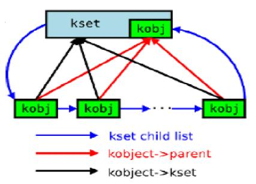

# Linux基础之object

**kobject：**

```
struct kobject is a simple data type that provides a foundation for
more complex object types. （嵌入其他内核对象中，作为内核对象的基础。
）It provides a set of basic fields that
almost all complex data（复杂数据） types share. kobjects are intended to be
embedded in larger data structures and replace fields they duplicate（替换他们重复的领域）. 以达到它和内核交互来创建它的可见表述目的。

struct kobject {
    char            name[KOBJ_NAME_LEN];
    atomic_t        refcount;
    struct list_head    entry;
    struct kobject        * parent;
    struct kset        * kset;
    struct kobj_type    * ktype;
    struct dentry        * dentry;
};

void kobject_init(struct kobject *);
int kobject_add(struct kobject *);
int kobject_register(struct kobject *);

void kobject_del(struct kobject *);
void kobject_unregister(struct kobject *);

struct kobject * kobject_get(struct kobject *);
void kobject_put(struct kobject *);

```

**kset：**

```
A kset is a set of kobjects that are embedded in the same type.

struct kset {
    struct subsystem    * subsys;
    struct kobj_type    * ktype;
    struct list_head    list;
    struct kobject        kobj;
};

void kset_init(struct kset * k);
int kset_add(struct kset * k);
int kset_register(struct kset * k);
void kset_unregister(struct kset * k);

struct kset * kset_get(struct kset * k);
void kset_put(struct kset * k);

struct kobject * kset_find_obj(struct kset *, char *);
```

**sysfs：**

```
Each kobject receives a directory in sysfs. This directory is created
under the kobject's parent directory. （kobject可实现在sysfs中创建一个文件夹）

If a kobject does not have a parent when it is registered, its parent
becomes its dominant（显性的） kset.

If a kobject does not have a parent nor a dominant kset, its directory
is created at the top-level of the sysfs partition. This should only
happen for kobjects that are embedded in a struct subsystem.
```

**struct ktype**

```
struct kobj_type {
    void (*release)(struct kobject *);
    struct sysfs_ops    * sysfs_ops;
    struct attribute    ** default_attrs;
};

struct attribute {
    char            * name;
    struct module         * owner;
    mode_t            mode;
};
```

Object types require specific functions for converting（转换） between the

generic object and the more complex type. struct kobj\_type provides

the object\-specific fields。（object有其通用点也有特殊的地方，如不同的析构方法，不同的sysfs访问方式，不同的属性，其作为

object的一种操作方法集，嵌入在object中使用）

 

kset和kobject的关系图如下所示：



以上图中kobj形成环形链表，不同层级的kobject不该形成环形链表，而只应该在同层级中实现。

```
     struct gendisk * disk;
     ...
     disk->kset.kobj.kset = &block_kset;
     disk->kset.ktype = &partition_ktype;
     kset_register(&disk->kset);
```

kobject是kset中的一个元素，被包含其中。用于最底层的基础特征，例如：

block device

disk

partition

以上三层为依次包含的关系，作为最底层的分区其嵌入kobject描述基础特征，多个分区可组成一个disk盘，因此单个disk中嵌入kset元素，其不仅可以通过kset中的内嵌kobject来描述基础特征，同时他还依赖kset向上组织成一张网。同样多个disk中的kset机器kobject在次组织在一起，层次分明。

注意的一点是kobject中只有kset指针不含具体对象。
