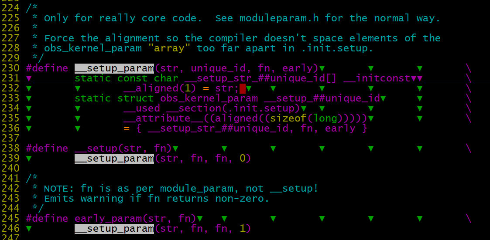
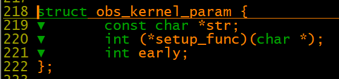
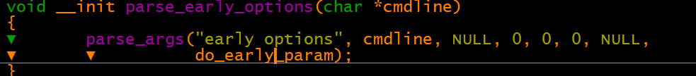
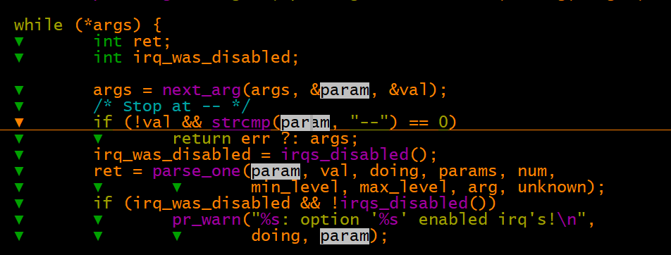
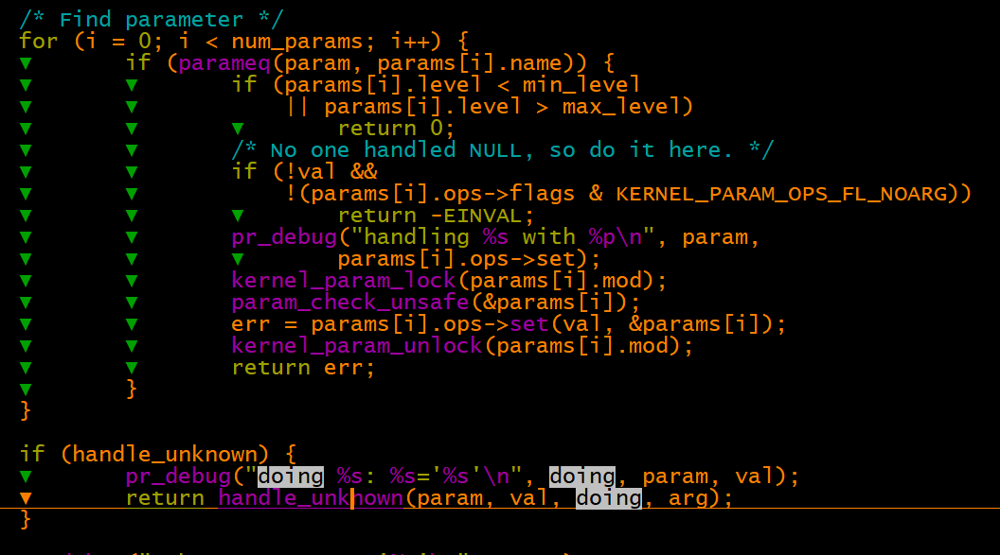
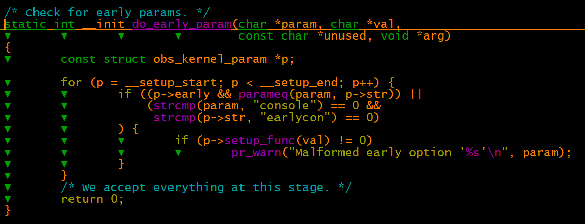
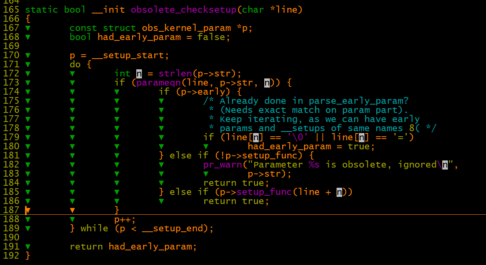
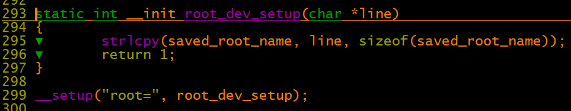
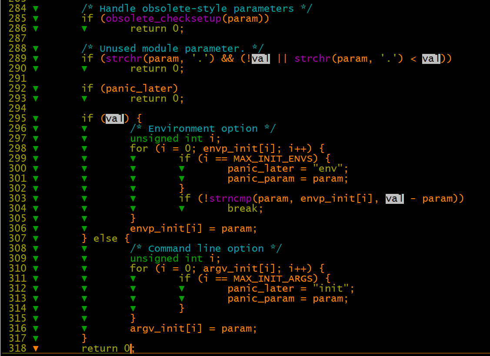

# Linux基础之命令行启动参数解析

[https://blog.csdn.net/rikeyone/article/details/79979887](https://blog.csdn.net/rikeyone/article/details/79979887)

\_\_setup 和 early\_param主要区别是处理时机不同，体现在代码上是  struct obs\_kernel\_param 中的eraly元素的值是0还是1。

本质上都是通过\_\_setup\_param在 \_\_section\(.init.setup\)定义了一个变量，多了就形成数组的效果，一个name和一个处理函数。

以下是early\_param定义的参数内核处理过程：

start\_kernel\-》setup\_arch\(&command\_line\)\-》 parse\_early\_param\(\)\-》 parse\_early\_options\-》 parse\_args

循环处理cmdline中的所有参数

 

比较\_\_setup\_start\-\_\_setup\_end section间的数据，通过名称param匹配p\-\>str找到对应的struct obs\_kernel\_param结构体，当然前提p\-\>early也要符合要求。

然后调用p\-\>setup\_func\(val\)函数进行处理数据。

例如命令行中的mem=1024M这样的，可以解析出size=1024，并传递后续函数处理。

obsolete\_checksetup

由于early值为0，此处实例调用root\_dev\_setup设置数据，直接return true结束后续运行。

下面这个环境变量相关的处理是啥作用？

对于既不是param（没有以"\\0"结尾或者没有“param=xxx”形式的），在handle\_unknown中又不是setup形式的参数字符串（声明时early=1），但设置了参数值。就将其放置在系统启动后的环境变量全局数组envp\_init\[\]中的同名参数或空环境变量中。对于没有设置参数值的参数字符串就将其传给argv\_init\[\]中同名参数或空参数。这个有作用？？？

