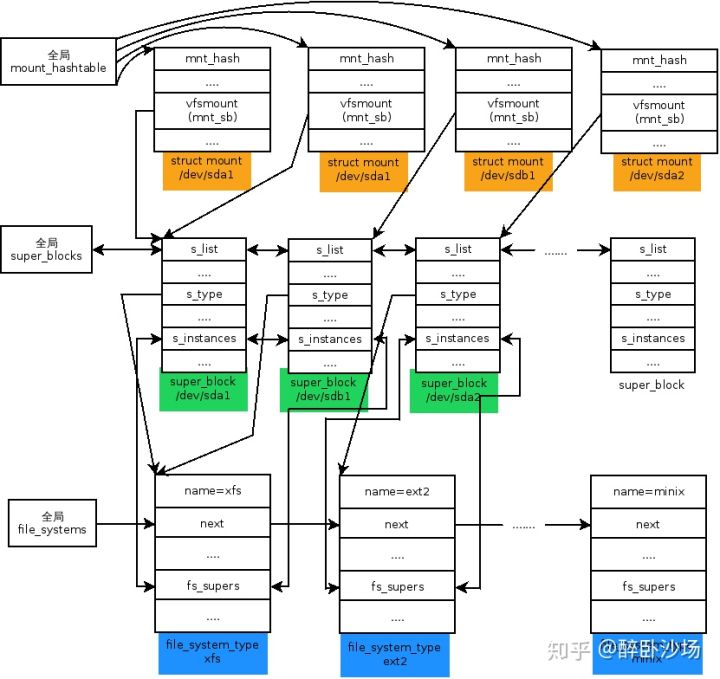
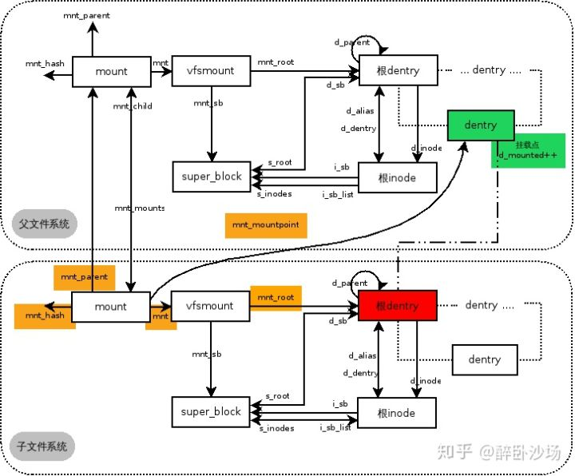
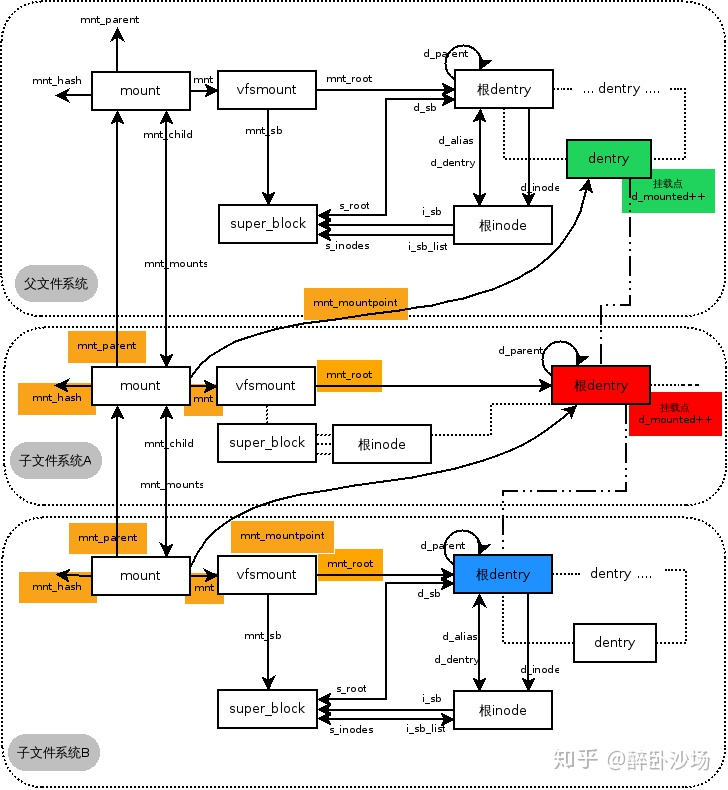
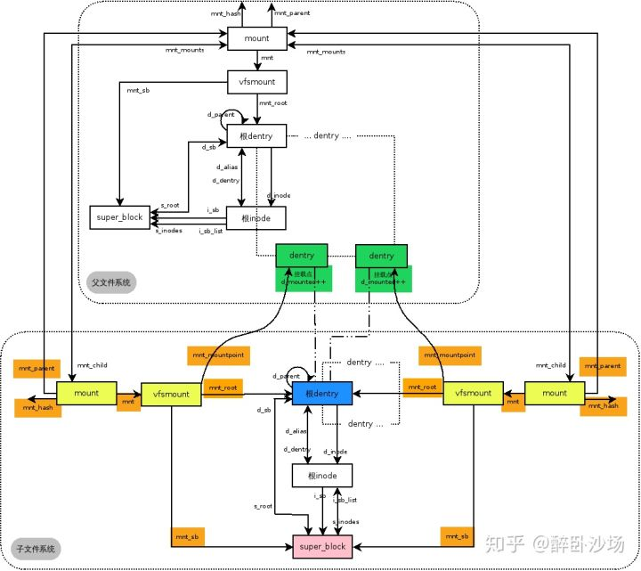

# VFS之挂载关系[Linux 3.16]

转载于：[https://zhuanlan.zhihu.com/p/67831794](https://zhuanlan.zhihu.com/p/67831794)

## **一、引言**

写到这里我们已经从mount文件系统调用的入口开始，分析到内核的mount，通过VFS层进入到具体文件系统实现的mount函数，最终得到具体文件系统的super block信息后构建出一个新的struct mount结构，返回给do\_add\_mount继续下面的操作。本来在这节我想从do\_add\_mount的代码开始把mount最后一部分——加入全局文件系统树讲完。但是写到一半我发现自己写不下去了，因为单纯的对代码进行注释没有办法解释很多基本的问题，到底挂载实例和文件系统有什么关系？我觉得不把这个说一下没有办法往下写，所以插入这样一节，我们来看一下挂载实例\(struct mount / struct vfsmount\)和super block, dentry, inode, file\_system\_type的关系，以及一个文件系统挂载到另一个文件系统下时到底是怎么样的关系。

为了说明的方便，我们下面以这样的场景为例进行描述：

1. 系统中有xfs, ext2和minix等若干文件系统模块

2. 现有/dev/sda1和/dev/sdb1上存在xfs文件系统，/dev/sda2上为ext2文件系统，/dev/sdc1上为minix文件系统

3. 将/dev/sda1挂载到/mnt/a上，将/dev/sdb1挂载到/mnt/b上，将/dev/sdc1不挂载

4. 在第三步之后，将/dev/sda2也挂载到/mnt/a上。再将/dev/sda1同时挂载到/mnt/x上

## **二、file\_system\_type \+ super block \+ mount的关系**

从file\_system\_type到super\_block到mount实例的角度来看，上述关系大致是这样的：

系统中存在三个文件系统，也就有三种file\_system\_type被注册。sda1和sdb1都是xfs文件系统，所以xfs的file\_system\_type的fs\_supers把这两个同为xfs文件系统的super\_block串连在自己下面。sda2是ext2文件系统，所以它挂在ext2的file\_system\_type下。sdc1是minix文件系统，在sdc1的设备上存在着super\_block信息，但是我们这里说的super\_block是指内存中的，由于sdc1没有被挂载使用，所以没有它的super\_block信息被读入内存。

从挂载实例上看，sda1和sda2都挂载到/mnt/a上，但是从上述关系中很难表述它们的区别，需要借助mount和dentry的关系来说明，下面再具体说明。sda1同时挂在了/mnt/a和/mnt/x上，所以它有两个挂载实例对应同一个super\_block。sdc1没有被挂载，所以没有挂载实例和它对应。

mount\_hashtable是一个全局挂载实例的哈希表，系统中除了根挂载点以外所有的挂载实例都记录在它下面，搜索一个mount实例时需要借助这个mount的父mount实例和dentry实例来计算的出。比如说/mnt上挂载着一个文件系统，/mnt/a和b上分别又挂载着文件系统，此时要想检索/mnt/a\(或b\)，需要以/mnt上的挂载实例和/mnt/a\(或者b\)的dentry结构为依据计算hash数值从mount\_hashtable上得到一个头指针，这个头指针下就是所有父文件系统是在/mnt上且挂载点是/mnt/a\(或b\)的挂载到/mnt/a或b下的mount实例。（这里其实有一个不太容易注意到的地方，到底什么情况下同一个父文件系统下的同一个dentry下会有多个挂载实例呢？我们不在本文讨论，以后有机会再讨论这个问题。）

上图可以看出file\_system\_type, super\_block和mount实例之间的关系，但是不能看出来父子文件系统之间的相互关系。下面让我们看一下当一个文件系统挂载到另一个文件系统的子目录下的情况。

## **三、父子挂载点的挂载关系**

假设在/mnt上挂载着一个文件系统，根据上面条件我们以/dev/sda1挂载到/mnt/a上为例，来解释一下/mnt/a上这个挂载实例和/mnt的挂载实例的关系，如下图所示：

父文件系统代表/mnt上的文件系统，子文件系统代表/mnt/a上的文件系统（带颜色的地方为重点要注意的地方）。父子文件系统通过mnt\_parent, mount\_child, mnt\_mounts等成员来联系在一起，每个挂载实例的mnt\_sb都指向这个挂载实例所属文件系统的super\_block。每个挂载实例的mnt\_root都指向这个文件系统的根dentry。

根dentry就是一个文件系统的路径的起始，也就是"/"。比如一个路径名/mnt/a/dir/file。在/mnt/a这个文件系统下看这个文件是/dir/file，这个起始的"/"代表/mnt/a下挂载的文件系统的根，也就是如上图红色所示的dentry，它是这一文件系统的起始dentry。当发现到了一个文件系统的根后，如果想继续探寻完整路径应该根据/mnt/a的挂载实例向上找到其父文件系统，也就是/mnt下挂载的文件系统。/dev/sda1挂载在了/mnt/a上，这里的/mnt/a代表/mnt下文件系统的一个子dentry，如图绿色部分所示。注意红色和绿色是两个文件系统下的两个不同的dentry，虽然不是很恰当的说它们从全局来看是一个路径名。那么从/mnt所在的文件系统看/mnt/a就是/a。最后再往上就到了rootfs文件系统，也就是最上层的根"/"。所以我们之前说过，表示一个文件的路径需要\<mount, dentry\>二元组来共同确定。

子文件系统的mnt\_mountpoint就指向了父文件系统的一个dentry，这个dentry也就是子文件系统的真正挂载点。可以说子文件系统在挂载后会新创建一个dentry，并在此构建这个文件系统下的路径结构。

宗上所述，/mnt/a上这个新挂载的文件系统创建了一个新的mount, super\_block, 根inode和根dentry。在看懂了一个简单的父子文件系统挂载关系后，我们来看下多个文件系统挂载到同一路径名下时又是什么样子。

## **四、多文件系统单挂载点的挂载关系**

就像上面所叙述的/dev/sda1挂载到了/mnt/a上，之后/dev/sda2也挂载到/mnt/a上的情况，当两个以上的文件系统先后挂载到同一个路径名下时会是怎样一种情况呢？如下图所示：

如上图，子文件系统A代表/dev/sda1，子文件系统B代表/dev/sda2。父文件系统和子文件系统A的挂载在之前一节已经说明过了，当/dev/sda2在sda1之后也挂载到/mnt/a上时，其关系就像在上一节基础上又添加了子文件系统B的关系。实际上子文件系统A就是子文件系统B的父文件系统，而唯一不同的是子文件系统B的mnt\_mountpoint指向了子文件系统A的根dentry。而新的子文件系统B还是有自己的mount, super\_block, 根dentry和根inode。

两个文件系统挂载在同一路径名下会造成之前挂载的文件系统被隐藏，这种实现我们在后续讲解。其实从上面的关系也应该可以想到一些解决的方式。最后再来看一下一个文件系统被挂载到多个不同的路径下的情况。

## **五、单文件系统多挂载点的挂载关系**

同一个文件系统被挂载到不同的路经下，就像上面例子中/dev/sda1被挂载到/mnt/a和/mnt/x两个位置一样，如下图所示：

一个文件系统对应一个super\_block，所以同一个文件系统当然只有一个super\_block。但是因为挂载了两次，所有每一次挂载对应一个挂载实例struct mount，也就是有两个mount实例。此外同一个文件系统只有一个根，也就是两个挂载实例公用一个根dentry。但是因为挂载在两个不同的路经下，所以每个挂载实例的mnt\_mountpoint指向不同的dentry。由于/mnt/a和/mnt/x都属于同一文件系统的下的两个子目录，所以两个子mount才指向同一个父mount（这个不是必须的）。

如果我们想讨论的再变态一点，在上述/mnt/a和/mnt/x的基础上在将两个不同的文件系统分别挂载到/mnt/a/dir和/mnt/x/dir上，想象一下这将是怎样一种情况和关系。这个我就不画出来了，有兴趣的可以思考一下。

## **六、结束语**

本文讲到这里就先结束了，只是为后文将mount加入全局文件系统树，以及以后可能会写到的路径名解析中都有一些铺垫的作用。所以只是简单的罗列了一下不同情况下挂载关系的情况。上述的分析也只是代表我个人粗浅的观点，可能有些地方并不十分准确，欢迎留言指正。上面的图都是我自己用DIA一笔一笔画的，如果有问题我以后会修正重传。
