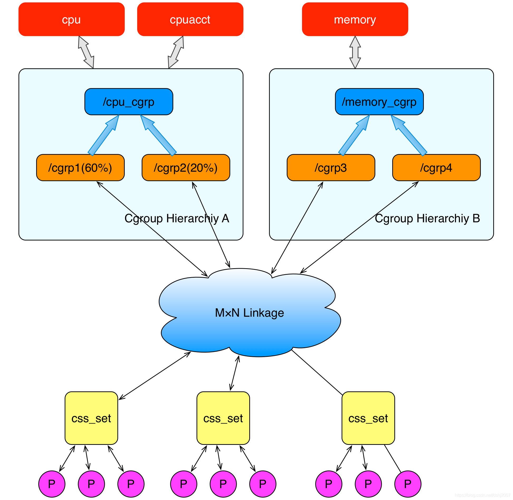
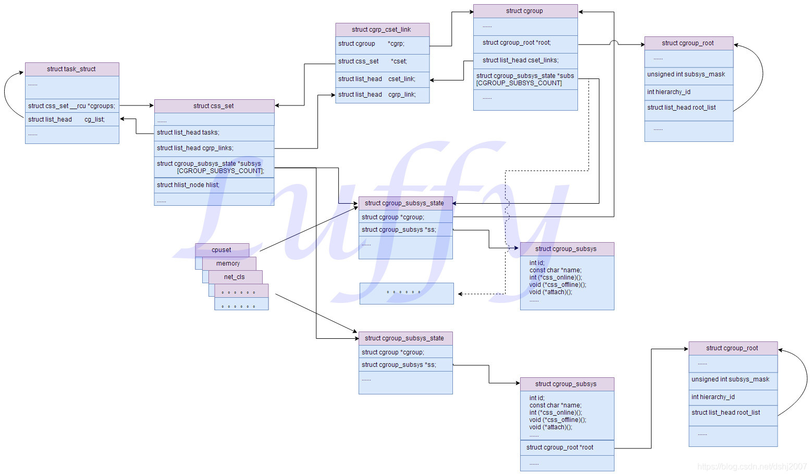
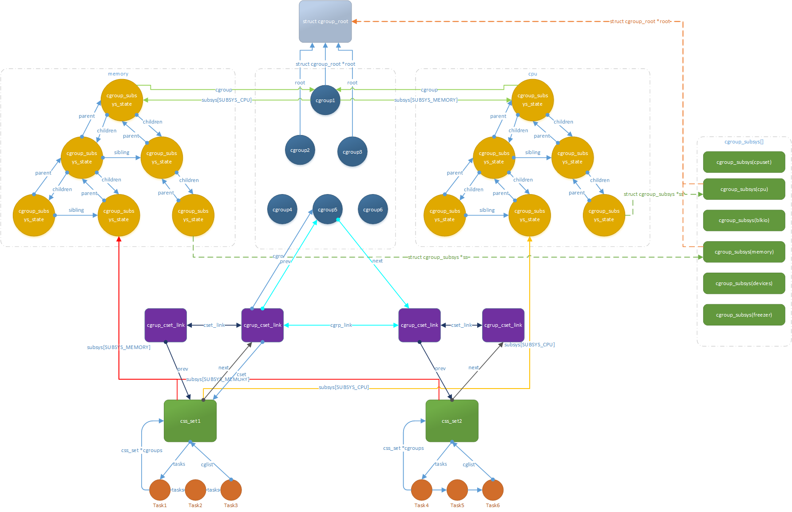

# cgroup之数�结�

基�Linux5.8版本总结

**一�基本概念**

1.任务（task）。在cgroups中，任务就是系统的一个进程。

2.�制�群（control group）。�制�群就是一组按照��标准划分的进程。Cgroups中的资��制都是以�制�群为����。一个进程�以加入到�个�制�群，也�一个进程组�移到�一个�制�群。一个进程组的进程�以使用cgroups以�制�群为��分�的资�，�时�到cgroups以�制�群为��设定的�制。

3.层级（hierarchy）。�制�群�以组织�hierarchical的形�，既一颗�制�群树（�一颗cgroup树）。�制�群树上的�节点�制�群是父节点�制�群的孩�，继承父�制�群的特定的�性。

4.�系统（subsytem）。一个�系统就是一个资��制器，比如cpu�系统就是�制cpu时间分�的一个�制器。�系统必须附加（attach）到一个层级上�能起作用，一个�系统附加到�个层级以�，这个层级上的所有�制�群都�到这个�系统的�制。

相互关系

1.�次在系统中创建新层级时，该系统中的所有任务都是那个层级的默认 cgroup（我们称之为 root cgroup ，此cgroup在创建层级时自动创建，��在该层级中创建的cgroup都是此cgroup的�代）的�始�员。

2.一个�系统最多�能附加到一个层级。所以层级的数�是��或等��系统类�的数�的。

3.一个层级�以附加多个�系统。这样的好处是�少层级的数�，�际使用过程中�能并�需�那么多独立�系统��的层级。如下cpu和cpuacct�以附加到�一层级中。

4.一个任务�以是多个cgroup的�员，但是这些cgroup必须在��的层级。层级中cgroup间�制的是相�的资��是具体�制值��，�能�多个cgroup�制而出�冲�。

5.系统中的进程（任务）创建�进程（任务）时，该�任务自动�为其父进程所在 cgroup 的�员。然��根�需�将该�任务移动到��的 cgroup 中，但开始时它总是继承其父任务的cgroup。



如下图，task1和task2两个任务都在在cpu cgroup4和memory cgroup5中，task group应该是虚拟出�的，�际并没有任务组。

                              

**二�数�结�**

```
struct task_struct {
#ifdef CONFIG_CGROUPS
        /* Control Group info protected by css_set_lock: */
        struct css_set __rcu            *cgroups;  //指�task对应的css_set
        /* cg_list protected by css_set_lock and tsk->alloc_lock: */
        struct list_head                cg_list; //加入css_set的链表，使用相�css_set的task串�起�
#endif
}

struct css_set {
        struct cgroup_subsys_state *subsys[CGROUP_SUBSYS_COUNT];  //指�css_set关�的�系统，�有�之有关的�系统项指针�有效

        /* reference count */
        refcount_t refcount;
        /* internal task count, protected by css_set_lock */
        int nr_tasks;  //使用该css_set的总的task数
        struct list_head tasks; //串�用该css_set的task
        ...
}

struct cgroup_subsys_state {
        /* PI: the cgroup that this css is attached to */
        struct cgroup *cgroup;  //�系统关�的cgroup数�结�

        /* PI: the cgroup subsystem that this css is attached to */
        struct cgroup_subsys *ss; //�系统关�具体的�系统方法

        /* reference count - access via css_[try]get() and css_put() */
        struct percpu_ref refcnt;

        /* siblings list anchored at the parent's ->children */
        struct list_head sibling;  //用�建立该�系统的树形关系图
        struct list_head children;
        struct cgroup_subsys_state *parent;
};

struct cgrp_cset_link {
        /* the cgroup and css_set this link associates */
        struct cgroup           *cgrp; //指�该cgrp_cset_link关�的cgroup数�结�
        struct css_set          *cset;  //指�该cgrp_cset_link关�的css_set数�结�

        /* list of cgrp_cset_links anchored at cgrp->cset_links */
        struct list_head        cset_link; //串�起����一个css_set的cgrp_cset_link类�数�结�

        /* list of cgrp_cset_links anchored at css_set->cgrp_links */
        struct list_head        cgrp_link;  //串�起����一个cgroup的cgrp_cset_link类�数�结�
};

struct cgroup_root {
        struct kernfs_root *kf_root;

        /* The bitmask of subsystems attached to this hierarchy */
        unsigned int subsys_mask;

        /* Unique id for this hierarchy. */
        int hierarchy_id;

        /* The root cgroup.  Root is destroyed on its release. */
        struct cgroup cgrp;

        /* for cgrp->ancestor_ids[0] */
        u64 cgrp_ancestor_id_storage;

        /* Number of cgroups in the hierarchy, used only for /proc/cgroups */
        atomic_t nr_cgrps;

        /* A list running through the active hierarchies */
        struct list_head root_list;

        /* Hierarchy-specific flags */
        unsigned int flags;

        /* The path to use for release notifications. */
        char release_agent_path[PATH_MAX];

        /* The name for this hierarchy - may be empty */
        char name[MAX_CGROUP_ROOT_NAMELEN];  //该hierarchy
};

struct cgroup_subsys {
        struct cgroup_subsys_state *(*css_alloc)(struct cgroup_subsys_state *parent_css);
        int (*css_online)(struct cgroup_subsys_state *css);
        void (*css_offline)(struct cgroup_subsys_state *css);
        void (*css_released)(struct cgroup_subsys_state *css);
        void (*css_free)(struct cgroup_subsys_state *css);
        void (*css_reset)(struct cgroup_subsys_state *css);
        void (*css_rstat_flush)(struct cgroup_subsys_state *css, int cpu);
        int (*css_extra_stat_show)(struct seq_file *seq,
                                   struct cgroup_subsys_state *css);

        int (*can_attach)(struct cgroup_taskset *tset);
        void (*cancel_attach)(struct cgroup_taskset *tset);
        void (*attach)(struct cgroup_taskset *tset);
        void (*post_attach)(void);
        int (*can_fork)(struct task_struct *task,
                        struct css_set *cset);
        void (*cancel_fork)(struct task_struct *task, struct css_set *cset);
        void (*fork)(struct task_struct *task);
        void (*exit)(struct task_struct *task);
        void (*release)(struct task_struct *task);
        void (*bind)(struct cgroup_subsys_state *root_css);
        ...
}
```

**三�数�结�关系**



**å››ã€�整体框æ�¶Â** 

 

                            



1�两个进程组，组A包括1�2�3进程;组B包括4�5�6进程

2�系统中包括一个mem\_cpu层级（包括memory\+cpu两个�系统）和其他层级，该层级有1\-6个cgroup

3�组A的进程和组B�加入mem\_cpu层级的cgroup5，以�其他层级;cgroup5中的cset\_link链表串�两个�之有关的cgrup\_set\_link，�样css\_set也通过cgrp\_link串�多个cgrup\_set\_link；�对存在关�的cgroup�css\_set之间都会建立一个cgrup\_set\_link�将其关�起�。

4�mem\_cpu层级中，�个cgroup有两个�之对应的cgroup\_subsys\_state，分别为memory和cpu，�个cgroup\_subsys\_state代表cgroup系统中一个�系统示例。在�系统如memory中通过parent/children/slibing指针串�，形�树形关系。cgroup\_subsys\_state通过cgroup元素指�其cgroup。

5�系统中�个cgroup�系统都有一个唯一的cgroup\_subsys，维护具体�系统相关的数��方法，这些cgroup\_subsys组�一个全局数组。�个cgroup\_subsys\_state�例都会指�其对应的�系统cgroup\_subsys。
