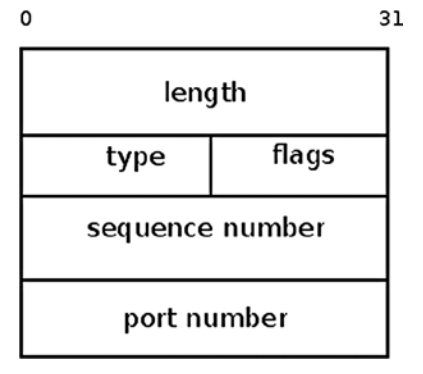
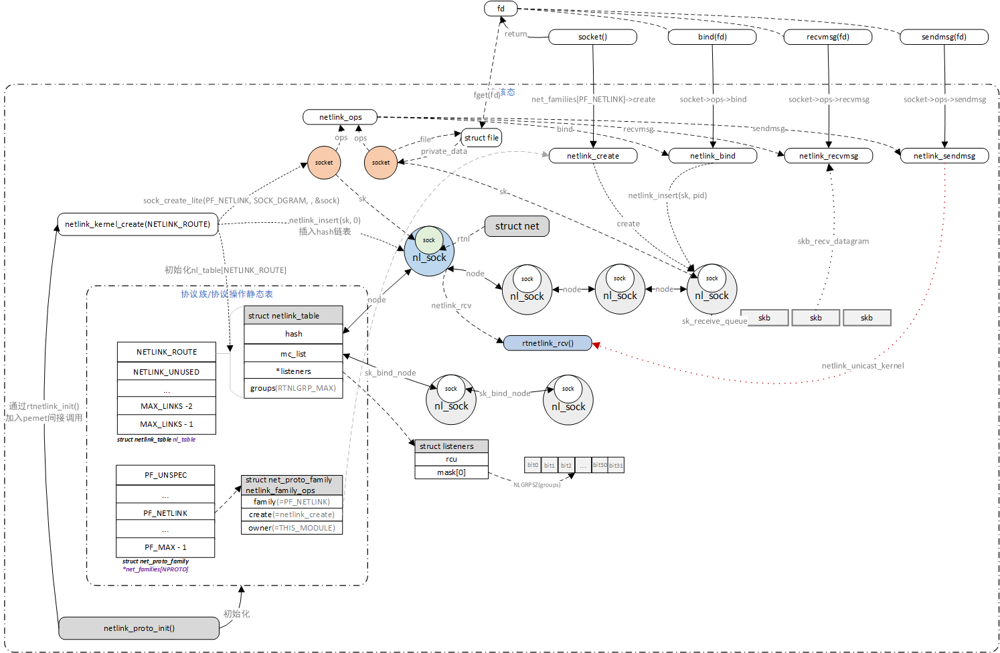
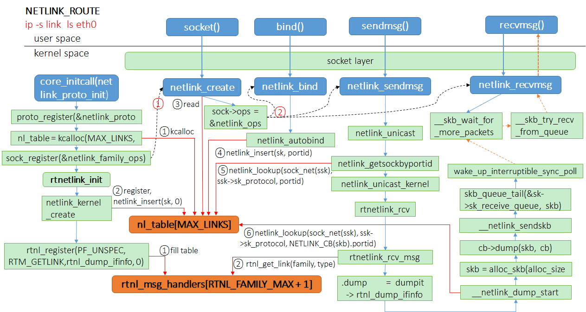

# linux网络管理之netlink机制

**一、背景**

Netlink套接字家族（英语：Netlink socket family）是一组Linux核心接口（Linux kernel interfaces），可用于进程间通信，Linux内核与用户空间的进程间、用户进程间的通讯。然而它并不像网络套接字可以用于主机间通讯，Netlink只能用于同一主机上进程通讯，并通过PID来标识它们。

Netlink被设计为在Linux内核与用户空间进程传送各种网络信息。网络工具iproute2利用 Netlink从用户空间与内核进行通讯。Netlink由一个在用户空间的标准的Socket接口和内核模块提供的内核API组成。Netlink的设计比ioctl更加灵活，Netlink使用了AF\_NETLINK Socket 家族。

用于在某些场景取代ioctl。

**二、数据结构**

**2.1 sockaddr\_nl \(netlink socket地址\)**

```
struct sockaddr_nl {
        __kernel_sa_family_t    nl_family;      /* AF_NETLINK   */
        unsigned short  nl_pad;         /* zero         */
        __u32           nl_pid;         /* port ID      */
        __u32           nl_groups;      /* multicast groups mask */
};
```

**2.2 nlmsghdr\(netlink消息头结构，共16字节长度\)**

```
//netlink 消息数据结构
struct nlmsghdr {
        __u32           nlmsg_len;      /* Length of message including header */ 
        __u16           nlmsg_type;     /* Message content */  
        __u16           nlmsg_flags;    /* Additional flags */
        __u32           nlmsg_seq;      /* Sequence number */
        __u32           nlmsg_pid;      /* Sending process port ID */
};
```

**nlmsg\_len**：整个消息的长度，按字节计算。包括了Netlink消息头本身。

**nlmsg\_type**：消息的类型，即是数据还是控制消息。

            目前\(内核版本2.6.21\)Netlink仅支持四种类型的控制消息，如下：

NLMSG\_NOOP（0x1）\-空消息，什么也不做；

NLMSG\_ERROR（0x2）\-指明该消息中包含一个错误；

NLMSG\_DONE（0x3）\-如果内核通过Netlink队列返回了多个消息，那么队列的最后一条消息的类型为NLMSG\_DONE，其余所有消息的nlmsg\_flags属性都被设置                                 nlmsg\_flags的NLM\_F\_MULTI\-位有效。

NLMSG\_OVERRUN（0x4）\-暂时没用到。

数据消息有很多种，如rtnetlink中：

RTM\_xxxx（0x10~，RTM\_BASE\-RTM\_MAX）

**nlmsg\_flags**：附加在消息上的额外说明信息，如上面提到的NLM\_F\_MULTI。如下列举几种：

NLM\_F\_REQUEST\- 如果消息中有该标记位，说明这是一个请求消息。所有从用户空间到内核空间的消息都要设置该位，否则内核将向用户返回一个EINVAL无效参数的错误

NLM\_F\_MULTI \- 消息从用户\-\>内核是同步的立刻完成，而从内核\-\>用户则需要排队。如果内核之前收到过来自用户的消息中有NLM\_F\_DUMP位为1的消息，那么内核就会向用户空间发送一个由多个Netlink消息组成的链表。除了最后个消息外，其余每条消息中都设置了该位有效。

NLM\_F\_ACK \- 该消息是内核对来自用户空间的NLM\_F\_REQUEST消息的响应。

NLM\_F\_ECHO \- 如果从用户空间发给内核的消息中该标记为1，则说明用户的应用进程要求内核将用户发给它的每条消息通过单播的形式再发送给用户进程。和我们通常说的“回显”功能类似。

**nlmsg\_seq**：消息序列号。因为Netlink是面向数据报的，所以存在丢失数据的风险，但是Netlink提供了如何确保消息不丢失的机制，让程序开发人员根据其实际需求而实现。消息序列号一般和NLM\_F\_ACK类型的消息联合使用，如果用户的应用程序需要保证其发送的每条消息都成功被内核收到的话，那么它发送消息时需要用户程序自己设置序号，内核收到该消息后对提取其中的序列号，然后在发送给用户程序回应消息里设置同样的序列号。有点类似于TCP的响应和确认机制。

注意：当内核主动向用户空间发送广播消息时，消息中的该字段总是为0。

**nlmsg\_pid**：当用户空间的进程和内核空间的某个子系统之间通过Netlink建立了数据交换的通道后，Netlink会为每个这样的通道分配一个唯一的数字标识。其主要作用就是将来自用户空间的请求消息和响应消息进行关联。说得直白一点，假如用户空间存在多个用户进程，内核空间同样存在多个进程，Netlink必须提供一种机制用于确保每一对“用户\-内核”空间通信的进程之间的数据交互不会发生紊乱。



**2.3 netlink\_kernel\_cfg用于创建并设置内核态的socket**

```
struct netlink_kernel_cfg {
        unsigned int    groups;
        unsigned int    flags;
        void            (*input)(struct sk_buff *skb);
        struct mutex    *cb_mutex;
        int             (*bind)(struct net *net, int group);
        void            (*unbind)(struct net *net, int group);
        bool            (*compare)(struct net *net, struct sock *sk);
};
```

**groups**：指定了多播组的的mask，最多32个组

**flags**：可以是NL\_CFG\_F\_NONROOT\_RECV or NL\_CFG\_F\_NONROOT\_SEND。

         NL\_CFG\_F\_NONROOT\_RECV ，对于普通用户的socket能绑定到多播组，否则会报\-EPRM错误

         NL\_CFG\_F\_NONROOT\_SEND，对于普通用户，可有发送多播消息

**input**：数据接收处理的回调函数，如果input为null，这个kernel socket将不会从用户态接收数据。

        对于rtnetlink（NETLINK\_ROUTE）协议来讲，input为 rtnetlink\_rcv\(\)，因此所有用户态的数据需要经过rtnetlink\_rcv\(\)处理。

        对于uevent netlink\( NETLINK\_KOBJECT\_UEVENT\)协议，只需要从内核发送数据到用户空间，因此input是null。

```
__netlink_kernel_create() 
{     
   if (cfg && cfg->input)
                nlk_sk(sk)->netlink_rcv = cfg->input;
}
```

**cb\_mutex：**回调用互斥锁，一般的netlink协议不用， rtnl\_mutex（RT NETLINK）和  genl\_mutex（generic netlink）

**bind**：在netlink binding路径下增加的hook函数，几乎没怎么用，RT NETLINK也没有使用（commit：03292745b02d1166e2a215504407e096b8427be5）

**unbind**：也不常用 （commit：4f520900522fd596e336c07e9aafd5b7a9564235）

**compare**：通常相同的net命令空间的socket才能通信，但是对于使用netlink的其他模块如audit应该不能被限制在同一个net中。如果模块需要私有的比较方法，可以通过该配置重写默认的判断方法，默认的判断方法为判断portid和net ，在函数netlink\_compare实现（ commit：da12c90e099789a63073fc82a19542ce54d4efb9）

**2.4 netlink\_table用于组织某一类netlink协议的私有数据管理**

```
struct netlink_table {
        struct rhashtable       hash;
        struct hlist_head       mc_list;
        struct listeners __rcu  *listeners; //监听者标志
        unsigned int            flags;
        unsigned int            groups;  // 每个netlink的协议类型可以定义多个组, 8的倍数,最小是32
        struct mutex            *cb_mutex;  //指向注册时的netlink_kernel_cfg->cb_mutex
        struct module           *module;
        int                     (*bind)(struct net *net, int group);  //暂存协议注册时的netlink_kernel_cfg->bind
        void                    (*unbind)(struct net *net, int group);  //暂存协议注册时的netlink_kernel_cfg->unbind
        bool                    (*compare)(struct net *net, struct sock *sock); //暂存协议注册时的netlink_kernel_cfg->compare
        int                     registered;
};

struct netlink_table *nl_table;  //nl_table是一个netlink_table类型的数组，个数为netlink协议类型个数MAX_LINKS
static int __init netlink_proto_init(void)
{
    nl_table = kcalloc(MAX_LINKS, sizeof(*nl_table), GFP_KERNEL); 
}
```

**hash**: 管理该协议的所有sock，net\+pid进行hash值计算，方便查找和添加

**mc\_list**: 管理该协议的所有加入了任意组播的sock，sock\-\>sk\_bind\_node节点加入链表

**listeners**：增加netlink\_has\_listeners\(\)对外接口，方便使用netlink的模块判断是有listeners在监听消息，避免发出广播消息后无任何用户在监听消息（commit：4277a083ecd2c8771058641132bcecea04ca6608）

**subscriptions，ngroups，\*groups**：用于每个netlink支持动态数量的多播组。（commit f7fa9b10edbb9391bdd4ec8e8b3d621d0664b198）

**2.5 netlink\_sock是包了一层netlink特定需要的sock，相当于一个netlink句柄**

```
struct netlink_sock {
        /* struct sock has to be the first member of netlink_sock */
        struct sock             sk;
        u32                     portid;  //sock绑定的portid
        u32                     dst_portid;  
        u32                     dst_group;
        u32                     flags;
        u32                     subscriptions;
        u32                     ngroups;        // 多播组数量
        unsigned long           *groups;  // 多播组号
        unsigned long           state;
        size_t                  max_recvmsg_len;
        wait_queue_head_t       wait;
        bool                    bound;
        bool                    cb_running;
        int                     dump_done_errno;
        struct netlink_callback cb;
        struct mutex            *cb_mutex;
        struct mutex            cb_def_mutex;
        void                    (*netlink_rcv)(struct sk_buff *skb);   //netlink_kernel_cfg->input
        int                     (*netlink_bind)(struct net *net, int group);  //netlink_kernel_cfg->bind
        void                    (*netlink_unbind)(struct net *net, int group);   //netlink_kernel_cfg->unbind
        struct module           *module;

        struct rhash_head       node;
        struct rcu_head         rcu;
        struct work_struct      work;
};
```

**sk**：内嵌具体的sock数据结构

**dst\_portid**，dst\_group：sock建立连接后会设置这两个字段，netlink\_connect函数可以设置连接。当sendmsg时未指定目的地址，则会用这个地址和组作为目的。

**subscriptions**：表明该netlink\_sock是否有加入大组播中，通过函数netlink\_update\_subscriptions\(\)会将该sock 加入链表nl\_table\[sk\-\>sk\_protocol\].mc\_list，表明该sock在订阅组播消息，并设置subscriptions变量。

**bound**：也是用于存portid，为了替换原先的rhash\_portid，存放的是netlink\_sock关联的portpid，当进行了bind后会设置该值。（commit：da314c9923fed553a007785a901fd395b7eb6c19）

**cb**:    netlink\_sock关联的回调函数，在将sock作为参数传递的时候，将后续需要做的回调等操作存在这里，这样可以减少参数个数

**node**：加入到nl\_table\[protol\]\-\>hash中，通过该链表的管理所有的scok

**三、逻辑框架**

下图描述的是内核中route netlink的框架图，代表内核的socket是在net namespace创建时创建的，代表用户的socket是由用户调用socket\(\)系统调用创建，并用bind\(\)系统，将创建的socket关联的nelink\_sock加入到nl\_table\[NETLINK\_ROUTE\].hsah链表中去。红色虚线的路径是用户态往内核态发送消息的路径，目的sock是代表内核的sock，消息是由内核sock创建时，注册进去的netlink\_kernel\_cfg\-\>input函数负责接收处理skb，在这里是rtnetlink\_rcv\(\)函数。



- 上图左下角中的nltable/net\_fam
- 一个netlink socket实质上有4部分，分别是struct socket本身、代表内核通用struct scok、代表netlink特征的struct netlink\_sock、以及与socket关联的strcut file，socket在用户态也是表现为一个普通的文件。
- 在用户态使用的4个系统调用的中，socket\(\)是需要创建socket，与其他三个使用socket不一样，因此在socket创建时，并没有create相关的的netlink\_ops，需要通过netlink协议族中的net\_families\[PF\_NETLINK\]\-\>create方法创建。
- netlink\_table中下面三个元素是用于组播，listeners\-\>mask指向的是一组掩码，掩码的宽度与组播组个数相关，以32大小对齐，掩码是通过kmalloc分配的。

下图是执行ip \-s link ls eth0命令过程的netlink流程：



图中红色数字和黑色虚线标识了socket设计的思路：

①初始化调用sock\_register注册协议簇套接字操作函数块，提供创建套接字的回调函数netlink\_create；

②socket系统调用创建套接字，将套接字层对应系统调用的套接字操作函数块struct proto\_ops netlink\_ops赋值给套接字socket。

**四、代码分析**

**五、参考资料**

[http://rfc.ac.cn/html/rfc3549.html](http://rfc.ac.cn/html/rfc3549.html)

[https://jgsun.github.io/2018/12/14/linux\-netlink/](https://jgsun.github.io/2018/12/14/linux-netlink/)

[https://www.linuxjournal.com/article/7356](https://www.linuxjournal.com/article/7356)

[https://lwn.net/Articles/147608/](https://lwn.net/Articles/147608/)
