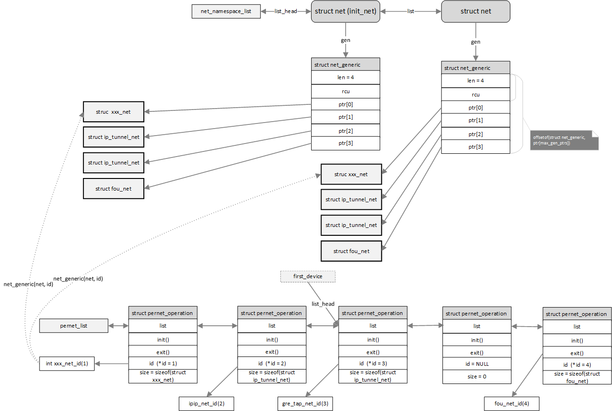

# linux网络管理之pernet_operations机制

基于内核 linux4.9

**一、功能背景**

网络子系统为何需要pernet\_operations模块？

pernet\_operations从命名上表示是每个struct net的操作。struct net是网络命名空间的管理数据结构，在一个系统中存在一个或多个net命名空间，而每个net本身又管理着其一整套网络参数和各种subsys/device的实例。当创建或者销毁一个net时，需要为这个net的不同subsys/device进行初始化或者退出操作，这些操作则都以pernet\_operations形式表示，并且用链表串联起来。每个pernet\_operations都可能尤其私有数据结构，这些数据结构对于每个net都有一份实例，操作方法则在pernet\_operations中。

**二、数据结构**

```
struct pernet_operations {
        struct list_head list;   //将不同子系统注册的operations连接起来
        int (*init)(struct net *net);       //net创建时需要调用
        void (*exit)(struct net *net);        //net退出时需要调用
        void (*exit_batch)(struct list_head *net_exit_list);
        int *id;        //指向该operations的id，id是一个int数，表明该pernet_operations所使用的私有数据指针。
                        //（net->net_generic->ptr[id - 1]表示该私有数据指针），id由pernet_operations模块分配
        size_t size;    //size是该operations的私有数据大小
};

//net_generic用来管理net的所有的operations的私有数据，这些私有数据对于每个net都有一个实例存在，避免在在struct net中添加私有不方便不好管理
struct net_generic {
        unsigned int len;  //net_generic管理的私有数据或id个数
        struct rcu_head rcu;

        void *ptr[0];    //ptr指向该net的operations的私有数据指针
};

struct net {
    ...
    struct net_generic __rcu        *gen;  //指向该net拥有的net_generic
    ...
}
```

**三、逻辑框图**

net、 net\_generic、pernet\_operations三者之间的关系如下图表示，下图中假定有pernet\_operations，其中4个私有数据，对于每一种私有数据，其在每个net中都有一份实例。不同的net中的私有数据排布应该是相同的，因为私有数据对每个net而言都是相同的。



**四、代码分析**

**4.1 pernet\_operations注册**

以内核中的fou\_net\_ops注册为例：

```
static struct pernet_operations fou_net_ops = {
        .init = fou_init_net,
        .exit = fou_exit_net,
        .id   = &fou_net_id,
        .size = sizeof(struct fou_net),
};

static int __init fou_init(void)
{
        ret = register_pernet_device(&fou_net_ops);
        return ret;
}
//device 需要放到pernet_list的后半断，subsys放在前半段
int register_pernet_device(struct pernet_operations *ops)
{
        int error;
        mutex_lock(&net_mutex);
        error = register_pernet_operations(&pernet_list, ops);
        if (!error && (first_device == &pernet_list))
                first_device = &ops->list;
        mutex_unlock(&net_mutex);
        return error;
}

static int register_pernet_operations(struct list_head *list,
                                      struct pernet_operations *ops)
{
        int error;

        if (ops->id) {  //如果pernet_operations中id不为空，这说明该operations需要私有参数
again:
                error = ida_get_new_above(&net_generic_ids, 1, ops->id);  //此处传入ops->id为指针，通过ida模块分配一个id
                if (error < 0) {
                        if (error == -EAGAIN) {
                                ida_pre_get(&net_generic_ids, GFP_KERNEL);
                                goto again;
                        }
                        return error;
                }
                max_gen_ptrs = max_t(unsigned int, max_gen_ptrs, *ops->id);  //记录下最大的id值，待后续分配net_generic（net_alloc_generic）时使用
        }
        error = __register_pernet_operations(list, ops);  //将ops加入链表
        if (error) {
                rcu_barrier();
                if (ops->id)
                        ida_remove(&net_generic_ids, *ops->id);
        }

        return error;
}

static int __register_pernet_operations(struct list_head *list,
                                        struct pernet_operations *ops)
{
        struct net *net;
        int error;
        LIST_HEAD(net_exit_list);

        list_add_tail(&ops->list, list);  //将ops加入链表
        if (ops->init || (ops->id && ops->size)) {  //新加入的ops，如果有init需要或者私有参数，需要在每个net上调用或者分配私有内存
                for_each_net(net) {  
                        error = ops_init(ops, net); //遍历当前所有的net，针对net做ops_init操作
                        if (error)
                                goto out_undo;
                        list_add_tail(&net->exit_list, &net_exit_list);
                }
        }
        return 0;

out_undo:
        /* If I have an error cleanup all namespaces I initialized */
        list_del(&ops->list);
        ops_exit_list(ops, &net_exit_list);
        ops_free_list(ops, &net_exit_list);
        return error;
}

static int ops_init(const struct pernet_operations *ops, struct net *net)
{
        int err = -ENOMEM;
        void *data = NULL;

        if (ops->id && ops->size) {
                data = kzalloc(ops->size, GFP_KERNEL);  //尝试为net - ops分配私有数据内存
                if (!data)
                        goto out;

                err = net_assign_generic(net, *ops->id, data);  //新分配的id可能大于现有net_generic id指针的容量，可能需要重新分配
                if (err)
                        goto cleanup;
        }
        err = 0;
        if (ops->init)
                err = ops->init(net); //调用init在指定net环境下使用ops初始化方法
        if (!err)
                return 0;

cleanup:
        kfree(data);
out:
        return err;
}
```

ops\_init执行过程中可能涉及到net\_generic的扩充，扩充的方法是在rcu机制的保护下重新申请一个net\_generic内存。因此在读端net\_generic需要rcu读保护锁

```
static int net_assign_generic(struct net *net, int id, void *data)
{
        struct net_generic *ng, *old_ng;

        old_ng = rcu_dereference_protected(net->gen,
                      lockdep_is_held(&net_mutex));  
        //net注册之后，net_assign_generic是唯一会修改net->gen的地方，因此此处的读无需rcu读保护
        //外层有mutex_lock(&net_mutex)进行保护，实现多核间的写互斥

        ng = old_ng;
        if (old_ng->len >= id)
                goto assign;

        ng = net_alloc_generic();  //重新分配一个net_generic
        if (ng == NULL)
                return -ENOMEM;

        memcpy(&ng->ptr, &old_ng->ptr, old_ng->len * sizeof(void*));

        rcu_assign_pointer(net->gen, ng);  //将重新分配的net_generic发布
        kfree_rcu(old_ng, rcu);  //等待一个宽限期，待读端都离开读临界区后释放旧的net_generic数据结构
assign:
        ng->ptr[id - 1] = data;
        return 0;
}

static inline void *net_generic(const struct net *net, int id)
{
        struct net_generic *ng;
        void *ptr;

        rcu_read_lock();
        ng = rcu_dereference(net->gen);  //通过在rcu读锁的保护下读取net->net_generic内存
        ptr = ng->ptr[id - 1];
        rcu_read_unlock();

        return ptr;
}
```

**4.2 id参数使用**

```
//1、首先静态定一个id，初值为0，并且将地址放在fou_net_ops.id中
static unsigned int fou_net_id;

//2、如上一节，ops注册时，pernet_operations模块会为该ops分配一个id，此时fou_net_id应该为非0
register_pernet_device(&fou_net_ops);

//3、在ops的具体的init/exit方法中，针对net，获取到具体的私有数据内存指针
struct fou_net *fn = net_generic(net, fou_net_id)
```

**4.3 net加入时init调用**

当创建新的net时（copy\_net\_ns或者net\_ns\_init\)，都回调setup\_net做些初始化操作，在该函数中会遍历所有的pernet\_operations，为新创建的net执行init方法以及分配私有数据内存数据，具体见上节ops\_init函数

```
static __net_init int setup_net(struct net *net, struct user_namespace *user_ns)
{
        list_for_each_entry(ops, &pernet_list, list) {
                error = ops_init(ops, net);
}
```

**4.4 net释放时退出调用**

当一个net不再使用时，需要针对该net，遍历所有的pernet\_operations并调用exit方法，同时还要释放所有pernet\_operations关联与该net的私有内存数据

```
static inline void put_net(struct net *net)
{                       
        if (atomic_dec_and_test(&net->count)) //引用计数减一并测试
                __put_net(net);
}

void __put_net(struct net *net)
{
        /* Cleanup the network namespace in process context */
        unsigned long flags;

        spin_lock_irqsave(&cleanup_list_lock, flags);
        list_add(&net->cleanup_list, &cleanup_list); //将net加入cleanup_list，利用工作队列在进程上下文进行清理工作
        spin_unlock_irqrestore(&cleanup_list_lock, flags);

        queue_work(netns_wq, &net_cleanup_work);
}

tatic void cleanup_net(struct work_struct *work)
{
        mutex_lock(&net_mutex);
        /* Run all of the network namespace exit methods */ 
        //循环遍历所有的ops，并针对退出链表中的net调用exit/exit_batch方法
        list_for_each_entry_reverse(ops, &pernet_list, list)
                ops_exit_list(ops, &net_exit_list);

        /* Free the net generic variables */
        //循环遍历所有的ops，并针对退出链表中的net调用ops_free释放私有数据
        list_for_each_entry_reverse(ops, &pernet_list, list)
                ops_free_list(ops, &net_exit_list);

        mutex_unlock(&net_mutex);
}
```

**五、参考资料**
