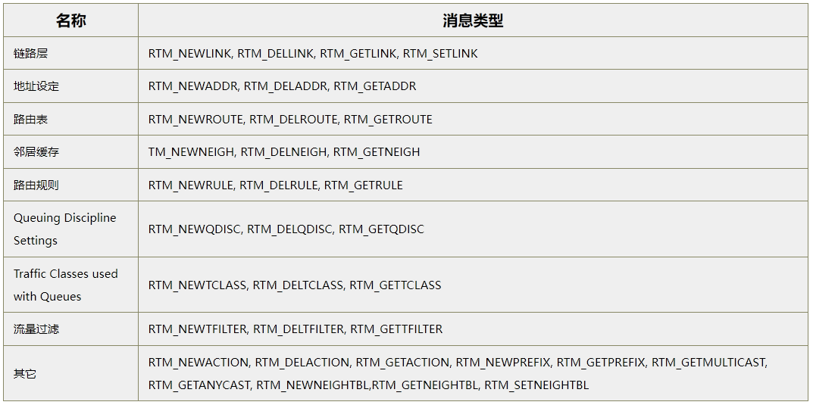
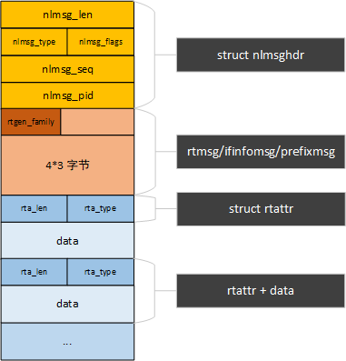
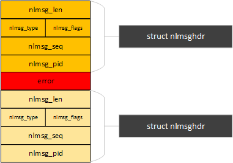
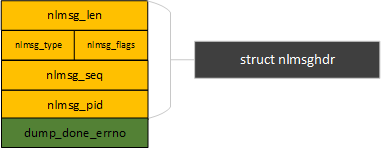

# linux网络管理之route netlink

**一、背景**

netlink route并不仅仅用于route模块，还应用于其他很多网络模块，套用这个框架进行用户态和内核态之间的通信，主要功能归类如下。



**二、数据结构**

**2.1操作方法结构**

rtnl\_msg\_handlers是一个数组指针，数组长度为协议栈类型的长度，每个元素用于一类协议族，如IPV4、桥接等等协议。

每个元素都是rtnl\_link类型的指针，指针指向该协议栈管理的各种RTM\_xxxx操作方法

```
struct rtnl_link *rtnl_msg_handlers[RTNL_FAMILY_MAX + 1];

struct rtnl_link {
        rtnl_doit_func          doit;
        rtnl_dumpit_func        dumpit;
        rtnl_calcit_func       calcit;
};
```

**doit** : callback is for actions like addition/deletion/modification 用于增加/删除/修改操作

**dumpit** : callback is for retrieving information 用于获取信息，dumpit用于构建一个skb，该skb是用户想要获取的信息。netlink\_dump\(\)中会将该skb发给用户态。

**calcit** : callback is for calculation of buffer size 用于计算缓存大小

**2.1 消息结构：**

netlink层消息头

```
//netlink 消息数据结构
struct nlmsghdr {
        __u32           nlmsg_len;      /* Length of message including header */
        __u16           nlmsg_type;     /* Message content */  
        __u16           nlmsg_flags;    /* Additional flags */
        __u32           nlmsg_seq;      /* Sequence number */
        __u32           nlmsg_pid;      /* Sending process port ID */
};
```

nlmsg\_type定义了消息类型，具体参考netlink机制一文，该字段在rtnelink中可以指定具体的消息类型，其包括多种操作对象，每种操作对象包括4种操作方法。

由RTM\_NEW\*，RTM\_DEL\*，RTM\_GET\*，RTM\_SET\*为一组，一组4个操作操作方法用于某一类对象，主要对象包括：

```
• LINK (network interfaces)
• ADDR (network addresses)
• ROUTE (routing messages)
• NEIGH (neighbouring subsystem messages)
• RULE (policy routing rules)
• QDISC (queueing discipline)
• TCLASS (traffic classes)
• ACTION (packet action API, see net/sched/act_api.c)
• NEIGHTBL (neighbouring table)
• ADDRLABEL (address labeling)
```

其中只有RTM\_GET\*操作需要定义dumpit/calcit方法，rtnetlink\_rcv\_msg函数中会判断，只有GET操作会调用dumpit/calcit及doit，其他的操作类型只调用doit。

nlmsg\_type包括以下类型：

```
enum {
        RTM_BASE        = 16,

        RTM_NEWLINK     = 16,
        RTM_DELLINK,
        RTM_GETLINK,
        RTM_SETLINK,

        RTM_NEWADDR     = 20,
        RTM_DELADDR,
        RTM_GETADDR,

        RTM_NEWROUTE    = 24,
        RTM_DELROUTE,
        RTM_GETROUTE,

        RTM_NEWNEIGH    = 28,
        RTM_DELNEIGH,
        RTM_GETNEIGH,

        RTM_NEWRULE     = 32,
        RTM_DELRULE,
        RTM_GETRULE,

        RTM_NEWQDISC    = 36,
        RTM_DELQDISC,
        RTM_GETQDISC,

        RTM_NEWTCLASS   = 40,
        RTM_DELTCLASS,
        RTM_GETTCLASS,

        RTM_NEWTFILTER  = 44,
        RTM_DELTFILTER,
        RTM_GETTFILTER,

        RTM_NEWACTION   = 48,
        RTM_DELACTION,
        RTM_GETACTION,
        ...
        RTM_NEWSTATS = 92,
        RTM_GETSTATS = 94,

        __RTM_MAX,
};
```

关于部分ROUTE NETLINK MESSAGE的详细说明：

```
RTM_NEWLINK, RTM_DELLINK, RTM_GETLINK
       Create, remove, or get information about a specific
       network interface.  These messages contain an ifinfomsg
       structure followed by a series of rtattr structures.

RTM_NEWADDR, RTM_DELADDR, RTM_GETADDR
       Add, remove, or receive information about an IP address
       associated with an interface.  In Linux 2.2, an interface
       can carry multiple IP addresses, this replaces the alias
       device concept in 2.0.  In Linux 2.2, these messages
       support IPv4 and IPv6 addresses.  They contain an
       ifaddrmsg structure, optionally followed by rtattr routing
       attributes.        
      
RTM_NEWROUTE, RTM_DELROUTE, RTM_GETROUTE
       Create, remove, or receive information about a network
       route.  These messages contain an rtmsg structure with an
       optional sequence of rtattr structures following.  For
       RTM_GETROUTE, setting rtm_dst_len and rtm_src_len to 0
       means you get all entries for the specified routing table.
       For the other fields, except rtm_table and rtm_protocol, 0
       is the wildcard.

RTM_NEWNEIGH, RTM_DELNEIGH, RTM_GETNEIGH
       Add, remove, or receive information about a neighbor table
       entry (e.g., an ARP entry).  The message contains an ndmsg
       structure.
      
RTM_NEWRULE, RTM_DELRULE, RTM_GETRULE
       Add, delete, or retrieve a routing rule.  Carries a struct
       rtmsg
      
RTM_NEWQDISC, RTM_DELQDISC, RTM_GETQDISC
       Add, remove, or get a queueing discipline.  The message
       contains a struct tcmsg and may be followed by a series of
       attributes.
```

**三、rtnetlink消息结构**

**3.1 消息体**

用户态发到内核态的消息以及内核态调用dumpit返回给用户态的消息格式都是基于此消息体构建。

通常的rtnelink的消息格式包括三部分：nlmsghdr \+ msg \+ rtattr\*n  ，其中第二部分是根据不同的RTM类型，具有不同定义的数据结构，但是长度通常是4\*3字节，其中第一个 unsigned char  rtgen\_family为协议族类型，在不同的数据结构里面名称可能定义不一样。第三部分是一个可选的struct rtattr数据，个数根据具体操作而定。



**3.2 错误消息**

当用户空间的应用程序和内核空间的进程之间通过Netlink通信时发生了错误，Netlink必须向用户空间通报这种错误，rtnetlink也是如此。

消息到达rtnetlink层时，通过netlink\_rcv\_skb\(\)函数处理消息，如果用户态发的消息存在问题导致处理出错（如消息类型错误），则会调用netlink\_ack\(\)往用户态发送错误消息。

Netlink对错误消息进行了单独封装：

```
<include/linux/netlink.h>

struct nlmsgerr {
        int             error;
        struct nlmsghdr msg;
};
```



**3.3 dump完成消息**

内核在执行完用户态发送的dump请求时，如果执行注册dumpit没有构建出带有数据skb，内核则会向用户态发送一个dump完成消息，该消息只包含dump的skb数据长度，在netlink\_dump\(\)函数中调用\_\_netlink\_sendskb\(sk, skb\)发送。

```
rtnetlink_rcv_msg
    netlink_dump_start
        __netlink_dump_start
            netlink_dump
                nlk->dump_done_errno = cb->dump(skb, cb); //执行rtnl注册的dumpit方法，返回值为dump的数据，正常情况下为dump所发送数据的skb->len
```

dump完成消息包结构：



**四、分析总结**

**4.1 创建内核态netlink**

创建内核态route netlink  socket，内核态route netlink消息处理函数为rtnetlink\_rcv\(\)，rtnetlink\_net\_init有pernet机制，在net namespace创建时调用。

```
static int __net_init rtnetlink_net_init(struct net *net)
{
        struct sock *sk;
        struct netlink_kernel_cfg cfg = {
                .groups         = RTNLGRP_MAX,
                .input          = rtnetlink_rcv,
                .cb_mutex       = &rtnl_mutex,
                .flags          = NL_CFG_F_NONROOT_RECV,
        };

        sk = netlink_kernel_create(net, NETLINK_ROUTE, &cfg);
        net->rtnl = sk;
        return 0;
}
```

**4.2 注册rtnl**

注册具体的route netlink类型方法，注册方法非常简单，rtnl\_msg\_handlers是一个数组指针，每个元素指向一种family（这里或者叫protocol）协议栈组。而每一个rtnl\_msg\_handlers\[protocol\]指向的是一个数组，数组的每个元素是一个route netlink type的方法集rtnl\_link。相当于填表即可。

```
int __rtnl_register(int protocol, int msgtype,
                    rtnl_doit_func doit, rtnl_dumpit_func dumpit,
                    rtnl_calcit_func calcit)
{
        struct rtnl_link *tab;
        int msgindex;

        msgindex = rtm_msgindex(msgtype);
        tab = rtnl_msg_handlers[protocol];
        if (tab == NULL) {
                tab = kcalloc(RTM_NR_MSGTYPES, sizeof(*tab), GFP_KERNEL);
                if (tab == NULL)
                       return -ENOBUFS;

                rtnl_msg_handlers[protocol] = tab;
        }

        if (doit)
                tab[msgindex].doit = doit;
        if (dumpit)
                tab[msgindex].dumpit = dumpit;
        if (calcit)
                tab[msgindex].calcit = calcit;
        return 0;
}  
```

**4.3 内核态rtnl接收**

内核态route netlink sokcet收到消息后，调用rtnetlink\_rcv\(\)，根据skb里面传下来的消息做具体的处理。

```
static void rtnetlink_rcv(struct sk_buff *skb)
{               
        rtnl_lock();
        netlink_rcv_skb(skb, &rtnetlink_rcv_msg);
        rtnl_unlock();
}

static int rtnetlink_rcv_msg(struct sk_buff *skb, struct nlmsghdr *nlh)
{
        struct net *net = sock_net(skb->sk);
        rtnl_doit_func doit;
        int kind;
        int family;
        int type;
        int err;

        type = nlh->nlmsg_type;
        type -= RTM_BASE;  //计算netlink route类型，RTM_xxx开头

        family = ((struct rtgenmsg *)nlmsg_data(nlh))->rtgen_family; //取出family协议族类型，协议族PF_xxx开头
        kind = type&3;

        if (kind != 2 && !netlink_net_capable(skb, CAP_NET_ADMIN))
                return -EPERM;
        //如果
        if (kind == 2 && nlh->nlmsg_flags&NLM_F_DUMP) {
                struct sock *rtnl;
                rtnl_dumpit_func dumpit;
                rtnl_calcit_func calcit;
                u16 min_dump_alloc = 0;

                dumpit = rtnl_get_dumpit(family, type); //根据family, type查表得到dumpit方法
                if (dumpit == NULL)
                        return -EOPNOTSUPP;
                calcit = rtnl_get_calcit(family, type);  //查表得到calcit方法
                if (calcit)
                        min_dump_alloc = calcit(skb, nlh); //1、先计算dump的缓存空间

                __rtnl_unlock();
                rtnl = net->rtnl;
                {
                        struct netlink_dump_control c = {
                                .dump           = dumpit,
                                .min_dump_alloc = min_dump_alloc,
                        };
                        err = netlink_dump_start(rtnl, skb, nlh, &c);  //2、执行dump，具体的数据由dump方法获取，并在netlink_dump内通过skb发出
                }
                rtnl_lock();
                return err;
        }

        doit = rtnl_get_doit(family, type); //查表得到doit方法
        if (doit == NULL)
                return -EOPNOTSUPP;

        return doit(skb, nlh); //3、执行doit
}
```

**五、使用案例**

**5.1、用户态发送**

```
   #include <linux/rtnetlink.h>
   ...

   struct {
       struct nlmsghdr  nh;
       struct ifinfomsg if; 
       char             attrbuf[512];
   } req;

   struct rtattr *rta;
   unsigned int mtu = 1000;

   int rtnetlink_sk = socket(AF_NETLINK, SOCK_DGRAM, NETLINK_ROUTE);

   memset(&req, 0, sizeof(req));
   req.nh.nlmsg_len = NLMSG_LENGTH(sizeof(req.if));
   req.nh.nlmsg_flags = NLM_F_REQUEST;
   req.nh.nlmsg_type = RTM_NEWLINK;
   req.if.ifi_family = AF_UNSPEC;
   req.if.ifi_index = INTERFACE_INDEX;
   req.if.ifi_change = 0xffffffff;

   rta = (struct rtattr *)(((char *) &req) + NLMSG_ALIGN(req.nh.nlmsg_len));
   rta->rta_type = IFLA_MTU;
   rta->rta_len = RTA_LENGTH(sizeof(mtu));
   req.nh.nlmsg_len = NLMSG_ALIGN(req.nh.nlmsg_len) + RTA_LENGTH(sizeof(mtu));
   memcpy(RTA_DATA(rta), &mtu, sizeof(mtu));

   send(rtnetlink_sk, &req, req.nh.nlmsg_len, 0);
```

**5.2 内核态接收**

首先内核态注册RTM\_NEWLINK类型的rtnetlink，doit函数为rtnl\_newlink，消息从用户态到达内核态后由rtnetlink\_rcv\_msg调用具体的doit函数rtnl\_newlink处理。

```
#define PF_UNSPEC       AF_UNSPEC
rtnl_register(PF_UNSPEC, RTM_NEWLINK, rtnl_newlink, NULL, NULL);
```

**六、参考资料**

[https://www.man7.org/linux/man\-pages/man7/rtnetlink.7.html\#:~:text=Rtnetlink%20allows%20the%20kernel%27s%20routing%20tables%20to%20be,documented%20here%2C%20and%20for%20communication%20with%20user\-space%20programs](https://www.man7.org/linux/man-pages/man7/rtnetlink.7.html#:~:text=Rtnetlink%20allows%20the%20kernel%27s%20routing%20tables%20to%20be,documented%20here%2C%20and%20for%20communication%20with%20user-space%20programs).
