# linux网络管理之skb

**一、背景**

skb数据结构运用非常普遍，关于其用法本文做个总结。

**二、数据机构**

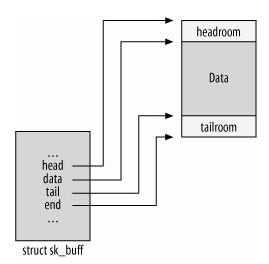

**三、逻辑框图**

**3.1 skb分配**

```
struct sk_buff *__alloc_skb(unsigned int size, gfp_t gfp_mask, int flags, int node)
{
    skb = kmem_cache_alloc(skbuff_head_cache, gfp_mask & ~_ _GFP_DMA);
    ... ... ...
    size = SKB_DATA_ALIGN(size);
    data = kmalloc(size + sizeof(struct skb_shared_info), gfp_mask);
}
```

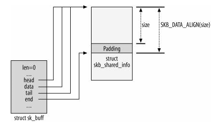

**3.2 skb 操作**

**1、skb\_put: 在尾部增加buffer的大小，返回buffer增加之前的尾tail地址  ==》在数据包尾填充新的数据，发包时使用**

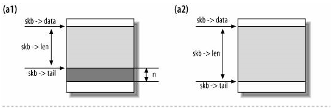

```
unsigned char *skb_put(struct sk_buff *skb, unsigned int len)
{
        unsigned char *tmp = skb_tail_pointer(skb);
        skb->tail += len;
        skb->len  += len;
        return tmp;  //返回buffer增加之前的尾tail地址
}  
```

**2、skb\_push:在头部增加buffer的大小：返回增加后的buffer地址  ==》在数据包再增加头内容，发包时使用**

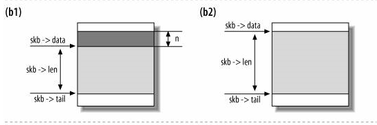

```
unsigned char *skb_push(struct sk_buff *skb, unsigned int len)
{
        skb->data -= len;
        skb->len  += len;
        return skb->data;
}
```

**3、skb\_pull：从buffer的头部移除一部分空间，返回移除后的buffer地址 ==》在数据包头去掉头，解包时使用**

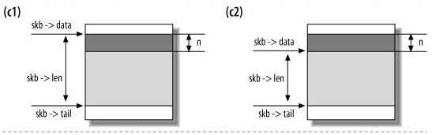

```
static inline unsigned char *__skb_pull(struct sk_buff *skb, unsigned int len)
{
        skb->len -= len;
        return skb->data += len;
}
```

**4、skb\_reserve：对空的skb（即skb\-\>data等于skb\-\>tail），在其头部保留一段空间**

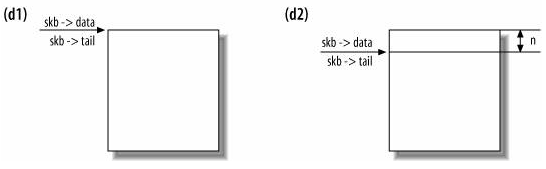

```
static inline void skb_reserve(struct sk_buff *skb, int len)
{
        skb->data += len;
        skb->tail += len;
}
```

**四、分片结构**

**4.1 分片相关数据结构**

```
/**
* sk_buff对应的数据区的附加信息，在缓冲区数据的末尾。
* 这个数据结构紧跟在end指针所指的地址之后（end指针指示数据的末尾）
*/
struct skb_shared_info {
        /**
         * 数据块的"用户"数,用于克隆和拷贝缓冲区
         */
        atomic_t        dataref;
        /**
         * 分散/聚集IO的页面数。
         */
        unsigned int    nr_frags;
        /**
         * 用于TCP段卸载（TSO）
         */
        unsigned short  tso_size;
        unsigned short  tso_segs;
        /**
         * 存储IP分片
         */
        struct sk_buff  *frag_list;
        /**
         * 分散/聚集IO启用时，指向所有页面。
         */
        skb_frag_t      frags[MAX_SKB_FRAGS];
};

struct sk_buff {
        /**
         * 这是缓冲区中数据部分的长度。它包括主缓冲区中的数据长度（data指针指向它）和分片中的数据长度。
         * 它的值在缓冲区从一个层向另一个层传递时改变，因为往上层传递，旧的头部就没有用了，而往下层传递，需要添加本层的头部。
         * len 同样包含了协议头的长度。
         */
        unsigned int            len;
        /*分片中数据的长度.*/
        unsigned int  data_len;
        ...
}
```

_nr\_frags, frags和frag\_list与IP分片的存储有关。frags和frag\_list是两种类型的分片表示方法。frags表示的数据在frag\_list表示的数据前面？_

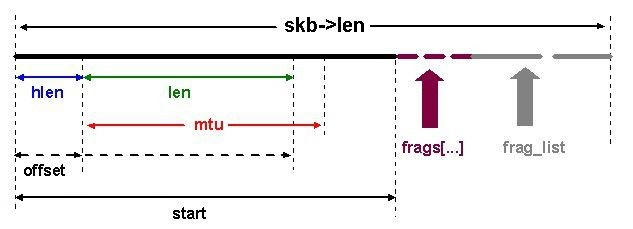

"《深入理解Linux内核网络》一书的21.1.4.3节中对frags的描述跟以上不太一样，frags表示分散聚集的内存，这内存不是分片的数据，而是线性区之外分散的内存数据，并且线性区数据\+frags中的数据不能大于mtu，否则应该另外创建skb用一个新的ip分片来管理"

"frags向量中指向的数据是对主缓冲区中的数据的扩展，即frags中的数据属于当前skb指向的ip分片；而frags\_list中的数据则表示独立缓冲区\(即每个缓冲区都将作为一个单独的IP片段进行独立传输\)。frags\_list中的skb表述的数据属于后续ip分片，所以上图是错误的？frags应该画到mtu内？"

**4.2 线性数据区**

刚刚开始使用skb\_alloc给skb分配的时候，预分配一个一块线性数据区域，这个区域一般放入的是各个协议层次的不同的头，还有一些实际数据，下面的非线性区域是为了弥补当数据真的很多的时候，作为数据区域的扩展，而skb\_shared\_info就是表示此扩展数据区域的。

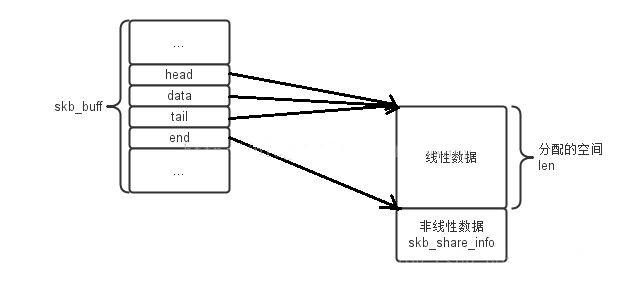

**4.3 frag\_list用法**

1）使用于在接收分片组后，链接多个分片，组成一个完成IP数据报；

2）在UDP数据报的输出中，将待分片的SKB链接到第一个SKB中，然后在输出过程中能够快速的分片；

3）用于存放FRAGLIST类型的聚合分散I/O的数据包，如果输出网络设备支持FRAGLIST类型的聚合分散I/O（目前只有回环设备支持），则可以直接输出。

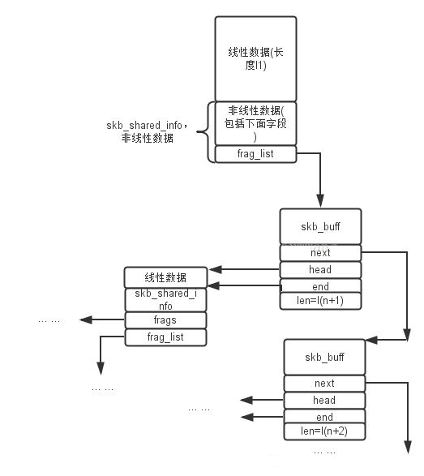

**4.4 frags和nr\_frags用法：**

```
/**
* 当设备支持分散/聚集IO时，该结构表示一段数据片段在内存中的位置及大小。
*/
struct skb_frag_struct {
        /**
         * 数据片段在哪个页面中。
         */
        struct page *page;
        /**
         * 在页面中的偏移。
         */
        __u16 page_offset;
        /**
         * 片段长度。
         */
        __u16 size;
};
```

frags和nr\_frags用于支持SG类型的聚合分散I/O分片。frags是用于存放聚合分散I/O分片的数组。nr\_frags为当前使用聚合分散I/O分片的数量，即为frags数组中使用的数量，不超过MAX\_SKB\_FRAGS。（_只有在DMA支持物理分散页的Scatter/Gather（SG，分散/聚集）操作时候才可以使用frags\[\]来保存剩下的数据，否则，只能扩展线性数据区域进行保存_）

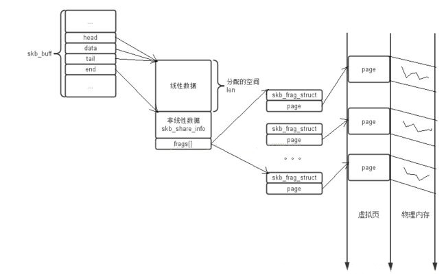

**4.5 整体分片数据框图**

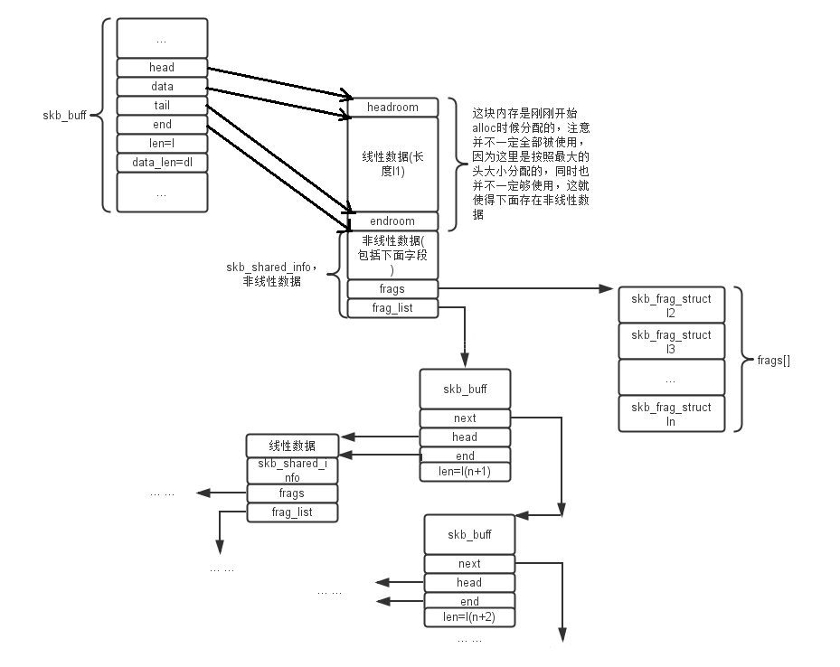

**五、skb复制**

**5.1 skb\_clone**

当skb缓冲区需要被多个地方使用，且使用者可能需要修改sk\_buff描述符的内容（如指向协议的报头的h和nh指针），内核不需要完全拷贝sk\_buff数据结构和数据缓冲区，可以只拷贝sk\_buff结构然后增加引用计数。该功能可以通过skb\_clone实现。如下框图可以看到skb\_clone只是将sk\_buff结构克隆了一份：

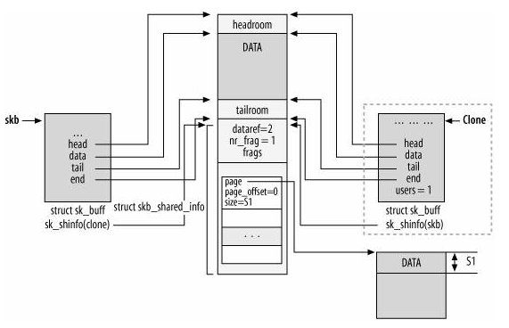

skb\_clone过程中的关键行为如函数注释所示：

```
struct sk_buff *skb_clone(struct sk_buff *skb, int gfp_mask)
{
        /**
         * 被克隆的sk_buff不会放在任何链表中，同时也不会有到socket的引用。
         */
        n->next = n->prev = NULL;
        n->list = NULL;
        n->sk = NULL;

        /**
         * 克隆包的skb->users值被置为1，这样，在释放时，可以先释放sk_buff结构。
         */
        atomic_set(&n->users, 1);
        
        /**
         * 缓冲区的引用计数(dataref)增加1（因为有多个sk_buff结构指向它），包含skb_shinfo的数据区域被多个sk_buff使用，因此增加引用计数
         */
        atomic_inc(&(skb_shinfo(skb)->dataref));

        /**
         * 原始的和克隆的sk_buff中的skb->cloned值都被置为1。
         */
        n->cloned = 1;
        skb->cloned = 1;
        
        return n;
}
```

**5.2 pskb\_copy**

如果对于多个使用者，其中还需要修改skb\-\>start和skb\-\>end之间的数据时，则需要使用pskb\_copy，其会克隆sk\_buff数据结构和包含skb\_share\_info的线性数据区域。

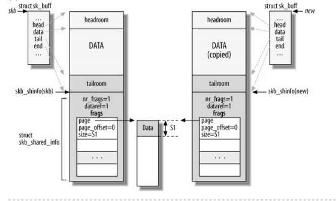

**5.3 skb\_copy**

如果对于多个使用者，其中还可能修改skb\_shinfo\(skb\)所描述的分片数据时，则需要使用skb\_copy，其会克隆sk\_buff数据结构、包含skb\_share\_info的线性数据区域，以及分片数据区域。下图省略了使用frag\_list形式的分片数据的克隆。

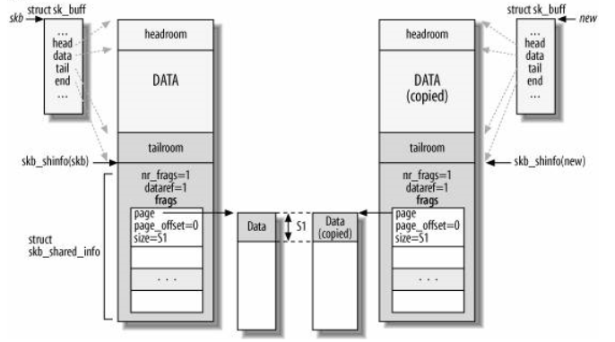
