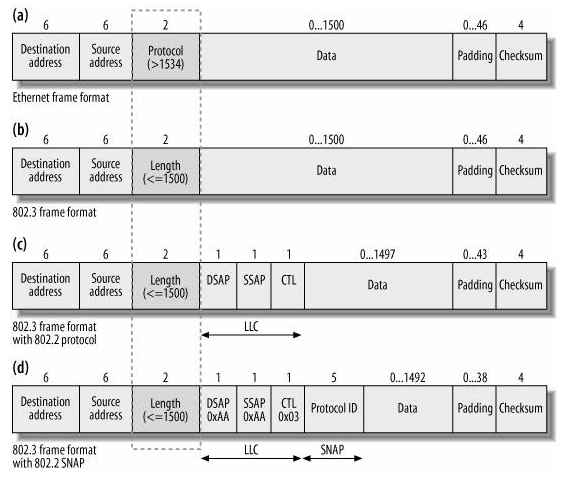
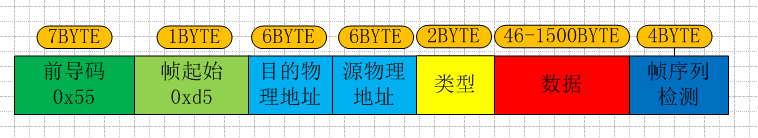
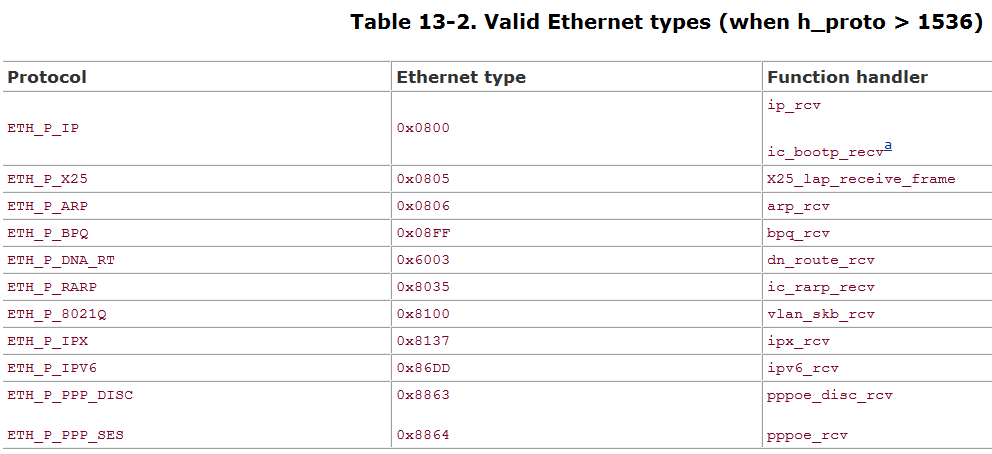
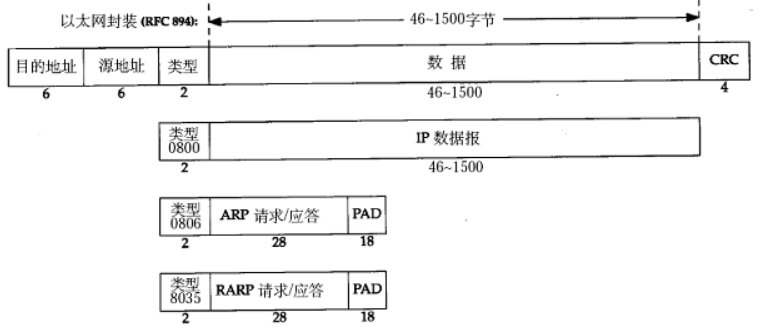
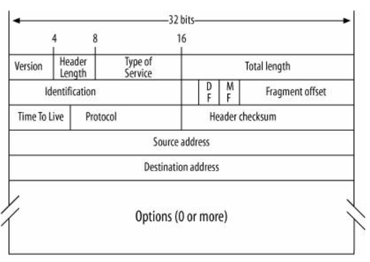
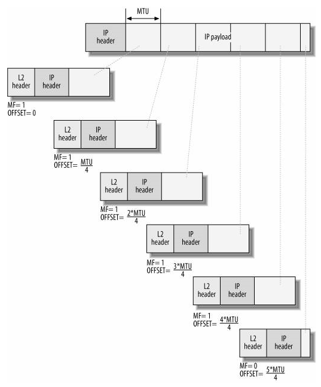
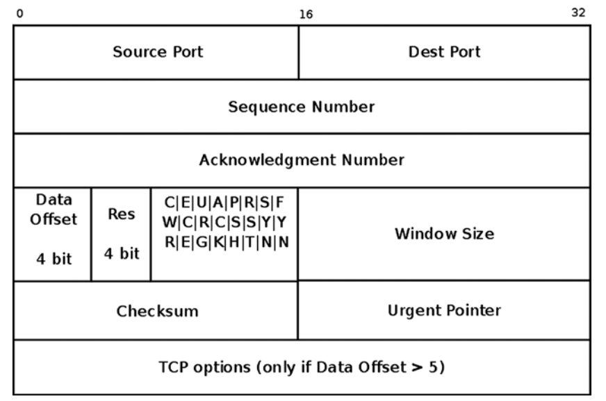
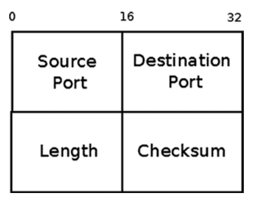
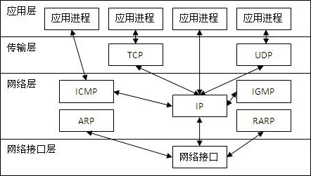
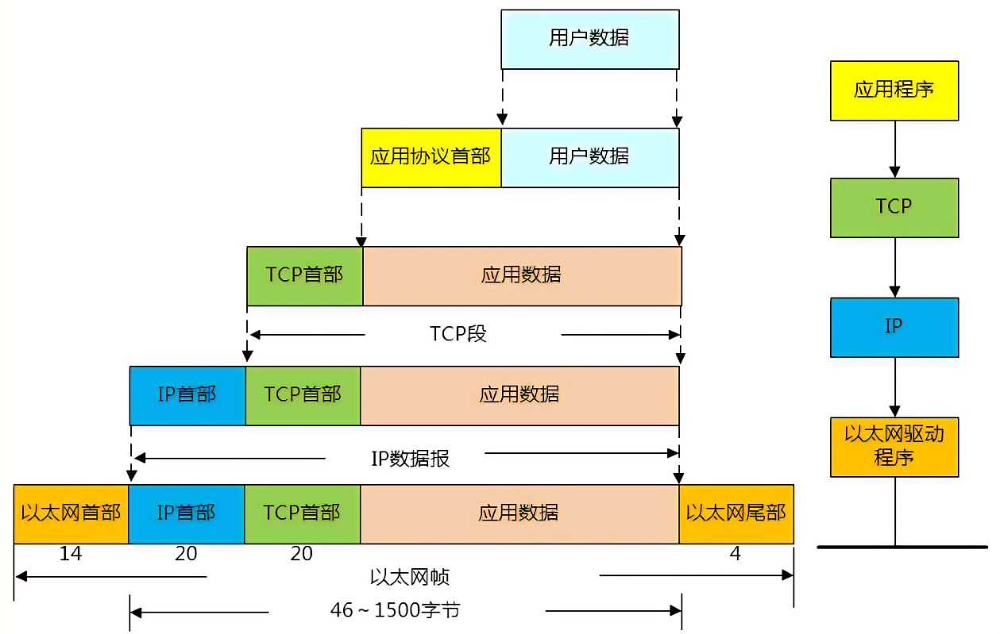

# linux网络管理之数据包格式

_注：本文中分片特指IP分片传输（fragment），分段特指TCP分段传输（segment）_

**一、以太网帧根式（L2）**

**1.1四种以太网帧格式**

目前，有四种不同格式的以太网帧在使用，它们分别是：

- lEthernet II即DIX2.0：Xerox与DEC、Intel在1982年制定的以太网标准帧格式。Cisco名称为：ARPA。
- lEthernet 802.3 raw：Novell在1983年公布的专用以太网标准帧格式。Cisco名称为：Novell\-Ether。
- lEthernet 802.3 SAP：IEEE在1985年公布的Ethernet 802.3的SAP版本以太网帧格式。Cisco名称为：SAP。
- lEthernet 802.3 SNAP：IEEE在1985年公布的Ethernet 802.3的SNAP版本以太网帧格式。Cisco名称为：SNAP。

在每种格式的以太网帧的开始处都有64比特（8字节）的前导字符，如图3所示。其中，前7个字节称为前同步码（Preamble），内容是16进制数0xAA，最后1字节为帧起始标志符0xAB，它标识着以太网帧的开始。前导字符的作用是使接收节点进行同步并做好接收数据帧的准备。四种具体格式如下：

**1.2 Ethernet II帧格式**

****

- Ethernet II类型以太网帧的最小长度为64字节（6＋6＋2＋46＋4），最大长度为1518字节（6＋6
- protocol/type 字段为2个字节标识出以太网帧所携带的上层数据类型，如16进制数0x0800代表IP协议数据，16进制数0x809B代表AppleTalk协议数据，16进制数0x8138代表Novell类型协议数据等。

        

      

        

- 数据长度最小为46字节，最大1500字节
- 在不定长的数据字段后是4个字节的帧校验序列（Frame Check Sequence，FCS），采用32位CRC循环冗余校验对从"目标MAC地址"字段到"数据"字段的数据进行校验。

**二、IP封包 （L3）**

**2.1 IP包结构**

**V****ersion 版本4位：**表示版本号，目前最广泛的是IPv4=B0100，相信IPv6=B0110

**Header Length 头长4位：**数据包头部长度。它表示数据包头部包括多少个32位长整型，也就是多少个4字节的数据。无选项则为5（红色部分）。

**Type of Service 服务类型**：包括8个二进制位，每个位的意义如下：

       过程字段：3位，设置了数据包的重要性，取值越大数据越重要，取值范围为：0（正常）~ 7（网络控制）

       延迟字段：1位，取值：0（正常）、1（期特低的延迟）

       流量字段：1位，取值：0（正常）、1（期特高的流量）

       可靠性字段：1位，取值：0（正常）、1（期特高的可靠性）

       成本字段：1位，取值：0（正常）、1（期特最小成本）

       保留字段：1位 ，未使用

**Total Length 总长度16位**：当前IP数据包的总长度，单位是字节。当然最大只能是65535，即63KB。

**Identification**** 重组标识16位**：发送者发送的包的顺序，依序递增1，如果客户端收到的包乱序了，依据这个排序。

**DF/MF 标志3位：**

　　第一位：保留字段

　　第二位：取值：0（允许数据报IP分片）、1（数据报不能IP分片）

　　第三位：后面是否有更多分片，取值：0（数据包后面没有包，该包为最后的包）、1（数据包后面有更多的包）

**Fragment Offset**** 段偏移量13位**：与更多段位组合，帮助接收方组合分片的报文，以字节\*8为单位。

**Time To Live**** 生存时间8位**：经常ping命令看到的TTL（Time To Live）就是这个，每经过一个路由器，该值就减一，到零丢弃。

**Protocol**** 协议代码8位**：表明使用该包裹的上层协议，如TCP=6，ICMP=1，UDP=17等。

**Header Checksum**** IP头检验和16位**：是IPv4数据包头部的校验和。

IP首部检验和字段\(16位，2字节\)，只计算IP头部的的所有字段的校验和，它不对首部后面的数据进行计算。

发送方：计算一份数据报的IP头部检验和，则需要首先把此检验和字段置为0。然后对首部中每个16 bit（2字节）进行二进制反码求和\(整个首部看成是由一串16 bit的字组成\)，然后结果存在此检验和字段中。接收方：当收到一份IP数据报后，对首部中每个16 bit（2字节）进行二进制反码的求和。由于接收方在计算过程中包含了发送方存在首部中的检验和，因此，如果首部在传输过程中没有发生任何差错，那么接收方计算的结果应该为全1。如果结果不是全1\(即检验和错误\)，那么IP就丢弃收到的数据报。但是不生成差错报文,由上层去发现丢失的数据报并进行重传。

**2.2 IP分片**

IP包分片（fragment），IP协议把封包的最大尺寸定义为64KB，长度由IP包头的len（16位）字段表示。由于实际上二层传输的数据单包大小受限，包括当前设备出口接口以及中间路由的限制，可能需要将IP包根据MTU进行分片传输。

IP分段：将原有的IP包分成MTU大小的封包包，最后一个封包可能小于MTU大小，每个封包都有独立的IP包头，IP包头中以下字段较为特殊：

- DF（Don't Fragment, 不分片）在分片情况下固定为0，否则不会分片
- MF（More Fragments，还有其他片）分片后最后一片封包为0，其他分片封包为1 
- OFFSET（Fragment offset，分片在原始IP封包中的偏移，单位是8字节，实际的偏移为OFFSET\*8，下图是不是画错？？？）
- ID （Identification，对于一个封包分段后的所有分片，其ID都是相同）

IP封包分片的重组：IP封包通常是在目的地主机进行重组，但是必须查看整个封包的中间设备也得重组，这类设备如防火墙和NAT路由器。IP数据报的分片与重组是在网络IP层完成的。

IP封包防止分片的方法：1、使用路径方向功能，设定路径中最小的MTU，避免分片；2、设置MTU为576，RFC791中规范每台主机必须能接收576大小的IP封包。

**三、TCP/UDP \(L4\)**

**3.1 TCP**

**3.1.1 TCP包结构**

**Source/Dest Port 16位端口号**：告知主机该报文段是来自哪里（源端口Source Port）以及传给哪个上层协议或应用程序（目的端口Destination Port）的。进行TCP通信时，客户端通常使用系统自动选择的临时端口号，而服务器则使用知名服务端口号（比如DNS协议对应端口53，HTTP协议对应80，这些端口号可在/etc/services文件中找到）。

**Sequence Number 32位序号**：一次TCP通信（从TCP连接建立到断开）过程中某一个传输方向上的字节流的每个字节的编号。假设主机A和主机B进行TCP通信，A发送给B的第一个TCP报文段中，序号值被系统初始化为某个随机值ISN（Initial Sequence Number，初始序号值）。那么在该传输方向上（从A到B），后续的TCP报文段中序号值将被系统设置成ISN加上该报文段所携带数据的第一个字节在整个字节流中的偏移。例如，某个TCP报文段传送的数据是字节流中的第1025~2048字节，那么该报文段的序号值就是ISN\+1025.另外一个传输方向（从B到A）的TCP报文段的序号值也具有相同的含义。

**Acknowledgement Number 32位确认号**：用作对另一方发送来的TCP报文段的响应。其值是收到的TCP报文段的序号值加1。假设主机A和主机B进行TCP通信，那么A发送出的TCP报文段不仅携带自己的序号，而且包含对B发送来的TCP报文段的确认号。反之，B发送出的TCP报文段也同时携带自己的序号和对A发送来的报文段的确认号。或者理解为接收者期望接收到的下一个序号。

**Header Length\(Data Offset\)�**�**4位头部长度**：标识该TCP头部有多少个32bit字（4字节）。因为4位最大能标识15，所以TCP头部最长是60字节。

**TCP Flags 6位标志位：**

        URG标志，表示紧急指针（urgent pointer）是否有效。

        ACK标志，表示确认号是否有效。我们称携带ACK标识的TCP报文段为确认报文段。

        PSH标志，提示接收端应用程序应该立即从TCP接收缓冲区中读走数据，为接收后续数据腾出空间（如果应用程序不将接收到的数据读走，它们就会一直停留在TCP接收缓冲区中）。

        RST标志，表示要求对方重新建立连接。我们称携带RST标志的TCP报文段为复位报文段。

        SYN标志，表示请求建立一个连接。我们称携带SYN标志的TCP报文段为同步报文段。

        FIN标志，表示通知对方本端要关闭连接了。我们称携带FIN标志的TCP报文段为结束报文段。

 **Window Size 16位窗口大小**：是TCP流量控制的一个手段。这里说的窗口，指的是接收通告窗口（Receiver Window，RWND）。它告诉对方本端的TCP接收缓冲区还能容纳多少字节的数据，这样对方就可以控制发送数据的速度。

**Checksum 16位校验和**：由发送端填充，接收端对TCP报文段执行CRC算法以检验TCP报文段在传输过程中是否损坏。注意，这个校验不仅包括TCP头部，也包括数据部分。这也是TCP可靠传输的一个重要保障。

**Urgent Pointer 16位紧急指针**：是一个正的偏移量。它和序号字段的值相加表示最后一个紧急数据的下一字节的序号。因此，确切地说，这个字段是紧急指针相对当前序号的偏移，不妨称之为紧急偏移。TCP的紧急指针是发送端向接收端发送紧急数据的方法。

**TCP Options TCP头部选项：**TCP头部的最后一个选项字段（options）是可变长的可选信息。这部分最多包含40字节，因为TCP头部最长是60字节（其中还包含前面讨论的20字节的固定部分）。典型的TCP头部选项结构如下图所示。

**3.1.2 TCP分段**

TCP分段（segment）即TCP数据包超过MSS后的行为，TCP协议中最大报文段长度\(Maximum Segment Size\)，即MSS，为TCP传输层的最大载荷上限\(即应用层数据最大长度\)，TCP三次握手期间通过TCP首部选项中的MSS字段通知对端，通常一条TCP连接的MSS取通信双方较小的那一个MSS值，与MTU的换算关系为：

            _MTU = MSS \+ TCP首部长度 \+ IP首部长度_

故在以太网中\(网络层以IPv4为例\)：

            _MSS = 以太网MTU \- TCP首部长度 \- IPv4首部长度 = 1500 \- 20 \- 20 = 1460字节_

未指定MSS时默认值为536字节，这是因为在Internet中标准的MTU值为576字节，576字节MTU = TCP首部长度20字节 \+ IPv4首部长度20字节 \+ 536字节MSS。

一个应用程序如果要发送超过MSS大小的TCP数据，就要进行分段传输\(这里指TCP分段\)，使得每个报文段长度都不超过MSS。分段传输的TCP报文段不一定按序到达，但实现可靠传输的TCP协议中有处理乱序的机制，即利用报文段序列号在接收缓冲区进行数据重排以实现重组。TCP分段的重组是在TCP传输层完成的。TCP分段仅发生在发送端，这是因为在传输过程中，TCP分段是先被封装成IP数据报，再封装在以太网帧中被链路所传输的，并且在端到端路径上通常不会有工作在三层以上，即传输层的设备，故TCP分段不会发生在传输路径中间的某个设备中，在发送端TCP传输层分段后，在接收端TCP传输层重组。

发送端进行TCP分段后就一定不会在IP层进行分片，因为MSS本身就是基于MTU推导而来，TCP层分段满足了MSS限制，也就满足了MTU的物理限制。但在TCP分段发生后仍然可能发生IP分片，这是因为TCP分段仅满足了通信两端的MTU要求，传输路径上如经过MTU值比该MTU值更小的链路，那么在转发分片到该条链路的设备中仍会以更小的MTU值作为依据再次进行IP分片。

**3.2 UDP**

udp没有类似tcp的分段机制，所以超过mtu大小的udp数据只能在ip层进行分片发送。

**四、 整体框架**

**五、参考资料**

1、[https://www.cnblogs.com/zhangmingda/p/12683149.html](https://www.cnblogs.com/zhangmingda/p/12683149.html)

2、[https://cloud.tencent.com/developer/article/1173790](https://cloud.tencent.com/developer/article/1173790)
