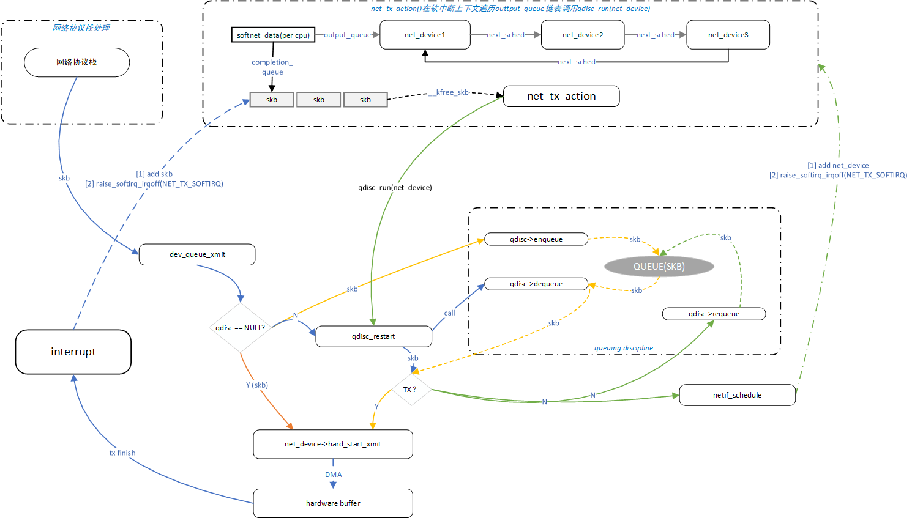

# linux网络管理之网卡数据发送

基于linux 2.6分析

**一、背景**

    协议栈将数据skb传递给网卡驱动，调用网卡驱动的发送方法完成数据的发送。

**二、数据结构**

```
struct softnet_data
{
        /**
         * output_queue是需要发包的设备列表。如果数据包缓存在qdisc的queue中，需要将net_device挂接在此链表中等待软中断处理
         */
        struct net_device       *output_queue;
        /**
         * completion_queue是已经成功发送，因而可以释放的缓冲区。在硬件中断中直接将skb释放影响性能，将skb挂接在此链表中等待tx软中断处理释放
         */
        struct sk_buff          *completion_queue;
};

struct net_device
{

        /**
         * 用于实现"Watchdog timer"，看门狗时钟的时间。
         * 这是等待的时间总计。由设备驱动程序初始化。当它被设置成0时，watchdog_timer没有启动。
         */
        int                     watchdog_timeo;
        /**
         * 这些变量用于流量管理，管理设备的接收，发送队列，并且可以被不同的cpu访问。
         */
        struct Qdisc            *qdisc;
        struct Qdisc            *qdisc_sleeping;
        struct Qdisc            *qdisc_ingress;
        struct list_head        qdisc_list;
        /**
         * 设备发送队列的长度。
         * 如果内核中包含了流量控制子系统，这个变量可能没有什么用（只有几个排队策略会使用它）。
         * 这个值可以通过sysfs文件系统修改（在/sys/class/net/device_name/目录下）。
         */
        unsigned long           tx_queue_len;   /* Max frames per queue allowed */

        spinlock_t              xmit_lock;
        /* cpu id of processor entered to hard_start_xmit or -1,
           if nobody entered there.
         */
        /**
         * xmit_lock_owner 是拥有锁的 CPU 的 ID。
         * 在单cpu系统上，这个值是 0；
         * 在多 cpu 系统中，如果锁没有被占用，这个值是-1。
         * 内核同样允许不加锁的发送，前提条件是设备驱动必须支持这个功能。
         */
        int                     xmit_lock_owner;
        /* device queue lock */
        /**
         * 流量控制子系统为每个网络设备定义了一个私有的发送队列。
         * queue_lock用于避免并发的访问。
         */
        spinlock_t              queue_lock;
        /**
         * 发送一个帧。
         */
        int                     (*hard_start_xmit) (struct sk_buff *skb,
                                                    struct net_device *dev);
        /* These may be needed for future network-power-down code. */
        /**
         * 最后一个帧开始发送的时间（用jiffies度量）。设备驱动在发送之前设置这个变量。
         * 这个变量用来检测网卡是否在给定的时间内把帧发送了出去。
         * 太长的发送时间意味着有错误发生，在这种情况下，设备驱动会重置网卡。
         */
        unsigned long           trans_start;    /* Time (in jiffies) of last Tx */
        /**
#define HAVE_TX_TIMEOUT
        /**
         * 在watchdog定时器超时后调用这个函数。它用来确定发送一个帧的时间是否太长。
         * 如果这个函数没有定义，watchdog定时器就不会被启用。
         * 当时钟到期时，内核处理函数dev_watchdog调用tx_timeout指向的函数。后者通常重置网卡，并且通过netif_wake_queue重启接口调度。
         */
        void                    (*tx_timeout) (struct net_device *dev);
}
```

**三、流程框架**



**3.1、发送路径**

        总体而言，数据发送框架较为简单，网络协议栈发送的数据用sk\_buff表示，取决于发送网卡情况，数据可能有3条线路（如上图不同的颜色路径）发送出去：

        1）如果在发送网卡无qdisc的情况下，数据直接从网卡驱动的hard\_start\_xmit方法发送出去，这种发送方式简单直接，但是如果此时网卡停止发送或其他原因，数据发送失败，那数据包只能丢弃。

        2）如果在发送网卡有指定的qdisc情况下，数据通过qdisc发送出去，如果此时网络发送条件正常，则skb也只是在qdisc的queue中缓存下，又立即通过网卡驱动的hard\_start\_xmit方法发送出去。

        3）如果qdisc\_restart发送的过程中，如果某些原因导致无法发送skb，则将skb重新入队列，并将相应的网卡nde\_device挂到softnet\_data指向的output\_queue中去，待发送软中断调用时，在软中断中网卡驱动的hard\_start\_xmit方法发送出去。

**3.2 qdisc**

        QDisc\(排队规则\)是queueing discipline的简写，它是理解流量控制\(traffic control\)的基础。无论何时，内核如果需要通过某个网络接口发送数据包，它都需要按照为这个接口配置的qdisc\(排队规则\)把数据包加入队列。然后，内核会尽可能多地从qdisc里面取出数据包，把它们交给网络适配器驱动模块。最简单的QDisc是pfifo它不对进入的数据包做任何的处理，数据包采用先入先出的方式通过队列。不过，它会保存网络接口一时无法处理的数据包。qdisc有多种，内核默认支持的是pfifo\_fast，对于部分虚拟网卡如lo，数据无需经过驱动发送出去，则无需qdisc。   

**3.3 skb释放**

         skb的流转至少经过以下4步，在硬件中断中不适合做skb释放这种非紧急事情，这些工作交由net\_tx\_action软中断处理

         网络协议栈skb \-\> 网卡驱动xmit 启动DMA发送 \-\> 发送完成触发硬件中断, 将skb挂入softnet\_data.completion\_queue链表 \-\> tx软中断中释放链表中所有skb

**3.4 watch dog**

        网卡注册的时候会调用dev\_watchdog\_init给每个网卡设备初始化一个定时器，定时器处理函数是通用函数dev\_watchdog，该函数定期检查，如果队列关闭且数据发送不出去就会调用网卡驱动的tx\_timeout函数，复位网卡。

```
static void dev_watchdog(unsigned long arg)
{
        struct net_device *dev = (struct net_device *)arg;

        spin_lock(&dev->xmit_lock);
        if (dev->qdisc != &noop_qdisc) {
                if (netif_device_present(dev) &&
                    netif_running(dev) &&
                    netif_carrier_ok(dev)) {
                        if (netif_queue_stopped(dev) &&
                            (jiffies - dev->trans_start) > dev->watchdog_timeo) {
                                printk(KERN_INFO "NETDEV WATCHDOG: %s: transmit timed out\n", dev->name);
                                dev->tx_timeout(dev);
                        }
                        if (!mod_timer(&dev->watchdog_timer, jiffies + dev->watchdog_timeo))
                                dev_hold(dev);
                }
        }    
        spin_unlock(&dev->xmit_lock);

        dev_put(dev);
}        
          
static void dev_watchdog_init(struct net_device *dev)
{
        init_timer(&dev->watchdog_timer);
        dev->watchdog_timer.data = (unsigned long)dev;
        dev->watchdog_timer.function = dev_watchdog;
}
```

**四、深入分析**

**五、参考资料**

《深入理解linux网络内幕》第十一章
