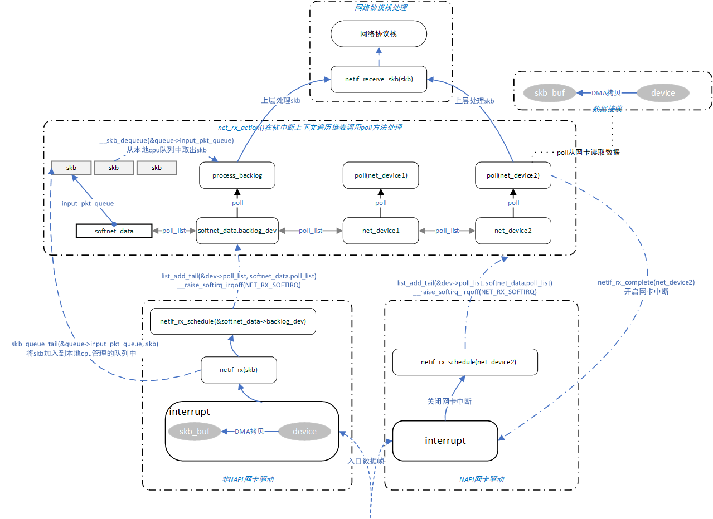
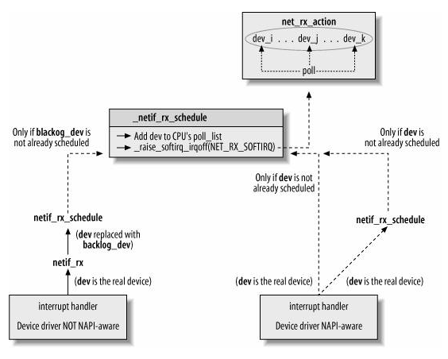

# linux网络管理之网卡驱动NAPI

基于linux 2.6分析

**一、NAPI背景概念**

在就有的网卡模型中，设备驱动会为其所接收的每个帧都产生一个中断事件，在高流量负载情况下，花在中断事件的时间较长，造成系统的响应延迟和资源的浪费。

NAPI混合了中断事件和轮询机制，在高流量负载情况下其性能会比旧有的方法要好很多，减少硬件中断处理的时间，将工作转移到软中断中处理，可以大幅度减少CPU的负载。其基本原理为，当接收到新帧时，网卡硬件中断中无需做过多的处理，只需关闭硬件中断自身并触发软中断，通过软中断中的轮询处理数据包，待数据包处理完成后再重新开启硬件中断。如此一来，驱动程序既能获得中断的及时性和轮询高性能。

**二、数据结构**

NAPI涉及的数据结构主要有两部分：

softnet\_data是每CPU数据，用于保存NAPI或兼容之前非NAPI的与CPU关联的数据结构

net\_device中有部分数据元素专门用于NAPI或兼容之前非NAPI元素

```
struct softnet_data
{
        /**
         * throttle、avg_blog、cng_level：这三字参数被用于拥塞管理算法
         * throttle被作为布尔变量处理，当CPU是超载时，其值为true，否则为false。
         * 它的值依赖于input_pkt_queue的数量。当throttle被设置时，当前CPU上的所有入包被丢弃，而不管队列中帧的数量。
         */
        int                     throttle;
        /**
         * 表示拥塞级别，通过avg_blog计算出，在get_sample_stats中计算。
         * 默认的，avg_blog和cng_level在处理每一帧时重新计算。但是可以被暂缓，并且挂到时钟上，以避免增加太多负载。
         */
        int                     cng_level;
        /**
         * 表示input_pkt_queue队列的平均长度，input_pkt_queue中的长度体现了该cpu上非NAPI 网卡驱动数据包的处理性能。
        它的范围在0到最大长度之间（netdev_max_backlog）。avg_blog被用来计算cng_level。
         * avg_blog和cng_level与CPU关联，因此被用于非NAPI驱动。
         */
        int                     avg_blog;
        /**
         * 这个队列在net_dev_init中初始化。入帧在没有被驱动处理前被存储在这里。
         * 它被非NAPI驱动使用。非NAPI使用它链接当前cpu上接收到到的从网卡设备上来的skb缓存，包括所有的非NAPI设备进入到该CPU的skb缓存。
         */
        struct sk_buff_head     input_pkt_queue;
        /**
         * 这是等待处理入帧的双向设备链表。
         */
        struct list_head        poll_list;
        /**
         * output_queue是需要发包的设备列表。发送相关数据结构
         */
        struct net_device       *output_queue;
        /**
         * completion_queue是已经成功发送，因而可以释放的缓冲区。发送相关数据结构
         */
        struct sk_buff          *completion_queue;

        /**
         * 这完全是一个嵌入的数据结构，类型为net_device。
            表示与CPU相关的的设备，用于泛指非NAPI设备，其poll函数为process_backlog，用于非NAPI设备的通用poll，以便在软中断中处理skb缓存。
         * 这个字段被非NAPI驱动使用。设备名字为"backlog device"。
         */
        struct net_device       backlog_dev;    /* Sorry. 8) */
};

DECLARE_PER_CPU(struct softnet_data,softnet_data);
```

```
struct net_device
{
        /**
         * 变量被NAPI使用，该链表中的net_device需要等待软中断调用其poll轮询方法处理数据。
            链表中可能包括若干个NAPI net_device和一个虚拟的由非NAPI设备共用的softnet_data.backlog_dev。
         * 在网卡入口有新帧的设备列表。列表头是softnet_data->poll_list。在这个列表中的设备的中断被禁止，并且内核正在轮询它们。
         */
        struct list_head        poll_list;      /* Link to poll list    */
        /**
         * quota是一个整数，表示在一次处理过程中，poll函数最多从队列中取出多少个缓冲区。
         * 它的值每次以weight为单位增加，被用来在不同的设备间进行公平的排序。低的配额意味着更长的延迟，因此其他设备饿死的风险更小。
         * 对与NAPI相关的设备，默认值由设备选择。大多数情况下，其值为64,但是也有使用16和32的。其值可以通过sysfs调整。
         * 在net_rx_action软中断poll的过程中，对于每个net_deivce一轮的遍历，其最多处理net_device.quota个缓冲区，待进行第二轮时，用weight来重新初始化quota。以此可以实现net_device设备之间的平衡
         */
        int                     quota;
        int                     weight;

        /**
         * 用于NAPI，一个虚函数。用于从入队列中取出缓冲区。对每个设备来说，入队列是私有的。
         * 返回值大于0，表示poll工作达到限额，还有工作未完成。在net_rx_action软中断中处理时需要将该net_device加入到poll_list队列尾进行下一轮的poll
           返回值等于0，表示poll工作全部完成，且未到达限额，在net_rx_action软中断中处理是需要将net_device摘除出poll_list中，无需再poll
         */
        int                     (*poll) (struct net_device *dev, int *quota);
}
```

**三、NAPI驱动流程**

如下是内核NAPI与非NAPI结构框图，实际上在引入NAPI机制后，为了兼容以前的非NAPI机制，两种机制有共用耦合的部分，如net\_device poll函数。

对于非NAPI驱动来讲，其本身的中断处理会将网卡设备数据拷贝到skb缓存，但是后续skb交由协议栈进一步处理则交由软中断中的通用poll函数。

而对于NAPI驱动来讲，其网卡驱动只是简单的将自身net\_device加入到poll\_list中，并关闭硬件中断，拉起软中断，网卡设备数据的拷贝和协议栈数据处理均在软中断中的poll中处理，而poll则需要NAPI设备自身根据其特性来实现。

注意：netif\_receive\_skb是在软中断中调用，协议栈处理数据依然是在软中断上下文中。



简单的结构描述如下：



函数功能分析：

\_\_netif\_rx\_schedule在NAPI和非NAPI中都有使用，对于非NAPI其添加是backlog\_dev虚拟设备，作为通用处理，并且只有在input\_pkt\_queue由空变为非空时才需此操作，对于NAPI设备，添加的则是NAPI设备自身。

```
static inline void __netif_rx_schedule(struct net_device *dev)
{
        unsigned long flags;

        local_irq_save(flags);
        dev_hold(dev);     //net_device引用计数增1
        list_add_tail(&dev->poll_list, &__get_cpu_var(softnet_data).poll_list);  //将设备加入poll_list
        if (dev->quota < 0) 
                dev->quota += dev->weight;
        else
                dev->quota = dev->weight;
        __raise_softirq_irqoff(NET_RX_SOFTIRQ);  //拉起NET_RX_SOFTIRQ软中断
        local_irq_restore(flags);
}
```

net\_rx\_action作为网卡数据接收软中断处理函数，在初始化时open\_softirq\(NET\_RX\_SOFTIRQ, net\_rx\_action, NULL\)注册进去，其本质还是在轮询调用处理NAPI及非NAPI的poll方法。

net\_rx\_action结束处理有两种可能：

1、poll\_list中的设备数据均处理完，设备被摘除链表

2、总的限额budget被用完，防止一次性poll处理太多导致性能及均衡问题，对于net\_device本身来讲，其配额使用完后，如果总的限额还有则还能进行下一次轮询。

```
static void net_rx_action(struct softirq_action *h)
{
        ...
        while (!list_empty(&queue->poll_list)) {
                struct net_device *dev;

                /**
                 * 如果当前设备还没有用完它的全部配额，它给予设备一个机会，通过poll函数从队列中取出缓冲区
                 */
                if (budget <= 0 || jiffies - start_time > 1)
                        goto softnet_break;

                local_irq_enable();

                /**
                 * 由于打开中断后，设备驱动只会在poll_list中增加设备，而不会删除。
                 * 因此，这里取第一个设备是没有问题的。
                 */
                dev = list_entry(queue->poll_list.next,
                                struct net_device, poll_list);

                /**
                 * 如果dev_poll因为设备配置不足以取出所有入队列中的所有缓冲而返回（这种情况下，它返回非0值），设备被移到poll_list的末尾
                 * 它在net_dev_init中被默认的初始化为process_backlog，因为这些设备不使用NAPI。
                 */
                if (dev->quota <= 0 || dev->poll(dev, &budget)) {
                        local_irq_disable();
                        /**
                         * 将设备移到链表尾部。
                         */
                        list_del(&dev->poll_list);
                        list_add_tail(&dev->poll_list, &queue->poll_list);
                        /**
                         * 重置设备配额。
                         */
                        if (dev->quota < 0)
                                dev->quota += dev->weight;
                        else
                                dev->quota = dev->weight;
                } else {
                        /**
                         * 当poll代替net_rx_action管理空队列，net_rx_action不从poll_list中移除设备：假定poll已经用netif_rx_complete这样做了
                         * 在软中断中，减少对设备的引用计数。
                         */
                        dev_put(dev);
                        /**
                         * 需要对链表进行判断了，此处需要关中断。
                         */
                        local_irq_disable();
                }
        }
        ...
}
```

process\_backlog作为非NAPI的通用处理poll方法，其本质是在循环处理网卡中断添加到softnet\_data.input\_pkt\_queue 上的skb包。

```
static int process_backlog(struct net_device *backlog_dev, int *budget)
{
        ...
        for (;;) {
                struct sk_buff *skb;
                struct net_device *dev;
                
                /**
                 * 由于要操作共享入包队列，并且多个设备可能产生中断向入队列写包，因此，在操作时，需要关闭中断。
                 * 这是本函数与NAPI设备的poll方法不同之处。
                 */
                local_irq_disable();
                /**
                 * 取出待处理的包。
                 */
                skb = __skb_dequeue(&queue->input_pkt_queue);
                if (!skb)
                        goto job_done;
                local_irq_enable();
                
                dev = skb->dev;
                
                /**
                 * 处理帧的主函数，不论是NAPI还是非NAPI，都会调用此函数将包传递给上层协议栈处理。
                 */
                netif_receive_skb(skb);
                
                dev_put(dev);
                
                work++;
                
                if (work >= quota || jiffies - start_time > 1)
                        break;
        
        }
        ...
}
```

**四、参考资料**

1、《深入理解linux网络技术内幕》
