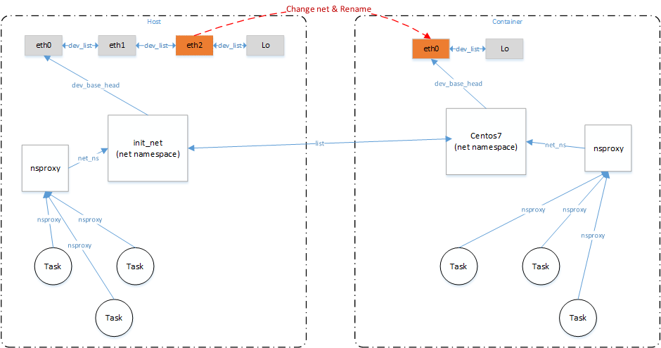

# linux网络管理之网络命名空间网卡独占

**一、背景**

存储设备通常采用高性能x86处理器，有多个物理网卡（如4或8个）。在业务上让某个容器独占使用物理网卡，可以提升容器业务的网络能力，相比较于docker中已有的3种网络模式（host，normal以及none），物理网卡独占方案能更好的利用IVSS等存储服务器的网络硬件资源。对于运行容器的宿主机系统环境来讲，需要负责为容器分配、回收以及管理物理网卡。

**二、整体方案**

**2.1技术原理**

容器独占物理网卡主要依赖于net namespace技术，在内核中，struct nsproxy用来管理一组namespace环境（如有pid、mount等等命名空间），在每个进程的数据结构struct task\_struct中都有元素nsproxy指向其所处的环境。

```
struct nsproxy {
        atomic_t count;
        struct uts_namespace *uts_ns;
        struct ipc_namespace *ipc_ns;
        struct mnt_namespace *mnt_ns;
        struct pid_namespace *pid_ns_for_children;
        struct net           *net_ns;
        struct cgroup_namespace *cgroup_ns;
};
```

设备启动后，host端（或者称为宿主机）中的进程均指向相同的nsproxy，使用相同的命名空间，其中的网络命名空间为init\_net。host端中的网卡设备，均在init\_net命名空间的管理下。容器创建以后，容器中的进程会使用一套新的nsproxy环境进行隔离，如果容器以非host模式创建，则容器进程使用的net namespace则会与host端不一样。将物理网卡给容器独占，其实只需将网卡设备挂到容器对应的net namespace中即可，这样对于物理网卡可以只给指定的容器使用，模型框图如下。

****

**2.2 容器独占物理网卡**

容器独占使用物理网卡的步骤较为简单，如下：

**1、启动容器，容器的网络模式为非host模式**

host模式，相当于容器和宿主机共享一个网络命名空间，容器可以看到host端的所有网卡

bridge模式，容器和宿主机通过一对veth虚拟网卡相连，但是容器依然有不同于宿主机的net命名空间，这对veth分属这两个net命名空间

none模式，则是容器和宿主机使用不同的net命名空间，容器对应得net命名空间中只有一个lo虚拟网卡。

**2、创建命名空间软连接**

创建软连接的目的是为了让ip命令能够操作到软连接指向的net命名空间

**3、在宿主机下修改物理网卡的net命名空间为容器的net命名空间**

**4、在容器环境中重命名物理网卡名称**

具体设置命令参考如下，将宿主机中的eth2分配给名称为centos7的容器，并在容器中重命名为eth0。此时在宿主机/proc/net/dev文件中不存在eth2设备，在容器centos7 /proc/net/dev文件中会新增一个eth0网卡，容器centos7可以独占原先宿主机中物理网卡eth2的带宽。

```
IMAGE_FILE="/mnt/dom_data/database/docker/centos7.2_20210527.tar"
IMAGE_NAME=centos7
SERVER_NAME=centos7
SERVER_NETNS=ns-${SERVER_NAME}
SERVER_HOSTNAME=vps-${SERVER_NAME}
IMAGE_ID=`docker load --input ${IMAGE_FILE} | grep sha256 | awk -F ":" '{print$3}'`
docker run -u root --cap-add NET_ADMIN --network none -m 8g --device /dev/mem --hostname ${SERVER_HOSTNAME} --name ${SERVER_NAME} -tid ${IMAGE_ID} /bin/bash
mkdir -p /var/run/netns/
SERVER_PID=`docker inspect ${SERVER_NAME} | grep "\"Pid\"" | awk -F " " '{print$2}' | awk -F "," '{print $1}'`
```

**2.3 宿主机回收容器中物理网卡**

待容器生命周期结束，或者是容器出现错误停止或退出，容器中的进程也会随之退出。容器进程指向的net命名空间缺少引用，内核会将该net命名空间释放掉，并调用内核网络子系统中的pernet\_operations机制，处理net命名空间释放时的收尾工作，其中default\_device\_exit\(\)函数会遍历net命名空间中的网卡，尝试将其归还给init\_net命名空间，即宿主机使用的命名空间。dev\_change\_net\_namespace\(\)函数完成网卡设备命名空间的修改。

**三、网卡丢失问题**

**3.1 网卡丢失**

```
if [ -L /var/run/netns/${SERVER_NETNS} ] ;then
    rm /var/run/netns/${SERVER_NETNS}
fi
ln -s /proc/${SERVER_PID}/ns/net /var/run/netns/${SERVER_NETNS}
# config container network
ip link set eth2 netns ${SERVER_NETNS}
docker exec ${SERVER_NAME} ip link set dev eth2 name eth0
```

修改物理网卡设备为某个容器的net命名空间，并将该网卡在容器中的网卡名改为宿主机中已存在的一个网卡名（如eth0这种常用网卡名），待该容器停止或退出后，在宿主机中无法找到原有的物理网卡，取而代之的是一个“devxxx”（x为数字）网卡。容器停止或退出时内核会将该net命名空间中真实的网卡归还给init\_net命名空间（即归还给宿主机），如上一节所述，default\_device\_exit\(\)在回收即将消亡的net命名空间的网卡设备时，如果网卡设备在容器中的名称与init\_net命名空间中的网卡名冲突，内核则会为其分配一个“devxxx”的网卡名。在这种情况下，物理网卡就像“丢失”一样，宿主机中负责网卡管理的软件无法方便的区分具体的物理网卡。

**3.2 解决方法**

在网卡的数据结构struct net\_device中新增一个init\_ns\_name数组，用于保存网卡在init\_net中的网卡名。当内核发现该网卡设备脱离init\_net命名空间时，保存其名称到init\_ns\_name中；当该网卡设备重新进入init\_net中时，恢复期在init\_net中原有的名称。只要保证设备中所有的物理网卡在init\_net命名空间中有其唯一的网卡名时，就能方便软件为容器分配和回收物理网卡设备。

**四、参考资料**

1、Linux内核代码：net/core/net\_namespace.c

2、https://www.jianshu.com/p/9f5743a7345a
