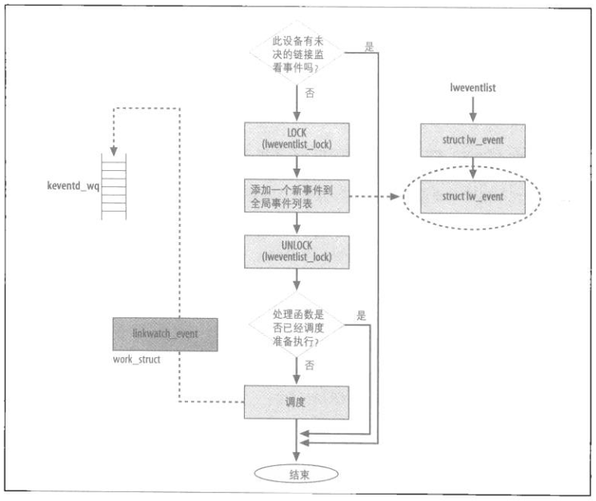

# linux网络管理之链接事件变更管理

基于2.6版本分析

**一、功能背景**

在Linux 网络协议栈中linkwatch模块用来通知网卡当前是否能够进行数据传输.

驱动中调用netif\_carrier\_on/netif\_carrier\_off函数（也只有这两处函数调用了）来通知网络状态变化.

主要作用:

1、启动/禁止 TX队列的流量控制功能

2、发起netlink消息NETDEV\_CHANGE到用户空间

**二、数据结构**

```
static unsigned long linkwatch_flags;  //linkwatch机制的状态标志
static unsigned long linkwatch_nextevent;  //存储工作队列下一次需要处理的时刻，单位为jiffies

enum lw_bits {
        /**
         * 当这个标志被设置时，linkwatch_event被调度执行，此标志由linkwatch_event自己清除。
         */
        LW_RUNNING = 0,
        /**
         * 由于lweventlist 通常有不止一个的元素，代码优化将静态分配的 lw_event 数据结构并总是用它作为第一个元素。
            仅当内核需要明了不止一个的未决事件(事件在不止一个设备)，为它分配额外的lw_event结构；否则，它简单的重用同一个结构。
         * 此标志表示第一个元素（即静态定义的变量singleevent）是否可用。通过该标志标记singleevent是否使用，如果没使用则使用singleevent，省的去kamlloc处理一个，提升性能。
         */
        LW_SE_USED
};

static void linkwatch_event(void *dummy);  //具体处理事件的函数
static DECLARE_WORK(linkwatch_work, linkwatch_event, NULL);  //具体处理事件的工作队列

/**
* 连接状态改变事件列表，后续所有的事件元素添加到此链表中。
*/
static LIST_HEAD(lweventlist);

/**
* 保护lweventlist链表的锁。
*/
static DEFINE_SPINLOCK(lweventlist_lock);

/**
* 网络设备连接状态改变事件。
* lw_event结构并不包括任何区分信号传递的检测与丢失的参数.
*/
struct lw_event {
        /**
         * 将结构连接到未决连接状态改变事件全局队列的字段lweventlist
         */
        struct list_head list;
        /**
         * 关联到net_device结构的指针
         */
        struct net_device *dev;
};
```

**三、流程分析**

外部调用linkwatch\_fire\_event，入参是网卡数据结构指针

```
void linkwatch_fire_event(struct net_device *dev)
{
        if (!test_and_set_bit(__LINK_STATE_LINKWATCH_PENDING, &dev->state)) {
         //判断未决状态，对一个网卡基本上只会有一个状态变更事件，不是开就是关，所以如果设备已有未决事件时，新事件就不用加入链表中。
                unsigned long flags;
                struct lw_event *event;

                if (test_and_set_bit(LW_SE_USED, &linkwatch_flags)) {
                        event = kmalloc(sizeof(struct lw_event), GFP_ATOMIC);

                        if (unlikely(event == NULL)) {
                                clear_bit(__LINK_STATE_LINKWATCH_PENDING, &dev->state);
                                return;
                        }
                } else {
                        event = &singleevent;
                }

                dev_hold(dev);
                event->dev = dev;

                spin_lock_irqsave(&lweventlist_lock, flags);
                list_add_tail(&event->list, &lweventlist);  //将事件加入链表中
                spin_unlock_irqrestore(&lweventlist_lock, flags);

                if (!test_and_set_bit(LW_RUNNING, &linkwatch_flags)) {
                        unsigned long thisevent = jiffies;

                        if (thisevent >= linkwatch_nextevent) {
                                schedule_work(&linkwatch_work); //运行工作队列，在工作队列中遍历运行事件
                        } else {
                                schedule_delayed_work(&linkwatch_work, linkwatch_nextevent - thisevent);
                        }
                }
        }
}
```

```
void linkwatch_run_queue(void)
{
        LIST_HEAD(head);
        struct list_head *n, *next;

        spin_lock_irq(&lweventlist_lock);
        list_splice_init(&lweventlist, &head);
        spin_unlock_irq(&lweventlist_lock);

        list_for_each_safe(n, next, &head) {
                struct lw_event *event = list_entry(n, struct lw_event, list);
                struct net_device *dev = event->dev;

                if (event == &singleevent) {
                        clear_bit(LW_SE_USED, &linkwatch_flags);
                } else {
                        kfree(event);
                }

                /* We are about to handle this device,
                 * so new events can be accepted
                 */
                /**
                 * 清除dev->state的__LINK_STATE_LINKWATCH_PENDING标志位
                 */
                clear_bit(__LINK_STATE_LINKWATCH_PENDING, &dev->state);

                if (dev->flags & IFF_UP) {
                        /**
                         * 发送NETDEV_CHANGE通知给netdev_chain通知链。
                         * 发送RTM_NEWLINK通知给RTMGRP_LINK RTnetlink组。
                         */
                        netdev_state_change(dev); //遍历所有事件，调用该函数表明状态发生变化
                }

                dev_put(dev);
        }
}
```

netdev\_state\_change的行为有两个：

1、发送通知链告知NETDEV\_CHANGE

2、通过NETLINK发送消息至群组，具体哪？？

```
void netdev_state_change(struct net_device *dev)
{
        if (dev->flags & IFF_UP) {
                notifier_call_chain(&netdev_chain, NETDEV_CHANGE, dev);
                rtmsg_ifinfo(RTM_NEWLINK, dev, 0);
        }
}
```



**四、总结**

linkwatch机制也就是个网络状态改变通知机制

来源于：netif\_carrier\_on/netif\_carrier\_off

发送到：通知链/netlink
