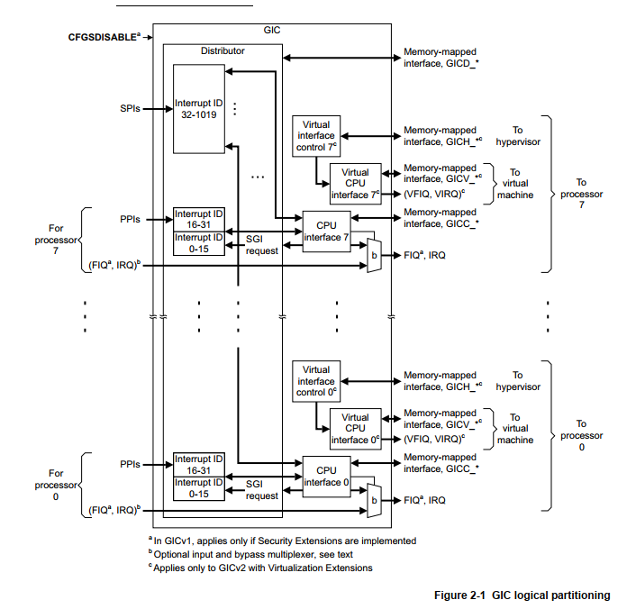
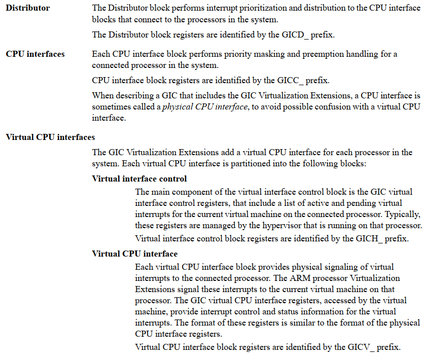
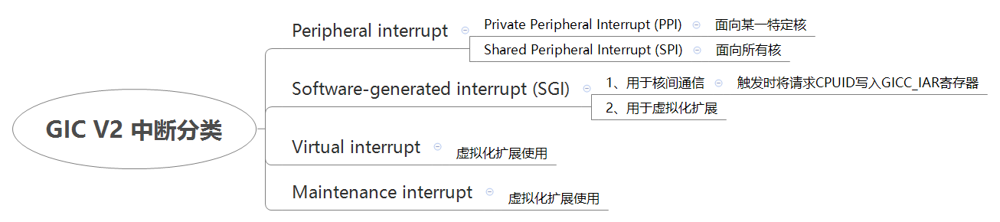
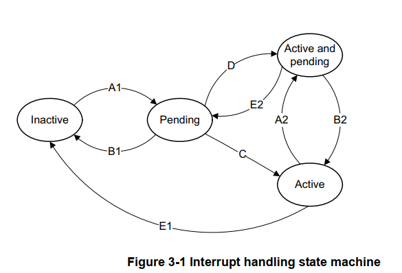
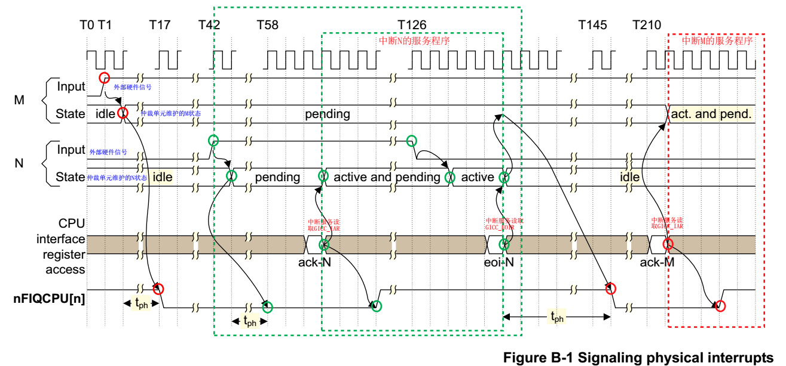

# 中断管理(一)中断控制器gic-v2

基于GIC\-400控制器 GIC version 2分析

**一、中断控制器框图**





1、 Distributor

执行中断优先级分配并分发给CPU interfaces模块

```
The Distributor provides a programming interface for:
• Globally enabling the forwarding of interrupts to the CPU interfaces. #控制转发中断到CPU interface模块的全局使能
• Enabling or disabling each interrupt.                                 #使能或失能每个中断
• Setting the priority level of each interrupt.                         #设置每个中断的优先级
• Setting the target processor list of each interrupt.                  #设置每个中断将转发到的CPU列表
• Setting each peripheral interrupt to be level-sensitive or edge-triggered.  #设置每个外设中断的触发方式：电平触发、边缘触发
• Setting each interrupt as either Group 0 or Group 1.                    #设置每个中断的Group：Group0或Group1，其中Group0用于安全中断，支持FIQ和IRQ，Group1用于非安全中断，只支持IRQ；
• Forwarding an SGI to one or more target processors.                      #将SGI中断分发到目标CPU上
• visibility of the state of each interrupt                                #每个中断的状态可见
• a mechanism for software to set or clear the pending state of a peripheral interrupt.  #提供软件机制来设置和清除外设中断的pending状态
```

2、CPU interfaces

执行优先级屏蔽和抢占处理

```
provides a programming interface for:
• enabling the signaling of interrupt requests to the processor         #使能中断请求信号到CPU上
• acknowledging an interrupt                                            #中断的确认
• indicating completion of the processing of an interrupt               #标识中断处理的完成
• setting an interrupt priority mask for the processor                  #为处理器设置中断优先级掩码
• defining the preemption policy for the processor                      #设置处理器的中断抢占策略
• determining the highest priority pending interrupt for the processor. #确定处理器的最高优先级pending中断
```

3、Virtual CPU interfaces

用于虚拟化扩展用途

**二、中断分类**



```
Interrupt numbers ID32-ID1019 are used for SPIs
Interrupt numbers ID0-ID31 are used for interrupts that are private to a CPU interface. These interrupts are banked in the Distributor.
    -ID0-ID15 are used for SGIs
    -ID16-ID31 are used for PPIs
```

**三、中断状态转移**

中断状态是每个中断在每个cpu interface

1、对于SGI/PPI中断，则每个中断都有一个状态

2、对于SPI中断，则每个中断都会在不同的interface有多个中断

```
The GIC maintains a state machine for each supported interrupt on each CPU interface
```



GIC检测中断流程如下：

\(1\) 当GIC检测到一个中断发生时，会将该中断标记为pending状态\(A1\)。

\(2\) 对处于pending状态的中断，仲裁单元回确定目标CPU，将中断请求发送到这个CPU上。

\(3\) 对于每个CPU，仲裁单元会从众多pending状态的中断中选择一个优先级最高的中断，发送到目标CPU的CPU Interface模块上。

\(4\) CPU Interface会决定这个中断是否可以发送给CPU。如果该终端优先级满足要求，GIC会发生一个中断信号给该CPU。

\(5\) 当一个CPU进入中断异常后，会去读取GICC\_IAR寄存器来响应该中断，会对该中断产生ACK\(一般是Linux内核的中断处理程序来读寄存器\)。寄存器会返回硬件中断号\(hardware interrupt ID\)，对于SGI中断来说同时会返回源CPU的ID。

     当GIC感知到软件读取了该寄存器后，又分为如下情况：

     \* 如果该中断源是pending状态，那么转改将变成active。\(C\)                               单个断言，则进入active状态

     \* 如果该中断又重新产生，那么pending状态变成active and pending。\(D\)         多个连续断言，则进入active&pending状态

     \* 如果该中断是active状态，现在变成active and pending。\(A2\)                          对于多个间隔开状态的变化

\(6\) 当处理器完成中断服务，必须发送一个完成信号EOI\(End Of Interrupt\)给GIC控制器。软件写GICC\_EOIR寄存器，状态变成inactive。\(E1\)

补充：

\(7\) 对于level triggered类型中断来说，当触发电平消失，状态从active and pending变成active。\(B2\)

**四、中断抢�**�

- 1、 GIC中断抢占

GIC中断控制器支持中断优先级抢占，一个高优先级中断可以抢占一个低优先级且处于active状态的中断，即GIC仲裁单元会记录和比较当前优先级最高的pending状态，然后去抢占当前中断，并且发送这个最高优先级的中断请求给CPU，CPU应答了高优先级中断，暂停低优先级中断服务，进而去处理高优先级中断。

GIC会将pending状态优先级最高的中断请求发送给CPU。

- 2、Linux对中断抢占处理

从GIC角度看，GIC会发送高优先级中断请求给CPU。

但是目前CPU处于关中断状态，需要等低优先级中断处理完毕，直到发送EOI给GIC。

然后CPU才会响应pending状态中优先级最高的中断进行处理。

所以Linux下：

\-高优先级中断无法抢占正在执行的低优先级中断。

\-同处于pending状态的中断，优先响应高优先级中断进行处理。

**五、GIC时序**



```
(1) T1时刻：GIC的总裁单元检测到中断M的电平变化。
(2) T2时刻：仲裁单元设置中断M的状态为pending。
/---------------------------经过tph的时间------------------------------/
(3) T17时刻：CPU Interface模块会拉低nFIQCPU[n]信号。在中断M的状态变成pending后，大概需要15个时钟周期后会拉低nFIQCPU[n]信号来向CPU报告中断请求(assertion)。仲裁单元需要这些时间来计算哪个是pending状态下优先级最高的中断。
(4) T42时刻：仲裁单元检测到另外一个优先级更高的中断N。
(5) T43时刻：仲裁单元用中断N替换中断M为当前pending状态下优先级最高的中断，并设置中断N为pending状态。
/---------------------------经过tph的时间------------------------------/
(6) T58时刻：经过tph个时钟后，CPU Interface拉低你FIOCPU[n]信号来通知CPU。因为此信号在T17时刻已经被拉低，CPU Interface模块会更新GICC_IAR寄存器的Interrupt ID域，该域的值变成中断N的硬件中断号。
(7) T61~T131时刻：Linux对中断N的服务程序
/-----------------------------------------------------------------------
　　T61时刻：CPU(Linux中断服务例程)读取GICC_IAR寄存器，即软件响应了中断N。这时仲裁单元把中断N的状态从pending变成active and pending。读取GICC_IAR
            (读取GICC_IAR的过程中，一方面获取到当前中断的硬件中断号，另一方面会产生一个ACK给该中断)
　　T64时刻：在中断N被Linux响应3个时钟内，CPU Interface模块完成对nFIQCPU[n]信号的deasserts，即拉高nFIQCPU[n]信号。
　　T126时刻：外设也deassert了该中断N。
　　T128时刻：仲裁单元移出了中断N的pending状态。
　　T131时刻：Linux服务程序把中断N的硬件ID号写入GICC_EOIR寄存器来完成中断N的全部处理过程。写GICC_EOIR
-----------------------------------------------------------------------/
(8) T146时刻：在向GICC_EOIR寄存器写入中断N中断号后的tph个时钟后，仲裁单元会选择下一个最高优先级中断，即中断M，发送中断请求给CPU Interface模块。CPU Interface会拉低nFIQCPU[n]信号来向CPU报告外设M的中断请求。
(9) T211时刻：Linux中断服务程序读取GICC_IAR寄存器来响应中断，仲裁单元设置中断M的状态为active and pending。
(10) T214时刻：在CPU响应中断后的3个时钟内，CPU Interface模块拉高nFIOCPU[n]信号来完成deassert动作。
```

- tph 长度 大概15个时钟周期，仲裁单元需要这15个时钟周期来计算哪个是pending状态下优先级最高的中断
- 读取GICC\_IAR的过程中，一方面获取到当前中断的硬件中断号，另一方面会产生一个ACK给该中断
