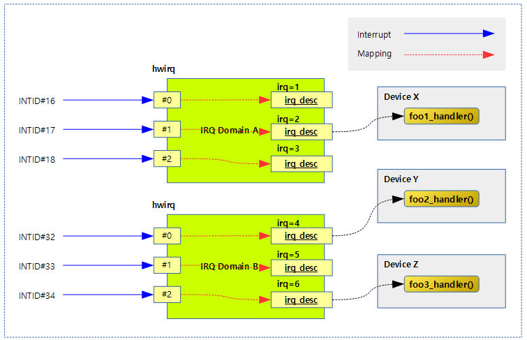
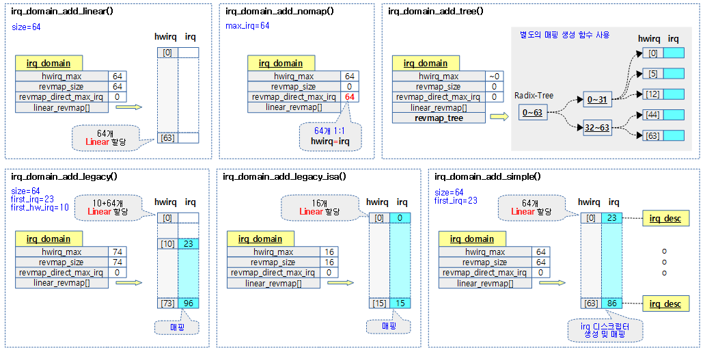
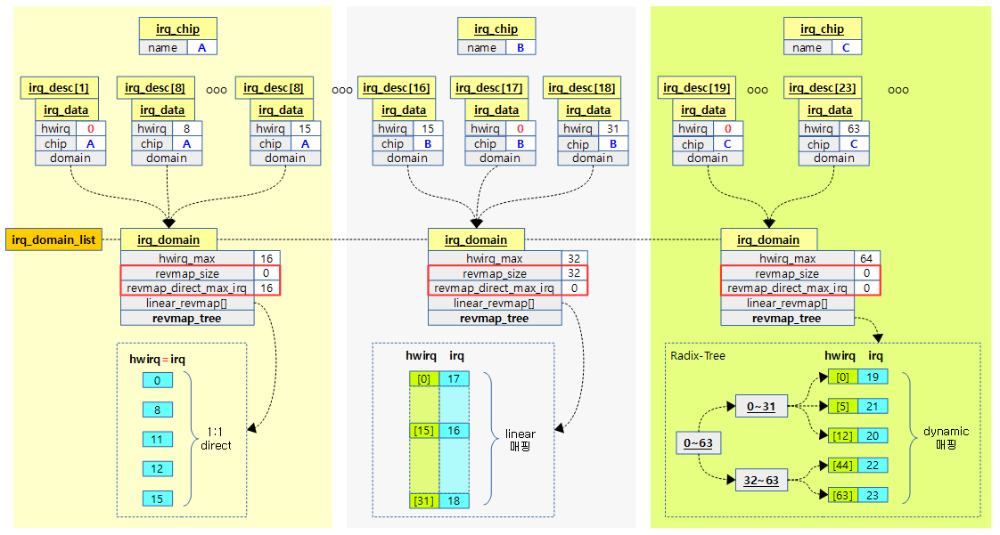
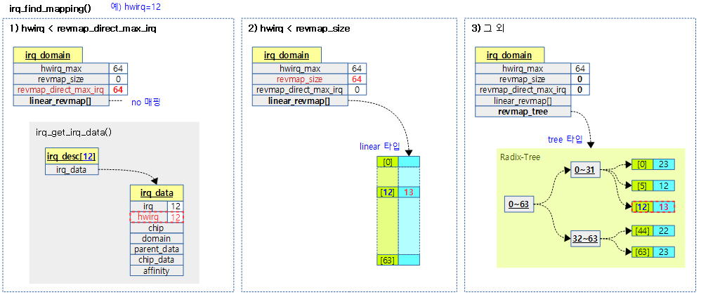
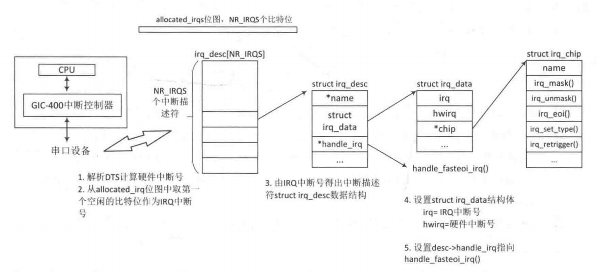

# 中断管理(三)之irq domain

分析环境：

    linux4.9.94

    ARM32/dts

参考资料：

[http://jake.dothome.co.kr/interrupts\-2/](http://jake.dothome.co.kr/interrupts-2/)

[http://jake.dothome.co.kr/interrupts\-3/](http://jake.dothome.co.kr/interrupts-3/)

**一、什么是irqdomain**

在中断产生时，通过映射关系（hwirq\-\> Linux irq），可以更快的找到相应的中断描述符irq\_desc处理函数



**二、irqdomain数据结构**

```
/**
* struct irq_domain_ops - Methods for irq_domain objects
* @match: Match an interrupt controller device node to a host, returns
*         1 on a match
* @map: Create or update a mapping between a virtual irq number and a hw
*       irq number. This is called only once for a given mapping.
* @unmap: Dispose of such a mapping
* @xlate: Given a device tree node and interrupt specifier, decode
*         the hardware irq number and linux irq type value.
*
* Functions below are provided by the driver and called whenever a new mapping
* is created or an old mapping is disposed. The driver can then proceed to
* whatever internal data structures management is required. It also needs
* to setup the irq_desc when returning from map().
*/
struct irq_domain_ops {
        int (*match)(struct irq_domain *d, struct device_node *node,
                     enum irq_domain_bus_token bus_token);
        int (*select)(struct irq_domain *d, struct irq_fwspec *fwspec,
                      enum irq_domain_bus_token bus_token);
        int (*map)(struct irq_domain *d, unsigned int virq, irq_hw_number_t hw);
        void (*unmap)(struct irq_domain *d, unsigned int virq);
        int (*xlate)(struct irq_domain *d, struct device_node *node,
                     const u32 *intspec, unsigned int intsize,
                     unsigned long *out_hwirq, unsigned int *out_type);
                
#ifdef  CONFIG_IRQ_DOMAIN_HIERARCHY
        /* extended V2 interfaces to support hierarchy irq_domains */
        int (*alloc)(struct irq_domain *d, unsigned int virq,
                     unsigned int nr_irqs, void *arg);
        void (*free)(struct irq_domain *d, unsigned int virq,
                     unsigned int nr_irqs);
        void (*activate)(struct irq_domain *d, struct irq_data *irq_data);
        void (*deactivate)(struct irq_domain *d, struct irq_data *irq_data);
        int (*translate)(struct irq_domain *d, struct irq_fwspec *fwspec,
                         unsigned long *out_hwirq, unsigned int *out_type);
#endif  
};

struct irq_domain {
        struct list_head link;
        const char *name;
        const struct irq_domain_ops *ops;
        void *host_data;
        unsigned int flags;

        /* Optional data */
        struct fwnode_handle *fwnode;
        enum irq_domain_bus_token bus_token;
        struct irq_domain_chip_generic *gc;
#ifdef  CONFIG_IRQ_DOMAIN_HIERARCHY
        struct irq_domain *parent;
#endif

        /* reverse map data. The linear map gets appended to the irq_domain */
        irq_hw_number_t hwirq_max;
        unsigned int revmap_direct_max_irq;
        unsigned int revmap_size;
        struct radix_tree_root revmap_tree;
        unsigned int linear_revmap[];  //扩展映射数据，需要额外kmalloc
};
```

**三、创建irq domain**

1、创建的时机

gic\_of\_init\-\>\_\_gic\_init\_bases\-\>gic\_init\_bases\(）

2、irqdomain的分类



3、创建的方法

下图显示了通过混合三种方法（例如对应于三个中断控制器的nomap，linear和tree）来配置irq\_domain的示例。



**创建（添加）并删除IRQ域**

nomap添加

```
static inline struct irq_domain *irq_domain_add_nomap(struct device_node *of_node,
                                         unsigned int max_irq,
                                         const struct irq_domain_ops *ops,
                                         void *host_data)
{       
        return __irq_domain_add(of_node_to_fwnode(of_node), 0, max_irq, max_irq, ops, host_data);
}  
```

linear添加

```
static inline struct irq_domain *irq_domain_add_linear(struct device_node *of_node,
                                         unsigned int size,
                                         const struct irq_domain_ops *ops,
                                         void *host_data)
{
        return __irq_domain_add(of_node_to_fwnode(of_node), size, size, 0, ops, host_data);
}
```

radixtree添加

```
static inline struct irq_domain *irq_domain_add_tree(struct device_node *of_node,
                                         const struct irq_domain_ops *ops,
                                         void *host_data)
{
        return __irq_domain_add(of_node_to_fwnode(of_node), 0, ~0, 0, ops, host_data);
}
```

```
/**                           
* __irq_domain_add() - Allocate a new irq_domain data structure
* @fwnode: firmware node for the interrupt controller
* @size: Size of linear map; 0 for radix mapping only  linear映射才使用
* @hwirq_max: Maximum number of interrupts supported by controller
* @direct_max: Maximum value of direct maps; Use ~0 for no limit; 0 for no
*              direct mapping
* @ops: domain callbacks
* @host_data: Controller private data pointer
*
* Allocates and initialize and irq_domain structure.
* Returns pointer to IRQ domain, or NULL on failure.
*/             
struct irq_domain *__irq_domain_add(struct fwnode_handle *fwnode, int size,
                                    irq_hw_number_t hwirq_max, int direct_max,
                                    const struct irq_domain_ops *ops,
                                    void *host_data)
{
        struct device_node *of_node = to_of_node(fwnode);
        struct irq_domain *domain;

        domain = kzalloc_node(sizeof(*domain) + (sizeof(unsigned int) * size),
                              GFP_KERNEL, of_node_to_nid(of_node));
        if (WARN_ON(!domain))
                return NULL;

        of_node_get(of_node);

        /* Fill structure */
        INIT_RADIX_TREE(&domain->revmap_tree, GFP_KERNEL);
        domain->ops = ops;
        domain->host_data = host_data;
        domain->fwnode = fwnode;
        domain->hwirq_max = hwirq_max;
        domain->revmap_size = size;  //主要是linear map使用, tadixtree不使用
        domain->revmap_direct_max_irq = direct_max;  //只有nomap使用
        irq_domain_check_hierarchy(domain);

        mutex_lock(&irq_domain_mutex);
        list_add(&domain->link, &irq_domain_list); //加入全局domain链表
        mutex_unlock(&irq_domain_mutex);

        pr_debug("Added domain %s\n", domain->name);
        return domain;
}
```

**四、中断映射搜索（hwirq\-\> irq）**

从硬件中断号返回virq号

```
unsigned int irq_find_mapping(struct irq_domain *domain,
                              irq_hw_number_t hwirq)
{
        struct irq_data *data;

        if (hwirq < domain->revmap_direct_max_irq) {
                data = irq_domain_get_irq_data(domain, hwirq);  //nomap映射
                if (data && data->hwirq == hwirq)
                        return hwirq;
        }               

        /* Check if the hwirq is in the linear revmap. */
        if (hwirq < domain->revmap_size)
                return domain->linear_revmap[hwirq];  //liner 映射
                                          
        rcu_read_lock();                  
        data = radix_tree_lookup(&domain->revmap_tree, hwirq);   //radixtree 映射
        rcu_read_unlock();
        return data ? data->irq : 0;
}
```

图1 nomap

图2 liner map

图3 radixtree map



**五、创建和删除IRQ映射**

1、创建时机

gic\_of\_init\-\>irq\_of\_parse\_and\_map\-\>irq\_create\_of\_mapping\(\)

```
unsigned int irq_of_parse_and_map(struct device_node *dev, int index)
{
        struct of_phandle_args oirq;

        if (of_irq_parse_one(dev, index, &oirq))
                return 0;

        return irq_create_of_mapping(&oirq);
}
```

2、创建/删除接口

以下是可以动态创建（包括连接）和删除域内映射的API。创建hw irq \-\>irq number的映射关系

\-\-irq\_create\_mapping（）

    \* 分配一个irq描述符并将其映射到指定的hwirq。

\-\-irq\_create\_of\_mapping（）

    \* 分配一个irq描述符，解析通过设备树节点找到的虚拟参数值，并将其映射到转换后的hwirq。

\-\-irq\_create\_fwspec\_mapping（）

    \* 分配irq描述符，并通过作为参数传递的fwspec结构将其映射到转换后的hwirq。

\-\-irq\_create\_identity\_mapping（）

    \* hwirq和irq分配相同的irq描述符并映射到hwirq。

\-\-irq\_create\_strict\_mapping（）

    \* 分配多个irq描述符，并将它们依次映射到指定的irq和hwirq编号。

\-\-irq\_create\_direct\_mapping（）

    \* 分配irq描述符后，以与hwirq编号相同的方式使用1：1直接映射方法对其进行映射。（hwirq = irq）

\-\-irq\_dispose\_mapping（）

    \* 取消映射并删除irq描述符。

3、基础irq\_create\_mapping方法

irq\_create\_mapping是一个基础的hwirq 到 virq的映射关系建立函数，irq\_create\_fwspec\_mapping也会调用该函数

```
unsigned int irq_create_mapping(struct irq_domain *domain,
                                irq_hw_number_t hwirq)
{
        struct device_node *of_node;
        int virq;

        pr_debug("irq_create_mapping(0x%p, 0x%lx)\n", domain, hwirq);

        /* Look for default domain if nececssary */
        if (domain == NULL)
                domain = irq_default_domain;
        if (domain == NULL) {
                WARN(1, "%s(, %lx) called with NULL domain\n", __func__, hwirq);
                return 0;
        }
        pr_debug("-> using domain @%p\n", domain);

        of_node = irq_domain_get_of_node(domain);

        /* Check if mapping already exists */  //检查映射是否已经处存在
        virq = irq_find_mapping(domain, hwirq);
        if (virq) {
                pr_debug("-> existing mapping on virq %d\n", virq);
                return virq;
        }

        /* Allocate a virtual interrupt number */  //分配irq描述符
        virq = irq_domain_alloc_descs(-1, 1, hwirq, of_node_to_nid(of_node), NULL);
        if (virq <= 0) {
                pr_debug("-> virq allocation failed\n");
                return 0;
        }

        if (irq_domain_associate(domain, virq, hwirq)) {  //将hwirq 和 irq number关联映射
                irq_free_desc(virq);
                return 0;
        }

        pr_debug("irq %lu on domain %s mapped to virtual irq %u\n",
                hwirq, of_node_full_name(of_node), virq);

        return virq;
}
```

为irqdomain分配irq描述符

```
如果入参virq大于等于0，则irq为指定值
如果入参virq小于0，则irq值为__irq_alloc_descs重分配值
int irq_domain_alloc_descs(int virq, unsigned int cnt, irq_hw_number_t hwirq,
                           int node, const struct cpumask *affinity)
{
        unsigned int hint;

        if (virq >= 0) {
                virq = __irq_alloc_descs(virq, virq, cnt, node, THIS_MODULE,
                                         affinity);
        } else {
                hint = hwirq % nr_irqs; //求余处理的目的是什么？
                if (hint == 0)
                        hint++;
                virq = __irq_alloc_descs(-1, hint, cnt, node, THIS_MODULE,
                                         affinity);
                if (virq <= 0 && hint > 1) {
                        virq = __irq_alloc_descs(-1, 1, cnt, node, THIS_MODULE,
                                                 affinity);
                }
        }

        return virq;
}

/**
* irq_alloc_descs - allocate and initialize a range of irq descriptors
* @irq:        Allocate for specific irq number if irq >= 0
* @from:       Start the search from this irq number
* @cnt:        Number of consecutive irqs to allocate.
* @node:       Preferred node on which the irq descriptor should be allocated
* @owner:      Owning module (can be NULL)
* @affinity:   Optional pointer to an affinity mask array of size @cnt which
*              hints where the irq descriptors should be allocated and which
*              default affinities to use
*
* Returns the first irq number or error code
*/
int __ref
__irq_alloc_descs(int irq, unsigned int from, unsigned int cnt, int node,
                  struct module *owner, const struct cpumask *affinity)
{
        int start, ret;

        if (!cnt)
                return -EINVAL;

        if (irq >= 0) {
                if (from > irq)
                        return -EINVAL;
                from = irq;
        } else {
                /*
                 * For interrupts which are freely allocated the
                 * architecture can force a lower bound to the @from
                 * argument. x86 uses this to exclude the GSI space.
                 */
                from = arch_dynirq_lower_bound(from);
        }

        mutex_lock(&sparse_irq_lock);

        start = bitmap_find_next_zero_area(allocated_irqs, IRQ_BITMAP_BITS,
                                           from, cnt, 0);  //form:The bitnumber to start searching at
        ret = -EEXIST;
        if (irq >=0 && start != irq)
                goto unlock;

        if (start + cnt > nr_irqs) {
                ret = irq_expand_nr_irqs(start + cnt);  //扩展irqs
                if (ret)
                        goto unlock;
        }
        ret = alloc_descs(start, cnt, node, affinity, owner);  //从start开始分配cnt个virt irq 
unlock:
        mutex_unlock(&sparse_irq_lock);
        return ret;
}

#ifdef CONFIG_SPARSE_IRQ
# define IRQ_BITMAP_BITS        (NR_IRQS + 8196)
#else
# define IRQ_BITMAP_BITS        NR_IRQS
#endif
static DECLARE_BITMAP(allocated_irqs, IRQ_BITMAP_BITS);  //定义一个已分配irq的位图

static int alloc_descs(unsigned int start, unsigned int cnt, int node,
                       const struct cpumask *affinity, struct module *owner)
{
        const struct cpumask *mask = NULL;
        struct irq_desc *desc;
        unsigned int flags;
        int i;
        
        /* Validate affinity mask(s) */
        if (affinity) {
                for (i = 0, mask = affinity; i < cnt; i++, mask++) {
                        if (cpumask_empty(mask)) 
                                return -EINVAL;  //入参affinity是一个亲和性掩码数组。
        //如果其中掩码为空说明某个中断设置有问题，直接报错返回
                }
        }
        
        flags = affinity ? IRQD_AFFINITY_MANAGED : 0;
        mask = NULL;
        
        for (i = 0; i < cnt; i++) {
                if (affinity) {
                        node = cpu_to_node(cpumask_first(affinity));
                        mask = affinity;
                        affinity++;
                }
                //分配irq desc
                desc = alloc_desc(start + i, node, flags, mask, owner);
                if (!desc)
                        goto err;
                //添加建立irq desc的依赖关系
                irq_insert_desc(start + i, desc);  //将该desc插入到基数树irq_desc_tree中去
                irq_sysfs_add(start + i, desc);  //将irq相关的数据加入到sys文件系统中(kobject_add(&desc->kobj, irq_kobj_base, "%d", irq)
        }
        //设置allocated_irqs位图表示这些中断已分配
        bitmap_set(allocated_irqs, start, cnt);
        return start;

err:    
        for (i--; i >= 0; i--)
                free_desc(start + i);
        return -ENOMEM;
}
```

**六、创建映射时中断关联 hwirq和virq**

```
int irq_domain_associate(struct irq_domain *domain, unsigned int virq,
                         irq_hw_number_t hwirq)
{
        struct irq_data *irq_data = irq_get_irq_data(virq);
        int ret;
        
        if (WARN(hwirq >= domain->hwirq_max,
                 "error: hwirq 0x%x is too large for %s\n", (int)hwirq, domain->name))
                return -EINVAL;
        if (WARN(!irq_data, "error: virq%i is not allocated", virq))
                return -EINVAL;
        if (WARN(irq_data->domain, "error: virq%i is already associated", virq))
                return -EINVAL;
        
        mutex_lock(&irq_domain_mutex);
        irq_data->hwirq = hwirq;
        irq_data->domain = domain;
        if (domain->ops->map) {
                ret = domain->ops->map(domain, virq, hwirq);
                if (ret != 0) {
                        /*
                         * If map() returns -EPERM, this interrupt is protected
                         * by the firmware or some other service and shall not
                         * be mapped. Don't bother telling the user about it.
                         */
                        if (ret != -EPERM) {
                                pr_info("%s didn't like hwirq-0x%lx to VIRQ%i mapping (rc=%d)\n",
                                       domain->name, hwirq, virq, ret);
                        }
                        irq_data->domain = NULL;
                        irq_data->hwirq = 0;
                        mutex_unlock(&irq_domain_mutex);
                        return ret;
                }
                
                /* If not already assigned, give the domain the chip's name */
                if (!domain->name && irq_data->chip)
                        domain->name = irq_data->chip->name;
        }
        
        if (hwirq < domain->revmap_size) {  //linear映射处理
                domain->linear_revmap[hwirq] = virq;
        } else {  //radixtree 映射处理
                mutex_lock(&revmap_trees_mutex);
                radix_tree_insert(&domain->revmap_tree, hwirq, irq_data);
                mutex_unlock(&revmap_trees_mutex);
        }
        mutex_unlock(&irq_domain_mutex);
        
        irq_clear_status_flags(virq, IRQ_NOREQUEST);

        return 0;
}                                                        
```

**七、irqdomain总结**

如下是硬件中断和软件中断的映射的过程，其中硬件中断号\-\>软件终端号的转换关系下图没有描述。正是irqdomain模块，帮助构建出这种映射关系。


