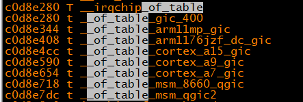
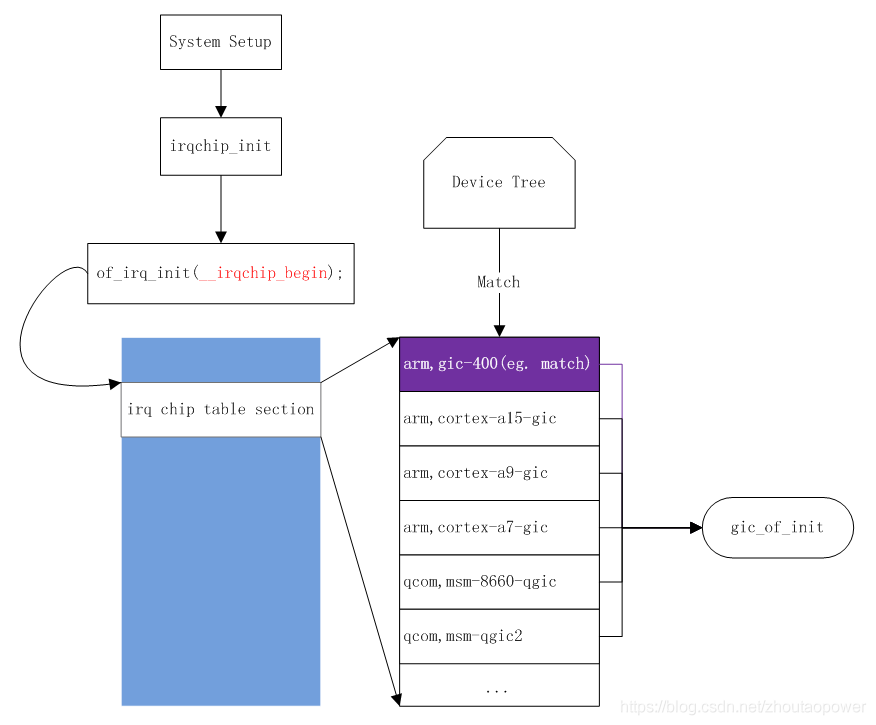
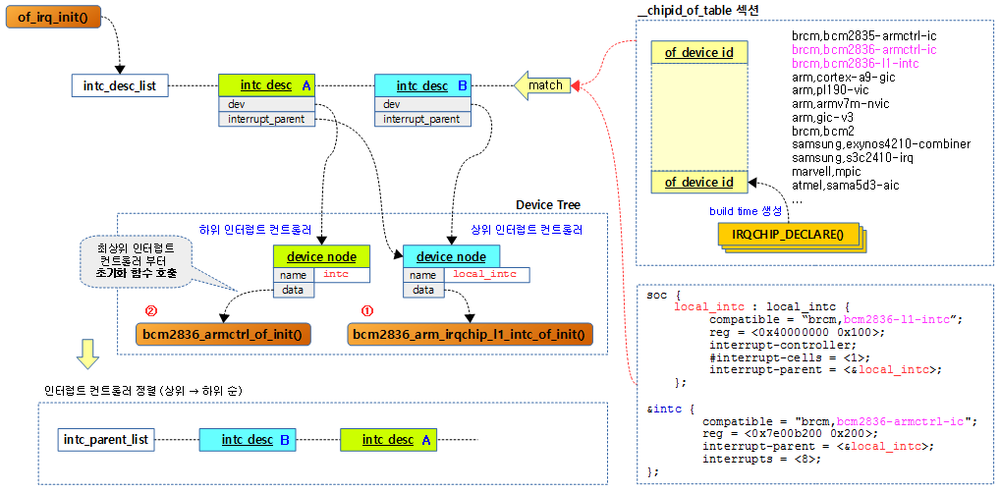

# 中断管理(二)之控制器初始化

内核版本：4.0.0

芯片平台：arm32  vexpress\-v2p\-ca9.dts

参考资料：

[https://www.cnblogs.com/LoyenWang/p/13052677.html](https://www.cnblogs.com/LoyenWang/p/13052677.html)

```
struct irq_domain {
        struct list_head link;
        const char *name;
        const struct irq_domain_ops *ops;
        void *host_data;
        unsigned int flags;

        /* Optional data */
        struct fwnode_handle *fwnode;
        enum irq_domain_bus_token bus_token;
        struct irq_domain_chip_generic *gc;
#ifdef  CONFIG_IRQ_DOMAIN_HIERARCHY
        struct irq_domain *parent;
#endif

        /* reverse map data. The linear map gets appended to the irq_domain */
        irq_hw_number_t hwirq_max;
        unsigned int revmap_direct_max_irq;
        unsigned int revmap_size;
        struct radix_tree_root revmap_tree;
        unsigned int linear_revmap[];
};

/**
* struct irq_domain_ops - Methods for irq_domain objects
* @match: Match an interrupt controller device node to a host, returns
*         1 on a match
* @map: Create or update a mapping between a virtual irq number and a hw
*       irq number. This is called only once for a given mapping.
* @unmap: Dispose of such a mapping
* @xlate: Given a device tree node and interrupt specifier, decode  
*         the hardware irq number and linux irq type value.
*
* Functions below are provided by the driver and called whenever a new mapping
* is created or an old mapping is disposed. The driver can then proceed to
* whatever internal data structures management is required. It also needs
* to setup the irq_desc when returning from map().
*/
struct irq_domain_ops {
        int (*match)(struct irq_domain *d, struct device_node *node);
        int (*map)(struct irq_domain *d, unsigned int virq, irq_hw_number_t hw);
        void (*unmap)(struct irq_domain *d, unsigned int virq);
        int (*xlate)(struct irq_domain *d, struct device_node *node,  //xlate根据设备树节点信息解析出hwirq和触发type
                     const u32 *intspec, unsigned int intsize,
                     unsigned long *out_hwirq, unsigned int *out_type);

#ifdef  CONFIG_IRQ_DOMAIN_HIERARCHY
        /* extended V2 interfaces to support hierarchy irq_domains */
        int (*alloc)(struct irq_domain *d, unsigned int virq,
                     unsigned int nr_irqs, void *arg);
        void (*free)(struct irq_domain *d, unsigned int virq,
                     unsigned int nr_irqs);
        void (*activate)(struct irq_domain *d, struct irq_data *irq_data);
        void (*deactivate)(struct irq_domain *d, struct irq_data *irq_data);
#endif
};
```

**一、中断控制器初始化列表**

```
IRQCHIP_DECLARE(cortex_a15_gic, "arm,cortex-a15-gic", gic_of_init);

#define IRQCHIP_DECLARE(name, compat, fn) OF_DECLARE_2(irqchip, name, compat, fn)

#define OF_DECLARE_2(table, name, compat, fn) \
                _OF_DECLARE(table, name, compat, fn, of_init_fn_2)

#define _OF_DECLARE(table, name, compat, fn, fn_type)                   \
        static const struct of_device_id __of_table_##name              \
                __used __section(__##table##_of_table)                  \
                 = { .compatible = compat,                              \
                     .data = (fn == (fn_type)NULL) ? fn : fn  }
```

在section  \_\_irqchip\_of\_table中定义好中断控制器的表格



控制器初始化函数： of\_device\_id.data =  gic\_of\_init

```
int __init
gic_of_init(struct device_node *node, struct device_node *parent)
{
        struct gic_chip_data *gic;
        int irq, ret;
        
        if (WARN_ON(!node))
                return -ENODEV;
        
        if (WARN_ON(gic_cnt >= CONFIG_ARM_GIC_MAX_NR))
                return -EINVAL;
        
        gic = &gic_data[gic_cnt];
        
        ret = gic_of_setup(gic, node);
        if (ret)
                return ret;
        
        /*
         * Disable split EOI/Deactivate if either HYP is not available
         * or the CPU interface is too small.
         */
        if (gic_cnt == 0 && !gic_check_eoimode(node, &gic->raw_cpu_base))
                static_key_slow_dec(&supports_deactivate);
        
        ret = __gic_init_bases(gic, -1, &node->fwnode);
        if (ret) {
                gic_teardown(gic);
                return ret;
        }
        
        if (!gic_cnt) {
                gic_init_physaddr(node);
                gic_of_setup_kvm_info(node);
        }
        
        if (parent) {
                irq = irq_of_parse_and_map(node, 0);
                gic_cascade_irq(gic_cnt, irq);
        }
        
        if (IS_ENABLED(CONFIG_ARM_GIC_V2M))
                gicv2m_init(&node->fwnode, gic_data[gic_cnt].domain);
        
        gic_cnt++;
        return 0;
}
```

函数调用栈

\#0  gic\_of\_init \(node=0xeefed9f4, parent=0x0 \<\_\_vectors\_start\>\) at drivers/irqchip/irq\-gic.c:1063

\#1  0xc0d65194 in of\_irq\_init \(matches=0xc0d8e280 \<\_\_of\_table\_gic\_400\>\) at drivers/of/irq.c:545

\#2  0xc0d5509c in irqchip\_init \(\) at drivers/irqchip/irqchip.c:28

\#3  0xc0d12c44 in init\_IRQ \(\) at arch/arm/kernel/irq.c:106

\#4  0xc0d0d6c8 in start\_kernel \(\) at init/main.c:577



**二、中断控制器扫描**

start\_kernel\(void\)\-\>irqchip\_init\(\)\-\>of\_irq\_init\(\_\_irqchip\_of\_table\)

```
void __init irqchip_init(void)
{
        of_irq_init(__irqchip_of_table);
        acpi_probe_device_table(irqchip);
}    
```

of\_irq\_init扫描dts匹配中断控制器，并调用相关的控制初始化函数，该函数的核心是，通过梳理出中断控制器的树形关系，从顶层root控制器开始，依次往下初始化控制器。

```
void __init of_irq_init(const struct of_device_id *matches)
{
        const struct of_device_id *match;
        struct device_node *np, *parent = NULL;
        struct of_intc_desc *desc, *temp_desc;
        struct list_head intc_desc_list, intc_parent_list;

        INIT_LIST_HEAD(&intc_desc_list);
        INIT_LIST_HEAD(&intc_parent_list);

        for_each_matching_node_and_match(np, matches, &match) { 
        //循环遍历__irqchip_of_table和struct device_node *of_root匹配
                if (!of_find_property(np, "interrupt-controller", NULL) ||
                                !of_device_is_available(np))
                        continue;

                if (WARN(!match->data, "of_irq_init: no init function for %s\n",
                         match->compatible))
                        continue;

                /*
                 * Here, we allocate and populate an of_intc_desc with the node
                 * pointer, interrupt-parent device_node etc.
                 */
                desc = kzalloc(sizeof(*desc), GFP_KERNEL);
                if (WARN_ON(!desc)) {
                        of_node_put(np);
                        goto err;
                }

                desc->irq_init_cb = match->data;
                desc->dev = of_node_get(np);
                desc->interrupt_parent = of_irq_find_parent(np); //不是root节点的控制器都需要指向父控制器
                if (desc->interrupt_parent == np)
                        desc->interrupt_parent = NULL;
                list_add_tail(&desc->list, &intc_desc_list); //将所有符合条件的控制器加入到intc_desc_list链表中
        }
        /*
         * The root irq controller is the one without an interrupt-parent.
         * That one goes first, followed by the controllers that reference it,
         * followed by the ones that reference the 2nd level controllers, etc.
         */
        while (!list_empty(&intc_desc_list)) { //第一层循环遍历intc_desc_list
                /*
                 * Process all controllers with the current 'parent'.
                 * First pass will be looking for NULL as the parent.
                 * The assumption is that NULL parent means a root controller.
                 */
                //第二层循环，找到当前intc_desc_list链表中最顶层的控制器，首先找到的是root，其parent为空
                //如果一个层级有多个控制器，则将所有控制器加入到intc_parent_list链表中
                list_for_each_entry_safe(desc, temp_desc, &intc_desc_list, list) {
                        int ret;

                        //如果当前desc不是最顶层的控制器，则继续判断下一个
                        if (desc->interrupt_parent != parent)
                                continue;
                       
                        list_del(&desc->list);

                        of_node_set_flag(desc->dev, OF_POPULATED);

                        pr_debug("of_irq_init: init %s (%p), parent %p\n",
                                 desc->dev->full_name,
                                 desc->dev, desc->interrupt_parent);
                        //将当前最顶层的控制器初始化，下一次循环的时候初始化次顶层的控制器，依次下去
                        //这里实质上是调用gic_of_init函数
                        ret = desc->irq_init_cb(desc->dev,
                                                desc->interrupt_parent);
                        if (ret) {
                                of_node_clear_flag(desc->dev, OF_POPULATED);
                                kfree(desc);
                                continue;
                        }

                        /*
                         * This one is now set up; add it to the parent list so
                         * its children can get processed in a subsequent pass.
                         */
                        //将处理后得desc加入intc_parent_list链表中
                        list_add_tail(&desc->list, &intc_parent_list);
                }

                /* Get the next pending parent that might have children */
                //从intc_parent_list链表中取出最前面的desc作为parent，查找，如果一层有多个则依次作为parent
                desc = list_first_entry_or_null(&intc_parent_list,
                                                typeof(*desc), list);
                if (!desc) {
                        pr_err("of_irq_init: children remain, but no parents\n");
                        break;
                }
                list_del(&desc->list);
                parent = desc->dev; //更新parent，查找下一级
                kfree(desc);
        }
        //以下完成初始化释放所有desc
        list_for_each_entry_safe(desc, temp_desc, &intc_parent_list, list) {
                list_del(&desc->list);
                kfree(desc);
        }
err:
        list_for_each_entry_safe(desc, temp_desc, &intc_desc_list, list) {
                list_del(&desc->list);
                of_node_put(desc->dev);
                kfree(desc);
        }
}
```



**三、中断控制器初始化**

```
int __init
gic_of_init(struct device_node *node, struct device_node *parent)
{
        struct gic_chip_data *gic;
        int irq, ret;

        if (WARN_ON(!node))
                return -ENODEV;

        if (WARN_ON(gic_cnt >= CONFIG_ARM_GIC_MAX_NR))
                return -EINVAL;

        gic = &gic_data[gic_cnt];

        ret = gic_of_setup(gic, node);
        if (ret)
                return ret;

        /*
         * Disable split EOI/Deactivate if either HYP is not available
         * or the CPU interface is too small.
         */
        if (gic_cnt == 0 && !gic_check_eoimode(node, &gic->raw_cpu_base))
                static_key_slow_dec(&supports_deactivate);

        ret = __gic_init_bases(gic, -1, &node->fwnode);
        if (ret) {
                gic_teardown(gic);
                return ret;
        }

        if (!gic_cnt) {
                gic_init_physaddr(node);
                gic_of_setup_kvm_info(node);
        }

        if (parent) {
                irq = irq_of_parse_and_map(node, 0);
                gic_cascade_irq(gic_cnt, irq);
        }

        if (IS_ENABLED(CONFIG_ARM_GIC_V2M))
                gicv2m_init(&node->fwnode, gic_data[gic_cnt].domain);

        gic_cnt++;
        return 0;
}
```

gic\_init\_bases\-\> gic\-\>domain = irq\_domain\_add\_linear\(node, gic\_irqs, ops, gic\);

```
(gdb) p *gic->domain
$9 = {
  link = {
    next = 0xc0d9d9cc <irq_domain_list>,
    prev = 0xc0d9d9cc <irq_domain_list>
  },
  name = 0x0 <NULL>,
  ops = 0xc0b8af4c <gic_irq_domain_hierarchy_ops>,
  host_data = 0xc0d96a48 <gic_data>,
  flags = 1,
  of_node = 0xeefed9f4,
  gc = 0x0 <NULL>,
  parent = 0x0 <NULL>,
  hwirq_max = 96,
  revmap_direct_max_irq = 0,
  revmap_size = 96,
  revmap_tree = {
    height = 0,
    gfp_mask = 208,
    rnode = 0x0 <NULL>
  },
  linear_revmap = 0xee80463c
}
```

**三、中断映射**

irq\_create\_of\_mapping进行具体的hwirq到virq的映射关系创建

```
Thread 1 hit Breakpoint 3, irq_create_of_mapping (irq_data=0xee895c68) at kernel/irq/irqdomain.c:474
474             domain = irq_data->np ? irq_find_host(irq_data->np) : irq_default_domain;
(gdb) bt
#0  irq_create_of_mapping (irq_data=0xee895c68) at kernel/irq/irqdomain.c:474
#1  0xc08cadbc in irq_of_parse_and_map (dev=0xeefeb6ac, index=0) at drivers/of/irq.c:44
#2  0xc08cb908 in of_irq_to_resource (dev=0xeefeb6ac, index=0, r=0xeea8325c) at drivers/of/irq.c:363
#3  0xc08cbbb4 in of_irq_to_resource_table (dev=0xeefeb6ac, res=0xeea8325c, nr_irqs=1) at drivers/of/irq.c:465
#4  0xc08c747c in of_device_alloc (np=0xeefeb6ac, bus_id=0x0 <__vectors_start>, parent=0x0 <__vectors_start>) at drivers/of/platform.c:136
#5  0xc08c76d8 in of_platform_device_create_pdata () at drivers/of/platform.c:233
#6  0xc08c7c84 in of_platform_bus_create () at drivers/of/platform.c:414
#7  0xc08c7f64 in of_platform_populate () at drivers/of/platform.c:501
#8  0xc0d14240 in customize_machine () at arch/arm/kernel/setup.c:815
#9  0xc0008de0 in do_one_initcall (fn=0xc0d141f4 <customize_machine>) at init/main.c:785
#10 0xc0d0e40c in do_initcall_level (level=3) at init/main.c:850
#11 0xc0d0e460 in do_initcalls () at init/main.c:858
#12 0xc0d0e4ac in do_basic_setup () at init/main.c:877
#13 0xc0d0e728 in kernel_init_freeable () at init/main.c:998
#14 0xc0b00764 in kernel_init (unused=0x0 <__vectors_start>) at init/main.c:928
#15 0xc0014e00 in ret_from_fork () at arch/arm/kernel/entry-common.S:92
Backtrace stopped: previous frame identical to this frame (corrupt stack?)
```

```
/**
* of_platform_populate() - Populate platform_devices from device tree data
* @root: parent of the first level to probe or NULL for the root of the tree
* @matches: match table, NULL to use the default
* @lookup: auxdata table for matching id and platform_data with device nodes
* @parent: parent to hook devices from, NULL for toplevel
*      
* Similar to of_platform_bus_probe(), this function walks the device tree
* and creates devices from nodes.  It differs in that it follows the modern
* convention of requiring all device nodes to have a 'compatible' property,
* and it is suitable for creating devices which are children of the root
* node (of_platform_bus_probe will only create children of the root which
* are selected by the @matches argument).
*                                      
* New board support should be using this function instead of
* of_platform_bus_probe().
*      
* Returns 0 on success, < 0 on failure.
*/     
int of_platform_populate(struct device_node *root,
                        const struct of_device_id *matches,
                        const struct of_dev_auxdata *lookup,
                        struct device *parent)
{
        struct device_node *child;
        int rc = 0;

        root = root ? of_node_get(root) : of_find_node_by_path("/");
        if (!root)
                return -EINVAL;

        for_each_child_of_node(root, child) {  //遍历所有的设备树，创建设备，创建的过程中有些设备需要映射中断
                rc = of_platform_bus_create(child, matches, lookup, parent, true);
                if (rc)
                        break;
        }
        of_node_set_flag(root, OF_POPULATED_BUS);

        of_node_put(root);
        return rc;
}

/**
* of_irq_to_resource - Decode a node's IRQ and return it as a resource
* @dev: pointer to device tree node
* @index: zero-based index of the irq
* @r: pointer to resource structure to return result into.
*/
int of_irq_to_resource(struct device_node *dev, int index, struct resource *r)
{
        int irq = irq_of_parse_and_map(dev, index);  //解析设备树节点并创建irq的映射

        /* Only dereference the resource if both the
         * resource and the irq are valid. */
        if (r && irq) {
                const char *name = NULL;

                memset(r, 0, sizeof(*r));
                /*
                 * Get optional "interrupt-names" property to add a name
                 * to the resource.
                 */
                of_property_read_string_index(dev, "interrupt-names", index,
                                              &name);

                r->start = r->end = irq;
                r->flags = IORESOURCE_IRQ | irqd_get_trigger_type(irq_get_irq_data(irq));
                r->name = name ? name : of_node_full_name(dev);
        }

        return irq;
}
```

**四、dts解析中断过程**

解析dts 设备节点，获取到硬件中断号和中断类型，并创建硬件中断到软件中断的映射

```
unsigned int irq_of_parse_and_map(struct device_node *dev, int index)
{                       
        struct of_phandle_args oirq;
        
        if (of_irq_parse_one(dev, index, &oirq))
                return 0;
            
        return irq_create_of_mapping(&oirq);
}
```

```
int of_irq_parse_one(struct device_node *device, int index, struct of_phandle_args *out_irq)
{
        struct device_node *p;
        const __be32 *intspec, *tmp, *addr;
        u32 intsize, intlen;
        int i, res;

        pr_debug("of_irq_parse_one: dev=%s, index=%d\n", of_node_full_name(device), index);

        /* OldWorld mac stuff is "special", handle out of line */
        if (of_irq_workarounds & OF_IMAP_OLDWORLD_MAC)
                return of_irq_parse_oldworld(device, index, out_irq);

        /* Get the reg property (if any) */
        addr = of_get_property(device, "reg", NULL);

        /* Try the new-style interrupts-extended first */
        res = of_parse_phandle_with_args(device, "interrupts-extended",
                                        "#interrupt-cells", index, out_irq);
        if (!res)
                return of_irq_parse_raw(addr, out_irq);

        /* Get the interrupts property */
        intspec = of_get_property(device, "interrupts", &intlen);  //从当前节点解析出"interrupts"的值
        if (intspec == NULL)
                return -EINVAL;

        intlen /= sizeof(*intspec);

        pr_debug(" intspec=%d intlen=%d\n", be32_to_cpup(intspec), intlen);

        /* Look for the interrupt parent. */
        p = of_irq_find_parent(device);  //找到当前节点的父节点，在这里是"interrupt-controller"节点
        if (p == NULL)
                return -EINVAL;

        /* Get size of interrupt specifier */
        tmp = of_get_property(p, "#interrupt-cells", NULL);  //获取父节点"#interrupt-cells"属性值，这里是3
        if (tmp == NULL) {
                res = -EINVAL;
                goto out;
        }
        intsize = be32_to_cpu(*tmp);  //大端转换成CPU的小端

        pr_debug(" intsize=%d intlen=%d\n", intsize, intlen);

        /* Check index */
        if ((index + 1) * intsize > intlen)
                res = -EINVAL;
                goto out;
        }

        /* Copy intspec into irq structure */
        intspec += index * intsize;
        out_irq->np = p;
        out_irq->args_count = intsize;
        for (i = 0; i < intsize; i++)
                out_irq->args[i] = be32_to_cpup(intspec++);  //将终端参数放入out_irq中传递出去

        /* Check if there are any interrupt-map translations to process */
        res = of_irq_parse_raw(addr, out_irq);
out:
        of_node_put(p);
        return res;
}
```

```
        clcd@10020000 {
                compatible = "arm,pl111", "arm,primecell";
                reg = <0x10020000 0x1000>;
                interrupt-names = "combined";
                interrupts = <0 44 4>;
                clocks = <&oscclk1>, <&oscclk2>;
                clock-names = "clcdclk", "apb_pclk";
                max-memory-bandwidth = <130000000>; /* 16bpp @ 63.5MHz */
        };

        gic: interrupt-controller@1e001000 {
                compatible = "arm,cortex-a9-gic";
                #interrupt-cells = <3>;
                #address-cells = <0>;
                interrupt-controller;
                reg = <0x1e001000 0x1000>,
                      <0x1e000100 0x100>;
        };
```

解析device node后通过struct of\_phandle\_args \*out\_irq输出

```
#define MAX_PHANDLE_ARGS 16
struct of_phandle_args {
        struct device_node *np;
        int args_count;
        uint32_t args[MAX_PHANDLE_ARGS];
};

(gdb) p *out_irq
$53 = {
  np = 0xeefed9f4, 
  args_count = 3,
  args = {0, 44, 4, 0, 0, 0, 0, 0, 0, 0, 0, 0, 0, 0, 0, 0}
}
```

```
unsigned int irq_create_of_mapping(struct of_phandle_args *irq_data)
{
        struct irq_domain *domain;
        irq_hw_number_t hwirq;
        unsigned int type = IRQ_TYPE_NONE;
        int virq;
        
        domain = irq_data->np ? irq_find_host(irq_data->np) : irq_default_domain;  //根据父节点拿到domain
        if (!domain) {
                pr_warn("no irq domain found for %s !\n",
                        of_node_full_name(irq_data->np));
                return 0;
        }
        
        /* If domain has no translation, then we assume interrupt line */
        //需要将irq_data中args解析为hwirq，此处解析值为<0, 44, 4>
        if (domain->ops->xlate == NULL)
                hwirq = irq_data->args[0];  //如果domain->ops->xlate未定义，则使用第一个参数args作为hwirq
        else {  
                //调试平台定义了转换函数，输出参数是硬件中断号hwirq和中断类型type ，实际输出为hwirp=76（应该是加了32） type=4
                //实际调用函数是gic_irq_domain_xlate
                if (domain->ops->xlate(domain, irq_data->np, irq_data->args,
                                        irq_data->args_count, &hwirq, &type))
                        return 0;
        }
        
        if (irq_domain_is_hierarchy(domain)) {
                /*
                 * If we've already configured this interrupt,
                 * don't do it again, or hell will break loose.
                 */
                virq = irq_find_mapping(domain, hwirq);
                if (virq)
                        return virq;
                
                virq = irq_domain_alloc_irqs(domain, 1, NUMA_NO_NODE, irq_data);  //分配软中断，virq=22
                if (virq <= 0)
                        return 0;
        } else {
                /* Create mapping */
                virq = irq_create_mapping(domain, hwirq);
                if (!virq)
                        return virq;
        }
        
        /* Set type if specified and different than the current one */
        if (type != IRQ_TYPE_NONE &&
            type != irq_get_trigger_type(virq))
                irq_set_irq_type(virq, type);   //通过chip->irq_set_type(&desc->irq_data, flags)设置中断触发类型到硬件
        return virq;
}
```

hwirq类型枚举数据结构

```
/*
* IRQ line status.
*
* Bits 0-7 are the same as the IRQF_* bits in linux/interrupt.h
*
* IRQ_TYPE_NONE                - default, unspecified type
* IRQ_TYPE_EDGE_RISING         - rising edge triggered
* IRQ_TYPE_EDGE_FALLING        - falling edge triggered
* IRQ_TYPE_EDGE_BOTH           - rising and falling edge triggered
* IRQ_TYPE_LEVEL_HIGH          - high level triggered
* IRQ_TYPE_LEVEL_LOW           - low level triggered
* IRQ_TYPE_LEVEL_MASK          - Mask to filter out the level bits
* IRQ_TYPE_SENSE_MASK          - Mask for all the above bits
* IRQ_TYPE_DEFAULT             - For use by some PICs to ask irq_set_type
*                                to setup the HW to a sane default (used
*                                by irqdomain map() callbacks to synchronize
*                                the HW state and SW flags for a newly
*                                allocated descriptor).
*
* IRQ_TYPE_PROBE               - Special flag for probing in progress
*
* Bits which can be modified via irq_set/clear/modify_status_flags()
* IRQ_LEVEL                    - Interrupt is level type. Will be also
*                                updated in the code when the above trigger
*                                bits are modified via irq_set_irq_type()
* IRQ_PER_CPU                  - Mark an interrupt PER_CPU. Will protect
*                                it from affinity setting
* IRQ_NOPROBE                  - Interrupt cannot be probed by autoprobing
* IRQ_NOREQUEST                - Interrupt cannot be requested via
*                                request_irq()
* IRQ_NOTHREAD                 - Interrupt cannot be threaded
* IRQ_NOAUTOEN                 - Interrupt is not automatically enabled in
*                                request/setup_irq()
* IRQ_NO_BALANCING             - Interrupt cannot be balanced (affinity set)
* IRQ_MOVE_PCNTXT              - Interrupt can be migrated from process context
* IRQ_NESTED_TRHEAD            - Interrupt nests into another thread
* IRQ_PER_CPU_DEVID            - Dev_id is a per-cpu variable
* IRQ_IS_POLLED                - Always polled by another interrupt. Exclude
*
*                                mechanism and from core side polling.
*/
enum {
        IRQ_TYPE_NONE           = 0x00000000,
        IRQ_TYPE_EDGE_RISING    = 0x00000001,
        IRQ_TYPE_EDGE_FALLING   = 0x00000002,
        IRQ_TYPE_EDGE_BOTH      = (IRQ_TYPE_EDGE_FALLING | IRQ_TYPE_EDGE_RISING),
        IRQ_TYPE_LEVEL_HIGH     = 0x00000004,
        IRQ_TYPE_LEVEL_LOW      = 0x00000008,
        IRQ_TYPE_LEVEL_MASK     = (IRQ_TYPE_LEVEL_LOW | IRQ_TYPE_LEVEL_HIGH),
        IRQ_TYPE_SENSE_MASK     = 0x0000000f,
        IRQ_TYPE_DEFAULT        = IRQ_TYPE_SENSE_MASK,

        IRQ_TYPE_PROBE          = 0x00000010,

        IRQ_LEVEL               = (1 <<  8),
        IRQ_PER_CPU             = (1 <<  9),
        IRQ_NOPROBE             = (1 << 10),
        IRQ_NOREQUEST           = (1 << 11),
        IRQ_NOAUTOEN            = (1 << 12),
        IRQ_NO_BALANCING        = (1 << 13),
        IRQ_MOVE_PCNTXT         = (1 << 14),
        IRQ_NESTED_THREAD       = (1 << 15),
        IRQ_NOTHREAD            = (1 << 16),
        IRQ_PER_CPU_DEVID       = (1 << 17),
        IRQ_IS_POLLED           = (1 << 18),
};                                it from the spurious interrupt detection
```

xlate过程中，实质上dts中的中断号加了16个SGIs 和 16个SPIs ，hwirq = 44 \+ 32 =》 76

```

static int gic_irq_domain_xlate(struct irq_domain *d,
                                struct device_node *controller,
                                const u32 *intspec, unsigned int intsize,
                                unsigned long *out_hwirq, unsigned int *out_type)
{
        unsigned long ret = 0;

        if (d->of_node != controller)
                return -EINVAL;
        if (intsize < 3)
                return -EINVAL;

        /* Get the interrupt number and add 16 to skip over SGIs */
        *out_hwirq = intspec[1] + 16;

        /* For SPIs, we need to add 16 more to get the GIC irq ID number */
        if (!intspec[0]) {
                ret = gic_routable_irq_domain_ops->xlate(d, controller,  //包含第二次xlate实现
                                                         intspec,
                                                         intsize,
                                                         out_hwirq,
                                                         out_type);

                if (IS_ERR_VALUE(ret))
                        return ret;
        }

        *out_type = intspec[2] & IRQ_TYPE_SENSE_MASK;

        return ret;
}

static int gic_routable_irq_domain_xlate(struct irq_domain *d,
                                struct device_node *controller,
                                const u32 *intspec, unsigned int intsize,
                                unsigned long *out_hwirq,
                                unsigned int *out_type)
{
        *out_hwirq += 16;
        return 0;
}

//里面一层
static const struct irq_domain_ops gic_default_routable_irq_domain_ops = {
        .map = gic_routable_irq_domain_map,
        .unmap = gic_routable_irq_domain_unmap,
        .xlate = gic_routable_irq_domain_xlate,
};

//外面一层
static const struct irq_domain_ops gic_irq_domain_hierarchy_ops = {
        .xlate = gic_irq_domain_xlate,
        .alloc = gic_irq_domain_alloc,
        .free = irq_domain_free_irqs_top,
};

外面这一层是在gic_init_bases函数中将gic_irq_domain_hierarchy_ops注册进去
    const struct irq_domain_ops *ops = &gic_irq_domain_hierarchy_ops;
    gic->domain = irq_domain_add_linear(node, gic_irqs, ops, gic);
```

**五、设置中断处理函数**

```
(gdb) bt
#0  __irq_set_handler (irq=23, handle=0xc00d10ec <handle_fasteoi_irq>, is_chained=0, name=0x0 <__vectors_start>) at kernel/irq/chip.c:726
#1  0xc00d4f8c in irq_domain_set_info (domain=0xee804600, virq=23, hwirq=77, chip=0xc0dad380 <gic_chip>, chip_data=0xc0d96a48 <gic_data>, handler=0xc00d10ec <handle_fasteoi_irq>, handler_data=0x0 <__vectors_start>, handler_name=0x0 <__vectors_start>) at kernel/irq/irqdomain.c:946
#2  0xc05e2c04 in gic_irq_domain_map (d=0xee804600, irq=23, hw=77) at drivers/irqchip/irq-gic.c:802
#3  0xc05e2e68 in gic_irq_domain_alloc (domain=0xee804600, virq=23, nr_irqs=1, arg=0xee895d08) at drivers/irqchip/irq-gic.c:881
#4  0xc00d5278 in irq_domain_alloc_irqs_recursive (domain=0xee804600, irq_base=23, nr_irqs=1, arg=0xee895d08) at kernel/irq/irqdomain.c:1029
#5  0xc00d5434 in __irq_domain_alloc_irqs (domain=0xee804600, irq_base=-1, nr_irqs=1, node=-1, arg=0xee895d08, realloc=false) at kernel/irq/irqdomain.c:1092
#6  0xc00d433c in irq_domain_alloc_irqs (arg=0xee895d08, node=-1, nr_irqs=1, domain=0xee804600) at include/linux/irqdomain.h:276
#7  irq_create_of_mapping (irq_data=0xee895d08) at kernel/irq/irqdomain.c:499
#8  0xc08cadbc in irq_of_parse_and_map (dev=0xeefed130, index=0) at drivers/of/irq.c:44
#9  0xc08c79c4 in of_amba_device_create (node=0xeefed130, bus_id=0x0 <__vectors_start>, platform_data=0x0 <__vectors_start>, parent=0x0 <__vectors_start>) at drivers/of/platform.c:311
#10 0xc08c7c68 in of_platform_bus_create (bus=0xeefed130, matches=0xc0bc99ac <of_default_bus_match_table>, lookup=0x0 <__vectors_start>, parent=0x0 <__vectors_start>, strict=true) at drivers/of/platform.c:410
#11 0xc08c7f64 in of_platform_populate (root=0xeefeb300, matches=0xc0bc99ac <of_default_bus_match_table>, lookup=0x0 <__vectors_start>, parent=0x0 <__vectors_start>) at drivers/of/platform.c:501
#12 0xc0d14240 in customize_machine () at arch/arm/kernel/setup.c:815
#13 0xc0008de0 in do_one_initcall (fn=0xc0d141f4 <customize_machine>) at init/main.c:785
#14 0xc0d0e40c in do_initcall_level (level=3) at init/main.c:850
#15 0xc0d0e460 in do_initcalls () at init/main.c:858
#16 0xc0d0e4ac in do_basic_setup () at init/main.c:877
#17 0xc0d0e728 in kernel_init_freeable () at init/main.c:998
#18 0xc0b00764 in kernel_init (unused=0x0 <__vectors_start>) at init/main.c:928
#19 0xc0014e00 in ret_from_fork () at arch/arm/kernel/entry-common.S:92
Backtrace stopped: previous frame identical to this frame (corrupt stack?)
```

```
static int gic_irq_domain_map(struct irq_domain *d, unsigned int irq,
                                irq_hw_number_t hw)
{
        if (hw < 32) {
                irq_set_percpu_devid(irq);
                irq_domain_set_info(d, irq, hw, &gic_chip, d->host_data,
                                    handle_percpu_devid_irq, NULL, NULL);  //小于32的中断处理函数
                set_irq_flags(irq, IRQF_VALID | IRQF_NOAUTOEN);
        } else {
                irq_domain_set_info(d, irq, hw, &gic_chip, d->host_data,   //大于32的中断处理函数
                                    handle_fasteoi_irq, NULL, NULL);
                set_irq_flags(irq, IRQF_VALID | IRQF_PROBE);

                gic_routable_irq_domain_ops->map(d, irq, hw);
        }
        return 0;
}

/**
* irq_domain_set_info - Set the complete data for a @virq in @domain
* @domain:             Interrupt domain to match
* @virq:               IRQ number
* @hwirq:              The hardware interrupt number
* @chip:               The associated interrupt chip
* @chip_data:          The associated interrupt chip data
* @handler:            The interrupt flow handler
* @handler_data:       The interrupt flow handler data
* @handler_name:       The interrupt handler name
*/     
void irq_domain_set_info(struct irq_domain *domain, unsigned int virq,
                         irq_hw_number_t hwirq, struct irq_chip *chip,
                         void *chip_data, irq_flow_handler_t handler,
                         void *handler_data, const char *handler_name)
{
        irq_domain_set_hwirq_and_chip(domain, virq, hwirq, chip, chip_data);  //设置chip
        __irq_set_handler(virq, handler, 0, handler_name);
        irq_set_handler_data(virq, handler_data);
}
```

**六、中断处理函数**

```
#0  handle_fasteoi_irq (irq=36, desc=0xeea86780) at kernel/irq/chip.c:510
#1  0xc00c9ab8 in generic_handle_irq_desc (desc=0xeea86780, irq=36) at include/linux/irqdesc.h:129
#2  generic_handle_irq (irq=36) at kernel/irq/irqdesc.c:351
#3  0xc00c9c50 in __handle_domain_irq (domain=0xee804600, hwirq=44, lookup=true, regs=0xee895df8) at kernel/irq/irqdesc.c:388
#4  0xc00089e4 in handle_domain_irq (regs=0xee895df8, hwirq=44, domain=0xee804600) at include/linux/irqdesc.h:147
#5  gic_handle_irq (regs=0xee895df8) at drivers/irqchip/irq-gic.c:280
#6  0xc0b0d680 in __irq_svc () at arch/arm/kernel/entry-armv.S:206
```

```
static void __exception_irq_entry gic_handle_irq(struct pt_regs *regs)
{
        u32 irqstat, irqnr;
        struct gic_chip_data *gic = &gic_data[0];
        void __iomem *cpu_base = gic_data_cpu_base(gic);

        do {
                irqstat = readl_relaxed(cpu_base + GIC_CPU_INTACK);  //读取寄存器
                irqnr = irqstat & GICC_IAR_INT_ID_MASK; //获取中断号

                if (likely(irqnr > 15 && irqnr < 1021)) {
                        handle_domain_irq(gic->domain, irqnr, regs); //普通中断走这里
                        continue;
                }
                if (irqnr < 16) {
                        writel_relaxed(irqstat, cpu_base + GIC_CPU_EOI);
#ifdef CONFIG_SMP
                        handle_IPI(irqnr, regs);
#endif
                        continue;
                }
                break;
        } while (1);
}

static inline int handle_domain_irq(struct irq_domain *domain,
                                    unsigned int hwirq, struct pt_regs *regs)
{
        return __handle_domain_irq(domain, hwirq, true, regs);
}

int __handle_domain_irq(struct irq_domain *domain, unsigned int hwirq,
                        bool lookup, struct pt_regs *regs)
{
        struct pt_regs *old_regs = set_irq_regs(regs);
        unsigned int irq = hwirq;
        int ret = 0;

        irq_enter();

#ifdef CONFIG_IRQ_DOMAIN
        if (lookup)
                irq = irq_find_mapping(domain, hwirq); //根据domain和hwirq找到对应的virq
#endif

        /*
         * Some hardware gives randomly wrong interrupts.  Rather
         * than crashing, do something sensible.
         */
        if (unlikely(!irq || irq >= nr_irqs)) {
                ack_bad_irq(irq);
                ret = -EINVAL;
        } else {
                generic_handle_irq(irq);  //进一步处理中断
        }

        irq_exit();
        set_irq_regs(old_regs);
        return ret;
}

int generic_handle_irq(unsigned int irq)
{
        struct irq_desc *desc = irq_to_desc(irq);  //根据virq获取到中断描述符
 
        if (!desc)
                return -EINVAL;
        generic_handle_irq_desc(irq, desc);
        return 0;
}

static inline void generic_handle_irq_desc(unsigned int irq, struct irq_desc *desc)
{
        desc->handle_irq(irq, desc); //调用描述符中的回调函数进行处理，由上一节可知gic_irq_domain_map函数中设置回调函数
                                 //小于32：handle_percpu_devid_irq 大于32：handle_fasteoi_irq
}

void
handle_fasteoi_irq(unsigned int irq, struct irq_desc *desc)
{       
        struct irq_chip *chip = desc->irq_data.chip;

        raw_spin_lock(&desc->lock);

        if (!irq_may_run(desc))
                goto out;

        desc->istate &= ~(IRQS_REPLAY | IRQS_WAITING);
        kstat_incr_irqs_this_cpu(irq, desc); //增加中断统计

        /*
         * If its disabled or no action available
         * then mask it and get out of here:
         */
        if (unlikely(!desc->action || irqd_irq_disabled(&desc->irq_data))) {
                desc->istate |= IRQS_PENDING;
                mask_irq(desc);
                goto out;
        }

        if (desc->istate & IRQS_ONESHOT)
                mask_irq(desc);

        preflow_handler(desc);
        handle_irq_event(desc);

        cond_unmask_eoi_irq(desc, chip);

        raw_spin_unlock(&desc->lock);
        return;
out:
        if (!(chip->flags & IRQCHIP_EOI_IF_HANDLED))
                chip->irq_eoi(&desc->irq_data);
        raw_spin_unlock(&desc->lock);
}

static inline void kstat_incr_irqs_this_cpu(unsigned int irq, struct irq_desc *desc)
{
        __this_cpu_inc(*desc->kstat_irqs);  //增加本cpu的本中断的计数
        __this_cpu_inc(kstat.irqs_sum);  //增加本cpu总的计数
}

irqreturn_t handle_irq_event(struct irq_desc *desc)
{
        struct irqaction *action = desc->action;
        irqreturn_t ret;

        desc->istate &= ~IRQS_PENDING;
        irqd_set(&desc->irq_data, IRQD_IRQ_INPROGRESS);
        raw_spin_unlock(&desc->lock);

        ret = handle_irq_event_percpu(desc, action);

        raw_spin_lock(&desc->lock);
        irqd_clear(&desc->irq_data, IRQD_IRQ_INPROGRESS);
        return ret;
}

irqreturn_t
handle_irq_event_percpu(struct irq_desc *desc, struct irqaction *action)
{
        irqreturn_t retval = IRQ_NONE;
        unsigned int flags = 0, irq = desc->irq_data.irq;

        do {
                irqreturn_t res;

                trace_irq_handler_entry(irq, action);
                res = action->handler(irq, action->dev_id); //调用具体的action进行处理
                trace_irq_handler_exit(irq, action, res);

                if (WARN_ONCE(!irqs_disabled(),"irq %u handler %pF enabled interrupts\n",
                              irq, action->handler))
                        local_irq_disable();

                switch (res) {
                case IRQ_WAKE_THREAD:
                        /*
                         * Catch drivers which return WAKE_THREAD but
                         * did not set up a thread function
                         */
                        if (unlikely(!action->thread_fn)) {
                                warn_no_thread(irq, action);
                                break;
                        }

                        __irq_wake_thread(desc, action);

                        /* Fall through to add to randomness */
                case IRQ_HANDLED:
                        flags |= action->flags;
                        break;

                default:
                        break;
                }

                retval |= res;
                action = action->next;
        } while (action);

        add_interrupt_randomness(irq, flags);

        if (!noirqdebug)
                note_interrupt(irq, desc, retval);
        return retval;
}
```

```
(gdb) p *desc
$68 = {
  irq_data = {
    mask = 0,
    irq = 36,
    hwirq = 44,
    node = 4294967295,
    state_use_accessors = 8196,
    chip = 0xc0dad380 <gic_chip>,
    domain = 0xee804600,
    parent_data = NULL,
    handler_data = NULL,
    chip_data = 0xc0d96a48 <gic_data>,
    msi_desc = NULL,
    affinity = {{
        bits = {15}
      }}
  },
  kstat_irqs = 0xc0d96e58 <gic_data+1040>,
  handle_irq = 0xc00d10ec <handle_fasteoi_irq>,
  action = 0xeeb11540,
  status_use_accessors = 260,
  core_internal_state__do_not_mess_with_it = 0,
  depth = 0,
  wake_depth = 0,
  irq_count = 0,
  last_unhandled = 0,
  irqs_unhandled = 0,
  threads_handled = {
    counter = 0
  },
  threads_handled_last = 0,
  lock = {
    raw_lock = {
      {
        slock = 524295,
        tickets = {
          owner = 7,
          next = 8
        }
      }
    }
  },
  percpu_enabled = 0x0 <__vectors_start>,
  affinity_hint = 0x0 <__vectors_start>,
  affinity_notify = 0x0 <__vectors_start>,
  threads_oneshot = 0,
  threads_active = {
    counter = 0
  },
  wait_for_threads = {
    lock = {
      {
        rlock = {
          raw_lock = {
            {
              slock = 0,
              tickets = {
                owner = 0,
                next = 0
              }
            }
          }
        }
      }
    },
    task_list = {
      next = 0xeea867fc,
      prev = 0xeea867fc
    }
  },
  nr_actions = 1,
  no_suspend_depth = 0,
  cond_suspend_depth = 0,
  force_resume_depth = 0,
  dir = 0xeeb13100,
  parent_irq = 0,
  owner = 0x0 <__vectors_start>,
  name = 0x0 <__vectors_start>
```
