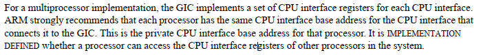
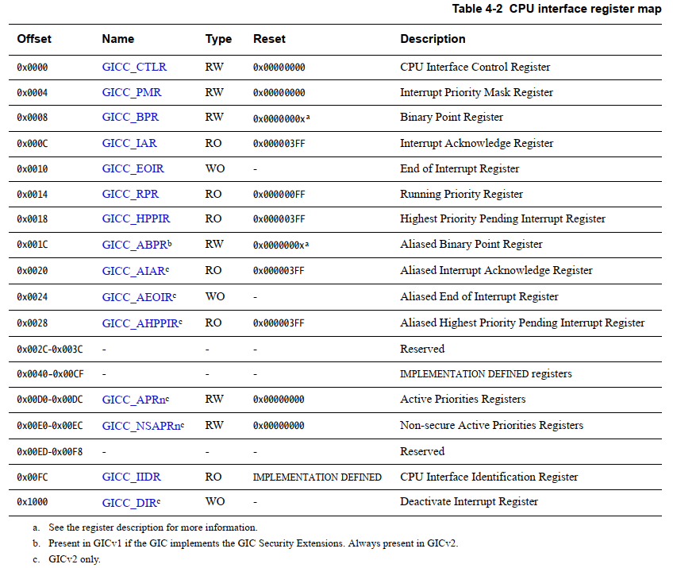
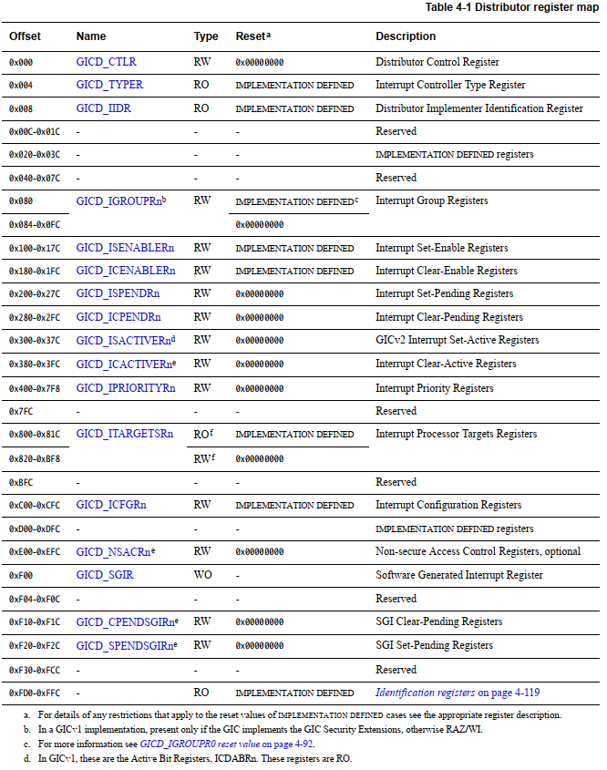

# 中断管理之GIC-v2寄存器对照表

**一、CPU interface register map**



Address offsets are relative to the Distributor base address defined by the system memory map.

对于SMP处理器，每一个CPU interface都有一组寄存器，ARM强烈建议每个处理器都有相同的CPU interface 基地址。一个CPU能否访问其他CPU的CPU interface取决于具体实现。那如果每个CPU的CPU interface都有相同的基地址，那么通常就无法互相访问。同时如果每个CPU地址相等，那么软件处理上好处理，每个CPU访问相同的地址即可。



```
#define GIC_CPU_CTRL                    0x00
#define GIC_CPU_PRIMASK                 0x04
#define GIC_CPU_BINPOINT                0x08
#define GIC_CPU_INTACK                  0x0c
#define GIC_CPU_EOI                     0x10
#define GIC_CPU_RUNNINGPRI              0x14
#define GIC_CPU_HIGHPRI                 0x18
#define GIC_CPU_ALIAS_BINPOINT          0x1c
#define GIC_CPU_ACTIVEPRIO              0xd0
#define GIC_CPU_IDENT                   0xfc
#define GIC_CPU_DEACTIVATE              0x1000
```

**二、 Distributor register map**

Address offsets are relative to the Distributor base address defined by the system memory map

Distributor寄存器则是GIC只有一组，所以每个CPU访问的都是同一份。



```
#define GIC_DIST_CTRL                   0x000
#define GIC_DIST_CTR                    0x004
#define GIC_DIST_IIDR                   0x008
#define GIC_DIST_IGROUP                 0x080
#define GIC_DIST_ENABLE_SET             0x100
#define GIC_DIST_ENABLE_CLEAR           0x180
#define GIC_DIST_PENDING_SET            0x200
#define GIC_DIST_PENDING_CLEAR          0x280
#define GIC_DIST_ACTIVE_SET             0x300
#define GIC_DIST_ACTIVE_CLEAR           0x380
#define GIC_DIST_PRI                    0x400
#define GIC_DIST_TARGET                 0x800
#define GIC_DIST_CONFIG                 0xc00
#define GIC_DIST_SOFTINT                0xf00
#define GIC_DIST_SGI_PENDING_CLEAR      0xf10
#define GIC_DIST_SGI_PENDING_SET        0xf20
```
