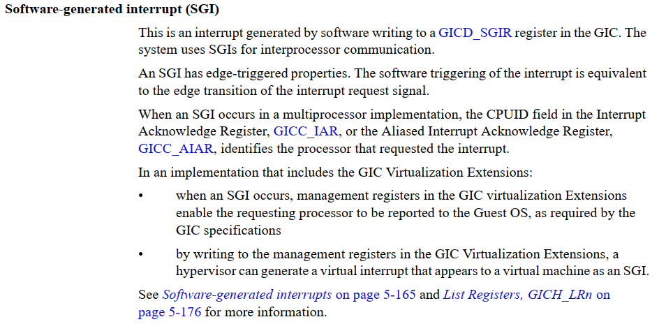
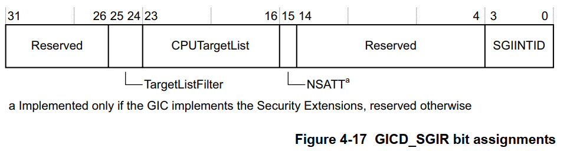
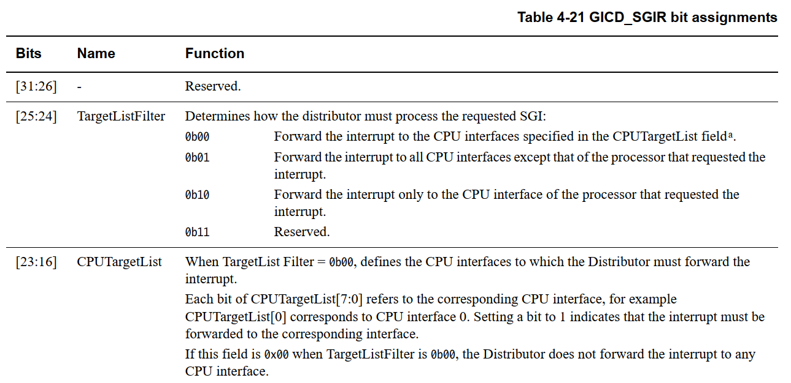
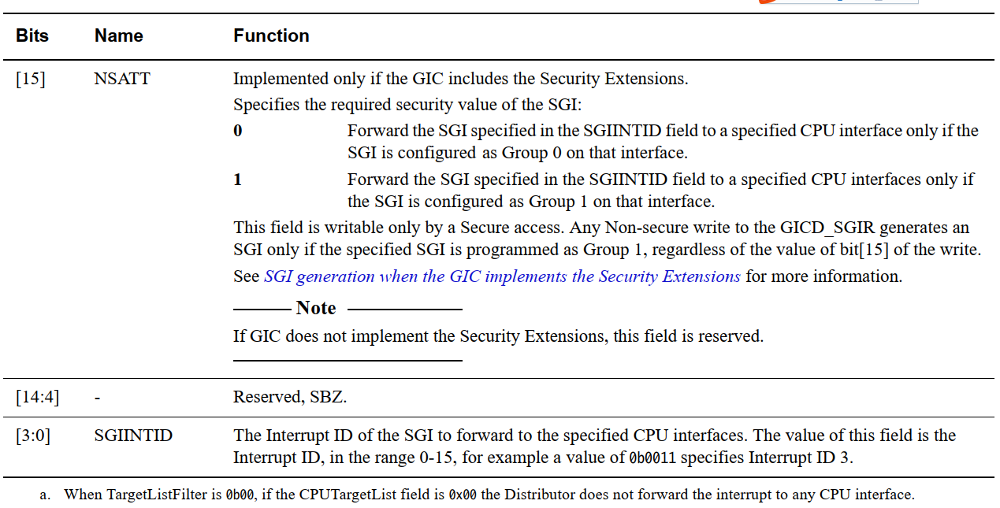
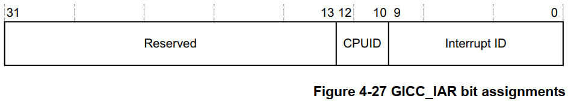
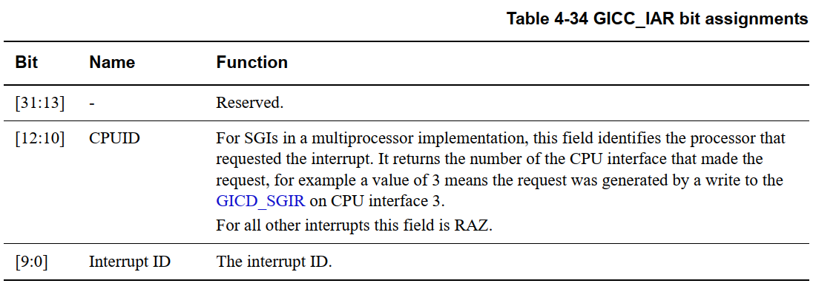

# 中断管理之SGI/IPI软件中断

`IPI`

基于平台：arm32

内核版本：linux 4.9

SGI（Software Generated Interrupts）通过写寄存器即可产生的中断，可以指定一个或多个目标核。

IPI是NMI中断吗？



**一、SGI硬件**

**（1）、SGI软件中断生成寄存器**







SPI中断占据硬件中断号的0\-15，从linux内核源码看芯片并未明确这16个中断分别用于什么用途。

另外还有两个相关的寄存器，但是Linux内核并没怎么使用

1、 SGI Clear\-Pending Registers, GICD\_CPENDSGIRn

2、 SGI Set\-Pending Registers, GICD\_SPENDSGIRn

**（2）、中断应答寄存器**

The processor reads this register to obtain the interrupt ID of the signaled interrupt. This read acts as an acknowledge for the interrupt。

这个读取会产生一个对此中断的ACK。





正常情况下，中断发生时能从GICC\_IAR寄存器读取到中断ID，但是在以下3中特殊情况下读取到的是1023这个伪中断ID。

```
• forwarding of interrupts by the Distributor to the CPU interface is disabled
    Distributor转发中断到CPU interface的功能关闭，相当于关CPU本地中断

• signaling of interrupts by the CPU interface to the connected processor is disabled
    CPU interface所对应的CPU被关闭

• no pending interrupt on the CPU interface has sufficient priority for the interface to signal it to the processor.
    转发到CPU interface的中断的优先级较低不够触发CPU
```

**二、SGI中断触发**

Linux内核中只使用了0\-8个 SGI中断

```
enum ipi_msg_type {
        IPI_WAKEUP,  //唤醒CPU
        IPI_TIMER,   //时钟同步
        IPI_RESCHEDULE,  //重新调度
        IPI_CALL_FUNC,  //调用指定函数
        IPI_CPU_STOP,  //CPU停止
        IPI_IRQ_WORK,  //
        IPI_COMPLETION,
        IPI_CPU_BACKTRACE,  //打印cpu堆栈
        /*
         * SGI8-15 can be reserved by secure firmware, and thus may
         * not be usable by the kernel. Please keep the above limited
         * to at most 8 entries.
         */
};
```

Linux中使用几个封装后的函数，来使用IPI中断功能

```
smp_cross_call(mask, IPI_CALL_FUNC);
smp_cross_call(mask, IPI_WAKEUP);
smp_cross_call(cpumask_of(cpu), IPI_CALL_FUNC);
smp_cross_call(cpumask_of(smp_processor_id()), IPI_IRQ_WORK);
smp_cross_call(mask, IPI_TIMER);
smp_cross_call(&mask, IPI_CPU_STOP);
smp_cross_call(cpumask_of(cpu), IPI_RESCHEDULE);
smp_cross_call(mask, IPI_CPU_BACKTRACE);
```

```
//向目标CPU列表发送中断号为ipinr的核间中断
static void smp_cross_call(const struct cpumask *target, unsigned int ipinr)
{
        trace_ipi_raise_rcuidle(target, ipi_types[ipinr]);
        __smp_cross_call(target, ipinr);
}

void (*__smp_cross_call)(const struct cpumask *, unsigned int);
void __init set_smp_cross_call(void (*fn)(const struct cpumask *, unsigned int))
{
        __smp_cross_call = fn;  //需要初始化才能调用
}

//在中断控制器初始化时设置核间中断触发函数
static int __init __gic_init_bases(struct gic_chip_data *gic, int irq_start,
                                   struct fwnode_handle *handle)
{
#ifdef CONFIG_SMP
                set_smp_cross_call(gic_raise_softirq);
#endif
}

static void gic_raise_softirq(const struct cpumask *mask, unsigned int irq)
{
        int cpu;
        unsigned long flags, map = 0;

        if (unlikely(nr_cpu_ids == 1)) {  //非smp结构特殊处理
                /* Only one CPU? let's do a self-IPI... */
                writel_relaxed(2 << 24 | irq,
                               gic_data_dist_base(&gic_data[0]) + GIC_DIST_SOFTINT);
                return;
        }
        gic_lock_irqsave(flags);

        /* Convert our logical CPU mask into a physical one. */
        for_each_cpu(cpu, mask)
                map |= gic_cpu_map[cpu];  //初始化cpu列表至map中
        /*
         * Ensure that stores to Normal memory are visible to the
         * other CPUs before they observe us issuing the IPI.
         */
        dmb(ishst);

        /* this always happens on GIC0 */
        //设置gic控制器的软件中断触发寄存器GIC_DIST_SOFTINT
        //从代码中可以看出，只设置了cpu列表和中断号irq
        writel_relaxed(map << 16 | irq, gic_data_dist_base(&gic_data[0]) + GIC_DIST_SOFTINT);

        gic_unlock_irqrestore(flags);
}
```

**三、SGI中断处理**

1、进入ipi中断处理

```
static void __exception_irq_entry gic_handle_irq(struct pt_regs *regs)
{
        u32 irqstat, irqnr;
        struct gic_chip_data *gic = &gic_data[0];
        void __iomem *cpu_base = gic_data_cpu_base(gic);

        do {
                irqstat = readl_relaxed(cpu_base + GIC_CPU_INTACK);       //读取寄存器获取中断ID，并发送ACK应答
                irqnr = irqstat & GICC_IAR_INT_ID_MASK; //获取中断号

                if (likely(irqnr > 15 && irqnr < 1021)) {
                        handle_domain_irq(gic->domain, irqnr, regs); //普通中断走
                        continue;
                }
                if (irqnr < 16) {
                        writel_relaxed(irqstat, cpu_base + GIC_CPU_EOI);  //写EOI寄存器产生信号
#ifdef CONFIG_SMP
                        handle_IPI(irqnr, regs);
#endif
                        continue;
                }
                break;
        } while (1);
}
```

2、根据预先定义好的中断类型，进行不同的中断功能处理

```
asmlinkage void __exception_irq_entry do_IPI(int ipinr, struct pt_regs *regs)
{
        handle_IPI(ipinr, regs);
}
```

```
void handle_IPI(int ipinr, struct pt_regs *regs)
{
        unsigned int cpu = smp_processor_id();
        struct pt_regs *old_regs = set_irq_regs(regs);

        if ((unsigned)ipinr < NR_IPI) {
                trace_ipi_entry_rcuidle(ipi_types[ipinr]);
                __inc_irq_stat(cpu, ipi_irqs[ipinr]);
        }

        switch (ipinr) {
        case IPI_WAKEUP:
                break;

#ifdef CONFIG_GENERIC_CLOCKEVENTS_BROADCAST
        case IPI_TIMER:
                irq_enter();
                tick_receive_broadcast();
                irq_exit();
                break;
#endif

        case IPI_RESCHEDULE:
                scheduler_ipi();
                break;

        case IPI_CALL_FUNC:
                irq_enter();
                generic_smp_call_function_interrupt();
                irq_exit();
                break;

        case IPI_CPU_STOP:
                irq_enter();
                ipi_cpu_stop(cpu);
                irq_exit();
                break;

#ifdef CONFIG_IRQ_WORK
        case IPI_IRQ_WORK:
                irq_enter();
                irq_work_run();
                irq_exit();
                break;
#endif
        case IPI_COMPLETION:
                irq_enter();
                ipi_complete(cpu);
                irq_exit();
                break;

        case IPI_CPU_BACKTRACE:
                printk_nmi_enter();
                irq_enter();
                nmi_cpu_backtrace(regs);
                irq_exit();
                printk_nmi_exit();
                break;

        default:
                pr_crit("CPU%u: Unknown IPI message 0x%x\n",
                        cpu, ipinr);
                break;
        }

        if ((unsigned)ipinr < NR_IPI)
                trace_ipi_exit_rcuidle(ipi_types[ipinr]);
        set_irq_regs(old_regs);
}
```

**四、IPI中断类型深入分析**

IPI\_WAKEUP,  //唤醒CPU

IPI\_TIMER,   //时钟同步

IPI\_RESCHEDULE,  //重新调度

IPI\_CALL\_FUNC,  //调用指定函数

IPI\_CPU\_STOP,  //CPU停止

IPI\_IRQ\_WORK,  

IPI\_COMPLETION,

IPI\_CPU\_BACKTRACE,  //打印cpu堆栈
