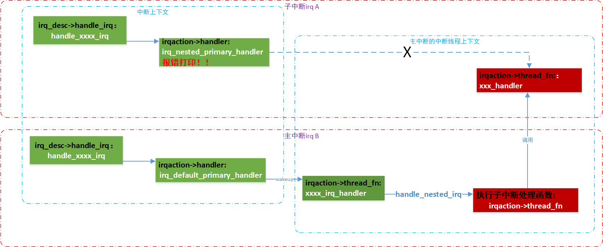
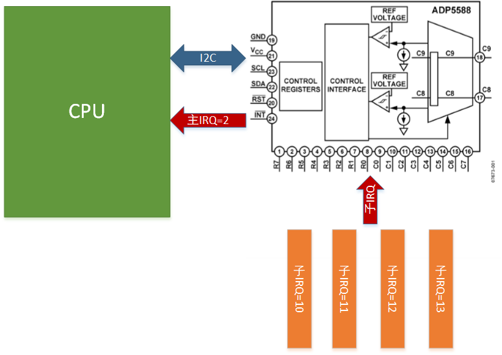

# 中断管理之nested_thread嵌套线程中断

内核版本：linux 4.0

参考：comit:399b5da29b9f851eb7b96e2882097127f003e87c \<genirq: Support nested threaded irq handling\>

**一、嵌套线程中断用法**

        嵌套线程中断实现其中一种中断共享机制，当多个中断共享某一根中断线时，我们可以把这个中断线作为父中断，共享该中断的各个设备作为子中断，在父中断的中断线程中决定和分发响应哪个设备的请求，在得出真正发出请求的子设备后，调用handle\_nested\_irq来响应中断。所以，该函数是在进程上下文执行的，我们也无需扫描和执行irq\_desc结构中的action链表。

        主中断和子中断都有hwirq、virq、中断描述符以及注册的中断处理action，子中断的action可以独立注册。

        嵌套线程中断的主要的目的是主中断的线程处理中，去轮询子设备的中断状态，调用子中断处理action\-\>handler，避免过多的子中断线程。

```
//子设备中断处理程序，不做处理，理论上不应该运行到这里
new->handler = irq_nested_primary_handler;
static irqreturn_t irq_nested_primary_handler(int irq, void *dev_id)
{
        WARN(1, "Primary handler called for nested irq %d\n", irq);
        return IRQ_NONE;
}

//普通线程化中断，返回IRQ_WAKE_THREAD，唤醒中断处理线程
new->handler = irq_default_primary_handler;
static irqreturn_t irq_default_primary_handler(int irq, void *dev_id)
{
        return IRQ_WAKE_THREAD;
}
```

驱动初始化时必须通过irq\_set\_nested\_thread函数明确告知中断子系统：这些子中断属于线程嵌套中断类型，这样驱动程序在申请这些子中断时，内核不会为它们建立自己的中断线程，所有的子中断共享父中断的中断线程。

**二、代码分析**

在主中断处理函数中，通过读取寄存器等方法判断具体那个子中断产生，接着调用handle\_nested\_irq函数处理具体的子中断。传入的irq为子中断的

```
void handle_nested_irq(unsigned int irq)
{
        struct irq_desc *desc = irq_to_desc(irq);
        struct irqaction *action;
        irqreturn_t action_ret;

        might_sleep();

        raw_spin_lock_irq(&desc->lock);

        desc->istate &= ~(IRQS_REPLAY | IRQS_WAITING);
        kstat_incr_irqs_this_cpu(irq, desc); //增加具体子中断的统计

        action = desc->action;
        if (unlikely(!action || irqd_irq_disabled(&desc->irq_data))) {
                desc->istate |= IRQS_PENDING;
                goto out_unlock;
        }

        irqd_set(&desc->irq_data, IRQD_IRQ_INPROGRESS);
        raw_spin_unlock_irq(&desc->lock);

        action_ret = action->thread_fn(action->irq, action->dev_id); //调用具体的中断线程处理函数进行中断处理
                                                                //从这里也看出每个子中断只有一个action
        if (!noirqdebug)
                note_interrupt(irq, desc, action_ret);

        raw_spin_lock_irq(&desc->lock);
        irqd_clear(&desc->irq_data, IRQD_IRQ_INPROGRESS);

out_unlock:
        raw_spin_unlock_irq(&desc->lock);
}
```

子中断需要设置该中断为线程嵌套中断，设置函数为irq\_set\_nested\_thread，这个动作在irq\_domain\_ops\-\>map中调用

```
static inline void irq_set_nested_thread(unsigned int irq, bool nest)
{
        if (nest)
                irq_set_status_flags(irq, IRQ_NESTED_THREAD);
        else
                irq_clear_status_flags(irq, IRQ_NESTED_THREAD);
}

例如：
static int ab8500_irq_map(struct irq_domain *d, unsigned int virq,
                                irq_hw_number_t hwirq)
{
        struct ab8500 *ab8500 = d->host_data;

        if (!ab8500)
                return -EINVAL;

        irq_set_chip_data(virq, ab8500);
        irq_set_chip_and_handler(virq, &ab8500_irq_chip,
                                handle_simple_irq);
        irq_set_nested_thread(virq, 1); //map时设置该irq为nested thread
#ifdef CONFIG_ARM
        set_irq_flags(virq, IRQFz_VALID);
#else
        irq_set_noprobe(virq);
#endif

        return 0;
}

static struct irq_domain_ops ab8500_irq_ops = {
        .map    = ab8500_irq_map,
        .xlate  = irq_domain_xlate_twocell,
};
```

子中断处理函数进行中断注册时需要做的特殊处理

```
static int
__setup_irq(unsigned int irq, struct irq_desc *desc, struct irqaction *new)
{
  /*
         * Check whether the interrupt nests into another interrupt
         * thread.
         */
        nested = irq_settings_is_nested_thread(desc);
        if (nested) {
                if (!new->thread_fn) {
                        ret = -EINVAL;
                        goto out_mput;
                }
                /*
                 * Replace the primary handler which was provided from
                 * the driver for non nested interrupt handling by the
                 * dummy function which warns when called.
                 */
                //new->handler是在中断上下文调用的处理函数，即非线程化中断当中使用的处理方法
                //由于当子中断标记为嵌套线程化中断处理方式时，实际上不能通过子中断本身进入中断处理函数，而是要借道主中断的处理函数进入
                //因此此处替换处理函数irq_nested_primary_handler，当直接进入子中断处理函数时，打印报错
                new->handler = irq_nested_primary_handler;  
        } else {
                if (irq_settings_can_thread(desc))
                        irq_setup_forced_threading(new);
        }

        /*
         * Create a handler thread when a thread function is supplied
         * and the interrupt does not nest into another interrupt
         * thread.
         */
        if (new->thread_fn && !nested) {
                。。。
                创建中断线程操作
                。。。
                //如果是nested thread 方式的中断，通常其new->thread_fn线程化处理函数是存在的，但是不能让其再
                //创建中断线程，因为子中断的处理入口是主中断处理函数，实质上是在主中断的处理线程中运行子中断的处理函数
        }
}
```

**三、nested thread 框图**

子中断产生时其中断处理函数的调用路径



**四、使用案例**

芯片adp5588是一颗移动I/O和键盘扩展芯片，其通过i2c，中断和cpu相连。通过该芯片能够扩展gpio的数量并用于手机键盘。

由于i2c是慢速总线，所以一级主中断适合在线程中处理中断函数，多个gpio的二级子中断共享主中断线，子中断处理函数也需要在线程中调用。

在支持nested thread之前，子中断没法独立注册和使用。使用nested thread方案使得子中断更加抽象的像一个普通中断。



1、adp5588芯片通过i2c与cpu相连，当i2c探测的时候，调用adp5588\_gpio\_probe函数初始化芯片，包括中断和寄存器的初始化，以及新增gpio添加到系统中

```
static struct i2c_driver adp5588_gpio_driver = {
        .driver = {
                   .name = DRV_NAME,
                   },
        .probe = adp5588_gpio_probe,
        .remove = adp5588_gpio_remove,
        .id_table = adp5588_gpio_id,
};
```

2、在探测函数中调用adp5588\_irq\_setup\(dev\)设置中断

```
static int adp5588_irq_setup(struct adp5588_gpio *dev)  
{ 
        //遍历处理每个gpio及其子中断
       for (gpio = 0; gpio < dev->gpio_chip.ngpio; gpio++) {
                int irq = gpio + dev->irq_base; //软件中断号是dts里面注册了留一段
                irq_set_chip_data(irq, dev);  
                irq_set_chip_and_handler(irq, &adp5588_irq_chip,
                                         handle_level_irq);  
                irq_set_nested_thread(irq, 1);  //设置子中断为线程嵌套中断
#ifdef CONFIG_ARM
                /*
                 * ARM needs us to explicitly flag the IRQ as VALID,
                 * once we do so, it will also set the noprobe.
                 */
                set_irq_flags(irq, IRQF_VALID);
#else
                irq_set_noprobe(irq);
#endif
        }

        ret = request_threaded_irq(client->irq,  //adp5588本身通过一个中断连接到cpu，就是上面所说的主中断，注册为线程化中断
                                   NULL,         //在该中断函数中通过i2c读取寄存器判断具体的中断管脚以及处理函数
                                   adp5588_irq_handler,
                                   IRQF_TRIGGER_FALLING | IRQF_ONESHOT,
                                   dev_name(&client->dev), dev);
}
```

3、当有gpio产生中断后，状态通过主中断传递给cpu并进入主中断的线程处理函数

     gpio及其子中断可以独立注册使用，具体的中断处理函数在主中断的中断线程中通过handle\_nested\_irq中被调用

```
static irqreturn_t adp5588_irq_handler(int irq, void *devid)
{
        struct adp5588_gpio *dev = devid;
        unsigned status, bank, bit, pending;
        int ret;
        status = adp5588_gpio_read(dev->client, INT_STAT);

        if (status & ADP5588_GPI_INT) {
                ret = adp5588_gpio_read_intstat(dev->client, dev->irq_stat);
                if (ret < 0)
                        memset(dev->irq_stat, 0, ARRAY_SIZE(dev->irq_stat));

                for (bank = 0, bit = 0; bank <= ADP5588_BANK(ADP5588_MAXGPIO);
                        bank++, bit = 0) {
                        pending = dev->irq_stat[bank] & dev->irq_mask[bank];

                        while (pending) {
                                if (pending & (1 << bit)) {
                                        //通过调用handle_nested_irq函数，传入子中断irq值，调用对应子中断的处理函数
                                        handle_nested_irq(dev->irq_base +  
                                                          (bank << 3) + bit);
                                        pending &= ~(1 << bit);

                                }
                                bit++;
                        }
                }
        }

        adp5588_gpio_write(dev->client, INT_STAT, status); /* Status is W1C */

        return IRQ_HANDLED;
}
```
