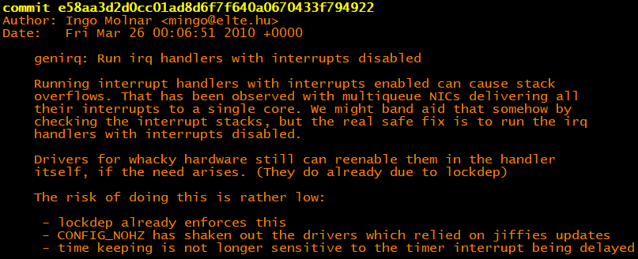
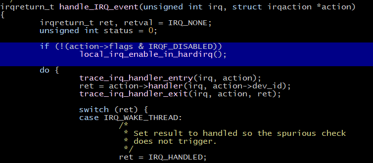
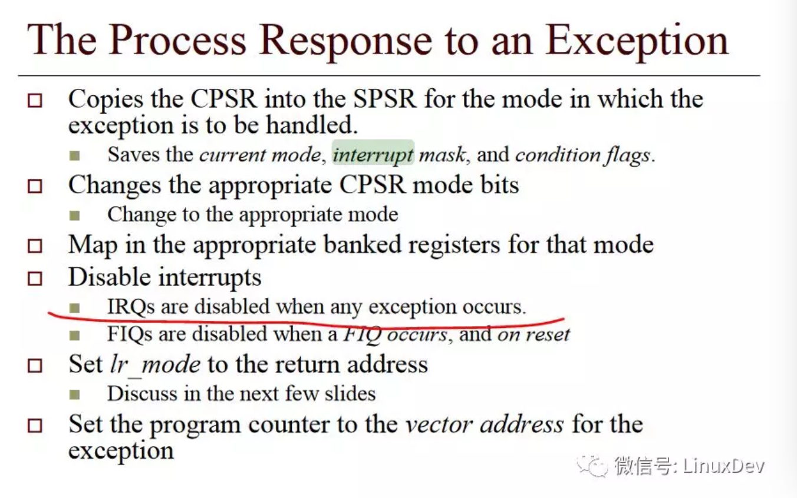

# 中断管理之中断嵌套变化

问答

问：Linux的中断可以嵌套吗？

答：以前是可以嵌套的，现在不可以！

**一、历史**

早前的Linux内核版本，中断分为两种：

- 快中断，申请的时候带IRQF\_DISABLED标记，在IRQ HANDLER里面不允许新的中断进来;
- 慢中断，申请的时候不带IRQF\_DISABLED标记，在IRQ HANDLER里面允许新的其他中断嵌套进来。

老的Linux内核中，如果一个中断服务程序不想被别的中断打断，我们能看到这样的代码：

```
request_irq(FLOPPY_IRQ, floppy_interrupt,\
-                   IRQF_DISABLED, "floppy", NULL)
```

**二、当前**

存在的问题

多个中断嵌套会导致栈溢出问题

修改方法

commit：e58aa3d2d0cc01ad8d6f7f640a0670433f794922

版本：Linux 2.6.34\-rc3



在函数中断处理函数handle\_IRQ\_event的入口处，将开启本地cpu的中断操作去掉



**三、硬件**

中断发生后，一般硬件会自动屏蔽CPU对中断的响应，而软件层面上，直到IRQ HANDLER做完，才会重新开启中断。

比如，对于ARM处理器而言，exception进来的时候，硬件都会自动屏蔽中断：



也就是说，当ARM处理器收到中断的时候，它进入中断模式，同时ARM处理器的CPSR寄存器的IRQ位会被硬件设置为屏蔽IRQ。

中断处理过程中，Linux内核会在如下三种情况下重新开启CPSR对IRQ的响应：

   ** 1. 从IRQ HANDLER返回中断底半部的SOFTIRQ**

       

```
__handle_domain_irq() 
    ->  irq_exit(void)
            ->invoke_softirq() 
                    -> __do_softirq(void)
                            -> local_irq_enable()
```

从这里看出SOFTIRQ里面是可以响应中断的。

   ** 2. 从IRQ HANDLER返回被中断线程的上下文，中断处理恢复cpsr寄存器时开中断**

```
__irq_svc:
        svc_entry
        irq_handler

#ifdef CONFIG_PREEMPT
        get_thread_info tsk
        ldr     r8, [tsk, #TI_PREEMPT]          @ get preempt count
        ldr     r0, [tsk, #TI_FLAGS]            @ get flags
        teq     r8, #0                          @ if preempt count != 0
        movne   r0, #0                          @ force flags to 0
        tst     r0, #_TIF_NEED_RESCHED
        blne    svc_preempt
#endif

        svc_exit r5, irq = 1                    @ return from exception
UNWIND(.fnend          )
ENDPROC(__irq_svc)
```

```
        .macro  svc_exit, rpsr, irq = 0

        .if     \irq != 0
        @ IRQs already off
        .else
        @ IRQs off again before pulling preserved data off the stack
        disable_irq_notrace
        .endif

        msr     spsr_cxsf, \rpsr                #恢复cpsr，重新开启irq/fiq
        ldmia   sp, {r0 - pc}^                  @ load r0 - pc, cpsr
        .endm
```

**    3、执行内核抢占调度到一个新的线程，在schedule中重新开启中断**

```
static void __sched notrace __schedule(bool preempt)
{
        struct task_struct *prev, *next;
        unsigned long *switch_count;
        struct pin_cookie cookie;
        struct rq *rq;
        int cpu;

        cpu = smp_processor_id();
        rq = cpu_rq(cpu);
        prev = rq->curr;

        schedule_debug(prev);

        if (sched_feat(HRTICK))
                hrtick_clear(rq);

        local_irq_disable();  //关闭中断
        rcu_note_context_switch();

        /*
         * Make sure that signal_pending_state()->signal_pending() below
         * can't be reordered with __set_current_state(TASK_INTERRUPTIBLE)
         * done by the caller to avoid the race with signal_wake_up().
         */
        smp_mb__before_spinlock();
        raw_spin_lock(&rq->lock); //lock
        cookie = lockdep_pin_lock(&rq->lock);

        ....

        if (likely(prev != next)) {
                rq->nr_switches++;
                rq->curr = next;
                ++*switch_count;

                trace_sched_switch(preempt, prev, next);
                rq = context_switch(rq, prev, next, cookie); /* unlocks the rq */ 
        } else {
                lockdep_unpin_lock(&rq->lock, cookie);
                raw_spin_unlock_irq(&rq->lock);
        }

        balance_callback(rq);
}

static __always_inline struct rq *
context_switch(struct rq *rq, struct task_struct *prev,
               struct task_struct *next, struct pin_cookie cookie)
{
        prepare_task_switch(rq, prev, next);  //处于线程A
        switch_to(prev, next, prev);  // 线程A切换至线程B

        return finish_task_switch(prev);  // 处于线程B
}

static struct rq *finish_task_switch(struct task_struct *prev)
        __releases(rq->lock)
{
    finish_lock_switch(rq, prev);
}

static inline void prepare_lock_switch(struct rq *rq, struct task_struct *next)
{    
    raw_spin_unlock_irq(&rq->lock);
}
```

```
__schedule --开始
    local_irq_disable()                      //A线程中，关闭中断
    raw_spin_lock(&rq->lock)
    context_switch(rq, prev, next, cookie)
        prepare_task_switch(rq, prev, next)
        switch_to(prev, next, prev)          //线程A切换至B线程
        finish_task_switch(prev)
            finish_lock_switch(rq, prev)
                raw_spin_unlock_irq(&rq->lock) //B线程中，开启中断
__schedule --结束
```

**中断发生时硬件自动处理：**


**中断发生时软件需要处理：**


**四、ARM32中断处理流程中的开关中断点**


参考资料：

[https://blog.csdn.net/juS3Ve/article/details/81437432](https://blog.csdn.net/juS3Ve/article/details/81437432)

[https://www.wowotech.net/process\_management/scheudle\-sync.html](https://www.wowotech.net/process_management/scheudle-sync.html)
