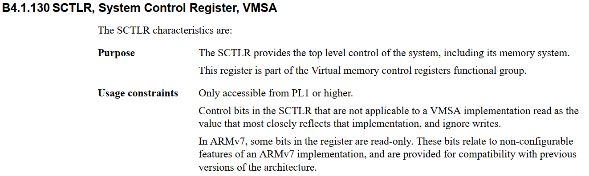
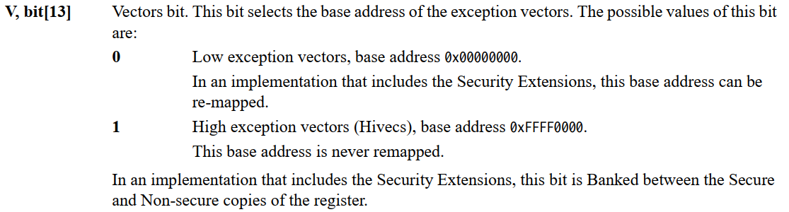
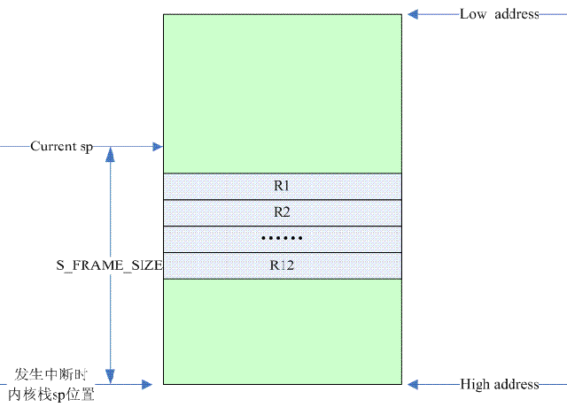
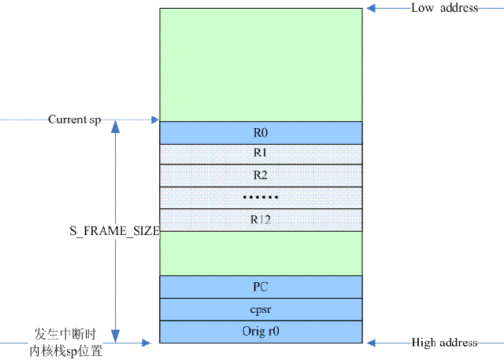
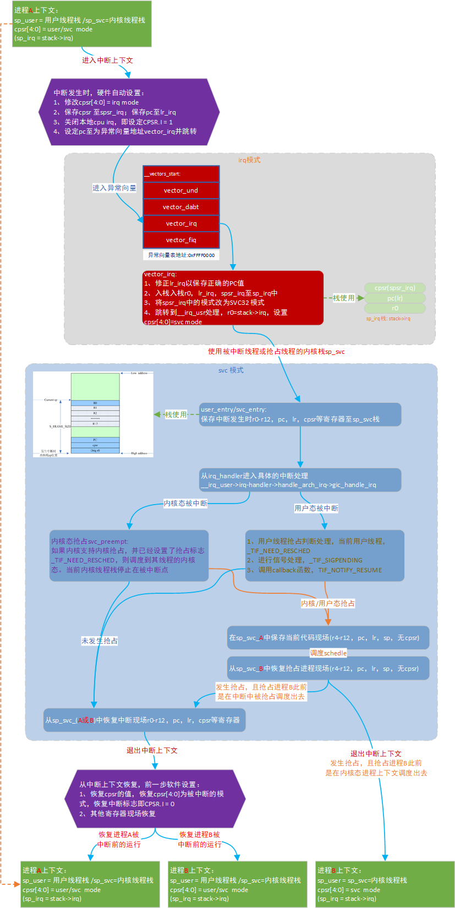
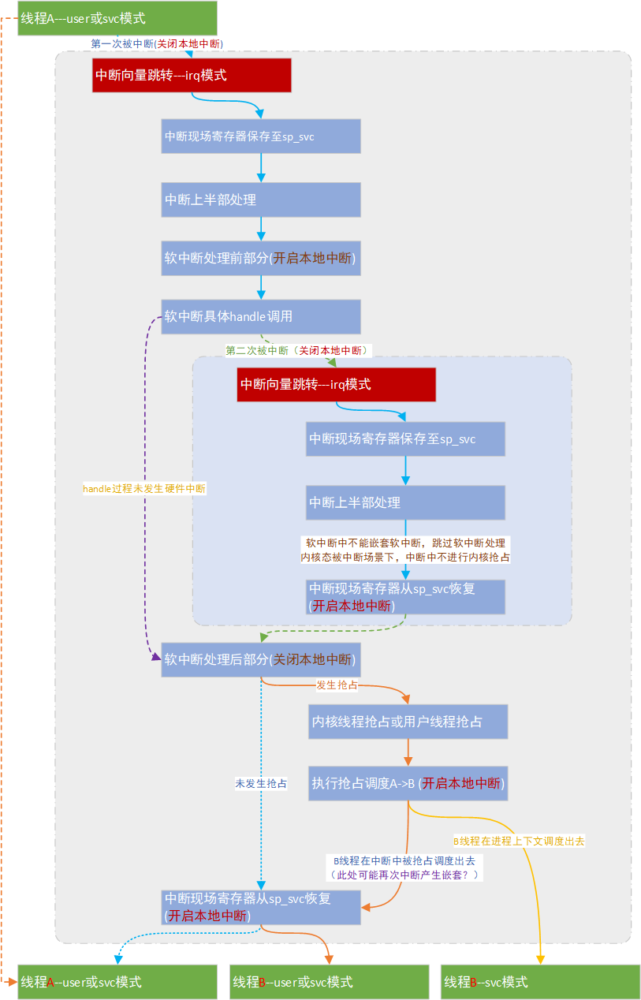

# 中断管理之中断进入退出

内核版本：linux 4.9

硬件平台：ARM32

参考资料：[http://www.wowotech.net/irq\_subsystem/irq\_handler.html](http://www.wowotech.net/irq_subsystem/irq_handler.html)

**一、中断处理的准备过程**

**1、中断模式的stack准备**

```
struct stack {
        u32 irq[3];
        u32 abt[3];
        u32 und[3];
        u32 fiq[3];
} ____cacheline_aligned;
                
#ifndef CONFIG_CPU_V7M
static struct stack stacks[NR_CPUS];
#endif
```

```
/* cpu_init sets up the per-CPU stacks.*/
void notrace cpu_init(void)
{
#ifndef CONFIG_CPU_V7M
        unsigned int cpu = smp_processor_id();        //获取当前CPU ID
        struct stack *stk = &stacks[cpu];            //获取当前CPU对应的irq/fiq/abt/und模式栈

        if (cpu >= NR_CPUS) {
                pr_crit("CPU%u: bad primary CPU number\n", cpu);
                BUG();
        }

        set_my_cpu_offset(per_cpu_offset(cpu));
        cpu_proc_init();
        set_my_cpu_offset(per_cpu_offset(cpu));

        cpu_proc_init();

        /*
         * Define the placement constraint for the inline asm directive below.
         * In Thumb-2, msr with an immediate value is not allowed.
         */
#ifdef CONFIG_THUMB2_KERNEL
#define PLC     "r"  //Thumb-2下，msr指令不允许使用立即数，只能使用寄存器。
#else
#define PLC     "I"
#endif

        /*
         * setup stacks for re-entrant exception handlers
         */
        __asm__ (
        "msr    cpsr_c, %1\n\t"    //让CPU进入IRQ模式
        "add    r14, %0, %2\n\t"   //将栈地址stack->irq保存至R14
        "mov    sp, r14\n\t"       //将SP_irq 设置为stack->irq
        "msr    cpsr_c, %3\n\t"    //返回SVC模式
        "add    r14, %0, %4\n\t"
        "mov    sp, r14\n\t"        //将SP_abt 设置为stack->abt
        "msr    cpsr_c, %5\n\t"
        "add    r14, %0, %6\n\t"
        "mov    sp, r14\n\t"        //将SP_und 设置为stack->und
        "msr    cpsr_c, %7\n\t"
        "add    r14, %0, %8\n\t"
        "mov    sp, r14\n\t"        //将SP_fiq 设置为stack->fiq
        "msr    cpsr_c, %9"
            :
            : "r" (stk),
              PLC (PSR_F_BIT | PSR_I_BIT | IRQ_MODE),
              "I" (offsetof(struct stack, irq[0])),
              PLC (PSR_F_BIT | PSR_I_BIT | ABT_MODE),
              "I" (offsetof(struct stack, abt[0])),
              PLC (PSR_F_BIT | PSR_I_BIT | UND_MODE),
              "I" (offsetof(struct stack, und[0])),
              PLC (PSR_F_BIT | PSR_I_BIT | FIQ_MODE),
              "I" (offsetof(struct stack, fiq[0])),
              PLC (PSR_F_BIT | PSR_I_BIT | SVC_MODE)
            : "r14");
#endif
}
```

对于SMP，bootstrap CPU会在系统初始化的时候执行cpu\_init函数，进行本CPU的irq、abt和und几种模式的内核栈的设定。

对于最先启动的0核，cpu\_init调用序列：

            start\_kernel\-\-\-\>setup\_arch\-\-\-\>setup\_processor\-\-\-\>cpu\_init。

对于系统中其他的CPU，bootstrap CPU会在系统初始化的最后，对每一个online的CPU进行初始化。

对于其他核，被启动的调用序列是：

            start\_kernel\-\-\-\>rest\_init\-\-\-\>kernel\_init\-\-\-\>kernel\_init\_freeable\-\-\-\>kernel\_init\_freeable\-\-\-\>smp\_init\-\-\-\>cpu\_up\-\-\-\>\_cpu\_up\-\-\-\>\_\_cpu\_up

\_\_cpu\_up函数是和CPU architecture相关的。

ARM中，对于其他核，cpu\_init调用序列：

           \_\_cpu\_up\-\-\-\>boot\_secondary\-\-\-\>smp\_ops.smp\_boot\_secondary\(SOC相关代码\)\-\-\-\>secondary\_startup\-\-\-\>\_\_secondary\_switched\-\-\-\>secondary\_start\_kernel\-\-\-\>cpu\_init。

除了初始化，系统电源管理也需要irq、abt和und stack的设定。如果我们设定的电源管理状态在进入sleep的时候，CPU会丢失irq、abt和und stack point寄存器的值，那么在CPU resume的过程中，要调用cpu\_init来重新设定这些值。

**2、SVC模式的stack准备**

Linux进程上下文中，在用户空间，使用的是用户栈。陷入内核后，使用的是内核栈。所谓内核栈其实就是处于SVC mode时候使用的栈。

在linux最开始启动的时候，系统只有一个进程，即PID等于0的那个进程，叫做swapper进程（或者叫做idle进程）。该进程的内核栈是静态定义的。

**3、异常向量表的准备**

对于ARM处理器而言，当发生异常的时候，处理器会暂停当前指令的执行，保存现场，转而去执行对应的异常向量处的指令，当处理完该异常的时候，恢复现场，回到原来的那点去继续执行程序。中断向量表如下所示，向量表中的每个指令都是一个b跳转指令，跳转到具体的异常处理中。

```
        .section .vectors, "ax", %progbits
.L__vectors_start:
        W(b)    vector_rst
        W(b)    vector_und
        W(ldr)  pc, .L__vectors_start + 0x1000
        W(b)    vector_pabt
        W(b)    vector_dabt
        W(b)    vector_addrexcptn
        W(b)    vector_irq
        W(b)    vector_fiq
```

异常向量表可能被安放在两个位置上：

（1）异常向量表位于0x0的地址。这种设置叫做Normal vectors或者Low vectors。

（2）异常向量表位于0xffff0000的地址。这种设置叫做high vectors

具体是low vectors还是high vectors是由ARM的一个叫做的SCTLR寄存器的第13个bit （vector bit）控制的。对于启用MMU的ARM Linux而言，系统使用了high vectors。为什么不用low vector呢？对于linux而言，0～3G的空间是用户空间，如果使用low vector，那么异常向量表在0地址，那么则是用户空间的位置，因此linux选用high vector。





```
#define vectors_high()  (get_cr() & CR_V)
#define CR_V    (1 << 13)       /* Vectors relocated to 0xffff0000      */
```

当然，使用Low vector也可以，这样Low vector所在的空间则属于kernel space了（也就是说，3G～4G的空间加上Low vector所占的空间属于kernel space），不过这时候要注意一点，因为所有的进程共享kernel space，而用户空间的程序经常会发生空指针访问，这时候，内存保护机制应该可以捕获这种错误（大部分的MMU都可以做到，例如：禁止userspace访问kernel space的地址空间），防止vector table被访问到。对于内核中由于程序错误导致的空指针访问，内存保护机制也需要控制vector table被修改，因此vector table所在的空间被设置成read only的。在使用了MMU之后，具体异常向量表放在那个物理地址已经不重要了，重要的是把它映射到0xffff0000的虚拟地址就OK了，具体代码如下：

```
static void __init devicemaps_init(const struct machine_desc *mdesc)
{         
        //为向量表分配两个物理page
        vectors = early_alloc(PAGE_SIZE * 2);

             //异常向量表初始化
        early_trap_init(vectors);

        /*
         * Create a mapping for the machine vectors at the high-vectors
         * location (0xffff0000).  If we aren't using high-vectors, also
         * create a mapping at the low-vectors virtual address.
         */
        map.pfn = __phys_to_pfn(virt_to_phys(vectors));
        map.virtual = 0xffff0000;
        map.length = PAGE_SIZE;
#ifdef CONFIG_KUSER_HELPERS
        map.type = MT_HIGH_VECTORS;
#else
        map.type = MT_LOW_VECTORS;
#endif
        create_mapping(&map);  //创建虚拟地址0xffff0000到物理页面的映射

        if (!vectors_high()) {  //如果SCTLR寄存器的标志为low vectors,则需要映射虚拟地址0到向量表的物理内存
                map.virtual = 0;
                map.length = PAGE_SIZE * 2;
                map.type = MT_LOW_VECTORS;
                create_mapping(&map); //创建虚拟地址0到物理页面的映射
        }

        /* Now create a kernel read-only mapping */
        map.pfn += 1;
        map.virtual = 0xffff0000 + PAGE_SIZE;
        map.length = PAGE_SIZE;
        map.type = MT_LOW_VECTORS;
        create_mapping(&map);  //创建虚拟地址0xffff0000+PAGE_SIZE到物理页面的映射
}

void __init early_trap_init(void *vectors_base)
{
#ifndef CONFIG_CPU_V7M
        unsigned long vectors = (unsigned long)vectors_base;
        extern char __stubs_start[], __stubs_end[];
        extern char __vectors_start[], __vectors_end[];
        unsigned i;

        vectors_page = vectors_base;

        /*
         * Poison the vectors page with an undefined instruction.  This
         * instruction is chosen to be undefined for both ARM and Thumb
         * ISAs.  The Thumb version is an undefined instruction with a
         * branch back to the undefined instruction.
         */
        //先把内存初始化成在ARM和THUMB下都是未定义指令的数据，以免在这段中断向量发生软件或硬件异常
        //的时候出现不可预料的错误，被未定义指令异常捕获更好
        for (i = 0; i < PAGE_SIZE / sizeof(u32); i++)
                ((u32 *)vectors_base)[i] = 0xe7fddef1;  

        /*
         * Copy the vectors, stubs and kuser helpers (in entry-armv.S)
         * into the vector page, mapped at 0xffff0000, and ensure these
         * are visible to the instruction stream.
         */
        //拷贝vectors, stubs and kuser helpers到向量表中
        memcpy((void *)vectors, __vectors_start, __vectors_end - __vectors_start);
        memcpy((void *)vectors + 0x1000, __stubs_start, __stubs_end - __stubs_start);

        kuser_init(vectors_base);

        flush_icache_range(vectors, vectors + PAGE_SIZE * 2);
#else /* ifndef CONFIG_CPU_V7M */
        /*
         * on V7-M there is no need to copy the vector table to a dedicated
         * memory area. The address is configurable and so a table in the kernel
         * image can be used.
         */
#endif
}

//拷贝kuser helpers到向量表的页面内存中
static void __init kuser_init(void *vectors)
{
        extern char __kuser_helper_start[], __kuser_helper_end[];
        int kuser_sz = __kuser_helper_end - __kuser_helper_start;

        memcpy(vectors + 0x1000 - kuser_sz, __kuser_helper_start, kuser_sz);

        /*
         * vectors + 0xfe0 = __kuser_get_tls
         * vectors + 0xfe8 = hardware TLS instruction at 0xffff0fe8
         */
        if (tls_emu || has_tls_reg)
                memcpy(vectors + 0xfe0, vectors + 0xfe8, 4);
}
```

**二、ARM硬件对中断事件的处理**

ARM处理器感知到了中断事件后，会进行下面一系列的动作：

**1、修改CPSR（Current Program Status Register）寄存器中的M\[4:0\]。**M\[4:0\]表示了ARM处理器当前处于的模式（ processor modes）。

ARM定义的mode包括：

|处理器模式|缩写|对应的M\[4:0\]编码|Privilege level|
|----------|----|------------------|---------------|
|User      |usr |10000             |PL0            |
|FIQ       |fiq |10001             |PL1            |
|IRQ       |irq |10010             |PL1            |
|Supervisor|svc |10011             |PL1            |
|Monitor   |mon |10110             |PL1            |
|Abort     |abt |10111             |PL1            |
|Hyp       |hyp |11010             |PL2            |
|Undefined |und |11011             |PL1            |
|System    |sys |11111             |PL1            |

一旦设定了CPSR.M，ARM处理器就会将processor mode切换到IRQ mode。

**2、保存发生中断那一点的CPSR值（step 1之前的状态）和PC值**

_硬件自动将cpsr保存至spsr\_irq，pc至保存至lr\_irq寄存器_

ARM处理器支持9种processor mode，每种mode看到的ARM core register（R0～R15，共计16个）都是不同的。每种mode都是从一个包括所有的Banked ARM core register中选取。全部Banked ARM core register包括：

|usr                    |System|Hyp      |Supervisor|abort    |undefined|Monitor  |IRQ      |FIQ      |
|-----------------------|------|---------|----------|---------|---------|---------|---------|---------|
|\-\-\-\-

R7\_user
R0\_usr|      |         |          |         |         |         |         |         |
|R8\_usr                |      |         |          |         |         |         |         |R8\_fiq  |
|R9\_usr                |      |         |          |         |         |         |         |R9\_fiq  |
|R10\_usr               |      |         |          |         |         |         |         |R10\_fiq |
|R11\_usr               |      |         |          |         |         |         |         |R11\_fiq |
|R12\_usr               |      |         |          |         |         |         |         |R12\_fiq |
|SP\_usr                |      |SP\_hyp  |SP\_svc   |SP\_abt  |SP\_und  |SP\_mon  |SP\_irq  |SP\_fiq  |
|LR\_usr                |      |         |LR\_svc   |LR\_abt  |LR\_und  |LR\_mon  |LR\_irq  |LR\_fiq  |
|PC                     |      |         |          |         |         |         |         |         |
|CPSR                   |      |         |          |         |         |         |         |         |
|                       |      |SPSR\_hyp|SPSR\_svc |SPSR\_abt|SPSR\_und|SPSR\_mon|SPSR\_irq|SPSR\_fiq|
|                       |      |ELR\_hyp |          |         |         |         |         |         |

在IRQ mode下，CPU看到的R0～R12寄存器、PC以及CPSR是和usr mode（userspace）或者svc mode（kernel space）是一样的。不同的是IRQ mode下，有自己的R13\(SP，stack pointer）、R14（LR，link register）和SPSR（Saved Program Status Register）。

CPSR是共用的，虽然中断可能发生在usr mode（用户空间），也可能是svc mode（内核空间），不过这些信息都是体现在CPSR寄存器中。硬件会将发生中断那一刻的CPSR保存在SPSR寄存器中（由于不同的mode下有不同的SPSR寄存器，因此更准确的说应该是SPSR\-irq，也就是IRQ mode中的SPSR寄存器）。

**3、mask IRQ exception。**也就是设定CPSR.I = 1

**4、设定PC值为IRQ exception vector。**一旦设定PC值，ARM处理器就会跳转到IRQ的exception vector地址了，后续的动作都是软件行为。

**三、进入ARM中断**

**1、IRQ mode中的处理**

进入异常向量后，IRQ mode的处理都在vector\_irq中，vector\_irq是使用vector\_stub宏来定义的。

```
/*
* Interrupt dispatcher
*/
        vector_stub     irq, IRQ_MODE, 4    //通过宏展开定义vector_irq

        .long   __irq_usr                       @  0  (USR_26 / USR_32)
        .long   __irq_invalid                   @  1  (FIQ_26 / FIQ_32)
        .long   __irq_invalid                   @  2  (IRQ_26 / IRQ_32)
        .long   __irq_svc                       @  3  (SVC_26 / SVC_32)
        .long   __irq_invalid                   @  4
        .long   __irq_invalid                   @  5
        .long   __irq_invalid                   @  6
        .long   __irq_invalid                   @  7
        .long   __irq_invalid                   @  8
        .long   __irq_invalid                   @  9
        .long   __irq_invalid                   @  a
        .long   __irq_invalid                   @  b
        .long   __irq_invalid                   @  c
        .long   __irq_invalid                   @  d
        .long   __irq_invalid                   @  e
        .long   __irq_invalid                   @  f
```

vector\_stub宏实现，以irq为例：

```
        .macro  vector_stub, name, mode, correction=0
        .align  5

vector_\name:
        //1、修正lr_irq中保存被中断的点的PC值
        .if \correction
        sub     lr, lr, #\correction   //当发生IRQ中断的时候，硬件在lr_irq中保存了发生中断的PC＋4，此处减去4就是PC

        .endif

        @
        @ Save r0, lr_<exception> (parent PC) and spsr_<exception>
        @ (parent CPSR)
        //2、使用其第一章中cpu_init设置的栈stack->irq，入栈r0，lr_irq，spsr_irq三个寄存器
        stmia   sp, {r0, lr}            @ save r0, lr //保存r0，lr_irq至 sp_irq的栈中
        mrs     lr, spsr
        str     lr, [sp, #8]            @ save spsr  //借用lr_irq寄存器，保存spsr_irq至 sp_irq的栈中

        @
        @ Prepare for SVC32 mode.  IRQs remain disabled.
        @
        //3、将spsr_irq中的模式改为SVC32 模式，为下面的irq模式转换成SVC模式铺垫
        mrs     r0, cpsr
        eor     r0, r0, #(\mode ^ SVC_MODE | PSR_ISETSTATE)
        msr     spsr_cxsf, r0

        @
        @ the branch table must immediately follow this code
        @
        //4、跳转到__irq_usr或者__irq_svc处理，r0赋值stack->irq，同时将离开IRQ模式切换成SVC模式
        and     lr, lr, #0x0f    //上面第2步中，lr_irq保存了发生IRQ时候的CPSR，通过and操作，可以获取CPSR.M[3:0]的值
                                 //如果中断发生在用户空间，lr_irq=0，如果是内核空间，lr_irq=3
THUMB( adr     r0, 1f                  )
THUMB( ldr     lr, [r0, lr, lsl #2]    )
        mov     r0, sp           //将sp_irq(即stack->irq)的值通过r0传递给要进一步跳转的函数
ARM(   ldr     lr, [pc, lr, lsl #2]    )  //根据mode查表，表的位置在当前代码即PC后面，给lr_irq赋值进一步函数__irq_usr或者__irq_svc
        movs    pc, lr                    //给PC赋值lr_irq，实现跳转到进一步处理函数
                                          //同时由于是movs，会吧spsr_irq拷贝至cpsr，实现模式切换成svc模式
                                
ENDPROC(vector_\name)
```

**2、当发生中断的时候，代码运行在用户空间**

进入\_\_irq\_usr时已是SVC模式

```
        .align  5
__irq_usr:
        usr_entry                    //保存中断发生时刻r0-r12，pc，lr，cpsr等寄存器至sp_svc的栈(即内核线程上下文的栈)
        kuser_cmpxchg_check        
        irq_handler                  //进行具体的中断处理
        get_thread_info tsk
        mov     why, #0
        b       ret_to_user_from_irq  //中断返回处理
UNWIND(.fnend          )
ENDPROC(__irq_usr)
```

usr\_entry步骤详细分析，去掉了写调试代码：

```
        .macro  usr_entry, trace=1, uaccess=1

        sub     sp, sp, #PT_REGS_SIZE   //修改sp_svc，空出PT_REGS_SIZE大小的空间保存所有发生中断时刻寄存器线程
ARM(   stmib   sp, {r1 - r12}  )        //先保存r1-r12 ，当前r0的值为stack->irq，真正的r0在这个栈中，后面会取出保存 ---A

ATRAP( mrc     p15, 0, r7, c1, c0, 0)
ATRAP( ldr     r8, .LCcralign)

        ldmia   r0, {r3 - r5}           //当前r0的值为stack->irq，所以从stack->irq中取出r0，lr_irq(中断发生时的pc)
                                        //spsr_irq(中断发生时的cpsr)保存至r3-r5中
        add     r0, sp, #S_PC           //到这里r0已经没其他用处，用于保存sp_svc栈顶的值
        mov     r6, #-1                 @  ""  ""     ""        ""

        str     r3, [sp]                //将中断发生时的r0保存至sp_svc中
                                        @ from the exception stack

ATRAP( ldr     r8, [r8, #0])

        @
        @ We are now ready to fill in the remaining blanks on the stack:
        @
        @  r4 - lr_<exception>, already fixed up for correct return/restart
        @  r5 - spsr_<exception>
        @  r6 - orig_r0 (see pt_regs definition in ptrace.h)
        @
        @ Also, separately save sp_usr and lr_usr
        @
        stmia   r0, {r4 - r6}          //将lr_irq(中断发生时的pc),spsr_irq(中断发生时的cpsr)保存至sp_svc中----B
ARM(   stmdb   r0, {sp, lr}^)          //保存中断发生时的sp和lr寄存器

        .if \uaccess
        uaccess_disable ip
        .endif

        @ Enable the alignment trap while in kernel mode
ATRAP( teq     r8, r7)
ATRAP( mcrne   p15, 0, r8, c1, c0, 0)

        @
        @ Clear FP to mark the first stack frame
        @
        zero_fp
        .endm
```

下面图分别是A阶段和B阶段时中断线程寄存器保存情况：



    

**3、当发生中断的时候，代码运行在内核空间**

```
        .align  5
__irq_svc:
        svc_entry        //保存发生中断那一刻的现场保存在内核栈上
        irq_handler      //具体的中断处理

#ifdef CONFIG_PREEMPT    //内核态线程抢占相关，如果开启内核抢占并置位了_TIF_NEED_RESCHED，调度到其他内核线程
        ldr     r8, [tsk, #TI_PREEMPT]          @ get preempt count
        ldr     r0, [tsk, #TI_FLAGS]            @ get flags
        teq     r8, #0                          @ if preempt count != 0
        movne   r0, #0   //如果preempt计数不为0，即在中断中flag强制清0，不会发生内核抢占
        tst     r0, #_TIF_NEED_RESCHED
        blne    svc_preempt
#endif

        svc_exit r5, irq = 1   //从异常返回内核态
UNWIND(.fnend          )
ENDPROC(__irq_svc)
```

svc\_entry是保存中断时的寄存器到sp\_svc中，和上面用户态中断现场寄存器保存usr\_entry类似

```
        .macro  svc_entry, stack_hole=0, trace=1, uaccess=1
UNWIND(.fnstart                )
UNWIND(.save {r0 - pc}         )
        sub     sp, sp, #(SVC_REGS_SIZE + \stack_hole - 4)
SPFIX( tst     sp, #4          )
SPFIX( subeq   sp, sp, #4      )
        stmia   sp, {r1 - r12}   //保存r1-r12

        ldmia   r0, {r3 - r5}    //从当前r0的值为stack->irq，所以从stack->irq中取出r0，lr_irq(中断发生时的pc)
        add     r7, sp, #S_SP - 4       @ here for interlock avoidance
        mov     r6, #-1                 @  ""  ""      ""       ""
        add     r2, sp, #(SVC_REGS_SIZE + \stack_hole - 4)
SPFIX( addeq   r2, r2, #4      )
        str     r3, [sp, #-4]!          @ save the "real" r0 copied
                                        @ from the exception stack
        mov     r3, lr

        @
        @ We are now ready to fill in the remaining blanks on the stack:
        @
        @  r2 - sp_svc
        @  r3 - lr_svc
        @  r4 - lr_<exception>, already fixed up for correct return/restart
        @  r5 - spsr_<exception>
        @  r6 - orig_r0 (see pt_regs definition in ptrace.h)
        @
        stmia   r7, {r2 - r6}

        get_thread_info tsk
        ldr     r0, [tsk, #TI_ADDR_LIMIT]
        mov     r1, #TASK_SIZE
        str     r1, [tsk, #TI_ADDR_LIMIT]
        str     r0, [sp, #SVC_ADDR_LIMIT]

        uaccess_save r0
        .if \uaccess
        uaccess_disable r0
        .endm
```

进入arch相关的中断处理函数处理，如arm是gic\_handle\_irq

```
/*
* Interrupt handling.
*/
        .macro  irq_handler
#ifdef CONFIG_MULTI_IRQ_HANDLER
        ldr     r1, =handle_arch_irq
        mov     r0, sp
        badr    lr, 9997f
        ldr     pc, [r1]
#else
        arch_irq_handler_default
#endif
9997:
        .endm
```

**四、退出ARM中断**

中断处理完成后，如果中断发生在用户态通过ret\_to\_user\_from\_irq返回，如果中断发生在内核态则通过svc\_exit返回。

**1、从中断返回用户态**

从中断返回用户态，其中很重要的一步是要去检查是否要进行用户态线程抢占、是否有信号处理、返回用户空间之前是否需要调用callback函数，检查并处理完成之后再从sp\_svc中恢复寄存器，回到用户态线程运行。

```
ENTRY(ret_to_user_from_irq)
        ldr     r1, [tsk, #TI_FLAGS]
        tst     r1, #_TIF_WORK_MASK
        bne     slow_work_pending  //如果_TIF_WORK_MASK标志设置了，做进一步的处理如用户态线程抢占和信号处理
no_work_pending:
        asm_trace_hardirqs_on save = 0

        /* perform architecture specific actions before user return */
        arch_ret_to_user r1, lr
        ct_user_enter save = 0

        restore_user_regs fast = 0, offset = 0  //将进入中断的时候保存的现场（寄存器值）恢复到实际的ARM的各个寄存器中

ENDPROC(ret_to_user_from_irq)
```

```
#define _TIF_WORK_MASK          (_TIF_NEED_RESCHED | _TIF_SIGPENDING | \
                                 _TIF_NOTIFY_RESUME | _TIF_UPROBE)

slow_work_pending:
        mov     r0, sp                          @ 'regs'
        mov     r2, why                         @ 'syscall'
        bl      do_work_pending
        cmp     r0, #0
        beq     no_work_pending
        movlt   scno, #(__NR_restart_syscall - __NR_SYSCALL_BASE)
        ldmia   sp, {r0 - r6}                   @ have to reload r0 - r6
        b       local_restart                   @ ... and off we go
ENDPROC(ret_fast_syscall)
```

进入do\_work\_pending做进一步的处理

```
asmlinkage int
do_work_pending(struct pt_regs *regs, unsigned int thread_flags, int syscall)
{
        /*
         * The assembly code enters us with IRQs off, but it hasn't
         * informed the tracing code of that for efficiency reasons.
         * Update the trace code with the current status.
         */
        trace_hardirqs_off();
        do {
                if (likely(thread_flags & _TIF_NEED_RESCHED)) {
                        schedule();  //如果设置了_TIF_NEED_RESCHED，进行用户态线程抢占
                } else {
                        if (unlikely(!user_mode(regs)))
                                return 0;
                        local_irq_enable();
                        if (thread_flags & _TIF_SIGPENDING) {
                                int restart = do_signal(regs, syscall); //如果设置了_TIF_SIGPENDING，进行信号处理
                                if (unlikely(restart)) {
                                        /*
                                         * Restart without handlers.
                                         * Deal with it without leaving
                                         * the kernel space.
                                         */
                                        return restart;
                                }
                                syscall = 0;
                        } else if (thread_flags & _TIF_UPROBE) {
                                uprobe_notify_resume(regs);
                        } else {
                                clear_thread_flag(TIF_NOTIFY_RESUME);
                                tracehook_notify_resume(regs);  //如果设置TIF_NOTIFY_RESUME，返回用户空间之前调用callback函数
                        }
                }
                local_irq_disable();
                thread_flags = current_thread_info()->flags;
        } while (thread_flags & _TIF_WORK_MASK);
        return 0;
}
```

**2、从中断返回内核态**

下面代码删减了thumb等相关的宏及代码，只保留了arm指令集的代码

从中断返回内核态的代码svc\_exit主要实现了从被中断线程栈sp\_svc中恢复寄存器，回到内核线程上下文运行（也有可能是软中断上下文）

```
        .macro  svc_exit, rpsr, irq = 0  //在__irq_svc中调用时，传入的rpsr==r5寄存器，其保存的值为spsr_irq(中断发生时的cpsr)
        .if     \irq != 0
        @ IRQs already off
        .else
        @ IRQs off again before pulling preserved data off the stack
        disable_irq_notrace
        .endif
        ldr     r1, [sp, #SVC_ADDR_LIMIT]
        uaccess_restore
        str     r1, [tsk, #TI_ADDR_LIMIT]

        @ ARM mode SVC restore
        msr     spsr_cxsf, \rpsr      //将spsr_irq(中断发生时的cpsr)保存至spsr_svc中

        ldmia   sp, {r0 - pc}^        //从sp_svc栈加载发生中断时的寄存器值到r0 - pc, cpsr
                                      //ldmia同时还会将spsr_svc恢复至cpsr中，由于PC被赋值恢复到被中断运行的指令处运行
        .endm
```

**五、总结**

中断进入退出过程



1、被中断的线程和出中断的线程，如果发生过内核抢占或者用户态线程抢占，则不会是同一个线程

2、发生中断时，进入Linux中断处理，使用的栈是被中断线程的内核栈，入栈时的寄存器保存结构和线程调度时寄存器保存结构是不同的，调度时保存r4\-r11, sp, lr

```
//调度时入栈现场和出栈现场
/*
* Register switch for ARMv7-M processors.
* r0 = previous task_struct, r1 = previous thread_info, r2 = next thread_info
* previous and next are guaranteed not to be the same.
*/
ENTRY(__switch_to)
        .fnstart
        .cantunwind
        add     ip, r1, #TI_CPU_SAVE
        stmia   ip!, {r4 - r11}         @ Store most regs on stack
        str     sp, [ip], #4
        str     lr, [ip], #4
        mov     r5, r0
        add     r4, r2, #TI_CPU_SAVE
        ldr     r0, =thread_notify_head
        mov     r1, #THREAD_NOTIFY_SWITCH
        bl      atomic_notifier_call_chain
        mov     ip, r4
        mov     r0, r5
        ldmia   ip!, {r4 - r11}         @ Load all regs saved previously
        ldr     sp, [ip]
        ldr     pc, [ip, #4]!
        .fnend
ENDPROC(__switch_to)
```

3、如果中断发生在用户态，那么内核栈中保存的是一组user模式下的寄存器。

        情况一：内核态线程A\-\>调度\-\>内核态线程B   （线程B在进程上下文调度出去）

        情况二：内核态线程A\-\>调度\-\>中断线程恢复\(内核态线程B\)\-\>用户态/内核态线程B.  （线程B在中断中被抢占调度出去）

4、如果发生中断上下文嵌套，中断上半部不会发生嵌套，软中断处理过程中会临时开启本地中断，因此有可能会再次发生硬件中断。软中断在irq\_handler中调用，因此软中断处于svc模式下，使用的是被中断的线程内核栈。中断计数不为0的情况下，不会发生内核抢占，具体的代码见\_\_irq\_svc。下图是软中断中再次发生硬件中断的处理框图。



5、中断中发生的内核态线程抢占或者是用户态线程，线程栈sp会发生变化，如何保证中断现场寄存器恢复？

抢占之后，对于被抢占线程A，其线程是不需要被恢复的，现场依然保持在栈中；对于抢占线程B，后续是否恢复取决于其堆栈和被调度的点。
