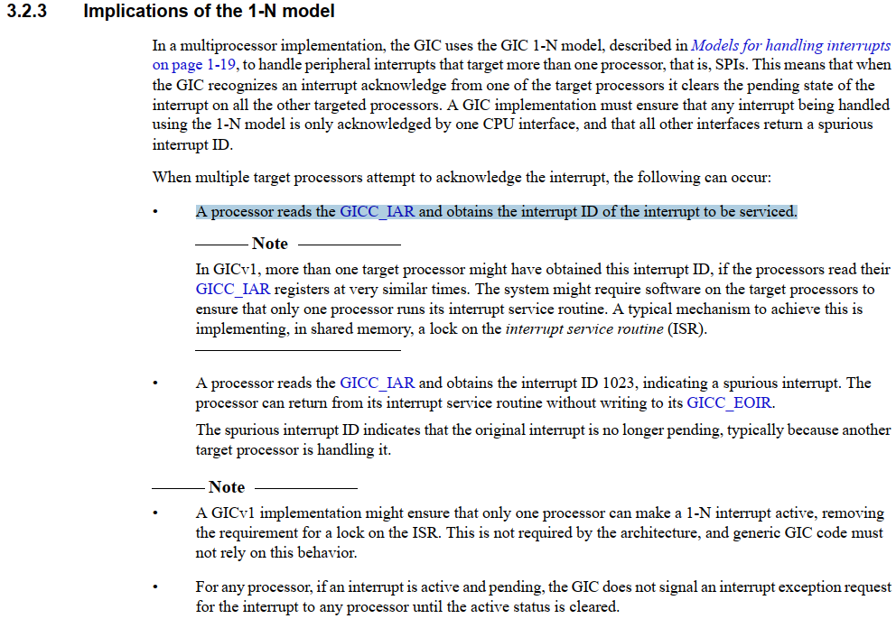
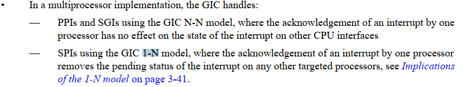

# 中断管理之并发深入分析

**一、简介**

Linux中断处理程序在中断上下文，不同场景或上下文下的资源争用需要使用不同的自旋锁。影响自旋锁选择的关键因素主要有两个：

- 执行是否可以重入。临界代码是否会出现重入情况，例如当多CPU运行时，同一段代码可能会在其他CPU核上运行
- 当前上下文是否可调度或会被其他上下文抢占。

**二、中断的上半部分**

Linux中中断处理程序的上半部分是无需考虑重入的。当一个给定的中断处理程序的上半部正在执行时，相应的中断线在所有处理器

上都会被屏蔽。通常情况下，所有其他的中断都是打开的，所以这些不同中断都能处理，但是当前中断总是被禁止的。同一个中断处理

程序的上半部绝对不会被同时调用。

- 对于SMP处理器中某个核：中断发生时，该核本地中断关闭，只有在进入中断下半部分或者退出中断处理程序时，本地中断才会

重新打开。因此中断上半部处理中，不会再次进入当前中断或者其他优先级更高的中断。具体参考中断系列《中断管理之中断嵌套变化》

- 对于SMP处理器中的多个核：对于SPI中断，由于使用1\-N模型，同一中断号不会同时在多个CPU核上确认进行处理，因此

半部处理中，不会被其他核上的相同中断打断，但是可以其他核上的其他中断可以并发产生。PPI/SGI使用N\-N模型，同一中断的处理函数

可以同时在多个CPU核上同时运行。

|要素                         |是否满足                                                                           |备注|
|-----------------------------|-----------------------------------------------------------------------------------|----|
|是否可以重入\(多CPU同时运行\)|否（对于SPI中断）
是（对于SGI/PPI中断）                                             |    |
|是否可以被调度或抢占         |否 （不支持高优先级抢占，Linux 2.6.34\-rc3之后都都不支持）
是 （支持更高优先级抢占）|    |

**1\-N model**

SPI中断使用的是1\-N模型，N个CPU核处理一个外设中断。当中断发生时，GIC的实现必须保证只有一个CPU核确认中断发生，而其他的

CPU核读取GICC\_IAR寄存器只能获取到一个伪中断号1023。在GIC\-V1中需要软件辅助完成实现只有一个CPU核确认中断的发生。同时

对于任何处理器，如果中断处于激活和挂起状态，则GIC不会向任何处理器发出中断异常请求信号，直到激活状态被清除。



**N\-N model**

All processors receive the interrupt independently. When a processor acknowledges the interrupt,

the interrupt pending state is cleared only for that processor. The interrupt remains pending for the

other processors. N\-N模型中，同一硬件中断号，可以被多个CPU核同时处理。



**三、中断的下半部分**

中断处理程序的下半部主要三种机制：软中断、tasklet和工作队列。

**软中断**

在SMP处理器的同一核上，一个软中断不会抢占另一个软中断，其他的CPU核上可以运行相同的软中断。

|要素                         |是否满足|备注                             |
|-----------------------------|--------|---------------------------------|
|是否可以重入\(多CPU同时运行\)|是      |同类型软中断可以在其他CPU核上运行|
|是否可以被调度或抢占         |是      |可以被中断的上半部抢占           |

```
void irq_exit(void)
{
#ifndef __ARCH_IRQ_EXIT_IRQS_DISABLED
        local_irq_disable();
#else
        WARN_ON_ONCE(!irqs_disabled());
#endif
        account_irq_exit_time(current);
        preempt_count_sub(HARDIRQ_OFFSET); //去掉硬件中断的标志
        //如果in_interrupt为真，则通常说明当前上下文已经嵌套在一次软中断中，不再陷入软中断处理
        if (!in_interrupt() && local_softirq_pending())
                invoke_softirq();

        tick_irq_exit();
        rcu_irq_exit();
        trace_hardirq_exit(); /* must be last! */
}

#define in_interrupt()          (irq_count())
#define irq_count()     (preempt_count() & (HARDIRQ_MASK | SOFTIRQ_MASK \
                                 | NMI_MASK))
```

**tasklet**

在同一时刻同一核上，相同类型的tasklet只有一个能够执行，因为tasklet本身是软中断的一种，而在SMP处理器的同一核上，

一个软中断不会抢占另一个软中断。如果过是SMP处理器，通过检查TASKLET\_STATE\_RUN状态这个tasklet是否正在其他处

理器上运行，如果正在其他核上运行，则当前这个不要执行，跳到下一个待处理的tasklet。

|要素                         |是否满足|备注                                                        |
|-----------------------------|--------|------------------------------------------------------------|
|是否可以重入\(多CPU同时运行\)|否      |同一时刻，在不同的CPU核上，相同类型的tasklet只有一个能够执行|
|是否可以被调度或抢占         |是      |可以被中断的上半部抢占                                      |

```
static void tasklet_action(struct softirq_action *a)
{
        struct tasklet_struct *list;

        local_irq_disable();
        list = __this_cpu_read(tasklet_vec.head);
        __this_cpu_write(tasklet_vec.head, NULL);
        __this_cpu_write(tasklet_vec.tail, this_cpu_ptr(&tasklet_vec.head));
        local_irq_enable();

        while (list) {
                struct tasklet_struct *t = list;

                list = list->next;
                //尝试上锁，如果不能锁上，则说明当前的tasklet已经在运行，不在重入运行
                if (tasklet_trylock(t)) {
                        if (!atomic_read(&t->count)) {
                                if (!test_and_clear_bit(TASKLET_STATE_SCHED,
                                                        &t->state))
                                        BUG();
                                t->func(t->data);
                                tasklet_unlock(t);
                                continue;
                        }
                        tasklet_unlock(t);
                }

                local_irq_disable();
                t->next = NULL;
                *__this_cpu_read(tasklet_vec.tail) = t;
                __this_cpu_write(tasklet_vec.tail, &(t->next));
                __raise_softirq_irqoff(TASKLET_SOFTIRQ);
                local_irq_enable();
        }
}

static inline int tasklet_trylock(struct tasklet_struct *t)
{
        return !test_and_set_bit(TASKLET_STATE_RUN, &(t)->state);
}
```

**工作队列**

工作队列也是中断下半部的一种，将工作推迟执行放到内核线程中去做，与前面几种情况是在中断上下文不同，这种场景是

在进程上下文。可以在工作队列的处理函数中进行调度和使用会休眠的接口和锁。

**四、不同上下文并发**

下面就不同的上下文可能产生的并发进行分析。

|系统类型                     |被打断内核路径                         |并发打断内核路径                                                                                                              |备注                                                                                                                 |
|-----------------------------|---------------------------------------|------------------------------------------------------------------------------------------------------------------------------|---------------------------------------------------------------------------------------------------------------------|
|单核系统                     |中断上半部处理程序A                    |无                                                                                                                            |Linux不支持中断嵌套，所以不同中断处理程序不会并发                                                                    |
|软中断A                      |中断处理程序B                          |单核系统软中断不会嵌套                                                                                                        |                                                                                                                     |
|tasklet A                    |中断处理程序B                          |单核系统软中断不会嵌套                                                                                                        |                                                                                                                     |
|\(支持内核抢占\)
进程上下文A  |软中断处理程序B

中断处理程序B
进程上下文B|内核态中，调度器可以抢占当前正在运行的进程，重新调度其他进程运行，从而导致单核系统中进程上下文存在并发的可能性。              |                                                                                                                     |
|\(不支持内核抢占\)
进程上下文A|中断处理程序B
软中断处理程序B           |内核态进程上下文中，进程只有显式的调度让出CPU，其他进程才有机会得到运行，因此其他进程不会打断当前运行中的进程。               |                                                                                                                     |
|SMP系统                      |中断处理程序A                          |中断处理程序B                                                                                                                 |同一类型的中断处理程序不会并发，但是不同类型的中断有可能送达到不同的CPU上，因此不同类型的中断处理程序可能存在并发执行|
|软中断处理程序A              |中断处理程序B
软中断处理程序B           |同一类型的软中断会在不同的CPU上并发                                                                                           |                                                                                                                     |
|Tasklet A                    |中断处理程序B
软中断处理程序B           |Tasklet基于优先级5的软中断实现，同一类型的tasklet串行执行，不会在多个CPU上并发，因此tasklet不会类似其他软中会在过个CPU上并发。|                                                                                                                     |
|进程上下文A                  |软中断处理程序B

中断处理程序B
进程上下文B|不同CPU上的进程上下文会并发运行，包括关闭内核抢占的系统。                                                                     |                                                                                                                     |

**五、自旋锁选择**

下面就几个典型的SMP下的中断上下文应用场景进行举例说明，由于工作队列实质上是在进程上下文，不在此归类分析中。

|序号       |场景                                                                                                                                                             |临界区位置                                                                                |自旋锁选择                                                                                                                                                      |备注                                                                                      |
|-----------|-----------------------------------------------------------------------------------------------------------------------------------------------------------------|------------------------------------------------------------------------------------------|----------------------------------------------------------------------------------------------------------------------------------------------------------------|------------------------------------------------------------------------------------------|
|1          |共享资源只在同一个软中断 A中使用                                                                                                                                 |软中断 A                                                                                  |spin\_unlock
spin\_lock                                                                                                                                          |避免SMP下多核软中断竞争，用一个忙等原子锁spin\_lock即可                                   |
|2          |共享资源只在一个tasklet A中使用                                                                                                                                  |tasklet A                                                                                 |不需要                                                                                                                                                          |同一个task在不同核上不会重入                                                              |
|3          |共享资源只在同一个中断上半部 A中使用                                                                                                                             |中断上半部 A                                                                              |需要（SGI/PPI中断）
不需要（SPI中断）                                                                                                                            |通常用户使用的SPI中断多                                                                   |
|4          |共享资源在进程上下文和软中断A中使用                                                                                                                              |进程上下文                                                                                |spin\_unlock\_bh

或者

spin\_lock\_irq

spin\_unlock\_irq

或者

spin\_lock\_irq\_save

spin\_unlock\_store
spin\_lock\_bh                                                  |防止本地核软中断抢占                                                                      |
|软中断 A   |spin\_unlock
spin\_lock                                                                                                                                           |避免SMP下多核间软中断同时进入产生竞争，实质是通过原子锁来保护临界资源                     |                                                                                                                                                                |                                                                                          |
|

5          |

共享资源在进程上下文和tasklet A中使用                                                                                                                            |进程上下文                                                                                |spin\_unlock\_bh

或者

spin\_lock\_irq

spin\_unlock\_irq

或者

spin\_lock\_irq\_save

spin\_unlock\_store
spin\_lock\_bh                                                  |防止本地核软中断抢占                                                                      |
|tasklet A  |spin\_unlock
spin\_lock                                                                                                                                           |同一个task在不同核上不会重入；                                                            |                                                                                                                                                                |                                                                                          |
|

6          |

共享资源在多个软中断中使用                                                                                                                                       |软中断 A                                                                                  |spin\_unlock
spin\_lock                                                                                                                                          |一方面避免SMP下其他核的相同同一软中断A竞争，另一方面避免SMP下其他核上软中断B处理函数竞争。|
|软中断 B   |spin\_unlock
spin\_lock                                                                                                                                           |一方面避免SMP下其他核的相同同一软中断B竞争，另一方面避免SMP下其他核上软中断A处理函数竞争。|                                                                                                                                                                |                                                                                          |
|

7          |（不支持中断嵌套的Linux版本）
共享资源在多个中断上半部处理                                                                                                        |上半部 A                                                                                  |spin\_unlock

或

spin\_lock\_bh

spin\_unlock\_bh

或者

spin\_lock\_irq

spin\_unlock\_irq（应该不行使用后会开中断）

或者

spin\_lock\_irq\_save

spin\_unlock\_store
spin\_lock|由于SMP下同一核上中断不会嵌套，只需防止其他核上中断B竞争                                  |
|上半部 B   |spin\_unlock

或

spin\_lock\_bh

spin\_unlock\_bh

或者

spin\_lock\_irq

spin\_unlock\_irq （应该不行使用后会开中断）

或者

spin\_lock\_irq\_save

spin\_unlock\_store
spin\_lock|由于SMP下同一核上中断不会嵌套，只需防止其他核上中断A竞争                                  |                                                                                                                                                                |                                                                                          |
|8
          |

 共享资源在进程上下文和中断上半部A                                                                                                                               |进程上下文                                                                                |spin\_unlock\_irq

或者

spin\_lock\_irq\_save

spin\_unlock\_store
spin\_lock\_irq                                                                                    |防止本地核硬件中断抢占                                                                    |
|上半部A    |spin\_unlock

或

spin\_lock\_bh

spin\_unlock\_bh

或者

spin\_lock\_irq

spin\_unlock\_irq（应该不行使用后会开中断）

或者

spin\_lock\_irq\_save

spin\_unlock\_store
spin\_lock |防止其他核上进程与正在处于临界区的中断上半部产生竞争                                      |                                                                                                                                                                |                                                                                          |
|9
          | 共享资源在软中断A和中断上半部B
                                                                                                                                  |软中断A                                                                                   |spin\_unlock\_irq

或者

spin\_lock\_irq\_save

spin\_unlock\_store
spin\_lock\_irq                                                                                    |防止本地核硬件中断抢占                                                                    |
|中断上半部B|spin\_unlock

或

spin\_lock\_bh

spin\_unlock\_bh

或者

spin\_lock\_irq

spin\_unlock\_irq（应该不行使用后会开中断）

或者

spin\_lock\_irq\_save

spin\_unlock\_store
spin\_lock |防止其他核上软中断与正在处于临界区的中断上半部产生竞争                                    |                                                                                                                                                                |                                                                                          |

总结：spin\_lock用于阻止在不同CPU上的执行单元对共享资源的同时访问以及不同进程上下文互相抢占导致的对共享资源的非同步访问，而中断失效和软中断失效却是为了阻止在同一CPU上软中断或中断对共享资源的非同步访问。


