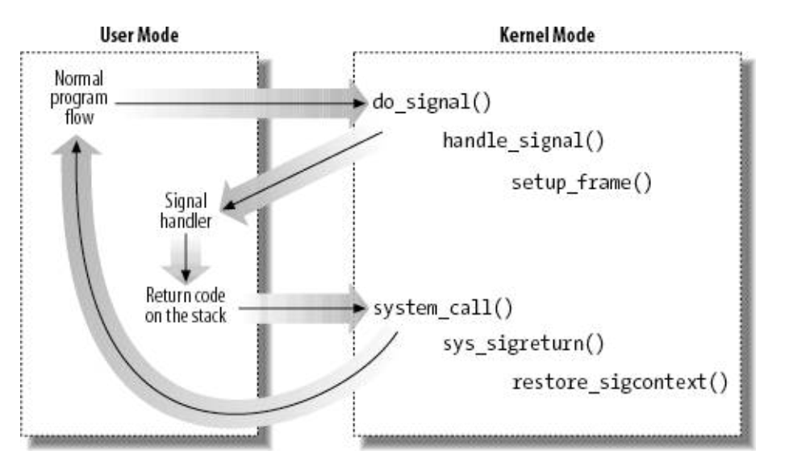
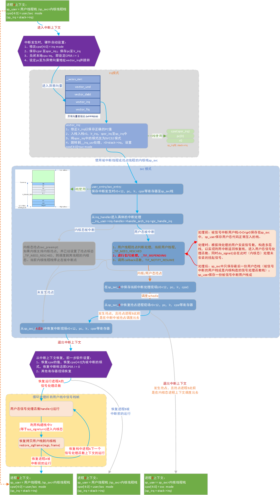
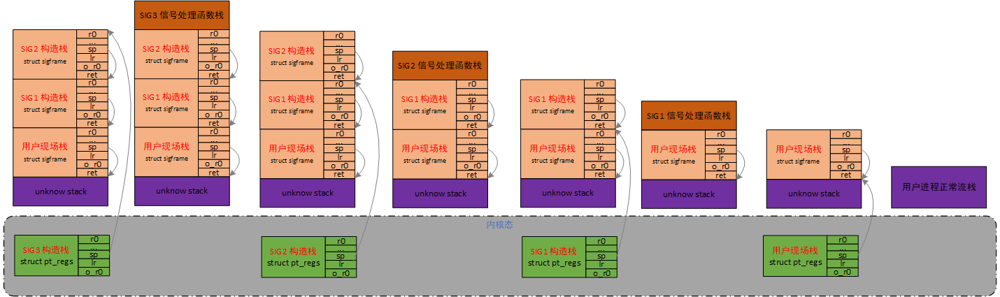
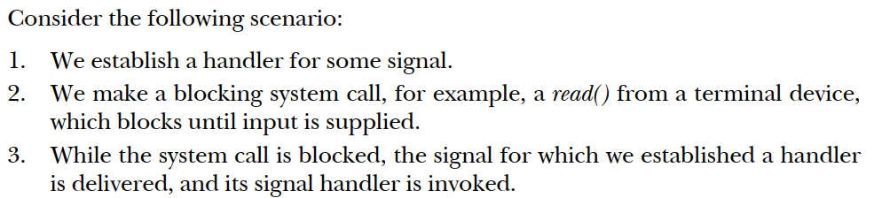

# 信号管理之信号处理原理

平台：arm32

内核版本：linux 4.9

**一、背景**

信号被称为是“software interrupt”，不是内核态的软中断，而是用户态代码的软中断，信号处理函数可以被用户注册，可以像中断一样打断正常用户态代码执行流。linux中信号的实现原理十分巧妙，利用中断栈恢复机制，模拟了这种“中断”行为。

下图展示信号处理的大体框架，信号中断正常的执行流，完了还要完全恢复到之前正常的执行流中。



**二、信号处理框架**

在中断返回用户态时，处理进程的挂起信号，此时内核栈中仅保存r0\-cpsr\-orig\_r0一份现场。

```
#define _TIF_WORK_MASK          (_TIF_NEED_RESCHED | _TIF_SIGPENDING | \
                                 _TIF_NOTIFY_RESUME | _TIF_UPROBE)

slow_work_pending:
        mov     r0, sp                          @ 'regs'
        mov     r2, why                         @ 'syscall'
        bl      do_work_pending
        cmp     r0, #0
        beq     no_work_pending
        movlt   scno, #(__NR_restart_syscall - __NR_SYSCALL_BASE)
        ldmia   sp, {r0 - r6}                   @ have to reload r0 - r6
        b       local_restart                   @ ... and off we go
ENDPROC(ret_fast_syscall)
```

在do\_work\_pending循环调用do\_signal，一方面处理需要在内核态处理的信号，另一方面准备需要在用户态处理的信号栈。

```
asmlinkage int
do_work_pending(struct pt_regs *regs, unsigned int thread_flags, int syscall)
{
        do {
                if (likely(thread_flags & _TIF_NEED_RESCHED)) {
                        schedule();
                } else {
                        if (unlikely(!user_mode(regs)))
                                return 0;
                        local_irq_enable();
                        if (thread_flags & _TIF_SIGPENDING) {
                                do_signal(regs, syscall);
                                syscall = 0;  
                        }
                }
                local_irq_disable();
                thread_flags = current_thread_info()->flags;
        } while (thread_flags & _TIF_WORK_MASK);
        return 0;
}

static int do_signal(struct pt_regs *regs, int syscall)
{
        if (get_signal(&ksig)) { //get_signal()中会处理需要在内核态处理的信号。
                /* handler */
                handle_signal(&ksig, regs);
        } else {
                /* no handler */
                restore_saved_sigmask();  
        }
        return 0;
}
```

handle\_signal\(\)函数则是在布局信号栈，待后续返回用户态处理多个用户安装的信号处理函数。

```
static void handle_signal(struct ksignal *ksig, struct pt_regs *regs)
{
        sigset_t *oldset = sigmask_to_save();
        int ret;

        if (ksig->ka.sa.sa_flags & SA_SIGINFO)
                ret = setup_rt_frame(ksig, oldset, regs);
        else
                ret = setup_frame(ksig, oldset, regs);
        /*
         * Check that the resulting registers are actually sane.
         */
        ret |= !valid_user_regs(regs);

        signal_setup_done(ret, ksig, 0);
}
```



信号处理时机及其信号上下文分为两种：

1、do\_signal\(\)\-\>get\_signal\(\)中将SIG\_IGN/SIG\_DFL等类型需要在内核态处理的信号处理掉

2、在从内核态通过栈恢复到用户态时，直接恢复到用户态信号处理函数处，处理用户态安装了信号处理函数的信号。

**三、信号栈布局**

**3.1 栈相关数据结构**

struct pt\_regs表示的是用户态进程被中断时，保存在内核态栈svc\_sp中上下文的寄存器值。从内核态返回用户态时，也是将svc\_sp中保存的这些寄存器值恢复，因此在构建用户态信号处理函数的栈时，即设置一份pt\_regs，但并不是所有的寄存器值都需要做初始化。

```
struct pt_regs {
        long uregs[18];
};

#define ARM_cpsr        uregs[16]
#define ARM_pc          uregs[15]
#define ARM_lr          uregs[14]
#define ARM_sp          uregs[13]
#define ARM_ip          uregs[12]
#define ARM_fp          uregs[11]
#define ARM_r10         uregs[10]
#define ARM_r9          uregs[9]
#define ARM_r8          uregs[8]
#define ARM_r7          uregs[7]
#define ARM_r6          uregs[6]
#define ARM_r5          uregs[5]
#define ARM_r4          uregs[4]
#define ARM_r3          uregs[3]
#define ARM_r2          uregs[2]
#define ARM_r1          uregs[1]
#define ARM_r0          uregs[0]
#define ARM_ORIG_r0     uregs[17]
```

struct sigframe保存的是一份临时栈数据，当中断返回执行用户态信号处理函数时，需要使用到svc\_sp保存的一份上下文现场，因此把sp\_svc中存的现场暂存到sigframe表示的数，并且最尾部retcode用于保存系统调用于用户态信号处理完成再次返回内核态。最终struct sigframe会暂存到sp\_user中去。

```
struct sigframe {
        struct ucontext uc;
        unsigned long retcode[2];
};

struct ucontext {
        unsigned long     uc_flags;
        struct ucontext  *uc_link;
        stack_t           uc_stack;
        struct sigcontext uc_mcontext;
        sigset_t          uc_sigmask;
        /* Allow for uc_sigmask growth.  Glibc uses a 1024-bit sigset_t.  */
        int               __unused[32 - (sizeof (sigset_t) / sizeof (int))];
        /* Last for extensibility.  Eight byte aligned because some
           coprocessors require eight byte alignment.  */
        unsigned long     uc_regspace[128] __attribute__((__aligned__(8)));
};
```

**3.2 信号栈设置**

信号栈的设置是为用户安装的信号处理函数运行做准备，通过修改栈数据，以此达到信号中断正常的用户态程序流。如果进程有多个挂起信号需要在用户态处理，则sp\_svc中则会层叠保存了多份 struct sigframe数据。

```
static int
setup_frame(struct ksignal *ksig, sigset_t *set, struct pt_regs *regs)
{
        struct sigframe __user *frame = get_sigframe(ksig, regs, sizeof(*frame)); //获取存放sigframe的用户栈地址
        int err = 0;

        if (!frame)
                return 1;

        /*
         * Set uc.uc_flags to a value which sc.trap_no would never have.
         */
        __put_user_error(0x5ac3c35a, &frame->uc.uc_flags, err);

        err |= setup_sigframe(frame, regs, set); //
        if (err == 0)
                err = setup_return(regs, ksig, frame->retcode, frame);

        return err;
}

static inline void __user *
get_sigframe(struct ksignal *ksig, struct pt_regs *regs, int framesize)
{
        //pt_regs这份现场保存在sp_svc中，其中的pt_regs->ARM_sp表示的是当前的用户栈值
        unsigned long sp = sigsp(regs->ARM_sp, ksig);
        void __user *frame;

        /*
         * ATPCS B01 mandates 8-byte alignment
         */
        //在用户栈中放一份struct sigframe数据后的栈地址
        frame = (void __user *)((sp - framesize) & ~7);

        /*
         * Check that we can actually write to the signal frame.
         */
        if (!access_ok(VERIFY_WRITE, frame, framesize))
                frame = NULL;
        return frame;
}

//setup_sigframe将当前sp_svc中保存的一份pt_regs暂存到前面get_sigframe获取的一段用户栈空间中
//__put_user_error为内核态拷贝数据到用户态函数
static int setup_sigframe(struct sigframe __user *sf, struct pt_regs *regs, sigset_t *set)
{
        struct aux_sigframe __user *aux;
        int err = 0;

        __put_user_error(regs->ARM_r0, &sf->uc.uc_mcontext.arm_r0, err);
        __put_user_error(regs->ARM_r1, &sf->uc.uc_mcontext.arm_r1, err);
        __put_user_error(regs->ARM_r2, &sf->uc.uc_mcontext.arm_r2, err);
        __put_user_error(regs->ARM_r3, &sf->uc.uc_mcontext.arm_r3, err);
        __put_user_error(regs->ARM_r4, &sf->uc.uc_mcontext.arm_r4, err);
        __put_user_error(regs->ARM_r5, &sf->uc.uc_mcontext.arm_r5, err);
        __put_user_error(regs->ARM_r6, &sf->uc.uc_mcontext.arm_r6, err);
        __put_user_error(regs->ARM_r7, &sf->uc.uc_mcontext.arm_r7, err);
        __put_user_error(regs->ARM_r8, &sf->uc.uc_mcontext.arm_r8, err);
        __put_user_error(regs->ARM_r9, &sf->uc.uc_mcontext.arm_r9, err);
        __put_user_error(regs->ARM_r10, &sf->uc.uc_mcontext.arm_r10, err);
        __put_user_error(regs->ARM_fp, &sf->uc.uc_mcontext.arm_fp, err);
        __put_user_error(regs->ARM_ip, &sf->uc.uc_mcontext.arm_ip, err);
        __put_user_error(regs->ARM_sp, &sf->uc.uc_mcontext.arm_sp, err);
        __put_user_error(regs->ARM_lr, &sf->uc.uc_mcontext.arm_lr, err);
        __put_user_error(regs->ARM_pc, &sf->uc.uc_mcontext.arm_pc, err);
        __put_user_error(regs->ARM_cpsr, &sf->uc.uc_mcontext.arm_cpsr, err);

        __put_user_error(current->thread.trap_no, &sf->uc.uc_mcontext.trap_no, err);
        __put_user_error(current->thread.error_code, &sf->uc.uc_mcontext.error_code, err);
        __put_user_error(current->thread.address, &sf->uc.uc_mcontext.fault_address, err);
        __put_user_error(set->sig[0], &sf->uc.uc_mcontext.oldmask, err);

        err |= __copy_to_user(&sf->uc.uc_sigmask, set, sizeof(*set));
        aux = (struct aux_sigframe __user *) sf->uc.uc_regspace;
        __put_user_error(0, &aux->end_magic, err);

        return err;
}

static int
setup_return(struct pt_regs *regs, struct ksignal *ksig,
             unsigned long __user *rc, void __user *frame)
{
        unsigned long handler = (unsigned long)ksig->ka.sa.sa_handler;
        unsigned long retcode;
        int thumb = 0;
        unsigned long cpsr = regs->ARM_cpsr & ~(PSR_f | PSR_E_BIT);

        cpsr |= PSR_ENDSTATE;

        if (ksig->ka.sa.sa_flags & SA_THIRTYTWO)
                cpsr = (cpsr & ~MODE_MASK) | USR_MODE;
        if (ksig->ka.sa.sa_flags & SA_RESTORER) { //SA_RESTORER标志用户运行用户设置的恢复函数，通常用户态不会使用
                retcode = (unsigned long)ksig->ka.sa.sa_restorer;
        } else {
                unsigned int idx = thumb << 1;

                if (ksig->ka.sa.sa_flags & SA_SIGINFO)
                        idx += 3;
                if (__put_user(sigreturn_codes[idx],   rc) ||
                    __put_user(sigreturn_codes[idx+1], rc+1))
                        return 1;

                 flush_icache_range((unsigned long)rc, (unsigned long)(rc + 2));
                 retcode = ((unsigned long)rc) + thumb;
        }

        //重新设置sp_svc中的pt_regs，只需设置几个关键寄存器即可完成一个信号栈构建
        regs->ARM_r0 = ksig->sig;             //r0为该信号处理函数的入参
        regs->ARM_sp = (unsigned long)frame;  //frame表示的地址值，为该信号处理函数运行时使用的用户栈
        regs->ARM_lr = retcode;               //待信号处理函数handler运行完成之后，会跳到lr运行，retcode存放的是sys_sigreturn的系统调用
        regs->ARM_pc = handler;               //handler为信号处理函数
        regs->ARM_cpsr = cpsr;

        return 0;
}
```

如下图是一个构造了3个用户安装信号处理函数的栈的过程，其5个步骤分别表示：

步骤1：中断发生时的用户栈和内核栈

步骤2：完成SIG1的栈构造

步骤3：完成SIG2的栈构造

步骤4：完成SIG3的栈构造

步骤5：执行SIG3的信号处理函数时的用户栈


**3.3 信号处理函数执行**

如上以章节所示，sp\_svc和sp\_user中的信号栈数据构建完成后，一旦进程从中断返回，恢复sp\_svc中寄存器现场，则会进入到用户态信号处理函数运行。

**3.3 信号栈恢复**

待用户态信号处理函数执行完成后，将会执行setup\_return\(\)中设置的保存在regs\-\>lr中的指令，即调用sys\_sigreturn系统调用，恢复此前暂存在sp\_user中的现场寄存器。

```
asmlinkage int sys_sigreturn(struct pt_regs *regs)
{
        struct sigframe __user *frame;
        
        /* Always make any pending restarted system calls return -EINTR */
        current->restart_block.fn = do_no_restart_syscall;
        
        if (regs->ARM_sp & 7)
                goto badframe;
        
        frame = (struct sigframe __user *)regs->ARM_sp; //此时ARM_sp中保存的是用户栈地址，其中保存了sigframe
        
        if (!access_ok(VERIFY_READ, frame, sizeof (*frame)))
                goto badframe;
        
        if (restore_sigframe(regs, frame)) //从sp_user中的sigframe中恢复一份现场到sp_svc
                goto badframe;

        return regs->ARM_r0;

badframe:
        force_sig(SIGSEGV, current);
        return 0;
}

static int restore_sigframe(struct pt_regs *regs, struct sigframe __user *sf)
{
        struct aux_sigframe __user *aux;
        sigset_t set;
        int err;

        err = __copy_from_user(&set, &sf->uc.uc_sigmask, sizeof(set));
        if (err == 0)
                set_current_blocked(&set);

        __get_user_error(regs->ARM_r0, &sf->uc.uc_mcontext.arm_r0, err);
        __get_user_error(regs->ARM_r1, &sf->uc.uc_mcontext.arm_r1, err);
        __get_user_error(regs->ARM_r2, &sf->uc.uc_mcontext.arm_r2, err);
        __get_user_error(regs->ARM_r3, &sf->uc.uc_mcontext.arm_r3, err);
        __get_user_error(regs->ARM_r4, &sf->uc.uc_mcontext.arm_r4, err);
        __get_user_error(regs->ARM_r5, &sf->uc.uc_mcontext.arm_r5, err);
        __get_user_error(regs->ARM_r6, &sf->uc.uc_mcontext.arm_r6, err);
        __get_user_error(regs->ARM_r7, &sf->uc.uc_mcontext.arm_r7, err);
        __get_user_error(regs->ARM_r8, &sf->uc.uc_mcontext.arm_r8, err);
        __get_user_error(regs->ARM_r9, &sf->uc.uc_mcontext.arm_r9, err);
        __get_user_error(regs->ARM_r10, &sf->uc.uc_mcontext.arm_r10, err);
        __get_user_error(regs->ARM_fp, &sf->uc.uc_mcontext.arm_fp, err);
        __get_user_error(regs->ARM_ip, &sf->uc.uc_mcontext.arm_ip, err);
        __get_user_error(regs->ARM_sp, &sf->uc.uc_mcontext.arm_sp, err);
        __get_user_error(regs->ARM_lr, &sf->uc.uc_mcontext.arm_lr, err);
        __get_user_error(regs->ARM_pc, &sf->uc.uc_mcontext.arm_pc, err);
        __get_user_error(regs->ARM_cpsr, &sf->uc.uc_mcontext.arm_cpsr, err);

        err |= !valid_user_regs(regs);
        return err;
}
```

如下图是一个构造了3个用户安装信号处理函数的栈，在恢复栈执行用户态处理函数的过程，其8个步骤分别表示：

步骤1：中断返回用户态过程中完成信号3栈构造

步骤2：中断返回恢复sp\_svc中栈现场，执行信号3用户态处理函数

步骤3：完成信号3用户态处理函数执行，通过sys\_sigreturn返回内核态后，将信号2的构造栈从sp\_user拷贝到sp\_svc

步骤4：从内核态恢复p\_svc中栈现场，执行信号2用户态处理函数

步骤5：完成信号2用户态处理函数执行，通过sys\_sigreturn返回内核态后，将信号1的构造栈从sp\_user拷贝到sp\_svc

步骤6：从内核态恢复p\_svc中栈现场，执行信号1用户态处理函数

步骤7：完成信号1用户态处理函数执行，通过sys\_sigreturn返回内核态后，将中断的用户栈从sp\_user拷贝到sp\_svc

步骤8：从内核态恢复p\_svc中栈现场，继续执行用户态被中断的正常执行流



**四、系统调用过程中处理信号**

**4.1 为何需要处理**

例如：系统调用阻塞式的读取数据，此时一个用户态安装好的信号达到，如果不去处理信号则影响进程响应，如果去处理信号，则需结束当前内核态系统调用的处理。通过信号处理后重新调用系统调用，可以适当解决此问题。



**4.2 系统调用返回的错误**

内核中定义了几种因为信号挂起需要处理导致系统调用失败的错误，这些错误在内核代码中使用，可以起到通知用户或重启系统调用的作用。

```
#define ERESTARTSYS     512  
#define ERESTARTNOINTR  513
#define ERESTARTNOHAND  514     /* restart if no handler.. */
#define ERESTART_RESTARTBLOCK 516 /* restart by calling sys_restart_syscall */   
```

ERESTARTSYS   ：如果用户给信号设置了SA\_RESTAR标志，那么系统调用会被重新调用，否则返回\-EINTR错误给用户态。

ERESTARTNOINTR  ：系统调用直接被重新调用。

ERESTARTNOHAND/ERESTARTNOHAND    ：用户态进程被唤醒，并且返回\-EINTR错误给用户态。

**4.3 代码实现分析**

去掉了信号处理中restart代码部分，这部分应该是有特殊用途，在arm64的信号处理中没有，去掉不影响系统调用的重新调用。

```
asmlinkage int
do_work_pending(struct pt_regs *regs, unsigned int thread_flags, int syscall)
{
        do {
                if (likely(thread_flags & _TIF_NEED_RESCHED)) {
                        schedule();
                } else {
                        if (unlikely(!user_mode(regs)))
                                return 0;
                        local_irq_enable();
                        if (thread_flags & _TIF_SIGPENDING) {
                                do_signal(regs, syscall);
                        //在系统调用过程处理信号，只有第一个信号处理的时候，syscall才等于0，因为只有第一个用户注册信号
                        //是直接返回用户态被中断系统调用现场，因此也只需要在第一个信号处理时，修改返回地址为系统调用的指令。
                                syscall = 0;  
                        } 
                }
                local_irq_disable();
                thread_flags = current_thread_info()->flags;
        } while (thread_flags & _TIF_WORK_MASK);
        return 0;
}

static int do_signal(struct pt_regs *regs, int syscall)
{
        unsigned int retval = 0, continue_addr = 0, restart_addr = 0;
        struct ksignal ksig;

        if (syscall) { 
                continue_addr = regs->ARM_pc;  //ARM_pc是系统调用下一条指令的地址
                restart_addr = continue_addr - (thumb_mode(regs) ? 2 : 4); //计算出系统调用指令的地址
                retval = regs->ARM_r0;  //当前上下文是处于系统调用返回用户态的过程中，因此ARM_r0是系统调用过程中的返回值

                switch (retval) {
                case -ERESTART_RESTARTBLOCK:
                case -ERESTARTNOHAND:
                case -ERESTARTSYS:
                case -ERESTARTNOINTR:
                        //ARM_ORIG_r0应该是系统调用时第一个参数，如果要重新执行系统调用，需要将r0恢复原状
                        regs->ARM_r0 = regs->ARM_ORIG_r0; 
                        regs->ARM_pc = restart_addr;
                        break;
                }
        }

        //由于get_signal()中会处理SIG_IGN/SIG_DFL等类型的信号，因此返回的必然是有用户态安装的信号处理函数的信号。
        //所以do_signal函数是本次信号处理第一次进入，并且get_signal返回非空的话，必然是第一个用户态安装的信号处理函数的信号
        //后续do_work_pending循环中将syscall置0是必要的。
        if (get_signal(&ksig)) {  
                /* handler */
                //如果regs->ARM_pc == restart_addr，那么意味着当前处于系统调用返回阶
                //段且预且准备处理第一个用户态安装了信号处理函数的信号
                if (regs->ARM_pc == restart_addr) { 
                        if (retval == -ERESTARTNOHAND ||
                            retval == -ERESTART_RESTARTBLOCK
                            || (retval == -ERESTARTSYS
                                && !(ksig.ka.sa.sa_flags & SA_RESTART))) {
                                //如果进入到这里，说明系统调用失败了，且内核或者用户并不想重新调用系统调用
                                regs->ARM_r0 = -EINTR;  //将系统调用失败值-EINTR通过系统调用返回。
                                regs->ARM_pc = continue_addr; //返回用户态接着运行系统调用下一条指令
                        }
                }
                handle_signal(&ksig, regs);
        } else {
                /* no handler */
                restore_saved_sigmask();
        }
        return 0;
}
```

**五、参考资料**

1、Understanding the Linux Kernel \[3rd Edition\].pdf

2、The Linux Programming Interface.pdf
