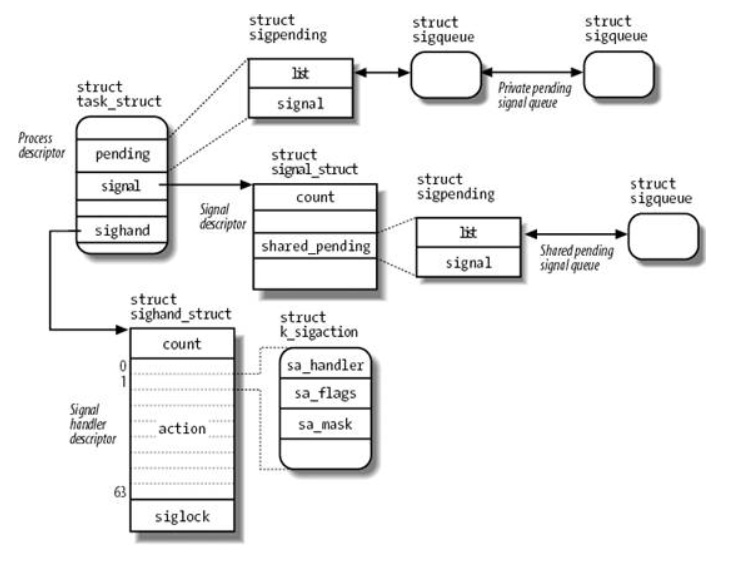
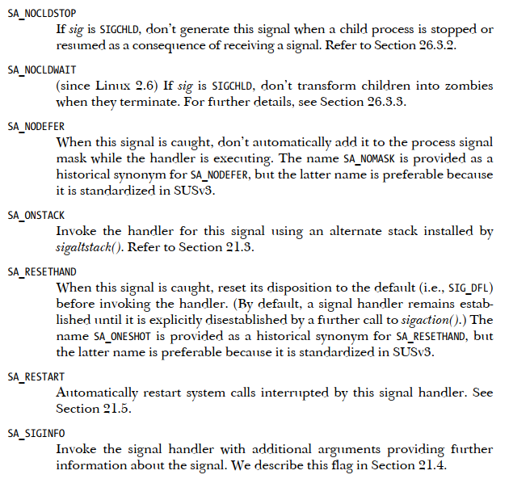

# 信号管理之组织结构介绍

内核版本：linux 4.9

**一、信号**

**1.1 信号是什么**

信号是通知用户进程事件发生的一种机制，在某种意义上可以认为是用户进程的software interrupts，其本质上是在模拟硬件“中断”，用户进程可以注册“中断”处理函数，以实现打断正常的执行流。

**1.2 常规信号和实时信号**

Linux 传统的信号 1~31 为常规信号（regular signal），POSIX 还引入了一种新的信号实时信号（real\-time signal）编号为 32~64。

它们的不同在于：**常规信号**同一个编号在 pending 队列中只存在一份，如果有重复的则直接丢弃；**实时信号**的多个相同信号不能丢弃，需要保证每个信号都能送达。

实时信号和标准信号的比较：

- 实时信号和标准信号不一样，他没有明确的含义，而是由使用者自己来决定如何使用。
- 进程可以接受多个同样的实时信号，而标准信号不能，在标准信号没有得到处理的时候，多个标准信号会被合为一个。
- 实时信号使用sigqueue发送的时候，可以携带附加的数据\(int或者pointer\)
- 实时信号有时间顺序的概念，所以同样的实时信号会按次序被处理。
- 实时信号具有优先的概念，数值越低的信号其优先级越高，在处理的时候，也是数值低的实时信号优先得到处理。
- 实时信号的默认行为都一样，都是结束当前的进程，这个和标准信号是不一样的。

**1.3 常规信号表**

Linux Signals常规信号表\(其中第二列表示信号的数值，不同平台有所差异，其中括号内表示某些平台下非常规的值。Sun SPARC and SPARC64 \(S\),HP/Compaq/Digital Alpha \(A\), MIPS \(M\), and HP PA\-RISC \(P\)


default：表示信号的默认处理策略，大部分信号可以通过注册信号处理函数实现用户态信号处理

**term** _means that�_�_the signal terminates the process_

_**core** means that the process produces a core�_�_dump file and terminates,_

**ignore** _means that the signal is ignored_

_**stop** means�_�_that the signal stops the process_

**cont** _means that the signal resumes a�_�_stopped process._

**二、数据结构**

**2.1 信号值�**�

ARM平台的常规信号值定义

```
#define SIGHUP           1
#define SIGINT           2
#define SIGQUIT          3
#define SIGILL           4
#define SIGTRAP          5
#define SIGABRT          6
#define SIGIOT           6
#define SIGBUS           7
#define SIGFPE           8
#define SIGKILL          9
#define SIGUSR1         10
#define SIGSEGV         11
#define SIGUSR2         12
#define SIGPIPE         13
#define SIGALRM         14
#define SIGTERM         15
#define SIGSTKFLT       16
#define SIGCHLD         17
#define SIGCONT         18
#define SIGSTOP         19
#define SIGTSTP         20
#define SIGTTIN         21
#define SIGTTOU         22
#define SIGURG          23
#define SIGXCPU         24
#define SIGXFSZ         25
#define SIGVTALRM       26
#define SIGPROF         27
#define SIGWINCH        28
#define SIGIO           29
#define SIGPOLL         SIGIO
/*
#define SIGLOST         29
*/
#define SIGPWR          30
#define SIGSYS          31
#define SIGUNUSED       31
/* These should not be considered constants from userland.  */
#define SIGRTMIN        32
#define SIGRTMAX        _NSIG
#define SIGSWI          32
#define _NSIG           64  //包括实时信号占用32bit
```

**2.2 信号数据结构**

```
struct task_struct {
        ...
        struct signal_struct *signal;    //看起来像是管理杂项信号相关的资源
        struct sighand_struct *sighand;  //sighand用于管理用户态注册的信号处理函数
        sigset_t blocked, real_blocked;  //sigset_t是一个64bit长的mask，在blocked中相应bit置上则表示阻塞该信号，即不处理
        sigset_t saved_sigmask; /* restored if set_restore_sigmask() was used */
        struct sigpending pending;  //线程私有的待处理信号
};

typedef struct {
        unsigned long sig[_NSIG_WORDS];
} sigset_t;
```

signal\_struct没有私有的锁，共享sighand\_struct\-\>siglock锁

```
struct signal_struct {
        atomic_t                sigcnt;
        int                     nr_threads;
        struct list_head        thread_head;
        /* shared signal handling: */
        struct sigpending       shared_pending;  //线程组共享的待处理信号
        struct rlimit rlim[RLIM_NLIMITS];
        ...
};

struct sigpending {
        struct list_head list; //list用于串联起sigqueue，表示待处理信号队列
        sigset_t signal;
};
//sigqueue表示一个pending队列中的待处理信号
struct sigqueue {
        struct list_head list;
        int flags;
        siginfo_t info;
        struct user_struct *user;
};

struct sighand_struct {
        atomic_t                count;
        struct k_sigaction      action[_NSIG];  //64个用户态注册的信号处理函数，action->sa->sa_handler指向用户态空间地址
        spinlock_t              siglock;
        wait_queue_head_t       signalfd_wqh;
};
struct sigaction {
        __sighandler_t  sa_handler;
        unsigned long   sa_flags;
        sigset_t        sa_mask;        /* mask last for extensibility */
};
struct k_sigaction {
        struct sigaction sa;
};
typedef void __signalfn_t(int);
typedef __signalfn_t __user *__sighandler_t;
```

以上信号数据结构框图：

%\!\(EXTRA markdown.ResourceType=, string=, string=\)

下图是2.6内核中信号数据结构框架，新的内核与之有所差异，仅供看看：



**三、信号发送与接收**

**3.1 信号发送**

信号的发送的函数调用路径如下，其中核心函数是send\_signal\(\)

kill\(\) \-\> kill\_something\_info\(\) \-\> kill\_pid\_info\(\) \-\> group\_send\_sig\_info\(\) \-\> do\_send\_sig\_info\(\) \-\> send\_signal\(\) \-\> \_\_send\_signal\(\)

tkill\(\) \-\> do\_tkill\(\) \-\> do\_send\_specific\(\) \-\> send\_signal\(\)

tgkill\(\) \-\> do\_tkill\(\) \-\> do\_send\_specific\(\) \-\> send\_signal\(\)

```
static int __send_signal(int sig, struct siginfo *info, struct task_struct *t,
                        int group, int from_ancestor_ns)
{
        struct sigpending *pending;
        struct sigqueue *q;
        int override_rlimit;
        int ret = 0, result;

        assert_spin_locked(&t->sighand->siglock);
        result = TRACE_SIGNAL_IGNORED;
        //prepare_signal对SIG_KERNEL_STOP_MASK和SIGCONT等信号进行预处理
        if (!prepare_signal(sig, t,
                        from_ancestor_ns || (info == SEND_SIG_FORCED))) 
                goto ret;

        pending = group ? &t->signal->shared_pending : &t->pending; //group决定了是共享线程组信号还是私有信号
        if (legacy_queue(pending, sig))  //如果是标准信号，且该信号已经被挂起，则不继续发送该信号
                goto ret;

        if (sig < SIGRTMIN)
                override_rlimit = (is_si_special(info) || info->si_code >= 0);
        else
                override_rlimit = 0;

        q = __sigqueue_alloc(sig, t, GFP_ATOMIC | __GFP_NOTRACK_FALSE_POSITIVE,
                override_rlimit);  //分配一个sigqueue
        if (q) {
                list_add_tail(&q->list, &pending->list); //将信号的sigqueue挂到对应的pending链表
                switch ((unsigned long) info) {
                case (unsigned long) SEND_SIG_NOINFO:
                        q->info.si_signo = sig;
                        q->info.si_errno = 0;
                        q->info.si_code = SI_USER;
                        q->info.si_pid = task_tgid_nr_ns(current,
                                                        task_active_pid_ns(t));
                        q->info.si_uid = from_kuid_munged(current_user_ns(), current_uid());
                        break;
                case (unsigned long) SEND_SIG_PRIV:
                        q->info.si_signo = sig;
                        q->info.si_errno = 0;
                        q->info.si_code = SI_KERNEL;
                        q->info.si_pid = 0;
                        q->info.si_uid = 0;
                        break;
                default:
                        copy_siginfo(&q->info, info);
                        if (from_ancestor_ns)
                                q->info.si_pid = 0;
                        break;
                }

                userns_fixup_signal_uid(&q->info, t);

        } else if (!is_si_special(info)) {
                if (sig >= SIGRTMIN && info->si_code != SI_USER) {
                        /*
                         * Queue overflow, abort.  We may abort if the
                         * signal was rt and sent by user using something
                         * other than kill().
                         */
                        result = TRACE_SIGNAL_OVERFLOW_FAIL;
                        ret = -EAGAIN;
                        goto ret;
                } else {
                        /*
                         * This is a silent loss of information.  We still
                         * send the signal, but the *info bits are lost.
                         */
                        result = TRACE_SIGNAL_LOSE_INFO;
                }
        }
out_set:
        signalfd_notify(t, sig);
        sigaddset(&pending->signal, sig);  //再pending中标记sig信号，表示信号送达
        complete_signal(sig, t, group);  //根据策略规则对接收信号进程进行signal_wake_up唤醒
ret:
        trace_signal_generate(sig, info, t, group, result);
        return ret;
}
```

**3.2 信号接收进程的唤醒**

那么对于阻塞状态的进程又怎么样来响应信号呢？

让一个进程进入阻塞状态，我们可以选择让其进入可中断（TASK\_INTERRUPTIBLE）或者不可中断（TASK\_UNINTERRUPTIBLE）状态，比如 mutex 操作分为 mutex\_lock\(\) 和 mutex\_lock\_interruptible\(\)。所谓的可中断和不可中断就是说是否可以被中断信号打断：如果进程处于可中断（TASK\_INTERRUPTIBLE）状态，信号发送函数会直接唤醒进程，让进程处理完内核态操作去返回用户态，让进程迅速去执行信号处理函数；如果进程处于不可中断（TASK\_UNINTERRUPTIBLE）状态俗称为 D 进程，信号只会挂到信号队列，但是没有机会去立即执行。在上一节中complete\_signal\(\)会做唤醒动作。

```
void signal_wake_up_state(struct task_struct *t, unsigned int state)
{
        set_tsk_thread_flag(t, TIF_SIGPENDING);
        /*
         * TASK_WAKEKILL also means wake it up in the stopped/traced/killable
         * case. We don't check t->state here because there is a race with it
         * executing another processor and just now entering stopped state.
         * By using wake_up_state, we ensure the process will wake up and
         * handle its death signal.
         */
        //在发送完信号后，会唤醒状态为TASK_INTERRUPTIBLE的进程
        if (!wake_up_state(t, state | TASK_INTERRUPTIBLE))
                kick_process(t);
}
```

**3.3 默认信号处理**

需要在用户态处理的用户注册信号处理函数的，可参考另一篇信号相关文档

需要在内核态处理的信号，ret\_to\_user\-\>do\_work\_pending\(\)\-\>do\_signal\(\)\-\>get\_signal\(\)

```
int get_signal(struct ksignal *ksig)
{
        struct sighand_struct *sighand = current->sighand;
        struct signal_struct *signal = current->signal;
        int signr;
        for (;;) {
                struct k_sigaction *ka;
                if (unlikely(current->jobctl & JOBCTL_STOP_PENDING) &&
                    do_signal_stop(0))
                        goto relock;
                if (unlikely(current->jobctl & JOBCTL_TRAP_MASK)) {
                        do_jobctl_trap();
                        spin_unlock_irq(&sighand->siglock);
                        goto relock;
                }

                //取出一个未阻塞的信号
                signr = dequeue_signal(current, &current->blocked, &ksig->info);
                if (!signr)
                        break; /* will return 0 */ //如果没有未阻塞的信号直接跳出，结束get_signal中的信号处理

                if (unlikely(current->ptrace) && signr != SIGKILL) {
                        signr = ptrace_signal(signr, &ksig->info);
                        if (!signr)
                                continue;
                }

                ka = &sighand->action[signr-1];  //取出signr对应的信号处理函数数据结构

                /* Trace actually delivered signals. */
                trace_signal_deliver(signr, &ksig->info, ka);

                //如果信号处理函数标记为SIG_IGN，则表示忽略处理该信号，继续其他挂起信号处理
                if (ka->sa.sa_handler == SIG_IGN) /* Do nothing.  */ 
                        continue;
                //如果信号处理函数标记为非SIG_DFL，则表示该信号为用户注册用户态处理函数信号，跳出把信号压入构造栈
                if (ka->sa.sa_handler != SIG_DFL) {
                        /* Run the handler.  */
                        ksig->ka = *ka;
                        //SA_ONESHOT表示用户安装信号只使用一次，此处将其恢复SIG_DFL
                        if (ka->sa.sa_flags & SA_ONESHOT)
                                ka->sa.sa_handler = SIG_DFL;  
                        break; /* will return non-zero "signr" value */
                }

                //下面剩下的都是SIG_DFL类型的信号，默认处理，部分默认处理方式是忽略
                if (sig_kernel_ignore(signr)) /* Default is nothing. */
                        continue;

                if (unlikely(signal->flags & SIGNAL_UNKILLABLE) &&
                                !sig_kernel_only(signr))
                        continue;

                //默认处理方式为stop的信号处理
                if (sig_kernel_stop(signr)) {
                        if (signr != SIGSTOP) {
                                spin_unlock_irq(&sighand->siglock);

                                if (is_current_pgrp_orphaned())
                                        goto relock;
                                spin_lock_irq(&sighand->siglock);
                        }

                        if (likely(do_signal_stop(ksig->info.si_signo))) {
                                /* It released the siglock.  */
                                goto relock;
                        }
                        continue;
                }
                spin_unlock_irq(&sighand->siglock);
                current->flags |= PF_SIGNALED;

                //默认处理为生成coredump的处理
                if (sig_kernel_coredump(signr)) {
                        if (print_fatal_signals)
                                print_fatal_signal(ksig->info.si_signo);
                        proc_coredump_connector(current);
                        do_coredump(&ksig->info);
                }

                do_group_exit(ksig->info.si_signo);
        }
        spin_unlock_irq(&sighand->siglock);

        ksig->sig = signr;
        return ksig->sig > 0;                    
}
```

**四、信号系统调用**

```
kill( )           Send a signal to a thread group
tkill( )          Send a signal to a process
tgkill( )         Send a signal to a process in a specific thread group
sigaction( )      Change the action associated with a signal
signal( )         Similar to sigaction( )
sigpending( )     Check whether there are pending signals
sigprocmask( )     Modify the set of blocked signals
sigsuspend( )      Wait for a signal
rt_sigaction( )    Change the action associated with a real-time signal
rt_sigpending( )  Check whether there are pending real-time signals
rt_sigprocmask( ) Modify the set of blocked real-time signals
rt_sigqueueinfo( ) Send a real-time signal to a thread group
rt_sigsuspend( )   Wait for a real-time signal
rt_sigtimedwait( ) Similar to rt_sigsuspend( )
```

1、**kill\( \)** \-_Send a signal to a thread group_

```
int kill(pid_t pid, int sig);
```

2、**tkill\( \)**  Send a signal to a process

```
int tkill(int tid, int sig);
```

3、**tgkill\( \)** Send a signal to a process in a specific thread group

```
int tgkill(int tgid, int tid, int sig);
```

4、**sigaction\( \)  �**�Change the action associated with a signal

```
int sigaction(int signum, const struct sigaction *act, struct sigaction *oldact);

           struct sigaction {
               void     (*sa_handler)(int);
               void     (*sa_sigaction)(int, siginfo_t *, void *);
               sigset_t   sa_mask;
               int        sa_flags;
               void     (*sa_restorer)(void);
           };
```



5、signal\( \) Similar to sigaction\( \)

```
typedef void (*sighandler_t)(int);
sighandler_t signal(int signum, sighandler_t handler);
```

6、sigpending\( \) Check whether there are pending signals

```
int sigpending(sigset_t *set);
```

7、sigprocmask\( \)  Modify the set of blocked signals

```
int sigprocmask(int how, const sigset_t *set, sigset_t *oldset);
```

8、sigsuspend\( \) Wait for a signal

```
int sigsuspend(const sigset_t *mask);
```

下面这些跟标准信号的函数原型是一样的

9、rt\_sigaction\( \)  Change the action associated with a real\-time signal

10、rt\_sigpending\( \) Check whether there are pending real\-time signals

11、rt\_sigprocmask\( \) Modify the set of blocked real\-time signals

12、rt\_sigqueueinfo\( \) Send a real\-time signal to a thread group

13、rt\_sigsuspend\( \)  Wait for a real\-time signal

14、rt\_sigtimedwait\( \) Similar to rt\_sigsuspend\( \)

**五、信号查看**

线程的信号信息

```
SigQ:   0/15421
SigPnd: 0000000000000000
ShdPnd: 0000000000000000
SigBlk: 0000000000010000
SigIgn: 0000000000380004
SigCgt: 000000004b817efb
```

SigQ：\_\_task\_cred\(p\)\-\>user\-\>sigpending

SigPnd：表示每线程的pending挂起信号  task\_struct\-\>pending.signal

ShdPnd：表示线程组内共享的pending挂起信号  task\_struct\-\>signal\-\>shared\_pending.signal

SigBlk：表示该线程阻塞的信号  task\_struct\-\>blocked

SigIgn：表示该线程忽略的信号。即处理函数为忽略处理函数SIG\_IGN，通过collect\_sigign\_sigcatch\(\)函数获得

SigCgt：表示会被捕获的信号。即信号处理函数为非默认处理函数SIG\_DFL 通过collect\_sigign\_sigcatch函数获得

**六、参考资料**

1、[https://kernel.meizu.com/linux\-signal.html](https://kernel.meizu.com/linux-signal.html)
