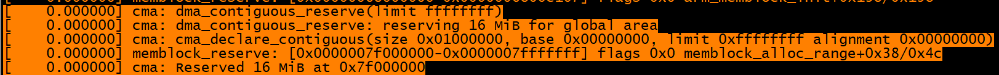
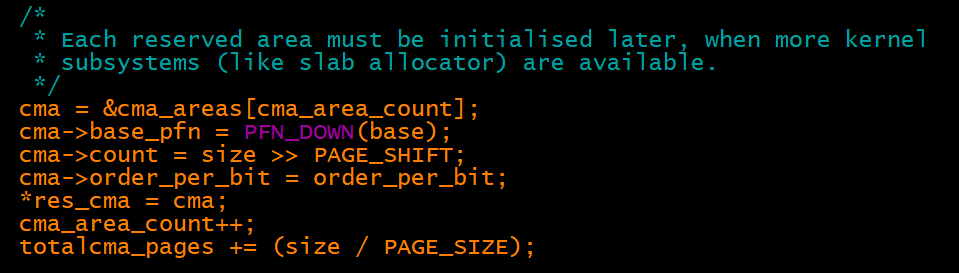
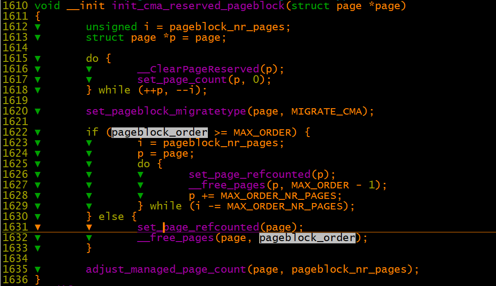
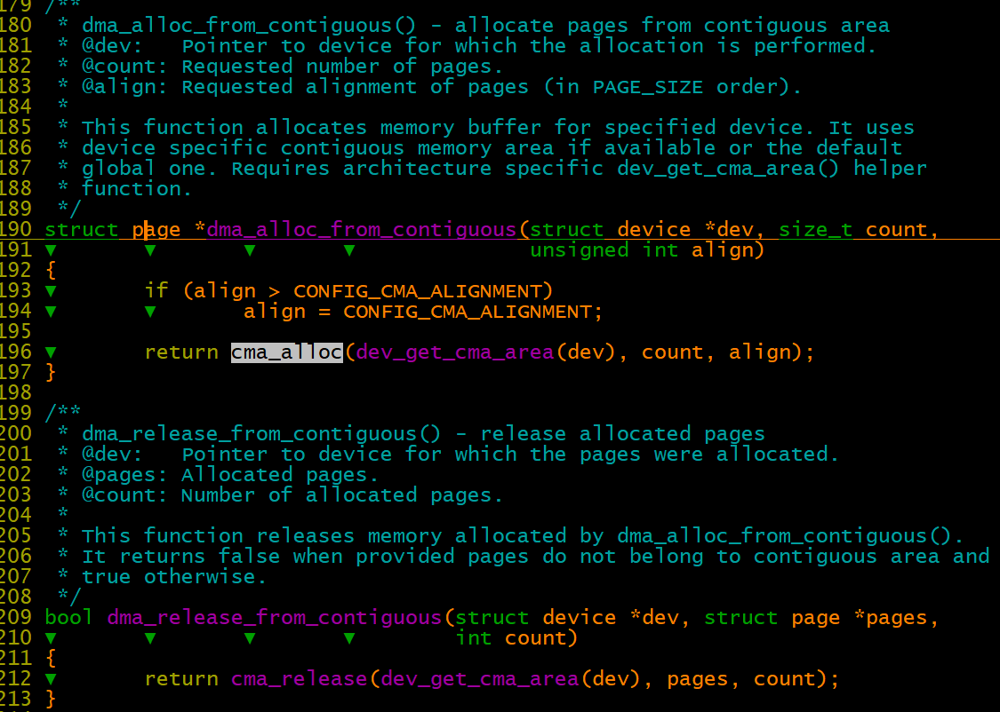
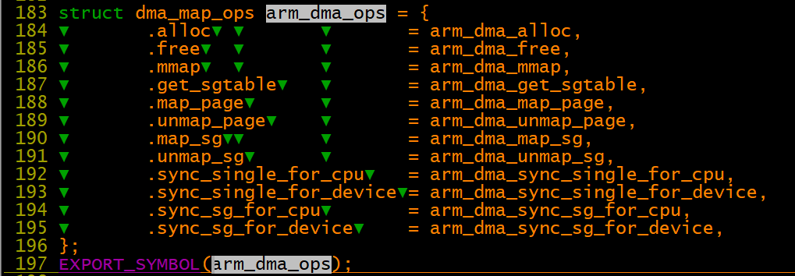
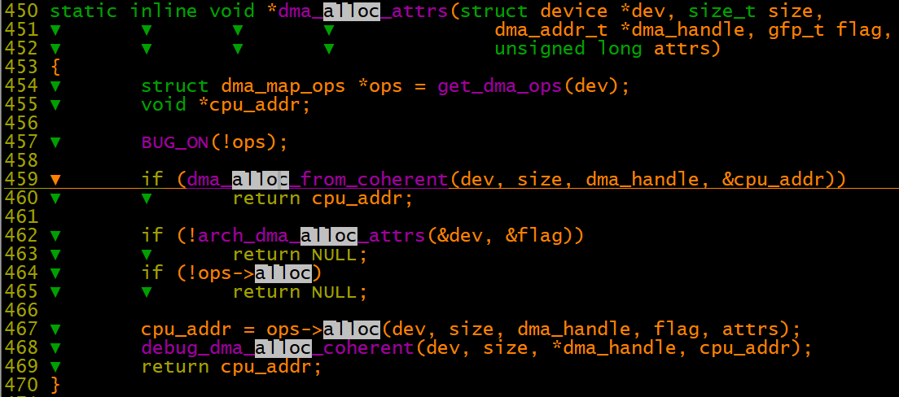
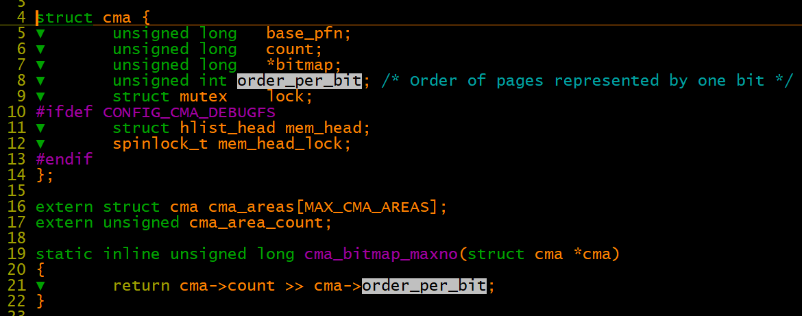

# 内存管�之CMA

**一�什么是CMA**

CMA，Contiguous Memory Allocator，是内存管��系统中的一个模�，负责物�地��续的内存分�。一般系统会在�动过程中，�整个memory中�置一段�续内存用�CMA，然�内核其他的模��以通过CMA的��API进行�续内存的分�。CMA的核心并�是设计精巧的算法�管�地��续的内存�，�际上它的底层还是�赖内核伙伴系统这样的内存管�机制，或者说CMA是处�需��续内存�的其他内核模�（例如DMA mapping framework）和内存管�模�之间的一个中间层模�，主�功能包括：

1�解�DTS或者命令行中的�数，确定CMA内存的区域，这样的区域我们定义为CMA area。

2��供cma\_alloc和cma\_release两个��函数用�分�和释放CMA pages

3�记录和跟踪CMA area中�个pages的状�

4�调用伙伴系统��，进行真正的内存分�。

 

**二�内核中为何建立CMA模�？**

Linux内核中已��供了��内存分�的��，为何还有建立CMA这��续内存分�的机制呢？

我们先�看看内核哪些模�有物�地��续的需求。huge page模�需�物�地��续是显而易�的。大家都熟悉的处�器（��太��），例如ARM64，其内存管��元都�以支�多个页�大�（4k�64K�2M或者更大的page size），但在大多数CPU��上，Linux内核总是倾�使用最�的page size，�4K page size。Page size大�4K的page统称为“huge page�。对�一个2M的huge page，MMU会把一个�续的2M的虚拟地�mapping到�续的�2M的物�地�上�，当然，这2M size的物�地�段必须是由512个地��续的4k page frame组�。

当然，更多的�续内存的分�需求�自形形色色的驱动。例如�在大家的手机都有视频功能，camer功能，这类驱动都需��常大�的内存，而且有DMA用�进行外设和大�内存之间的数�交�。对�嵌入�设备，一般�会有IOMMU，而且DMA也�具备scatter\-getter功能，这时候，驱动分�的大�内存（DMA buffer）必须是物�地��续的。

顺便说一�，huge page的�续内存需求和驱动DMA buffer还是有��的，例如在对��求上，一个2M的huge page，其底层的2M 的物�页�的首地�需�对�在2M上，一般而言，DMA buffer�会有这么高的对��求。因此，我们这里讲的CMA主�是为设备驱动准备的，huge page相关的内容�在本文中�述。

我们�一个�际的例��：我的手机，�素是1300W的，一个�素需�3B，那么�摄一幅图片需�的内存大概是1300W x 3B � 26MB。通过内存管�系统分�26M的内存，�力�是��。当然，在系统�动之处，伙伴系统中的大�内存比较大，也许分�26M�算什么，但是��系统的�行，内存�断的分��释放，大�内存�断的裂解，�裂解，这时候，内存�片化导致分�地��续的大�内存�得�是那么的容易了，�么�？作为驱动工程师，我们有两个选择：其一是在�动时分�用�视频采集的DMA buffer，�外一个方案是当�际使用camer设备的时候分�DMA buffer。�者的选择是��的，但它有一个缺点，�当照相机�使用时（大多数时间内camera其�都是空闲的），预留的那些DMA BUFFER的内存�际上是浪费了（特别在内存�置�大的系统上更是如此）。�一�选择�会浪费内存，但是���，��内存�片化，大的��续的内存分��得越�越困难，一旦内存分�失败，camera功能就会缺失，估计用户�会答应。

这就是驱动工程师�临的困境，为了解决这个问题，�个驱动�出奇招，但是都�能�常完�的解决问题。最终�自Michal Nazarewicz的CMA补�将�以把�个驱动工程师的烦�“一洗了之�。对�CMA 内存，当�驱动没有分�使用的时候，这些memory�以内核的被其他的模�使用（当然有一定的�求），而当驱动分�CMA内存�，那些被其他模�使用的内存需��出�，形�物�地��续的大�内存，给具体的驱动�使用。

 

**三�CMA模�的�图是�样的？**

 [](http://www.wowotech.net/content/uploadfile/201706/06d4c31f4030a8e984474d34258f4eab20170628102931.gif)

了解一个模�，先��深入细节，我们先远远的看看CMA在整个系统中的�置。虽然用�解决驱动的内存分�问题，但是驱动并�会直�调用CMA模�的��，而是通过DMA mapping framework�间�使用CMA的�务。一开始，CMA area的概念是全局的，通过内核�置�数和命令行�数，内核�以定�到Global CMA area在内存中的起始地�和大�（注：这里的Global的��是针对所有的driver而言的）。并在�始化的时候，调用dma\_contiguous\_reserve函数，将指定的memory region�留给Global CMA area使用。人性是贪婪的，驱动亦然，很快，有些驱动想�独食，�愿�和其他驱动共享CMA，因此出�两�CMA area：Global CMA area给大家共享，而per device CMA�以给指定的一个或者几个驱动使用。这时候，命令行�数�是那么�适了，因此引入了device tree中的reserved memory node的概念。当然，为了兼容，内核�然支�CMA的command line�数。

 

**四�CMA模�如何管�和�置CMA area？**

在CMA模�中，struct cma数�结�用�抽象一个CMA area，具体定义如下：

> struct cma {
> 
> unsigned long   base\_pfn;
> 
> unsigned long   count;  //page数�
> 
> unsigned long   \*bitmap;
> 
> unsigned int order\_per\_bit; /\* Order of pages represented by one bit \*/
> 
> struct mutex    lock;
> 
> };

cma模�使用bitmap�管�其内存的分�，0表示free，1表示已�分�。具体内存管�的��和struct cma中的order\_per\_bit�员相关，如�order\_per\_bit等�0，表示按照一个一个page�分�和释放，如�order\_per\_bit等�1，表示按照2个page组�的block�分�和释放，以此类�。struct cma中的bitmap�员就是管�该cma area内存的bit map。count�员说�了该cma area内存有多少个page。它和order\_per\_bit一起决定了bitmap指针指�内存的大�。base\_pfn定义了该CMA area的起始page frame number，base\_pfn和count一起定义了该CMA area在内存在的�置。

我们��说过了，CMA模�需�管�若干个CMA area，有gloal的，有per device的，代�如下：

> struct cma cma\_areas\[MAX\_CMA\_AREAS\];

�一个struct cma抽象了一个CMA area，标识了一个物�地��续的memory area。调用cma\_alloc分�的�续内存就是�CMA area中�得的。具体有多少个CMA area是编译时决定了，而具体��置多少个CMA area是和系统设计相关，你�以为特定的驱动准备一个CMA area，也�以�建立一个通用的CMA area，供多个驱动使用（本文�点�述这个共用的CMA area）。

房�建好了，但是还空�，�想金屋�娇，还需�一个CMA�置过程。�置CMA内存区有两�方法，一�是通过dts的reserved memory，�外一�是通过command line�数和内核�置�数。

device tree中�以包�reserved\-memory node，在该节点的child node中，�以定义���留内存的信�。compatible�性是shared\-dma\-pool的那个节点是专门用�建立 global CMA area的，而其他的child node都是for per device CMA area的。

Global CMA area的�始化�以�考定义如下：

> RESERVEDMEM\_OF\_DECLARE\(cma, "shared\-dma\-pool", rmem\_cma\_setup\);

具体的setup过程倒是比较简�，�device tree中�以��该memory range的起始地�和大�，调用cma\_init\_reserved\_mem函数��以注册一个CMA area。需�补充说�的是：CMA对应的reserved memory节点必须有reusable�性，�能有no\-map的�性。具体reusable�性的reserved memory有这样的特性，�在驱动�使用这些内存的时候，OS�以使用这些内存（当然有�制�件），而当驱动�这个CMA area分�memory的时候，OS�以reclaim这些内存，让驱动�以使用它。no\-map�性和地�映射相关，如�没有no\-map�性，那么OS会为这段memory创建地�映射，象其他普通内存一样。但是有no\-map�性的往往是专用��个设备驱动，在驱动中会进行io remap，如�OS已�对这段地�进行了mapping，而驱动�一次mapping，这样就有��的虚拟地�mapping到�一个物�地�上�，在�些ARCH上（ARMv6之�的cpu），会造���预知的��。而CMA这个场景，reserved memory必须�mapping好，这样�能用�其他内存分�场景，例如page cache。

per device CMA area的注册过程和�自具体的驱动相关，但是最终会dma\_declare\_contiguous这个��函数，为一个指定的设备而注册CMA area，这里就�详述了。

通过命令行�数也�以建立cma area。我们�以通过cma=nn\[MG\]@\[start\[MG\]\[\-end\[MG\]\]\]这样命令行�数�指�Global CMA area在整个物�内存中的�置。在�始化过程中，内核会解�这些命令行�数，��CMA area的�置（起始地�，大�），并调用cma\_declare\_contiguous��函数�CMA模�进行注册（当然，和device tree传�类似，最终也是调用cma\_init\_reserved\_mem��函数）。除了命令行�数，通过内核�置（CMA\_SIZE\_MBYTES和CMA\_SIZE\_PERCENTAGE）也�以确定CMA area的�数。

 

**五�memblock�CMA和伙伴系统的�始化顺�是�样的？**

套用一�广告�：CMA并�进行内存管�，它�是�内存管�机制“的��工。也就是说，CMA area的内存最终还是�并入伙伴系统进行管�。在这样大方�的指导下，CMA模�的�始化必须�在适当的时机，以适当的方��入到内存管�（包括memblock和伙伴系统）�始化过程中。

内存管��系统进行�始化的时候，首先是memblock��全局的，这时候需�确定整个系统的的内存布局，简�说就是了解整个memory的分布情况，哪些是memory block是memory type，哪些memory block是reserved type。毫无疑问，CMA area对应的当然是reserved type。最先进行的是memory type的内存�的建立，�以�考如下代�：

> setup\_arch\-\-\-\>setup\_machine\_fdt\-\-\-\>early\_init\_dt\_scan\-\-\-\>early\_init\_dt\_scan\_nodes\-\-\-\>memblock\_add

��会建立reserved type的memory block，�以�考如下代�：

> setup\_arch\-\-\-\>arm64\_memblock\_init\-\-\-\>early\_init\_fdt\_scan\_reserved\_mem\-\-\-\>\_\_fdt\_scan\_reserved\_mem\-\-\-\>memblock\_reserve

完�上�的�始化之�，memblock模�已�通过device tree�建了整个系统的内存全貌：哪些是普通内存区域，哪些是�留内存区域。对�那些reserved memory，我们还需�进行�始化，代�如下：

> setup\_arch\-\-\-\>arm64\_memblock\_init\-\-\-\>early\_init\_fdt\_scan\_reserved\_mem\-\-\-\>fdt\_init\_reserved\_mem\-\-\-\>\_\_reserved\_mem\_init\_node

上�的代�会scan内核中的一个特定的section（还记得��RESERVEDMEM\_OF\_DECLARE的定义�？），如�匹�就会调用相应的�始化函数，而对�Global CMA area而言，这个�始化函数就是rmem\_cma\_setup。当然，如�有需�，具体的驱动也�以定义自己的CMA area，�始化的�路都是一样的。

至此，通过device tree，所有的内核模���留的内存都已��清楚了（�仅仅是CMA�留内存），是时候通过命令行�数�留CMA内存了，具体的调用如下：

> setup\_arch\-\-\-\>arm64\_memblock\_init\-\-\-\>dma\_contiguous\_reserve

�际上，在�建CMA area上，device tree的功能已�完全碾�命令行�数，因此dma\_contiguous\_reserve有�能没有�际的作用。如�没有通过命令行或者内核�置文件�定义Global CMA area，那么这个函数调用当然�会起什么作用，如�device tree已�设定了Global CMA area，那么其�dma\_contiguous\_reserve也�会真正reserve memory（device tree优先级高�命令行）。

如�有�置命令行�数，而且device tree并没有设定Global CMA area，那么dma\_contiguous\_reserve�会真正有作用。那么根��置�数�以有两�场景：一�是CMA area是固定�置的，��数给出了确定的起始地�和大�，这�情况比较简�，直�调用memblock\_reserve就OK了，�外一�情况是动�分�的，这时候，需�调用memblock的内存分���memblock\_alloc\_range�为CMA area分�内存。

memblock始终是�始化阶段的内存管�模�，最终我们还是�转�伙伴系统，具体的代�如下：

> start\_kernel\-\-\-\>mm\_init\-\-\-\>mem\_init\-\-\-\>free\_all\_bootmem\-\-\-\>free\_low\_memory\_core\_early\-\-\-\>\_\_free\_memory\_core

在上�的过程中，free memory被释放到伙伴系统中，而reserved memory�会进入伙伴系统，对�CMA area，我们之�说过，最终被由伙伴系统管�，因此，在�始化的过程中，CMA area的内存会全部导入伙伴系统（方便其他应用�以通过伙伴系统分�内存）。具体代�如下：

> core\_initcall\(cma\_init\_reserved\_areas\);

至此，所有的CMA area的内存进入伙伴系统。

 

**六�CMA是如何工作的？**

1�准备知识

如�想�了解CMA是如何�作的，你�能需�知�一点点关�migrate types和pageblocks的知识。当�伙伴系统请求内存的时候，我们需��供了一个gfp\_mask的�数。它有很多的功能，�过在CMA这个场景，它用�指定请求页�的�移类�（migrate type）。migrate type有很多中，其中有一个是MIGRATE\_MOVABLE类�，被标记为MIGRATE\_MOVABLE的page说�该页�上的数�是�以�移的。也就是说，如�需�，我们�以分�一个新的page，copy数�到这个new page上�，释放这个page。而完�这样的�作对系统没有任何的影�。我们�举一个简�的例�：对�内核中的data section，其对应的page�是是movable的，因为一旦移动数�，那么内核模�就无法访问那些页�上的全局��了。而对�page cache这样的页�，其�是�以�移的，��让指针指�新的page就OK了。

伙伴系统�会跟踪�一个page frame的�移类�，�际上它是按照pageblock为��进行管�的，memory zone中会有一个bitmap，指�该zone中�一个pageblock的migrate type。在处�内存分�请求的时候，一般会首先�和请求相�migrate type（gfp\_mask）的pageblocks中分�页�。如�分���功，��migrate type的pageblocks中也会考虑，甚至�能改�pageblock的migrate type。这�味�一个non\-movable页�请求也�以�migrate type是movable的pageblock中分�。这一点CMA是�能��的，所以我们引入了一个新的migrate type：MIGRATE\_CMA。这��移类�具有一个��性质：�有�移动的页��以�MIGRATE\_CMA的pageblock中分�。

2��始化CMA area

> static int \_\_init cma\_activate\_area\(struct cma \*cma\)
> 
> {
> 
> int bitmap\_size = BITS\_TO\_LONGS\(cma\_bitmap\_maxno\(cma\)\) \* sizeof\(long\);
> 
> unsigned long base\_pfn = cma\-\>base\_pfn, pfn = base\_pfn;
> 
> unsigned i = cma\-\>count \>\> pageblock\_order;
> 
> struct zone \*zone; �����������������������������（1）
> 
> cma\-\>bitmap = kzalloc\(bitmap\_size, GFP\_KERNEL\); ����分�内存
> 
> zone = page\_zone\(pfn\_to\_page\(pfn\)\); ���找到page对应的memory zone
> 
> do {��������������������������（2）
> 
> unsigned j;
> 
> base\_pfn = pfn;
> 
> for \(j = pageblock\_nr\_pages; j; \-\-j, pfn\+\+\) {�������������（3）
> 
> if \(page\_zone\(pfn\_to\_page\(pfn\)\) \!= zone\)
> 
> goto err;
> 
> }
> 
> init\_cma\_reserved\_pageblock\(pfn\_to\_page\(base\_pfn\)\);����������（4）
> 
> } while \(\-\-i\);
> 
> mutex\_init\(&cma\-\>lock\);
> 
> return 0;
> 
> err:
> 
> kfree\(cma\-\>bitmap\);
> 
> cma\-\>count = 0;
> 
> return \-EINVAL;
> 
> }

（1）CMA area有一个bitmap�管��个page的状�，这里bitmap\_size给出了bitmap需�多少的内存。i��表示该CMA area有多少个pageblock。

（2）��该CMA area中的所有的pageblock。

（3）确�CMA area中的所有page都是在一个memory zone内，�时累加了pfn，�而得到下一个pageblock的�始page frame number。

（4）将该pageblock导入到伙伴系统，并且将migrate type设定为MIGRATE\_CMA。

2�分��续内存

cma\_alloc用��指定的CMA area上分�count个�续的page frame，按照align对�。具体的代�就��分�了，比较简�，�际上就是�bitmap上�索free page的过程，一旦�索到，就调用alloc\_contig\_range�伙伴系统申请内存。需�注�的是，CMA内存分�过程是一个比较“��的�作，�能涉�页��移�页��收等�作，因此�适�用�atomic context。

3�释放�续内存

分��续内存的逆过程，除了bitmap的�作之外，最��的就是调用free\_contig\_range，将指定的pages返�伙伴系统。

**七�CMA内核��分�**

1��留16M 内存，16M是linux内核的一个默认值，具体�留长度还�以调整。并�始化cma数�结�

dma\_contiguous\_reserve\-\>dma\_contiguous\_reserve\_area\-\>dma\_contiguous\_reserve\_area\-》cma\_declare\_contiguous\-》memblock\_alloc\_range/cma\_init\_reserved\_mem

****

**cma\_init\_reserved\_mem: Â** **This function creates custom contiguous area from already reserved memory åˆ�始化cma结æ�„体**

****

**2�****cma\_init\_reserved\_areas\-》****cma\_activate\_area\-\>****init\_cma\_reserved\_pageblock**

pageblock\_order: 内核认为够大的一个分�的阶。

pageblock\_nr\_pages: 内核认为�用该特性时�个�移链表需�具有的最少的内存页数。它的定义是基�pageblock\_order的。（1\<\<10）个page组�一个pageblock

```
#define pageblock_order▼▼       (MAX_ORDER-1)
#define MAX_ORDER 11
#define pageblock_nr_pages▼     (1UL << pageblock_order)
```

init\_cma\_reserved\_pageblock：Free whole pageblock and set its migration type to MIGRATE\_CMA.

将该pageblock导入到伙伴系统，并且将migrate type设定为MIGRATE\_CMA 。详细的�作没太看懂。



3�分�和释放cma内存，其最终还需�通过伙伴系统的��进行处�，在page\_alloc.c中。DMA模�中则�装分�和释放��，以�供内存给DMA使用。

cma\_alloc\-》 alloc\_contig\_range\(pfn, pfn \+ count, MIGRATE\_CMA\)  �cma�续内存中分�内存

cma\_release\-》free\_contig\_range\(pfn, count\);







调用cma内存分�和释放的�头代�为：dma\_alloc\_coherent/dma\_free\_coherent

该��

4�数�结�

****

通过buddy分页时，何时使用cma内存？

%\!\(EXTRA markdown.ResourceType=, string=, string=\)

1�首先扫�指定migratetype的列表，返�相应的page

2�如��1中未找到，且migratetype是MIGRATE\_MOVABLE类�，如用户空间映射的物�页，�以进行页�移的内存类�时，�以分�CMA MIGRATE\_CMA类�的物�页

    以此��内存�足时使用CMA 内存。

3�无法满足以上�件�，进行�级页分�
