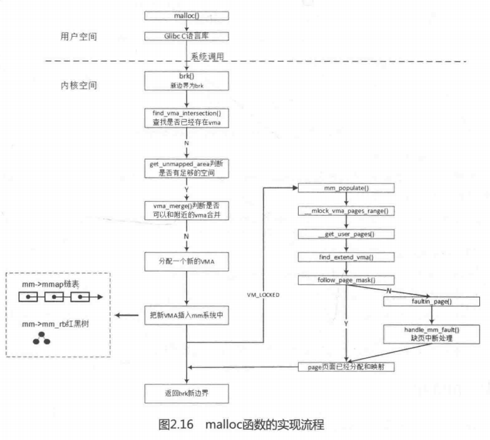
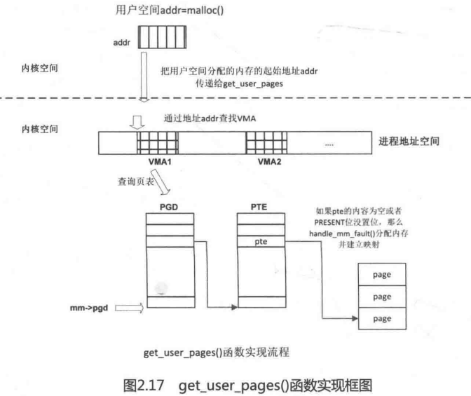

# 内存管理之brk

**一、如何查看进程发生缺页中断的次数？**

       用ps \-o majflt,minflt \-C program命令查看。majflt代表major fault，中文名叫大错误，minflt代表minor fault，中文名叫小错误。

       这两个数值表示一个进程自启动以来所发生的缺页中断的次数。

**二、发成缺页中断后，执行了那些操作？**

当一个进程发生缺页中断的时候，进程会陷入内核态，执行以下操作：

1、检查要访问的虚拟地址是否合法

2、查找/分配一个物理页

3、填充物理页内容（读取磁盘，或者直接置0，或者啥也不干）

4、建立映射关系（虚拟地址到物理地址）

重新执行发生缺页中断的那条指令

如果第3步，需要读取磁盘，那么这次缺页中断就是majflt，否则就是minflt。

**三、内存分配的原理**

从操作系统角度来看，进程分配内存有两种方式，分别由两个系统调用完成：brk和mmap（不考虑共享内存）。

1、brk是将数据段\(.data\)的最高地址指针\_edata往高地址推；

2、mmap是在进程的虚拟地址空间中（堆和栈中间，称为文件映射区域的地方）找一块空闲的虚拟内存。

    这两种方式分配的都是虚拟内存，没有分配物理内存。在第一次访问已分配的虚拟地址空间的时候，发生缺页中断，操作系统负责分配物理内存，然后建立虚拟内存和物理内存之间的映射关系。在标准C库中，提供了malloc/free函数分配释放内存，这两个函数底层是由brk，mmap，munmap这些系统调用实现的。

下面以一个例子来说明内存分配的原理：

情况一、malloc小于128k的内存，使用brk分配内存，将\_edata往高地址推\(只分配虚拟空间，不对应物理内存\(因此没有初始化\)，第一次读/写数据时，引起内核缺页中断，内核才分配对应的物理内存，然后虚拟地址空间建立映射关系\)，如下图：


1、进程启动的时候，其（虚拟）内存空间的初始布局如图\(1\)所示。

      其中，mmap内存映射文件是在堆和栈的中间（例如libc\-2.2.93.so，其它数据文件等），为了简单起见，省略了内存映射文件。

      \_edata指针（glibc里面定义）指向数据段的最高地址。

2、进程调用A=malloc\(30K\)以后，内存空间如图\(2\)：

      malloc函数会调用brk系统调用，将\_edata指针往高地址推30K，就完成虚拟内存分配。

3、进程调用B=malloc\(40K\)以后，内存空间如图\(3\)。

情况二、malloc大于128k的内存，使用mmap分配内存，在堆和栈之间找一块空闲内存分配\(对应独立内存，而且初始化为0\)，如下图：


4、进程调用C=malloc\(200K\)以后，内存空间如图\(4\)：

    默认情况下，malloc函数分配内存，如果请求内存大于128K（可由M\_MMAP\_THRESHOLD选项调节），那就不是去推\_edata指针了，而是利用mmap系统调用，从堆和栈的中间分配一块虚拟内存。这样子做主要是因为:brk分配的内存需要等到高地址内存释放以后才能释放（例如，在B释放之前，A是不可能释放的，这就是内存碎片产生的原因，什么时候紧缩看下面），而mmap分配的内存可以单独释放。

5、进程调用D=malloc\(100K\)以后，内存空间如图\(5\)；

6、进程调用free\(C\)以后，C对应的虚拟内存和物理内存一起释放。


7、进程调用free\(B\)以后，如图7所示：

    B对应的虚拟内存和物理内存都没有释放，因为只有一个\_edata指针，如果往回推，那么D这块内存怎么办呢？

    当然，B这块内存，是可以重用的，如果这个时候再来一个40K的请求，那么malloc很可能就把B这块内存返回回去了。

8、进程调用free\(D\)以后，如图8所示：

     B和D连接起来，变成一块140K的空闲内存。

9、默认情况下：

      当最高地址空间的空闲内存超过128K（可由M\_TRIM\_THRESHOLD选项调节）时，执行内存紧缩操作（trim）。在上一个步骤free的时候，发现最高地址空闲内存超过                128K，于是内存紧缩，变成图9所示。内存紧缩时应该调用brk\(B的低地址\)，可以通知内核将内存释放掉。

**三、用户态代码用例**

```
/* sbrk, brk 例子 */
#include <stdio.h>
#include <unistd.h>
#include <sys/types.h>

int main(){
        void *curr_brk, *tmp_brk = NULL;

        printf("Welcome to sbrk example:%d\n", getpid());

        /* sbrk(0) 获取当前 program break 位置 */
        tmp_brk = curr_brk = sbrk(0);
        printf("Program Break Location1:%p\n", curr_brk);
        getchar();

        /* 使用 brk 增加 program break 位置 */
        brk(curr_brk+4096);

        curr_brk = sbrk(0);
        printf("Program break Location2:%p\n", curr_brk);
        getchar();

        /* 使用 brk 减小 program break 位置 */
        brk(tmp_brk);

        curr_brk = sbrk(0);
        printf("Program Break Location3:%p\n", curr_brk);
        getchar();

        return 0;
}
```

```
进程打印：
Program Break Location1:0x55e224f6c000

Program break Location2:0x55e224f6d000

Program Break Location3:0x55e224f6c000

进程堆变化 cat /proc/xxx/maps：
55e224f4b000-55e224f6c000 rw-p 00000000 00:00 0                          [heap]
    
55e224f4b000-55e224f6d000 rw-p 00000000 00:00 0                          [heap]

55e224f4b000-55e224f6c000 rw-p 00000000 00:00 0                          [heap]
```

**四、内核代码分析**

```
SYSCALL_DEFINE1(brk, unsigned long, brk)
{
        unsigned long retval;
        unsigned long newbrk, oldbrk;
        struct mm_struct *mm = current->mm;
        struct vm_area_struct *next;
        unsigned long min_brk;
        bool populate;

        if (down_write_killable(&mm->mmap_sem))
                return -EINTR;

        min_brk = mm->start_brk;
        if (brk < min_brk)
                goto out;

        if (check_data_rlimit(rlimit(RLIMIT_DATA), brk, mm->start_brk,
                              mm->end_data, mm->start_data))
                goto out;

        newbrk = PAGE_ALIGN(brk);
        oldbrk = PAGE_ALIGN(mm->brk);
        if (oldbrk == newbrk)
                goto set_brk;

        /* Always allow shrinking brk. */
        if (brk <= mm->brk) {
                if (!do_munmap(mm, newbrk, oldbrk-newbrk)) 
       //如果参数brk小于当前进程mm->brk边界，则释放内存
                        goto set_brk;
                goto out;
        }

        /* Check against existing mmap mappings. */
        next = find_vma(mm, oldbrk);
        //以当前进程brk边界寻找vma，通常找到的是heap区域上面的mmap vma区域。
        //如果下一个vma的vmstart距离newbrk不足一个pagesize说明虚拟地址空间不够了要到达mmap区域，返回失败
        if (next && newbrk + PAGE_SIZE > vm_start_gap(next))
                goto out;

        /* Ok, looks good - let it rip. */
        if (do_brk(oldbrk, newbrk-oldbrk) < 0)
                goto out;

set_brk:
        mm->brk = brk;
        populate = newbrk > oldbrk && (mm->def_flags & VM_LOCKED) != 0; 
        //如果是分配内存且有VM_LOCKED标志，则调用mm_populate立即分配内存
        up_write(&mm->mmap_sem);
        if (populate)
                mm_populate(oldbrk, newbrk - oldbrk);
        return brk;

out:
        //out出口是出现分配或释放失败处理流程，返回当前进程brk边界
        retval = mm->brk;
        up_write(&mm->mmap_sem);
        return retval;
}
```

```
static int do_brk(unsigned long addr, unsigned long request)
{
        struct mm_struct *mm = current->mm;
        struct vm_area_struct *vma, *prev;
        unsigned long flags, len;
        struct rb_node **rb_link, *rb_parent;
        pgoff_t pgoff = addr >> PAGE_SHIFT;
        int error;

        len = PAGE_ALIGN(request);
        if (len < request)
                return -ENOMEM;
        if (!len)
                return 0;

        flags = VM_DATA_DEFAULT_FLAGS | VM_ACCOUNT | mm->def_flags;

        error = get_unmapped_area(NULL, addr, len, 0, MAP_FIXED);
        if (offset_in_page(error))
                return error;

        error = mlock_future_check(mm, mm->def_flags, len);
        if (error)
                return error;

        /*
         * mm->mmap_sem is required to protect against another thread
         * changing the mappings in case we sleep.
         */
        verify_mm_writelocked(mm);

        /*
         * Clear old maps.  this also does some error checking for us
         */
        while (find_vma_links(mm, addr, addr + len, &prev, &rb_link,
                              &rb_parent)) {
                if (do_munmap(mm, addr, len))
                        return -ENOMEM;
        }

        /* Check against address space limits *after* clearing old maps... */
        if (!may_expand_vm(mm, flags, len >> PAGE_SHIFT))
                return -ENOMEM;

        if (mm->map_count > sysctl_max_map_count)
                return -ENOMEM;

        if (security_vm_enough_memory_mm(mm, len >> PAGE_SHIFT))
                return -ENOMEM;

        /* Can we just expand an old private anonymous mapping? */
        //通常情况下是调整vma的边界将当前申请/释放的内存进行合并
        vma = vma_merge(mm, prev, addr, addr + len, flags,
                        NULL, NULL, pgoff, NULL, NULL_VM_UFFD_CTX);
        if (vma)
                goto out;

        /*
         * create a vma struct for an anonymous mapping
         */
        //无法合并的话则创建一个新的vma
        vma = kmem_cache_zalloc(vm_area_cachep, GFP_KERNEL);
        if (!vma) {
                vm_unacct_memory(len >> PAGE_SHIFT);
                return -ENOMEM;
        }

        INIT_LIST_HEAD(&vma->anon_vma_chain);
        vma->vm_mm = mm;
        vma->vm_start = addr;
        vma->vm_end = addr + len;
        vma->vm_pgoff = pgoff;
        vma->vm_flags = flags;
        vma->vm_page_prot = vm_get_page_prot(flags);
        vma_link(mm, vma, prev, rb_link, rb_parent);
out:
        perf_event_mmap(vma);
        mm->total_vm += len >> PAGE_SHIFT;
        mm->data_vm += len >> PAGE_SHIFT;
        if (flags & VM_LOCKED)
                mm->locked_vm += (len >> PAGE_SHIFT);
        vma->vm_flags |= VM_SOFTDIRTY;
        return 0;
}
```

**五、流程图**



1、get\_user\_pages：用于把用户空间的虚拟地址传入内核空间，内核空间为其分配物理内存并建立映射关系。（ get\_user\_pages的作用是把某个进程的虚拟地址进行预缺页，把物理页表分配出来，然后做get\_page\(\)，增加这个page的使用计数，这样这个page就不会被释放，设备就可以一直访问这个物理页了。通常用于用户态驱动dma实现，pin住物理页面，这样设备访问这段内存时不会出现缺页异常。）

2、follow\_page:通过虚拟地址addr寻找相应的物理页面，返回normal maooing页面对应的struct page数据结构，该函数会正向查询页表。

3、vm\_normal\_page:该函数由pte返回normal mapping的struct page数据结构，主要目的是过滤掉那些special mapping 页面。


