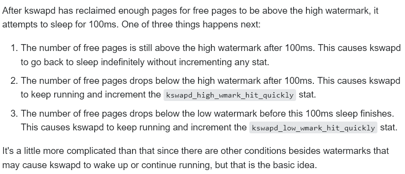

# 内存管理之kswapd框架

**一、kswapd内存回收**

kswapd 异步回收大循环

```
static int kswapd(void *p)
{
        ... 
        pgdat->kswapd_order = 0;
        pgdat->kswapd_classzone_idx = MAX_NR_ZONES;
        for ( ; ; ) {
                bool ret;
                //pgdat->kswapd_order和pgdat->kswapd_classzone_idx是kswpad回收的目标参数，内存分配wakeup时指定
                //初始化回收的目标order
                alloc_order = reclaim_order = pgdat->kswapd_order;
                //初始化本次回收所能接受的最大zone index，zone index越小越价值越大
                classzone_idx = kswapd_classzone_idx(pgdat, classzone_idx);

kswapd_try_sleep:
                kswapd_try_to_sleep(pgdat, alloc_order, reclaim_order,
                                        classzone_idx);

                /* Read the new order and classzone_idx */
                alloc_order = reclaim_order = pgdat->kswapd_order;
                classzone_idx = kswapd_classzone_idx(pgdat, 0);
                pgdat->kswapd_order = 0;
                pgdat->kswapd_classzone_idx = MAX_NR_ZONES;

                /*
                 * Reclaim begins at the requested order but if a high-order
                 * reclaim fails then kswapd falls back to reclaiming for
                 * order-0. If that happens, kswapd will consider sleeping
                 * for the order it finished reclaiming at (reclaim_order)
                 * but kcompactd is woken to compact for the original
                 * request (alloc_order).
                 */
                trace_mm_vmscan_kswapd_wake(pgdat->node_id, classzone_idx,
                                                alloc_order);
                reclaim_order = balance_pgdat(pgdat, alloc_order, classzone_idx);
                //reclaim_order返回的是kswapd完成回收的order大小，如果小于所需要的alloc_order大小
                //那么就没必要在继续继续回收，而是要考虑有条件的进行内存压缩，以增大回收的可能性
                if (reclaim_order < alloc_order)
                        goto kswapd_try_sleep; 
                //跳转到kswapd_try_sleep以避免几个局部参数清空，需要用这几个参数进一步判断压缩和回收操作
        }
        ...
}
```

kswapd\_try\_to\_sleep控制着kswapd休眠的关键函数

```
static void kswapd_try_to_sleep(pg_data_t *pgdat, int alloc_order, int reclaim_order,
                                unsigned int classzone_idx)
{
        long remaining = 0;
        DEFINE_WAIT(wait);

        prepare_to_wait(&pgdat->kswapd_wait, &wait, TASK_INTERRUPTIBLE);

        /*
         * Try to sleep for a short interval. Note that kcompactd will only be
         * woken if it is possible to sleep for a short interval. This is
         * deliberate on the assumption that if reclaim cannot keep an
         * eligible zone balanced that it's also unlikely that compaction will
         * succeed.
         */
        //使用reclaim_order 判断node是否平衡，如果平衡则说明，可以设定回收目标alloc_order作为规整目标
        //如果reclaim_order小于alloc_order  则程序希望通过规整达到回收目标order，如果node不平衡，则没必要规整和休眠要继续回收
        //如果reclaim_order等于alloc_order  则传进来的两者都应该为0，实际上只会做休眠不会做规整
        if (prepare_kswapd_sleep(pgdat, reclaim_order, classzone_idx)) {
                /*
                 * Compaction records what page blocks it recently failed to
                 * isolate pages from and skips them in the future scanning.
                 * When kswapd is going to sleep, it is reasonable to assume
                 * that pages and compaction may succeed so reset the cache.
                 */
                reset_isolation_suitable(pgdat);

                /*
                 * We have freed the memory, now we should compact it to make
                 * allocation of the requested order possible.
                 */
                wakeup_kcompactd(pgdat, alloc_order, classzone_idx); //以分配order为目标进行规整

                //如果系统此时有其他分配路径分配时内存小于low水位会再次唤醒kswapd，导致此处remaining大于0
                remaining = schedule_timeout(HZ/10); 

                /*
                 * If woken prematurely then reset kswapd_classzone_idx and
                 * order. The values will either be from a wakeup request or
                 * the previous request that slept prematurely.
                 */
                if (remaining) {
                        //内存水位又到low以下了，则更新回收参数，需要继续回收
                        pgdat->kswapd_classzone_idx = kswapd_classzone_idx(pgdat, classzone_idx);
                        pgdat->kswapd_order = max(pgdat->kswapd_order, reclaim_order);
                }

                finish_wait(&pgdat->kswapd_wait, &wait);
                prepare_to_wait(&pgdat->kswapd_wait, &wait, TASK_INTERRUPTIBLE);
        }

        /*
         * After a short sleep, check if it was a premature sleep. If not, then
         * go fully to sleep until explicitly woken up.
         */
        if (!remaining &&
            prepare_kswapd_sleep(pgdat, reclaim_order, classzone_idx)) {
                trace_mm_vmscan_kswapd_sleep(pgdat->node_id);

                /*
                 * vmstat counters are not perfectly accurate and the estimated
                 * value for counters such as NR_FREE_PAGES can deviate from the
                 * true value by nr_online_cpus * threshold. To avoid the zone
                 * watermarks being breached while under pressure, we reduce the
                 * per-cpu vmstat threshold while kswapd is awake and restore
                 * them before going back to sleep.
                 */
                set_pgdat_percpu_threshold(pgdat, calculate_normal_threshold);
                
                //到此处内存水位在high以上，可以继续休眠停止异步回收
                if (!kthread_should_stop())
                        schedule();

                set_pgdat_percpu_threshold(pgdat, calculate_pressure_threshold);
        } else {
                if (remaining)
                        count_vm_event(KSWAPD_LOW_WMARK_HIT_QUICKLY);
                else
                        count_vm_event(KSWAPD_HIGH_WMARK_HIT_QUICKLY);
        }
        finish_wait(&pgdat->kswapd_wait, &wait);
}
```

prepare\_kswapd\_sleep函数判断了当前kswapd的回收是否达到了high水位的平衡，如果没有平衡说明可能需要继续回收

如果内存确实很低或者部分zone内存低，有些内核版本prepare\_kswapd\_sleep始终返回false导致kswapd无法休眠CPU占用升高

```
static bool prepare_kswapd_sleep(pg_data_t *pgdat, int order, int classzone_idx)
{

        if (waitqueue_active(&pgdat->pfmemalloc_wait))
                wake_up_all(&pgdat->pfmemalloc_wait);
        /* Hopeless node, leave it to direct reclaim */
        if (pgdat->kswapd_failures >= MAX_RECLAIM_RETRIES)
                return true;
        if (pgdat_balanced(pgdat, order, classzone_idx)) {
                clear_pgdat_congested(pgdat);
                return true;
        }

        return false;
}
static bool pgdat_balanced(pg_data_t *pgdat, int order, int classzone_idx)
{
        int i;
        unsigned long mark = -1;
        struct zone *zone;
        /*
         * Check watermarks bottom-up as lower zones are more likely to
         * meet watermarks.
         */
        //循环遍历zone
        for (i = 0; i <= classzone_idx; i++) {
                zone = pgdat->node_zones + i;
                if (!managed_zone(zone))
                        continue;
                mark = high_wmark_pages(zone);
                //只要有zone水位平衡了就返回true表示node平衡
                //老一点的内核这里判断不一样需要每一个zone平衡了node才算平衡以及一些更复杂的判断
                if (zone_watermark_ok_safe(zone, order, mark, classzone_idx)) 
                        return true;
        }
        /*
         * If a node has no populated zone within classzone_idx, it does not
         * need balancing by definition. This can happen if a zone-restricted
         * allocation tries to wake a remote kswapd.
         */
        if (mark == -1)
                return true;
        return false;
}
```

**二、唤醒kswapd**

```
void wakeup_kswapd(struct zone *zone, gfp_t gfp_flags, int order,
                   enum zone_type classzone_idx)
{
        pg_data_t *pgdat;
        if (!managed_zone(zone))
                return;
        if (!cpuset_zone_allowed(zone, gfp_flags))
                return;
        pgdat = zone->zone_pgdat;
        pgdat->kswapd_classzone_idx = kswapd_classzone_idx(pgdat,
                                                           classzone_idx);
        pgdat->kswapd_order = max(pgdat->kswapd_order, order);
        if (!waitqueue_active(&pgdat->kswapd_wait))
                return;
        /* Hopeless node, leave it to direct reclaim if possible */
        if (pgdat->kswapd_failures >= MAX_RECLAIM_RETRIES ||
            (pgdat_balanced(pgdat, order, classzone_idx) &&
             !pgdat_watermark_boosted(pgdat, classzone_idx))) {
                /*
                 * There may be plenty of free memory available, but it's too
                 * fragmented for high-order allocations.  Wake up kcompactd
                 * and rely on compaction_suitable() to determine if it's
                 * needed.  If it fails, it will defer subsequent attempts to
                 * ratelimit its work.
                 */
                if (!(gfp_flags & __GFP_DIRECT_RECLAIM))
                        wakeup_kcompactd(pgdat, order, classzone_idx);
                return;
        }
        trace_mm_vmscan_wakeup_kswapd(pgdat->node_id, classzone_idx, order, gfp_flags);
        wake_up_interruptible(&pgdat->kswapd_wait);
}
```

**三、zone统计阈值修改**

zone\-\>per\_cpu\_pageset\-\>stat\_threshold阈值是：当每cpu变量中的临时统计值，到达这个阈值后将会将这些统计累进到全局统计和zone统计中

在kswpad被唤醒运行时，修改zone\-\>per\_cpu\_pageset\-\>stat\_threshold阈值，避免在kswpad运行过程中计算NR\_FREE\_PAGES误差较大。

当kswapd休眠时，使用普通的zone\-\>per\_cpu\_pageset\-\>stat\_threshold阈值，增强性能。

```
set_pgdat_percpu_threshold(pgdat, calculate_normal_threshold);    //kswapd休眠     
schedule();  //kswapd长时间休眠
set_pgdat_percpu_threshold(pgdat, calculate_pressure_threshold);  //kswapd运行
```

```
//计算压力阈值，该阈值基于min-low水位的差值和cpu的个数来计算，主要的目的是避免
//kswpad在不同的cpu上偏移导致预估计算得出的NR_FREE_PAGES在low-min之上，造成形成回收活锁
//因为如果stat_threshold*CPU的值较大时，而kswapd又在这些CPU上偏移时会造成计算freepages变化大而影响回收策略
int calculate_pressure_threshold(struct zone *zone)
{
        int threshold;
        int watermark_distance;

        /*
         * As vmstats are not up to date, there is drift between the estimated
         * and real values. For high thresholds and a high number of CPUs, it
         * is possible for the min watermark to be breached while the estimated
         * value looks fine. The pressure threshold is a reduced value such
         * that even the maximum amount of drift will not accidentally breach
         * the min watermark
         */
        watermark_distance = low_wmark_pages(zone) - min_wmark_pages(zone);
        threshold = max(1, (int)(watermark_distance / num_online_cpus()));

        /*
         * Maximum threshold is 125
         */
        threshold = min(125, threshold);

        return threshold;
}

//根据内存总量和cpu数计算zone->per_cpu_pageset->stat_threshold阈值，不跟low-min水位相关
int calculate_normal_threshold(struct zone *zone)
{
        int threshold;
        int mem;        /* memory in 128 MB units */
        mem = zone_managed_pages(zone) >> (27 - PAGE_SHIFT);
        threshold = 2 * fls(num_online_cpus()) * (1 + fls(mem));
        /*
         * Maximum threshold is 125
         */
        threshold = min(125, threshold);
        return threshold;
}
```

**四、统计信息**

1、kswapd\_low\_wmark\_hit\_quickly

kswapd通过调用schedule\_timeout\(HZ/10\)休眠一段时间时，如果提前被唤醒，则说明当前系统的内存又达到了low水位，因此KSWAPD\_LOW\_WMARK\_HIT\_QUICKLY统计增加。

所以该统计表明系统达到low水位以下的一个速度，如果high水位偏低和系统内存消耗速度大时，这个值都容易增大。

2、kswapd\_high\_wmark\_hit\_quickly

kswapd进入调用schedule\_timeout\(HZ/10\)休眠一段时间时，如果剩余时间为0，说明此时的水位在high以上，因为水位平衡是以high判断的。如果第二次prepare\_kswapd\_sleep判断返回false，说明此时水位是低于high。在这种情况下KSWAPD\_HIGH\_WMARK\_HIT\_QUICKLY统计增加

所以该统计表明系统系统达到high水位以下的一个速度。

如果两者都增长的很快，说明系统内存长期处于较低且消耗较快的水平。


