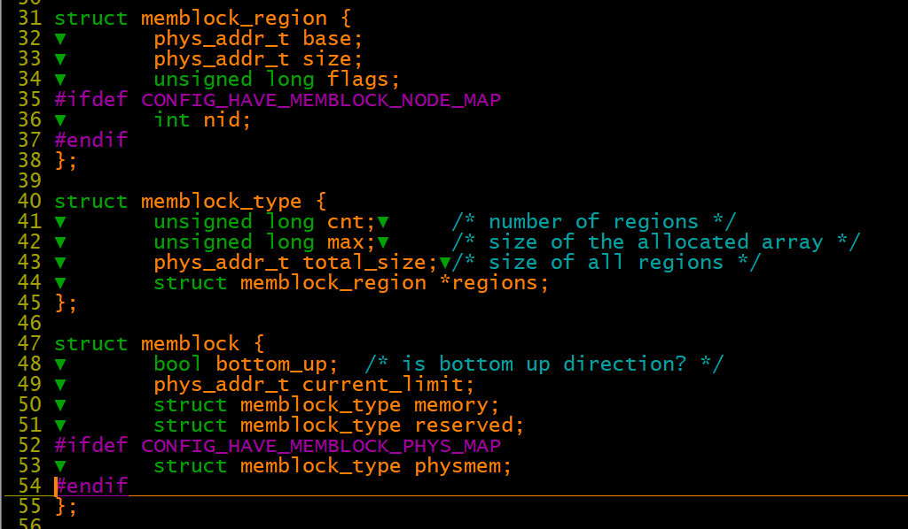
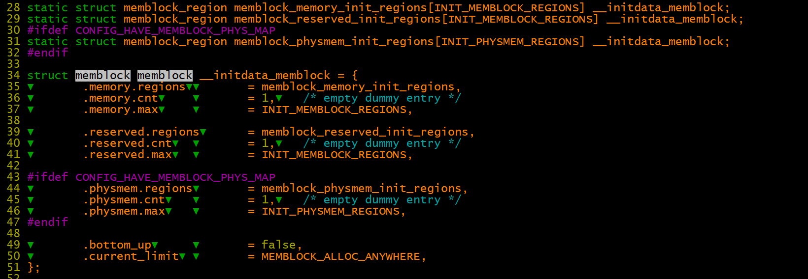
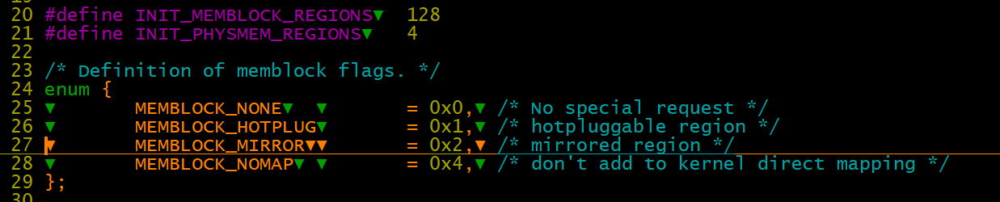
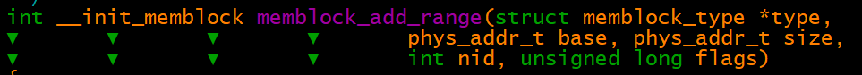
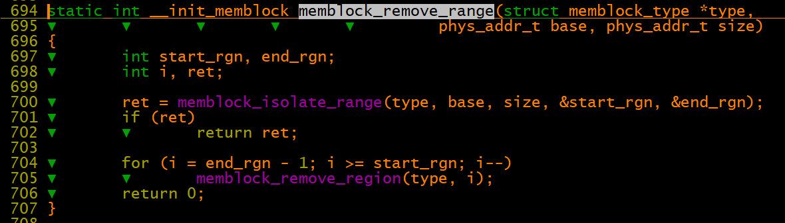
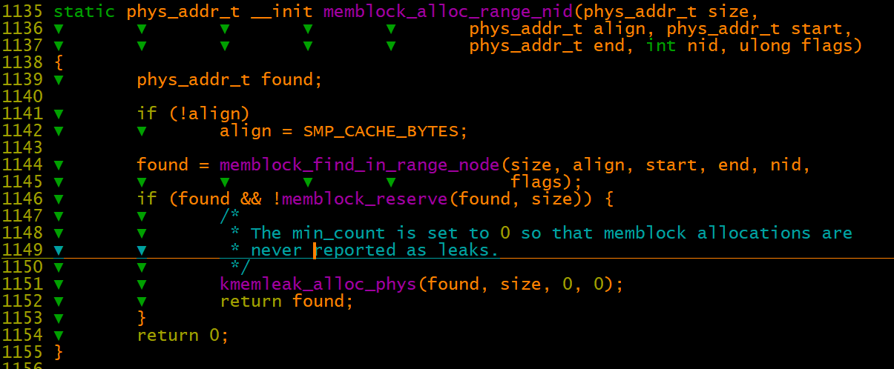

# 内存管理之memblock

arm\_memblock\_init







%\!\(EXTRA markdown.ResourceType=, string=, string=\)

memblock flags对应实体为struct memblock\_region\-\>flags

memblock\-\>memory：活动    内存

memblock\-\>reserved：预留内存

memblock\-\>physmem：物理内存的集合，通过宏CONFIG\_HAVE\_MEMBLOCK\_PHYS\_MAP控制，暂时用不到不研究。

API 接口

```
phys_addr_t memblock_find_in_range_node(phys_addr_t size, phys_addr_t align,
                    phys_addr_t start, phys_addr_t end,
                    int nid, ulong flags);
phys_addr_t memblock_find_in_range(phys_addr_t start, phys_addr_t end,
                   phys_addr_t size, phys_addr_t align);
void memblock_allow_resize(void);
int memblock_add_node(phys_addr_t base, phys_addr_t size, int nid);
int memblock_add(phys_addr_t base, phys_addr_t size);
int memblock_remove(phys_addr_t base, phys_addr_t size);
int memblock_free(phys_addr_t base, phys_addr_t size);
int memblock_reserve(phys_addr_t base, phys_addr_t size);
void memblock_trim_memory(phys_addr_t align);
bool memblock_overlaps_region(struct memblock_type *type,
                  phys_addr_t base, phys_addr_t size);
int memblock_mark_hotplug(phys_addr_t base, phys_addr_t size);
int memblock_clear_hotplug(phys_addr_t base, phys_addr_t size);
int memblock_mark_mirror(phys_addr_t base, phys_addr_t size);
int memblock_mark_nomap(phys_addr_t base, phys_addr_t size);
ulong choose_memblock_flags(void);
```

此函数为增加memblock\_type的regin的核心函数，在数组regions中增加一段内存地址描述。允许与现有的重叠，重叠不影响已经存在的区域，相邻的区域将会合并。



同理memblock\_remove\_range从memblock\_type中删除一段地址范围内的regions

先找到地址描述范围内的regin段，再进行删除操作



memblock\_alloc\_range\_nid：

1、从memory&&！reserve中找出free区域

2、并标记为reverse

3、如果找到合适的free区域并且reserve成功，则调用kmemleak\_alloc\_phys向kmemleak模块标记无内存泄漏



arm平台内核启动早期根据fdt获取总的内存信息，并初始化memblock\-\>memory。

start\_kernel\-\>setup\_arch\-》setup\_machine\_fdt\-》 early\_init\_dt\_scan\_nodes\-》early\_init\_dt\_scan\_memory\-》early\_init\_dt\_scan\_memory\-》early\_init\_dt\_add\_memory\_arch\-》memblock\_add\(base, size\);

** totalram\_pages是如何更新的**

内核中totalram\_pages在初始值是0，在free\_initmem\(\)之后就稳定在一个数值。

\(1\)内核首先遍历memblock.memory和memblock.reserved区域，判断出空闲区域内存大小；

\(2\)然后在CMA阶段，将CMA预留的内存释放出来，totalram\_pages增加；

\(3\)最后在free\_initmem\(\)中释放init段占用的内存。

1、free\_all\_bootmem\(\) 将memblock中reserved之外的regions返还给内核的buddy allocator使用

free\_all\_bootmem\(\-》free\_low\_memory\_core\_early\-》\_\_free\_memory\_core\-》\_\_free\_pages\_memory\-》\_\_free\_pages\_bootmem\-》\_\_free\_pages\_boot\_core

通过函数for\_each\_free\_mem\_range遍历将memory中存在但reserve中不存在的内存，通过函数\_\_free\_pages\_boot\_core添加到buddy系统中

%\!\(EXTRA markdown.ResourceType=, string=, string=\)

高端内存通过以下路径返还给buddy使用

free\_highpages\-》free\_area\_high\-》free\_highmem\_page

%\!\(EXTRA markdown.ResourceType=, string=, string=\)

2、cma\_init\_reserved\_areas\(\)中初始化CMA区域，将这个区域和系统buddy allocator复用

3、free\_initmem\(\)释放内核代码相关内存。

小结：

1、 系统启动时，扫描fdt里面memory node,把所有内存块添加到memblock

start\_kernel\-\>setup\_arch\-\>setup\_machine\_fdt\-\>early\_init\_dt\_scan\-\>early\_init\_dt\_scan\_nodes\-\>early\_init\_dt\_scan\_memory\-\>early\_init\_dt\_add\_memory\_arch\-\>memblock\_add

2、将内核代码占用内存，CMA使用内存，dts中标记为保留内存的内存等等标记为保留内存

dts保留：start\_kernel\-\>setup\_arch\-\>arm64\_memblock\_init\-\>early\_init\_fdt\_scan\_reserved\_mem\-\>\_\_fdt\_scan\_reserved\_mem/fdt\_init\_reserved\_mem

3、伙伴系统
