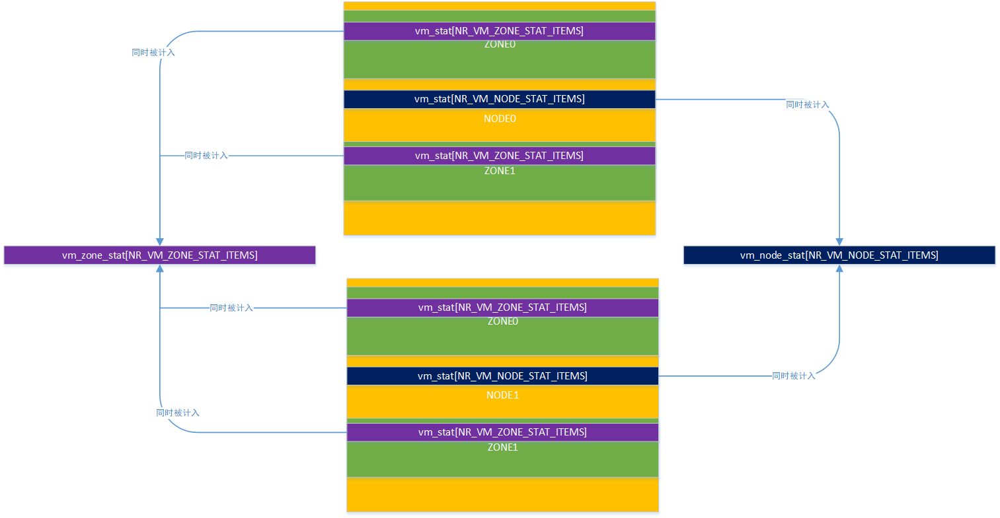
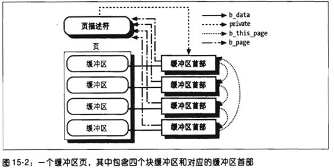
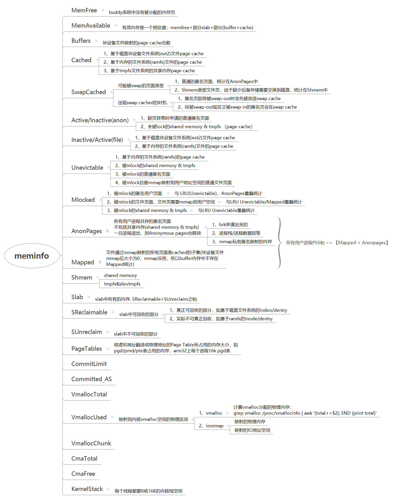

# 内存管理之meminfo解析

参考：

[http://linuxperf.com/?cat=7](http://linuxperf.com/?cat=7)

一、实现/proc/meminfo文件

```
164 static int meminfo_proc_open(struct inode *inode, struct file *file)
165 {
166 ▼       return single_open(file, meminfo_proc_show, NULL);
167 }
168
169 static const struct file_operations meminfo_proc_fops = {
170 ▼       .open▼  ▼       = meminfo_proc_open,
171 ▼       .read▼  ▼       = seq_read,
172 ▼       .llseek▼▼       = seq_lseek,
173 ▼       .release▼       = single_release,
174 };
```

二、统计项来源

```
MemTotal:        2063552 kB    //totalram_pages
MemFree:         1338856 kB    //vm_zone_stat[NR_FREE_PAGES]
MemAvailable:                  //si_mem_available()
Buffers:           33908 kB    //nr_blockdev_pages()
Cached:           487528 kB    //vm_node_stat[NR_FILE_PAGES] - total_swapcache_pages() - nr_blockdev_pages()
SwapCached:            0 kB    //total_swapcache_pages()
Active:           456944 kB    //vm_node_stat[LRU_ACTIVE_ANON] +vm_node_stat[LRU_ACTIVE_FILE]
Inactive:         170520 kB    //vm_node_stat[LRU_INACTIVE_ANON] +vm_node_stat[LRU_INACTIVE_FILE]
Active(anon):     106604 kB    //vm_node_stat[LRU_ACTIVE_ANON]
Inactive(anon):      492 kB    //vm_node_stat[LRU_INACTIVE_ANON]
Active(file):     350340 kB    //vm_node_stat[LRU_ACTIVE_FILE]
Inactive(file):   170028 kB    //vm_node_stat[LRU_INACTIVE_FILE]
Unevictable:           0 kB    //vm_node_stat[LRU_UNEVICTABLE]
Mlocked:               0 kB    //vm_zone_stat[NR_MLOCK]   //mlock()系统调用锁定的内存大小
HighTotal:       1183624 kB    //totalhigh_pages
HighFree:         812724 kB    //nr_free_highpages()
LowTotal:         879928 kB    //totalram_pages - totalhigh_pages
LowFree:          526132 kB    //vm_zone_stat[NR_FREE_PAGES] - nr_free_highpages()
SwapTotal:       1046524 kB    //total_swap_pages + nr_to_be_unused   交换空间的总容量
SwapFree:        1046524 kB    //atomic_long_read(&nr_swap_pages) + nr_to_be_unused   交换空间的剩余容量
Dirty:                64 kB    //vm_node_stat[NR_FILE_DIRTY]
Writeback:             0 kB    //vm_node_stat[NR_WRITEBACK]
AnonPages:        106084 kB    //vm_node_stat[NR_ANON_MAPPED]  //rmap反向映射记录的匿名页总和
Mapped:            42240 kB    //vm_node_stat[NR_FILE_MAPPED]
Shmem:              1072 kB    //vm_node_stat[NR_SHMEM]
Slab:              28168 kB    //vm_zone_stat[NR_SLAB_RECLAIMABLE] +vm_zone_stat[NR_SLAB_UNRECLAIMABLE]
SReclaimable:      13688 kB    //vm_zone_stat[NR_SLAB_RECLAIMABLE]
SUnreclaim:        14480 kB    //vm_zone_stat[NR_SLAB_UNRECLAIMABLE]
KernelStack:        2352 kB    //vm_zone_stat[NR_KERNEL_STACK_KB]
PageTables:         2900 kB    //vm_zone_stat[NR_PAGETABLE]
NFS_Unstable:          0 kB    //vm_node_stat[R_UNSTABLE_NFS]
Bounce:                0 kB    //vm_node_stat[NR_BOUNCE]
WritebackTmp:          0 kB    //vm_node_stat[NR_WRITEBACK_TEMP]
CommitLimit:     2078300 kB    //vm_commit_limit()
Committed_AS:     633032 kB    //committed
VmallocTotal:     122880 kB    //(VMALLOC_TOTAL >> 10) (kb)  vmalloc或高端内存使用的虚拟地址空间范围
VmallocUsed:       22656 kB    //0
VmallocChunk:      92320 kB    //0
CmaTotal:                      //totalcma_pages
CmaFree:                       //vm_zone_stat[NR_FREE_CMA_PAGES]
```

内存统计：vm\_zone\_stat和vm\_node\_stat

```
113 static inline void zone_page_state_add(long x, struct zone *zone,
114 ▼       ▼       ▼       ▼        enum zone_stat_item item)
115 {
116 ▼       atomic_long_add(x, &zone->vm_stat[item]);
117 ▼       atomic_long_add(x, &vm_zone_stat[item]);
118 }
119
120 static inline void node_page_state_add(long x, struct pglist_data *pgdat,
121 ▼       ▼       ▼       ▼        enum node_stat_item item)
122 {
123 ▼       atomic_long_add(x, &pgdat->vm_stat[item]);
124 ▼       atomic_long_add(x, &vm_node_stat[item]);
125 }

347 struct zone {
495 ▼       atomic_long_t▼  ▼       vm_stat[NR_VM_ZONE_STAT_ITEMS];
496 };

598 typedef struct pglist_data {
703 ▼       atomic_long_t▼  ▼       vm_stat[NR_VM_NODE_STAT_ITEMS];
704 } pg_data_t;
```

vm\_zone\_stat和vm\_node\_stat的区别

1、具备zone独立统计特征的项放入NR\_VM\_ZONE\_STAT\_ITEMS中，具备不区分zone统计特征的项放入NR\_VM\_NODE\_STAT\_ITEMS

2、在node/zone对应统计项中增加统计之外，还要在全局变量vm\_zone\_stat和yivm\_node\_stat中同时增加统计，以计算系统所有内存的统计量



```
全局变量：
  89 atomic_long_t vm_zone_stat[NR_VM_ZONE_STAT_ITEMS] __cacheline_aligned_in_smp;  //全局统计系统中所有
  90 atomic_long_t vm_node_stat[NR_VM_NODE_STAT_ITEMS] __cacheline_aligned_in_smp;  //

112 enum zone_stat_item {
113 ▼       /* First 128 byte cacheline (assuming 64 bit words) */
114 ▼       NR_FREE_PAGES,
115 ▼       NR_ZONE_LRU_BASE, /* Used only for compaction and reclaim retry */
116 ▼       NR_ZONE_INACTIVE_ANON = NR_ZONE_LRU_BASE,
117 ▼       NR_ZONE_ACTIVE_ANON,
118 ▼       NR_ZONE_INACTIVE_FILE,
119 ▼       NR_ZONE_ACTIVE_FILE,
120 ▼       NR_ZONE_UNEVICTABLE,
121 ▼       NR_ZONE_WRITE_PENDING,▼ /* Count of dirty, writeback and unstable pages */
122 ▼       NR_MLOCK,▼      ▼       /* mlock()ed pages found and moved off LRU */
123 ▼       NR_SLAB_RECLAIMABLE,
124 ▼       NR_SLAB_UNRECLAIMABLE,
125 ▼       NR_PAGETABLE,▼  ▼       /* used for pagetables */
126 ▼       NR_KERNEL_STACK_KB,▼    /* measured in KiB */
127 ▼       NR_KAISERTABLE,
128 ▼       NR_BOUNCE,
129 ▼       /* Second 128 byte cacheline */
130 #if IS_ENABLED(CONFIG_ZSMALLOC)
131 ▼       NR_ZSPAGES,▼    ▼       /* allocated in zsmalloc */
132 #endif
133 #ifdef CONFIG_NUMA
134 ▼       NUMA_HIT,▼      ▼       /* allocated in intended node */
135 ▼       NUMA_MISS,▼     ▼       /* allocated in non intended node */
136 ▼       NUMA_FOREIGN,▼  ▼       /* was intended here, hit elsewhere */
137 ▼       NUMA_INTERLEAVE_HIT,▼   /* interleaver preferred this zone */
138 ▼       NUMA_LOCAL,▼    ▼       /* allocation from local node */
139 ▼       NUMA_OTHER,▼    ▼       /* allocation from other node */
140 #endif
141 ▼       NR_FREE_CMA_PAGES,
142 ▼       NR_VM_ZONE_STAT_ITEMS
    };

144 enum node_stat_item {
145 ▼       NR_LRU_BASE,
146 ▼       NR_INACTIVE_ANON = NR_LRU_BASE, /* must match order of LRU_[IN]ACTIVE */
147 ▼       NR_ACTIVE_ANON,▼▼       /*  "     "     "   "       "         */
148 ▼       NR_INACTIVE_FILE,▼      /*  "     "     "   "       "         */
149 ▼       NR_ACTIVE_FILE,▼▼       /*  "     "     "   "       "         */
150 ▼       NR_UNEVICTABLE,▼▼       /*  "     "     "   "       "         */
151 ▼       NR_ISOLATED_ANON,▼      /* Temporary isolated pages from anon lru */
152 ▼       NR_ISOLATED_FILE,▼      /* Temporary isolated pages from file lru */
153 ▼       NR_PAGES_SCANNED,▼      /* pages scanned since last reclaim */
154 ▼       WORKINGSET_REFAULT,
155 ▼       WORKINGSET_ACTIVATE,
156 ▼       WORKINGSET_NODERECLAIM,
157 ▼       NR_ANON_MAPPED,▼/* Mapped anonymous pages */
158 ▼       NR_FILE_MAPPED,▼/* pagecache pages mapped into pagetables.
159 ▼       ▼       ▼          only modified from process context */
160 ▼       NR_FILE_PAGES,
161 ▼       NR_FILE_DIRTY,
162 ▼       NR_WRITEBACK,
163 ▼       NR_WRITEBACK_TEMP,▼     /* Writeback using temporary buffers */
164 ▼       NR_SHMEM,▼      ▼       /* shmem pages (included tmpfs/GEM pages) */
165 ▼       NR_SHMEM_THPS,
166 ▼       NR_SHMEM_PMDMAPPED,
167 ▼       NR_ANON_THPS,
168 ▼       NR_UNSTABLE_NFS,▼       /* NFS unstable pages */
169 ▼       NR_VMSCAN_WRITE,
170 ▼       NR_VMSCAN_IMMEDIATE,▼   /* Prioritise for reclaim when writeback ends */
171 ▼       NR_DIRTIED,▼    ▼       /* page dirtyings since bootup */
172 ▼       NR_WRITTEN,▼    ▼       /* page writings since bootup */
173 ▼       NR_VM_NODE_STAT_ITEMS
174 };
```

**MemAvailable:**

通过分析si\_mem\_available函数可知，MemAvailable主要由free内存\+预估的一半的pagecahe\+预估的一半的可回收slab内存构成

1、\+ 【vm\_zone\_stat\[R\_FREE\_PAGES\]】 

2、\-【 totalreserve\_pages 】 

3、//pagecache = pages\[LRU\_ACTIVE\_FILE\] \+ pages\[LRU\_INACTIVE\_FILE\];

    \+ 【pagecache \- min\(pagecache / 2, wmark\_low\)】

4、\+【vm\_zone\_stat\[NR\_SLAB\_RECLAIMABLE\)\]\- min\(vm\_zone\_stat\[NR\_SLAB\_RECLAIMABLE\] / 2, wmark\_low\)】

**Buffers：**所有块设备申请的缓存

```
747 long nr_blockdev_pages(void)
748 {
749 ▼       struct block_device *bdev;
750 ▼       long ret = 0;
751 ▼       spin_lock(&bdev_lock);
752 ▼       list_for_each_entry(bdev, &all_bdevs, bd_list) {
753 ▼       ▼       ret += bdev->bd_inode->i_mapping->nrpages;
754 ▼       }
755 ▼       spin_unlock(&bdev_lock);
756 ▼       return ret;
757 }

filemap.c
static int page_cache_tree_insert(struct address_space *mapping,
                  struct page *page, void **shadowp)
{
    mapping->nrpages++;
}
static void page_cache_tree_delete(struct address_space *mapping,
                   struct page *page, void *shadow)
{
    mapping->nrpages -= nr;
}
```

一般来说，buffers的数量不多，因为产生buffer的操作包括：

1、打开该block device的设备节点，直接进行读写操作（例如dd一个块设备）

2、mount文件系统的时候，需要从相应的block device上直接把块设备上的特定文件系统的super block相关信息读取出来，这些super block的raw data会保存在该block device的page cache中

3、文件操作的时候，和文件元数据相关的操作（例如读取磁盘上的inode相关的信息）也是通过buffer cache进行访问。

先说总结：

1. Linux2.4.10之前的内核中，分两种disk cache, 分别为buffer cache和page cache，区别暂时不清楚。

2. 大约2.4.10后的内核，buffer cache已经不存在了（或者说换了一种数据存放的方法） 而这种页面的叫法也变了，叫做 buffer page, 而buffer page放在什么地主呢？ 它放在page cache中。听着很绕口， 或者可以这样讲： 2.4.10之后的内核的disk cache 只有 page cache, 而page cache中有些页面被叫做buffer page的，是因为这些页面（buffer page）都有与其相关的buffer\_head 描述符，也正是这样页面被free 统计为 buffer 占用。如果没有buffer\_head与该页相关，则被free统计为 cache占用。 Buffer page 与 buffer\_head\(下图中右边方框里的 缓冲区首部 \)的关联如下



**Cached:�**�

vm\_node\_stat\[NR\_FILE\_PAGES\] \- total\_swapcache\_pages\(\) \- Buffers\(nr\_blockdev\_pages\(\)\)

**SwapCached：**\-》total\_swapcache\_pages

swapper\_spaces:交换缓存，页面换出时使用，具体在页面回收中进行分析

```
54 unsigned long total_swapcache_pages(void)
55 {
56 ▼       int i;
57 ▼       unsigned long ret = 0;
58
59 ▼       for (i = 0; i < MAX_SWAPFILES; i++)
60 ▼       ▼       ret += swapper_spaces[i].nrpages;
61 ▼       return ret;
62 }
```

**unevitable：**

lru链表中不可回收的页面：

在4.9.内核版本中，设备启动后ramfs 分配的页面是在 active/inactive中，当内存不足出现页面回收后，这些ramfs 分配的页面会被放到unevitable链表中。同时vmstat中UNEVICTABLE\_PGCULLED统计项相应的增加。

在最新5.8内核版本中，ramfs 分配的页面是直接加入unevitable链表中。

```
ramfs_get_inode() -> mapping_set_unevictable(inode->i_mapping);

static inline void mapping_set_unevictable(struct address_space *mapping)
{
        set_bit(AS_UNEVICTABLE, &mapping->flags);
}

//5.8的内核中__pagevec_lru_add_fn的实现，根据page_evictable(page)判断页面，如果是UNEVICTABLE则会将页面添加至UNEVICTABLE链表中
static void __pagevec_lru_add_fn(struct page *page, struct lruvec *lruvec,
                                 void *arg)
{
        enum lru_list lru;
        int was_unevictable = TestClearPageUnevictable(page);
        int nr_pages = hpage_nr_pages(page);

        SetPageLRU(page);
        smp_mb__after_atomic();
        
        if (page_evictable(page)) {
                lru = page_lru(page);
                if (was_unevictable)
                        __count_vm_events(UNEVICTABLE_PGRESCUED, nr_pages);
        } else {
                lru = LRU_UNEVICTABLE;
                ClearPageActive(page);
                SetPageUnevictable(page);
                if (!was_unevictable)
                        __count_vm_events(UNEVICTABLE_PGCULLED, nr_pages);
        }

        add_page_to_lru_list(page, lruvec, lru);
        trace_mm_lru_insertion(page, lru);
}

static inline bool page_evictable(struct page *page)
{               
        bool ret;
        
        /* Prevent address_space of inode and swap cache from being freed */
        rcu_read_lock();
        ret = !mapping_unevictable(page_mapping(page)) && !PageMlocked(page);
        rcu_read_unlock();
        return ret;
}

static inline bool mapping_unevictable(struct address_space *mapping)
{
        return mapping && test_bit(AS_UNEVICTABLE, &mapping->flags);
}
```

**Mlocked：**

被mlock\(\)系统调用锁定的内存大小。被锁定的内存因为不能pageout/swapout，会从Active/Inactive LRU list移到Unevictable LRU list上。也就是说，当”Mlocked”增加时，”Unevictable”也同步增加，而”Active”或”Inactive”同时减小；当”Mlocked”减小的时候，”Unevictable”也同步减小，而”Active”或”Inactive”同时增加。

“Mlocked”并不是独立的内存空间，它与以下统计项重叠：LRU Unevictable，AnonPages，Shmem，Mapped等。

**PageTables:**zone\_stat\_item\[NR\_PAGETABLE\]

Page Table用于将内存的虚拟地址翻译成物理地址，统计的是存放页表项所用内存页，在创建页表时，申请到页面之后通过pgtable\_page\_ctor函数增加该统计

arm32 中16K的pgd表直接通过\_\_get\_free\_pages函数进行分配，不会增加到NR\_PAGETABLE的统计信息中去

```
1665 static inline bool pgtable_page_ctor(struct page *page)
1666 {
1669 ▼       inc_zone_page_state(page, NR_PAGETABLE);
1670 ▼       return true;
1671 }
1673 static inline void pgtable_page_dtor(struct page *page)
1674 {
1676 ▼       dec_zone_page_state(page, NR_PAGETABLE);
1677 }

727 static void *__init late_alloc(unsigned long sz)
728 {
729 ▼       void *ptr = (void *)__get_free_pages(PGALLOC_GFP, get_order(sz));
730
731 ▼       if (!ptr || !pgtable_page_ctor(virt_to_page(ptr)))                                                                        
732 ▼       ▼       BUG();
733 ▼       return ptr;
734 }
```

**Slab**

cache创建时flags中SLAB\_RECLAIM\_ACCOUNT位决定该cache是否可回收

主要是文件系统的inode和dentry、super 申请时会需要SLAB\_RECLAIM\_ACCOUNT标志，在页面回收的时候shrink\_slab中进行这三者的回收

```
418 static int __init init_inodecache(void)
419 {
420 ▼       squashfs_inode_cachep = kmem_cache_create("squashfs_inode_cache",
421 ▼       ▼       sizeof(struct squashfs_inode_info), 0,
422 ▼       ▼       SLAB_HWCACHE_ALIGN|SLAB_RECLAIM_ACCOUNT|SLAB_ACCOUNT,
423 ▼       ▼       init_once);
424
425 ▼       return squashfs_inode_cachep ? 0 : -ENOMEM;
426 }

1444 ▼       if (cachep->flags & SLAB_RECLAIM_ACCOUNT)
1445 ▼       ▼       add_zone_page_state(page_zone(page),
1446 ▼       ▼       ▼       NR_SLAB_RECLAIMABLE, nr_pages);
1447 ▼       else
1448 ▼       ▼       add_zone_page_state(page_zone(page),
1449 ▼       ▼       ▼       NR_SLAB_UNRECLAIMABLE, nr_pages);
```

像ramfs文件系统没有注册私有的super\_operations\-\>alloc\_inode函数指针，在申请inode时使用的是从默认的inode\_cache中申请。

而inode\_cache默认是标记为可回收的slab的，因此这部分内存是NR\_SLAB\_RECLAIMABLE中，但是实际该内存是无法回收的。

```
202 static struct inode *alloc_inode(struct super_block *sb)
203 {
204 ▼       struct inode *inode;
205
206 ▼       if (sb->s_op->alloc_inode)
207 ▼       ▼       inode = sb->s_op->alloc_inode(sb);
208 ▼       else
209 ▼       ▼       inode = kmem_cache_alloc(inode_cachep, GFP_KERNEL);
222 ▼       return inode;
223 }

1943 void __init inode_init(void)
1944 {
1947 ▼       /* inode slab cache */
1948 ▼       inode_cachep = kmem_cache_create("inode_cache",
1949 ▼       ▼       ▼       ▼       ▼        sizeof(struct inode),
1950 ▼       ▼       ▼       ▼       ▼        0,
1951 ▼       ▼       ▼       ▼       ▼        (SLAB_RECLAIM_ACCOUNT|SLAB_PANIC|
1952 ▼       ▼       ▼       ▼       ▼        SLAB_MEM_SPREAD|SLAB_ACCOUNT),
1953 ▼       ▼       ▼       ▼       ▼        init_once);
    }
```

页面分布总结：



问题：

##### 1、为什么【Active\(anon\)\+Inactive\(anon\)】不等于AnonPages？

因为Shmem\(即Shared memory & tmpfs\) 被计入LRU Active/Inactive\(anon\)，但未计入 AnonPages。所以一个更合理的等式是：

【Active\(anon\)\+Inactive\(anon\)】 = 【AnonPages \+ Shmem】

但是这个等式在某些情况下也不一定成立，因为：

- 如果shmem或anonymous pages被mlock的话，就不在Active\(non\)或Inactive\(anon\)里了，而是到了Unevictable里，以上等式就不平衡了；
- 【注：参见mm/vmscan.c: shrink\_page\_list\(\)：
    它调用的add\_to\_swap\(\)会把swap cache页面标记成dirty，然后调用try\_to\_unmap\(\)将页面对应的page table mapping都删除，再调用pageout\(\)回写dirty page，最后try\_to\_free\_swap\(\)把该页从swap cache中删除。】
    当anonymous pages准备被swap\-out时，分几个步骤：先被加进swap cache，再离开AnonPages，然后离开LRU Inactive\(anon\)，最后从swap cache中删除，这几个步骤之间会有间隔，而且有可能离开AnonPages就因某些情况而结束了，所以在某些时刻以上等式会不平衡。

##### 2、 为什么【Active\(file\)\+Inactive\(file\)】不等于Mapped？

1. 因为LRU Active\(file\)和Inactive\(file\)中不仅包含mapped页面，还包含unmapped页面；
2. Mapped中包含”Shmem”\(即shared memory & tmpfs\)，这部分内存被计入了LRU Active\(anon\)或Inactive\(anon\)、而不在Active\(file\)和Inactive\(file\)中。

##### 3、为什么【Active\(file\)\+Inactive\(file\)】不等于 Cached？

1. 因为”Shmem”\(即shared memory & tmpfs\)包含在Cached中，而不在Active\(file\)和Inactive\(file\)中；
2. Active\(file\)和Inactive\(file\)还包含Buffers。

- 【Active\(file\) \+ Inactive\(file\) \+ Shmem】== 【Cached \+ Buffers】
    如果不考虑mlock的话，一个更符合逻辑的等式是：
- 【Active\(file\) \+ Inactive\(file\) \+ Shmem \+ _mlock\_file_】== 【Cached \+ Buffers】
    如果有mlock的话，等式应该如下（mlock包括file和anon两部分，/proc/meminfo中并未分开统计，下面的mlock\_file只是用来表意，实际并没有这个统计值）：
