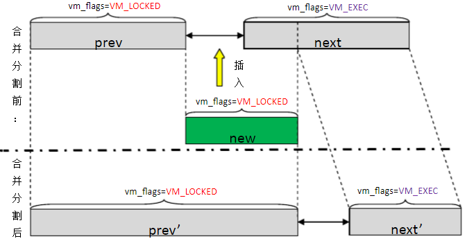

# 内存管理之mlock

**一、mlock机制主要有以下功能：**

a\)被锁定的物理内存在被解锁或进程退出前，不会被页回收流程处理。

b\)被锁定的物理内存，不会被交换到swap设备。

c\)进程执行mlock操作时，内核会立刻分配物理内存（注意COW的情况）。

**二、mlock基本原理**

1\) 每个进程都拥有一段连续的虚拟内存，内核并不是以整个虚拟内存为管理单位，而是将整个虚拟内存划分为若干个虚拟内存区域。

2\) 内核中使用vm\_area\_struct数据结构来管理虚拟内存区域，简称vma。

3\) 每一个vma代表一个已映射的、连续的且属性相同\(如可读/写\)的虚拟内存区域。

4\) mlock操作会给相应的vma的vm\_flags置一个VM\_LOCKED标记，而这个标记则会影响到物理内存回收和交换。

\#define VM\_LOCKED 0x00002000

5\) Linux分配内存到page且只能按页锁定内存，所以指定的地址会被round down到下一个page的边界。

6\) 当mlock锁定的虚拟内存区域跟现有vma管理的虚拟内存区域并不完全重合时，由于同一个vma的内存属性要求一致，而VM\_LOCKED标记也是其属性，因此会导致现有的vma被合并或分割，如下图所示：（这个图画的有问题，没有的内存区域，没有对应的vma，应该不能mlock）



说明：

a\) prev与next是已受链表管理的vma结构，new是将要新加入链表的vma。

b\) 当new加入时，如果new的起始地址与prev的结束地址相同，且new属性与prev属性均为VM\_LOCKED，则将prev和new合并成prev’。

c\) 如果new的结束地址与next的起始地址有重合，但next属性是VM\_EXEC，则next被分割成两部分，一部分加入prev’，另一部分变成next’。

7\) 操作系统通过LRU算法来管理Linux进程的虚拟内存，LRU算法主要通过两个页面标志符（PG\_active和 PG\_referenced）来标识某个页面的活跃程度，从而决定页面如何在两个链表（active\_list和inactive\_list）之间进行移动。

8\) 内核函数vmscan会遍历扫描active\_list和inactive\_list链表来回收页面。

9\) 内核在LRU算法中新增了一个unevictable\_list链表，将不可回收的页面都放在unevictable\_list中，mlock的页面就被放在unevictable\_list中，同时给该页置一个PG\_mlocked标记。

10\) 解锁并不立刻将解锁的页回收，而是将解锁的页放回active\_list或inactive\_list链表，然后交由页回收流程处理，所以mlock的页不会被页回收流程处理。

11\) 由于线程共享进程资源，所以线程的vma将继承VM\_LOCKED标记。但fork后的子进程的vma并不继承VM\_LOCKED标记，以及调用exec执行其它程序时，不继承VM\_LOCKED标记。

**三、mlock内核代码分析**

```
static __must_check int do_mlock(unsigned long start, size_t len, vm_flags_t flags)
{
        unsigned long locked;
        unsigned long lock_limit;
        int error = -ENOMEM;

        if (!can_do_mlock())
                return -EPERM;

        lru_add_drain_all();    /* flush pagevec */

        len = PAGE_ALIGN(len + (offset_in_page(start)));
        start &= PAGE_MASK;

        lock_limit = rlimit(RLIMIT_MEMLOCK);
        lock_limit >>= PAGE_SHIFT;
        locked = len >> PAGE_SHIFT;

        if (down_write_killable(&current->mm->mmap_sem))
                return -EINTR;

        locked += current->mm->locked_vm;
        if ((locked > lock_limit) && (!capable(CAP_IPC_LOCK))) {
                /*
                 * It is possible that the regions requested intersect with
                 * previously mlocked areas, that part area in "mm->locked_vm"
                 * should not be counted to new mlock increment count. So check
                 * and adjust locked count if necessary.
                 */
                locked -= count_mm_mlocked_page_nr(current->mm,
                                start, len);
        }

        /* check against resource limits */
        if ((locked <= lock_limit) || capable(CAP_IPC_LOCK))
                error = apply_vma_lock_flags(start, len, flags); //检查通过后，执行具体的mlock

        up_write(&current->mm->mmap_sem);
        if (error)
                return error;

        error = __mm_populate(start, len, 0); //给start  ->  strt+len区域填充物理页
        if (error)
                return __mlock_posix_error_return(error);
        return 0;
}
```

```
static int apply_vma_lock_flags(unsigned long start, size_t len,
                                vm_flags_t flags)
{
        unsigned long nstart, end, tmp;
        struct vm_area_struct * vma, * prev;
        int error;

        VM_BUG_ON(offset_in_page(start));
        VM_BUG_ON(len != PAGE_ALIGN(len));
        end = start + len;
        if (end < start)
                return -EINVAL;
        if (end == start)
                return 0;
        vma = find_vma(current->mm, start); 
        if (!vma || vma->vm_start > start)
                return -ENOMEM; //start 开始的区域没有再vma中则返回失败

        prev = vma->vm_prev;
        if (start > vma->vm_start)
                prev = vma; //如果start在vma地址区间中，prev=vma；如果start为vma的起始边界，则prev=vma->vm_prev

        for (nstart = start ; ; ) {
                vm_flags_t newflags = vma->vm_flags & VM_LOCKED_CLEAR_MASK;

                newflags |= flags;

                /* Here we know that  vma->vm_start <= nstart < vma->vm_end. */
                tmp = vma->vm_end;
                if (tmp > end)
                        tmp = end;
                error = mlock_fixup(vma, &prev, nstart, tmp, newflags);
                if (error)
                        break;
                nstart = tmp;
                if (nstart < prev->vm_end)
                        nstart = prev->vm_end;
                if (nstart >= end)
                        break;

                vma = prev->vm_next;
                if (!vma || vma->vm_start != nstart) {
                        error = -ENOMEM;  //如果mlock区域中有未分配的地址空间，此处返回出错。
                        break;
                }
        }
        return error;
}
```

```
static int mlock_fixup(struct vm_area_struct *vma, struct vm_area_struct **prev,
        unsigned long start, unsigned long end, vm_flags_t newflags)
{
        struct mm_struct *mm = vma->vm_mm;
        pgoff_t pgoff;
        int nr_pages;
        int ret = 0;
        int lock = !!(newflags & VM_LOCKED);
        vm_flags_t old_flags = vma->vm_flags;

        if (newflags == vma->vm_flags || (vma->vm_flags & VM_SPECIAL) ||
            is_vm_hugetlb_page(vma) || vma == get_gate_vma(current->mm))
                /* don't set VM_LOCKED or VM_LOCKONFAULT and don't count */
                goto out;

        pgoff = vma->vm_pgoff + ((start - vma->vm_start) >> PAGE_SHIFT);
        *prev = vma_merge(mm, *prev, start, end, newflags, vma->anon_vma,
                          vma->vm_file, pgoff, vma_policy(vma),
                          vma->vm_userfaultfd_ctx);
        if (*prev) {
                //合并成功，start-end区域可以直接修改为new_flags，直接跳转到success
                vma = *prev;
                goto success;
        }

        //start != vma->vm_start时，以start为边界进行vma的拆分
        if (start != vma->vm_start) {
                ret = split_vma(mm, vma, start, 1);
                if (ret)
                        goto out;
        }

                //end != vma->vm_end时，以end为边界进行拆分
        if (end != vma->vm_end) {
                ret = split_vma(mm, vma, end, 0);
                if (ret)
                        goto out;
        }

success:
        /*
         * Keep track of amount of locked VM.
         */
        nr_pages = (end - start) >> PAGE_SHIFT;
        if (!lock)
                nr_pages = -nr_pages;
        else if (old_flags & VM_LOCKED)
                nr_pages = 0;
        mm->locked_vm += nr_pages;

        /*
         * vm_flags is protected by the mmap_sem held in write mode.
         * It's okay if try_to_unmap_one unmaps a page just after we
         * set VM_LOCKED, populate_vma_page_range will bring it back.
         */

        if (lock)
                vma->vm_flags = newflags;
        else
                munlock_vma_pages_range(vma, start, end);

out:
        *prev = vma;
        return ret;
}
```
