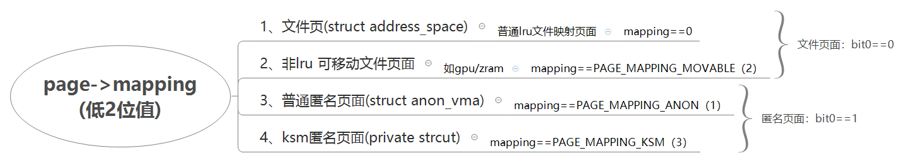

# 内存管理之page结构

**一、mapping**

\#define PAGE\_MAPPING\_ANON       0x1

\#define PAGE\_MAPPING\_MOVABLE    0x2

\#define PAGE\_MAPPING\_KSM        \(PAGE\_MAPPING\_ANON | PAGE\_MAPPING\_MOVABLE\)

\#define PAGE\_MAPPING\_FLAGS      \(PAGE\_MAPPING\_ANON | PAGE\_MAPPING\_MOVABLE\)

static \_\_always\_inline int PageMappingFlags\(struct page \*page\)

{

        return \(\(unsigned long\)page\-\>mapping & PAGE\_MAPPING\_FLAGS\) \!= 0;

}

static \_\_always\_inline int PageAnon\(struct page \*page\)

{

        page = compound\_head\(page\);

        return \(\(unsigned long\)page\-\>mapping & PAGE\_MAPPING\_ANON\) \!= 0;

}       

        

static \_\_always\_inline int \_\_PageMovable\(struct page \*page\)

{       

        return \(\(unsigned long\)page\-\>mapping & PAGE\_MAPPING\_FLAGS\) ==

                                PAGE\_MAPPING\_MOVABLE;

}

static \_\_always\_inline int PageKsm\(struct page \*page\)

{

        page = compound\_head\(page\);

        return \(\(unsigned long\)page\-\>mapping & PAGE\_MAPPING\_FLAGS\) ==

                                PAGE\_MAPPING\_KSM;

}

