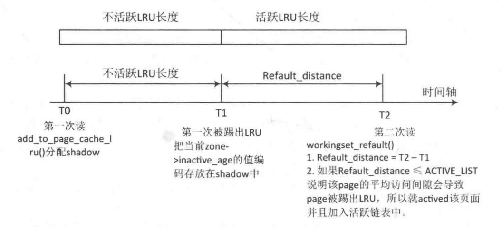
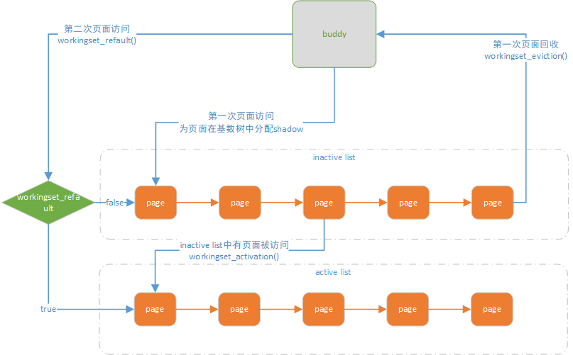

# 内存管理之refault distance

基于4.9.37内核版本分析

一、refault distance机制介绍

文件页面第一次访问时，加入inactive链表，如果文件页面，记链表为时间T0，经过时间T1\-T0，页面在inactive链表中移动不活跃链表的长度，则页面将被踢出LRU 链表。一段时间之后，页面又将被访问并加入不活跃链表，如此反复，将形成页面页面震荡。如果页面再次访问的时间T2与页面第一次被踢出LRU链表的时间T1之差refault distance，小于活跃链表的移动一轮的长度，那么可以将页面提前加入active 链表，解决部分问题。这就是refault distance策略。





```
int add_to_page_cache_lru(struct page *page, struct address_space *mapping,
                                pgoff_t offset, gfp_t gfp_mask)
{
        void *shadow = NULL;
        int ret;

        __SetPageLocked(page);
        ret = __add_to_page_cache_locked(page, mapping, offset,
                                         gfp_mask, &shadow);
        if (unlikely(ret))
                __ClearPageLocked(page);
        else {
                /*
                 * The page might have been evicted from cache only
                 * recently, in which case it should be activated like
                 * any other repeatedly accessed page.
                 * The exception is pages getting rewritten; evicting other
                 * data from the working set, only to cache data that will
                 * get overwritten with something else, is a waste of memory.
                 */
                if (!(gfp_mask & __GFP_WRITE) &&
                    shadow && workingset_refault(shadow)) {
                    //page 第二次访问时，通过refault判断是否需要将页面插入活跃链表
                        SetPageActive(page);
                        workingset_activation(page);
                } else
                    //其他情况清除active标志，加入不活跃链表
                        ClearPageActive(page);
                lru_cache_add(page);
        }
        return ret;
}
```

参考资料：

commit a528910e12ec7ee203095eb1711468a66b9b60b0

[http://tinylab.org/lwn\-495543/](http://tinylab.org/lwn-495543/)
