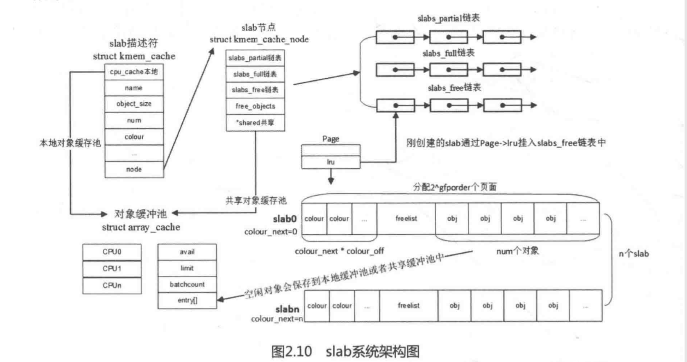
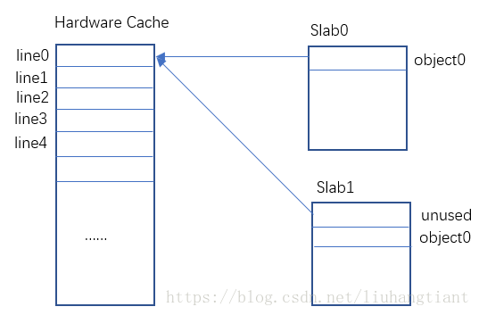
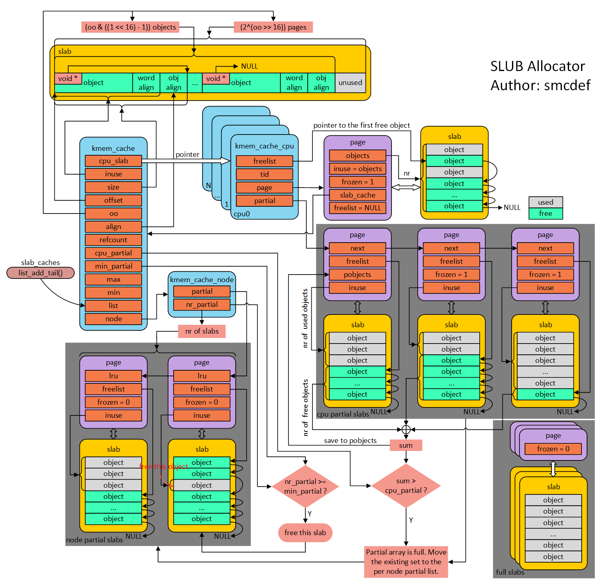

# 内存管理之slab

**SALB：**

1、数据结构

```
10 struct kmem_cache {
11 ▼       struct array_cache __percpu *cpu_cache;   /*每cpu cache描述符*/
12
13 /* 1) Cache tunables. Protected by slab_mutex */
14 ▼       unsigned int batchcount;
15 ▼       unsigned int limit;
16 ▼       unsigned int shared;
17
18 ▼       unsigned int size;
19 ▼       struct reciprocal_value reciprocal_buffer_size;
20 /* 2) touched by every alloc & free from the backend */
21
22 ▼       unsigned int flags;▼    ▼       /* constant flags */
23 ▼       unsigned int num;▼      ▼       /* # of objs per slab */
24
25 /* 3) cache_grow/shrink */
26 ▼       /* order of pgs per slab (2^n) */
27 ▼       unsigned int gfporder;
28
29 ▼       /* force GFP flags, e.g. GFP_DMA */
30 ▼       gfp_t allocflags;
31
32 ▼       size_t colour;▼ ▼       ▼       /* cache colouring range */
33 ▼       unsigned int colour_off;▼       /* colour offset */
34 ▼       struct kmem_cache *freelist_cache;
35 ▼       unsigned int freelist_size;
36
37 ▼       /* constructor func */
38 ▼       void (*ctor)(void *obj);
39
40 /* 4) cache creation/removal */
41 ▼       const char *name;
42 ▼       struct list_head list;
43 ▼       int refcount;
44 ▼       int object_size;
45 ▼       int align;        
73 ▼       int obj_offset;
87 ▼       struct kmem_cache_node *node[MAX_NUMNODES];
88 };

183 struct array_cache {
184 ▼       unsigned int avail;  /*当前cpu上有多少个可用的对象*/
185 ▼       unsigned int limit; /*per_cpu里面最大的对象的个数，当超过这个值时，将对象返回给伙伴系统*/
186 ▼       unsigned int batchcount;      /*一次转入和转出的对象*/                                                                                        187 ▼       unsigned int touched;  /*标示本地cpu最近是否被使用*/
188 ▼       void *entry[];▼ /*
189 ▼       ▼       ▼        * Must have this definition in here for the proper
190 ▼       ▼       ▼        * alignment of array_cache. Also simplifies accessing
191 ▼       ▼       ▼        * the entries.
192 ▼       ▼       ▼        */
            //ac->entry[0]  --> ac->entry[--ac->avail]  从代码看数组前avail-1个元素指向的obj是可用的obj
            //本质上分配和释放n个缓存对象，都是对ac->avail减或加你，并把对应的ac->entry[]元素指向obj地址
            //当本地cpu缓存不足或者多了之后，先将多余的obj挪到 node指向的share 缓存。
            //如果还不够，则从slabs_partial、slabs_full、slabs_free链表中取page来分配或者将多出来的slab page移动到list中
            //如果list中不够或者有多余，则通过buddy系统来进行分配页或者释放页。
193 };

428 struct kmem_cache_node {
429 ▼       spinlock_t list_lock;
430
431 #ifdef CONFIG_SLAB
432 ▼       struct list_head slabs_partial;▼/* partial list first, better asm code */
433 ▼       struct list_head slabs_full;
434 ▼       struct list_head slabs_free;
//slabs_partial、slabs_full、slabs_free，每个链表中挂着都是slab结构。其中，已经有部分obj被分配出去的slab均挂在slabs_partial下；全部obj都被分配出去的slab挂在slabs_full下；全部obj都未分配出去的slab挂在slabs_free下。
435 ▼       unsigned long num_slabs;
436 ▼       unsigned long free_objects;
437 ▼       unsigned int free_limit;
438 ▼       unsigned int colour_next;▼      /* Per-node cache coloring */
439 ▼       struct array_cache *shared;▼    /* shared per node */  /*基于node的共享cache，如果cpu本地cache不足，从此处填充过去*/
440 ▼       struct alien_cache **alien;▼    /* on other nodes */
441 ▼       unsigned long next_reap;▼       /* updated without locking */
442 ▼       int free_touched;▼      ▼       /* updated without locking */
443 #endif
455 };

163 #if FREELIST_BYTE_INDEX
164 typedef unsigned char freelist_idx_t;                                                                                            
165 #else
166 typedef unsigned short freelist_idx_t;
167 #endif
```



1、\_\_kmem\_cache\_create：

```
2083 ▼       cachep->align = ralign;
2084 ▼       cachep->colour_off = cache_line_size();  // arm-v6:#define CACHE_LINE_SIZE▼▼       32  
2085 ▼       /* Offset must be a multiple of the alignment. */
2086 ▼       if (cachep->colour_off < cachep->align)
2087 ▼       ▼       cachep->colour_off = cachep->align;

2119 ▼       size = ALIGN(size, cachep->align); //计算出对齐后的size

```

\_\_kmem\_cache\_create\-》set\_objfreelist\_slab\_cache\-》calculate\_slab\_order //相当于把order和obj的num都计算出来

```
1789 ▼       for (gfporder = 0; gfporder <= KMALLOC_MAX_ORDER; gfporder++) {
1790 ▼       ▼       unsigned int num;
1791 ▼       ▼       size_t remainder;
1792
1793 ▼       ▼       num = cache_estimate(gfporder, size, flags, &remainder); //根据
1794 ▼       ▼       if (!num)
1795 ▼       ▼       ▼       continue;
1800
1801 ▼       ▼       if (flags & CFLGS_OFF_SLAB) {  //如果是管理数据freelist数组在slab page之外
1802 ▼       ▼       ▼       struct kmem_cache *freelist_cache;
1803 ▼       ▼       ▼       size_t freelist_size;
1804
1805 ▼       ▼       ▼       freelist_size = num * sizeof(freelist_idx_t);
1806 ▼       ▼       ▼       freelist_cache = kmalloc_slab(freelist_size, 0u);  //根据freelist_size找到对应合适的slab缓存用于存放freelist管理数据
1807 ▼       ▼       ▼       if (!freelist_cache)
1808 ▼       ▼       ▼       ▼       continue;
1809
1814 ▼       ▼       ▼       if (OFF_SLAB(freelist_cache)) //avoid possible looping condition 这里检查CFLGS_OFF_SLAB标志，避免循环
1815 ▼       ▼       ▼       ▼       continue;
1817 ▼       ▼       ▼       /* check if off slab has enough benefit */
1818 ▼       ▼       ▼       if (freelist_cache->size > cachep->size / 2) //如何理解？？    
1819 ▼       ▼       ▼       ▼       continue;
1820 ▼       ▼       }
1821
1822 ▼       ▼       /* Found something acceptable - save it away */
1823 ▼       ▼       cachep->num = num;
1824 ▼       ▼       cachep->gfporder = gfporder;
1825 ▼       ▼       left_over = remainder;

1845 ▼       ▼       if (left_over * 8 <= (PAGE_SIZE << gfporder))
1846 ▼       ▼       ▼       break;
1847 ▼       }

cache_estimate：根据order计算obj的数量，可以看到有CFLGS_OFF_SLAB，是把管理数据freelist数组不算入其中，即这部分数据放到slab page之外
463 ▼       if (flags & (CFLGS_OBJFREELIST_SLAB | CFLGS_OFF_SLAB)) {
464 ▼       ▼       num = slab_size / buffer_size;
465 ▼       ▼       *left_over = slab_size % buffer_size;
466 ▼       } else {
467 ▼       ▼       num = slab_size / (buffer_size + sizeof(freelist_idx_t));
468 ▼       ▼       *left_over = slab_size %
469 ▼       ▼       ▼       (buffer_size + sizeof(freelist_idx_t));
470 ▼       }

```

freelist：freelist是一个数组，大多数情况下是unsigned char类型，在本obj索引所在的freelist位置，存放下一个空闲对象的索引。（备注：如果obj是已分配，则对应的index freelist元素无效，如未分配则存放下一个obj的索引，最后一个obj对应的freelist数组项存放结束标记）。如果没有 CFLGS\_OFF\_SLAB标志，则存放在slab page中，否则存放在另外申请的内存中。

```
如果是外置的freelist数组，则其真正分配在：
255 #define▼OFF_SLAB(x)▼    ((x)->flags & CFLGS_OFF_SLAB)
2186 ▼       if (OFF_SLAB(cachep)) {
2187 ▼       ▼       cachep->freelist_cache =
2188 ▼       ▼       ▼       kmalloc_slab(cachep->freelist_size, 0u);
2189 ▼       }
```

```
set_off_slab_cache：
left = calculate_slab_order(cachep, size, flags | CFLGS_OFF_SLAB); //left是总的page内存和对单个obj占用的内存求余
if (left >= cachep->num * sizeof(freelist_idx_t))  //如果left的空间足够存放freelist数组，则优先选用on-slab,管理freelist在slab page上，否则使用off-slab管理数据在slab page外
      return false;
cachep->colour = left / cachep->colour_off;   //cachep->colour存放的是空闲数据中可保留的cache line的数量 
```

**\_\_\_\_cache\_alloc：**

1、如果本地CPU缓存存在空闲对象，则直接分配objp = ac\-\>entry\[\-\-ac\-\>avail\];

2、否则通过函数cache\_alloc\_refill进行分配

```
//从from传nr个obj对象至to，实质上是拷贝nr个指向obj的只知道to 这个array_cache
619 static int transfer_objects(struct array_cache *to,                                                                               
620 ▼       ▼       struct array_cache *from, unsigned int max)
621 {
628 ▼       memcpy(to->entry + to->avail, from->entry + from->avail -nr,
629 ▼       ▼       ▼       sizeof(void *) *nr);
630
631 ▼       from->avail -= nr;
632 ▼       to->avail += nr;
634 }

//如果共享缓存中也没有，则从slabs_partial/slabs_free列表中取page，进行obj的分配
3032 ▼       while (batchcount > 0) {
3033 ▼       ▼       /* Get slab alloc is to come from. */
3034 ▼       ▼       page = get_first_slab(n, false);       //取到一个page                                                                         
3040 ▼       ▼       batchcount = alloc_block(cachep, ac, page, batchcount);
3041 ▼       ▼       fixup_slab_list(cachep, n, page, &list);
3042 ▼       }

//alloc_block 从page中
2615 static void *slab_get_obj(struct kmem_cache *cachep, struct page *page)
2616 {
2617 ▼       void *objp;                                                                                                               
2619 ▼       objp = index_to_obj(cachep, page, get_free_obj(page, page->active)); //get_free_obj主体((freelist_idx_t *)page->freelist)[idx];
            //通过active找到page中最后一个被使用的obj对应的freelist元素，该元素中存放的是一个空闲obj的index，通过该index找到空闲obj。
            //如果obj是从前往后使用，为何不直接用page->active作为index？此处freelist的结构和书上描述不一致。  page->freelist)[active]---page->freelist)[end]
            //中存放的是当前空闲的obj index，freelist起到一个映射表的作用。
2620 ▼       page->active++;  //acitive表示page中已分配的obj数量 BUG_ON(page->active >= cachep->num);这行代码可以看出cachep->num是page中obj总数为num
2627 ▼       return objp;
2628 }
2630 static void slab_put_obj(struct kmem_cache *cachep,
2631 ▼       ▼       ▼       struct page *page, void *objp)
2632 {
2633 ▼       unsigned int objnr = obj_to_index(cachep, page, objp);
2646 ▼       page->active--;
2650 ▼       set_free_obj(page, page->active, objnr);  //(page->freelist))[idx] = val;
2651 }

//如果list当中也没空间，则重新从buddy中分配
cache_grow_begin：
2700 ▼       page = kmem_getpages(cachep, local_flags, nodeid);  //从buddy中获取page
2719 ▼       freelist = alloc_slabmgmt(cachep, page, offset,      //映射到虚拟地址等
2720 ▼       ▼       ▼       local_flags & ~GFP_CONSTRAINT_MASK, page_node);
2727 ▼       cache_init_objs(cachep, page); //初始化page及freelist等

kmem_cache_create-》__kmem_cache_alias-》find_mergeable
创建新的cache时，会去遍历现有的cache，如果有非常贴近的cache可以选择合并而不创建新的cache
272 ▼       list_for_each_entry_reverse(s, &slab_caches, list) {
273 ▼       ▼       if (slab_unmergeable(s))
274 ▼       ▼       ▼       continue;
275
276 ▼       ▼       if (size > s->size)  
277 ▼       ▼       ▼       continue;
278
279 ▼       ▼       if ((flags & SLAB_MERGE_SAME) != (s->flags & SLAB_MERGE_SAME))
280 ▼       ▼       ▼       continue;
281 ▼       ▼       /*
282 ▼       ▼        * Check if alignment is compatible.
283 ▼       ▼        * Courtesy of Adrian Drzewiecki
284 ▼       ▼        */
285 ▼       ▼       if ((s->size & ~(align - 1)) != s->size)
286 ▼       ▼       ▼       continue;
287
288 ▼       ▼       if (s->size - size >= sizeof(void *))  //申请的cache大小和合并入的cache size相差小于字长
289 ▼       ▼       ▼       continue;
290
291 ▼       ▼       if (IS_ENABLED(CONFIG_SLAB) && align &&                                                                           
292 ▼       ▼       ▼       (align > s->align || s->align % align))
293 ▼       ▼       ▼       continue;
294
295 ▼       ▼       return s;
296 ▼       }
```

**\_\_\_cache\_free：**

```
3538 ▼       if (ac->avail < ac->limit) {
3539 ▼       ▼       STATS_INC_FREEHIT(cachep);
3540 ▼       } else {
3541 ▼       ▼       STATS_INC_FREEMISS(cachep);
3542 ▼       ▼       cache_flusharray(cachep, ac);       //如果cpu本地缓存大于limit数，则进行对象回收工作                                                
3543 ▼       }

3554 ▼       ac->entry[ac->avail++] = objp;   //将obj添加到本地缓存，即为释放

cache_flusharray：
3469 ▼       if (n->shared) {
3470 ▼       ▼       struct array_cache *shared_array = n->shared;
3471 ▼       ▼       int max = shared_array->limit - shared_array->avail;
3472 ▼       ▼       if (max) {  //如果共享缓存中空闲obj小于limit，则把cpu 本地缓存部分移动到共享缓存
3473 ▼       ▼       ▼       if (batchcount > max)
3474 ▼       ▼       ▼       ▼       batchcount = max;
3475 ▼       ▼       ▼       memcpy(&(shared_array->entry[shared_array->avail]),
3476 ▼       ▼       ▼              ac->entry, sizeof(void *) * batchcount);
3477 ▼       ▼       ▼       shared_array->avail += batchcount;
3478 ▼       ▼       ▼       goto free_done;
3479 ▼       ▼       }                                                                                                                 
3480 ▼       }
3481
3482 ▼       free_block(cachep, ac->entry, batchcount, node, &list);  //否则，释放batchcount个对象，可能会销毁slab,将相应的page放到freelist/partiallist
3483 free_done:
3498 ▼       slabs_destroy(cachep, &list);   //obj过多，此处会调用free_page释放页到buddy系统
3499 ▼       ac->avail -= batchcount;
3500 ▼       memmove(ac->entry, &(ac->entry[batchcount]), sizeof(void *)*ac->avail);
```

**slab的color和cache line对齐：**

一个kmem\_cache实例会维护一个或多个slab，两个slab可能对应的cache行很有可能冲突，最极端（理论上来说也很常见）的情况就是两个slab在cache中完全冲突。

\(这里的slab是否是指一个page，page中包含多个obj？？\)

出现cache行冲突的核心是obj分散在不同的不同的page中，在CPU访问切换不同的obj过程中，页内偏移相同的obj则可能从cache中刷出，所以通过color的方式，调整偏移减少cache冲突的问题。



kmalloc是否可以分配高端内存？

kmalloc和slab分配的物理页只能从nomal zone（低端内存）进行分配

```
2690 ▼       local_flags = flags & (GFP_CONSTRAINT_MASK|GFP_RECLAIM_MASK); //此处mask没有highmem的标志，分页只能从nomal zone（低端内存）进行分配
2700 ▼       page = kmem_getpages(cachep, local_flags, nodeid);

2718 ▼       /* Get slab management. */
2719 ▼       freelist = alloc_slabmgmt(cachep, page, offset,                                                                           
2720 ▼       ▼       ▼       local_flags & ~GFP_CONSTRAINT_MASK, page_node);
alloc_slabmgmt:
2395 ▼       void *addr = page_address(page);  //此处将低端内存page转换成虚拟地址，不涉及高端
```


