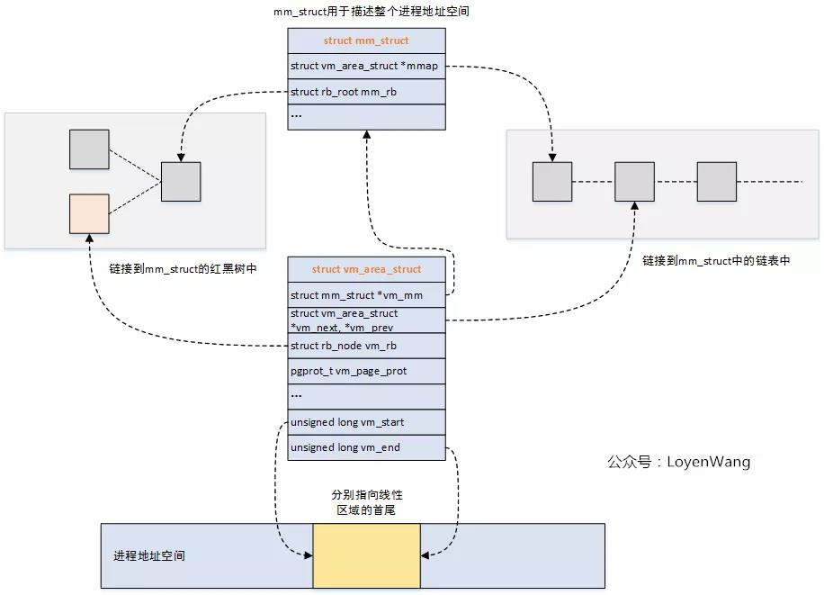
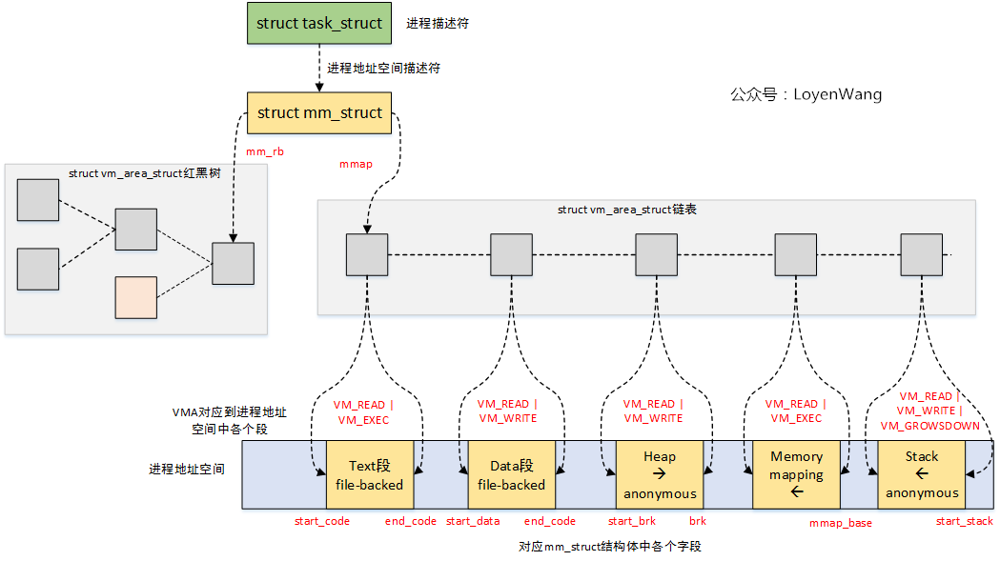

# 内存管理之vma/malloc/mmap

内核态高端内存映射使用struct vm\_struct描述虚拟地址到物理地址的映射关系，那么用户态的0\-3G地址空间，如何将离散的虚拟地址空间段映射物理地址空间，用什么数据结构进行描述？

```
294 /*                                                                                                                                 
295  * This struct defines a memory VMM memory area. There is one of these
296  * per VM-area/task.  A VM area is any part of the process virtual memory
297  * space that has a special rule for the page-fault handlers (ie a shared
298  * library, the executable area etc).
299  */
300 struct vm_area_struct {
301 ▼       /* The first cache line has the info for VMA tree walking. */
302
303 ▼       unsigned long vm_start;▼▼       /* Our start address within vm_mm. */
304 ▼       unsigned long vm_end;▼  ▼       /* The first byte after our end address
305 ▼       ▼       ▼       ▼       ▼          within vm_mm. */
306
307 ▼       /* linked list of VM areas per task, sorted by address */
308 ▼       struct vm_area_struct *vm_next, *vm_prev;      //双链表
309
310 ▼       struct rb_node vm_rb;                          //红黑树节点
320 ▼       /* Second cache line starts here. */
321
322 ▼       struct mm_struct *vm_mm;▼       /* The address space we belong to. */
323 ▼       pgprot_t vm_page_prot;▼ ▼       /* Access permissions of this VMA. */  //vma的访问权限
324 ▼       unsigned long vm_flags;▼▼       /* Flags, see mm.h. */
325
326 ▼       /*
327 ▼        * For areas with an address space and backing store,
328 ▼        * linkage into the address_space->i_mmap interval tree.
329 ▼        */
330 ▼       struct {
331 ▼       ▼       struct rb_node rb;
332 ▼       ▼       unsigned long rb_subtree_last;
333 ▼       } shared;
334
335 ▼       /*
336 ▼        * A file's MAP_PRIVATE vma can be in both i_mmap tree and anon_vma
337 ▼        * list, after a COW of one of the file pages.▼ A MAP_SHARED vma
338 ▼        * can only be in the i_mmap tree.  An anonymous MAP_PRIVATE, stack
339 ▼        * or brk vma (with NULL file) can only be in an anon_vma list.
340 ▼        */
341 ▼       struct list_head anon_vma_chain; /* Serialized by mmap_sem &
342 ▼       ▼       ▼       ▼       ▼         * page_table_lock */
343 ▼       struct anon_vma *anon_vma;▼     /* Serialized by page_table_lock */
344
345 ▼       /* Function pointers to deal with this struct. */
346 ▼       const struct vm_operations_struct *vm_ops;  //通常用于文件映射的操作方法
347
348 ▼       /* Information about our backing store: */
349 ▼       unsigned long vm_pgoff;▼▼       /* Offset (within vm_file) in PAGE_SIZE
350 ▼       ▼       ▼       ▼       ▼          units */
351 ▼       struct file * vm_file;▼ ▼       /* File we map to (can be NULL). */ //指向file实例，应该是映射的文件
352 ▼       void * vm_private_data;▼▼       /* was vm_pte (shared mem) */
357 #ifdef CONFIG_NUMA
358 ▼       struct mempolicy *vm_policy;▼   /* NUMA policy for the VMA */
359 #endif
360 ▼       struct vm_userfaultfd_ctx vm_userfaultfd_ctx;
361 };

396 struct mm_struct {
397 ▼       struct vm_area_struct *mmap;▼   ▼       /* list of VMAs */  //指向vma的链表，组成一个进程的映射关系
398 ▼       struct rb_root mm_rb;   //红黑树的根节点
            ......
}
```




