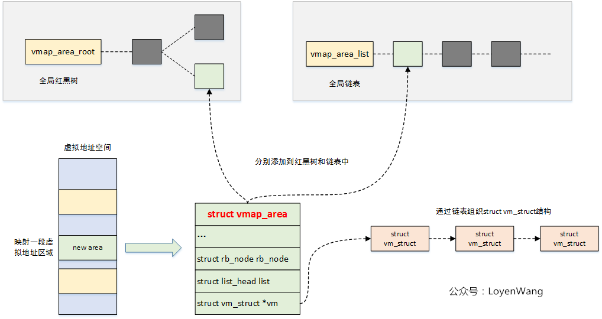

# 内存管理之vmalloc结构

数据结构

```
//vm_struct表示一段虚拟映射
32 struct vm_struct {
33 ▼       struct vm_struct▼       *next;  //指向下一个，通过该结构形成单链表，表示多段物理地址不连续的映射？
34 ▼       void▼   ▼       ▼       *addr;  //虚拟地址？？
35 ▼       unsigned long▼  ▼       size;   //
36 ▼       unsigned long▼  ▼       flags;
37 ▼       struct page▼    ▼       **pages;    //指向一个地址，这个地址空间存放着pages的地址，这些page可以是物理地址不连续的，供虚拟地址映射
38 ▼       unsigned int▼   ▼       nr_pages;   //映射的page数量
39 ▼       phys_addr_t▼    ▼       phys_addr;  //物理地址
40 ▼       const void▼     ▼       *caller;
41 };
42
//vmap_area描述的是一段分配的虚拟地址
43 struct vmap_area {
44 ▼       unsigned long va_start;         //分配的这段虚拟地址的起始地址
45 ▼       unsigned long va_end;           //分配的这段虚拟地址的结束地址
46 ▼       unsigned long flags;
47 ▼       struct rb_node rb_node;         /* address sorted rbtree */  //通过rb_node挂到全局的vmap_area_root红黑树上
48 ▼       struct list_head list;          /* address sorted list */   //将所有的vmap_area连接成链表，其中链表头为全局变量vmap_area_list
49 ▼       struct llist_node purge_list;    /* "lazy purge" list */
50 ▼       struct vm_struct *vm;  //vm用于管理虚拟地址和物理页之间的映射关系，可以将struct vm_struct构成一个链表，维护多段映射？
51 ▼       struct rcu_head rcu_head;
52 };
```



vmap\_area\_root:    将已分配的vmap\_area，按照地址顺序（其实也可以说是按照start地址顺序），从小到大，放进红黑树中。

vmap\_area\_list:      将已分配的vmap\_area ，按照地址顺序，从小到大的顺序，链接进双链表中

代码流程

```
1771 void *vmalloc(unsigned long size)
1772 {
1773 ▼       return __vmalloc_node_flags(size, NUMA_NO_NODE,                                                                           
1774 ▼       ▼       ▼       ▼           GFP_KERNEL | __GFP_HIGHMEM);
1775 }
1755 static inline void *__vmalloc_node_flags(unsigned long size,
1756 ▼       ▼       ▼       ▼       ▼       int node, gfp_t flags)
1757 {
1758 ▼       return __vmalloc_node(size, 1, flags, PAGE_KERNEL,
1759 ▼       ▼       ▼       ▼       ▼       node, __builtin_return_address(0));
1760 }
1740 static void *__vmalloc_node(unsigned long size, unsigned long align,
1741 ▼       ▼       ▼           gfp_t gfp_mask, pgprot_t prot,
1742 ▼       ▼       ▼           int node, const void *caller)
1743 {
1744 ▼       return __vmalloc_node_range(size, align, VMALLOC_START, VMALLOC_END,   //映射虚拟地址的start和end，即高端内存的虚拟地址空间
1745 ▼       ▼       ▼       ▼       gfp_mask, prot, 0, node, caller);
1746 }

1683 void *__vmalloc_node_range(unsigned long size, unsigned long align,
1684 ▼       ▼       ▼       unsigned long start, unsigned long end, gfp_t gfp_mask,
1685 ▼       ▼       ▼       pgprot_t prot, unsigned long vm_flags, int node,
1686 ▼       ▼       ▼       const void *caller)
1687 {
1692 ▼       size = PAGE_ALIGN(size);   //对size进行按页对齐，从此处可以看出vmalloc适合分配不连续的大块内存，否则如果分配小块内存会造成内存浪费
1696 ▼       area = __get_vm_area_node(size, align, VM_ALLOC | VM_UNINITIALIZED |
1697 ▼       ▼       ▼       ▼       vm_flags, start, end, node, gfp_mask, caller);//从高端内存中查找一个可用的地址空间，优先使用已分配空间中的hole空间
1698 ▼       if (!area)
1699 ▼       ▼       goto fail;
1700
1701 ▼       addr = __vmalloc_area_node(area, gfp_mask, prot, node);  
1702 ▼       if (!addr)
1703 ▼       ▼       return NULL;
1704
1705 ▼       /*
1706 ▼        * In this function, newly allocated vm_struct has VM_UNINITIALIZED
1707 ▼        * flag. It means that vm_struct is not fully initialized.
1708 ▼        * Now, it is fully initialized, so remove this flag here.
1709 ▼        */
1710 ▼       clear_vm_uninitialized_flag(area);
1725 }
```

```
alloc_vmap_area： //在alloc函数中，更多的是体现在组建红黑树，暂时并没有利用到红黑树查找插入速度快的优势
415 ▼       if (free_vmap_cache) {  //free_vmap_cache作为上一次搜索的缓存记录
416 ▼       ▼       first = rb_entry(free_vmap_cache, struct vmap_area, rb_node);
417 ▼       ▼       addr = ALIGN(first->va_end, align);
418 ▼       ▼       if (addr < vstart)
419 ▼       ▼       ▼       goto nocache;
420 ▼       ▼       if (addr + size < addr)
421 ▼       ▼       ▼       goto overflow;
422
423 ▼       } else {
424 ▼       ▼       addr = ALIGN(vstart, align); //addr相当于是高端内存地址空间的开始地址
425 ▼       ▼       if (addr + size < addr)
426 ▼       ▼       ▼       goto overflow;
427
428 ▼       ▼       n = vmap_area_root.rb_node;
429 ▼       ▼       first = NULL;
430
431 ▼       ▼       while (n) {  //如果从此处退出while循环，则有一种可能是VMALLOC_START开始一段空间还没有被分配，只是其后有空间被分配了
432 ▼       ▼       ▼       struct vmap_area *tmp;
433 ▼       ▼       ▼       tmp = rb_entry(n, struct vmap_area, rb_node);
434 ▼       ▼       ▼       if (tmp->va_end >= addr) {
435 ▼       ▼       ▼       ▼       first = tmp;
436 ▼       ▼       ▼       ▼       if (tmp->va_start <= addr)
437 ▼       ▼       ▼       ▼       ▼       break;  //如果进入break，则说明VMALLOC_START开始的地址已经被某一个已分配的vmap_area占用了
438 ▼       ▼       ▼       ▼       n = n->rb_left;
439 ▼       ▼       ▼       } else
440 ▼       ▼       ▼       ▼       n = n->rb_right;
441 ▼       ▼       }
442
443 ▼       ▼       if (!first)   //如果进入此处，说明高端地址空间没有分配过空间vmap_area
444 ▼       ▼       ▼       goto found;
445 ▼       }

447 ▼       /* from the starting point, walk areas until a suitable hole is found */
448 ▼       while (addr + size > first->va_start && addr + size <= vend) {   //first 是当前addr后面一块的虚拟地址空间，如果addr + size小于first->va_start，说明从addr开始的size大小的空间可用于分配，跟已分配的first空间不会有重叠，跳出while循环，使用这块空间。
449 ▼       ▼       if (addr + cached_hole_size < first->va_start)
450 ▼       ▼       ▼       cached_hole_size = first->va_start - addr;  //cached_hole_size也是作为上次搜索记录的是最大的hole大小
            //运行到此处，说明first空间之前的hole大小不满足需求，则将addr切到first空间后面地址开始的hole。即把first->va_end传给addr
451 ▼       ▼       addr = ALIGN(first->va_end, align);
452 ▼       ▼       if (addr + size < addr)
453 ▼       ▼       ▼       goto overflow;
454
455 ▼       ▼       if (list_is_last(&first->list, &vmap_area_list))  //此处成立，说明所有已分配的地址空间（都挂在链表上）间的hole没有可用的空间，可以从最后一个已分配地址空间，开始进行分配了。
456 ▼       ▼       ▼       goto found;
457
458 ▼       ▼       first = list_next_entry(first, list);
459 ▼       }
461 found:
462 ▼       if (addr + size > vend)
463 ▼       ▼       goto overflow;
464
465 ▼       va->va_start = addr;
466 ▼       va->va_end = addr + size;
467 ▼       va->flags = 0;
468 ▼       __insert_vmap_area(va);             //两个操作：1、将vmap_area va加入到红黑树  2、将vmap_area va加入到链表 
469 ▼       free_vmap_cache = &va->rb_node;
470 ▼       spin_unlock(&vmap_area_lock);
```
