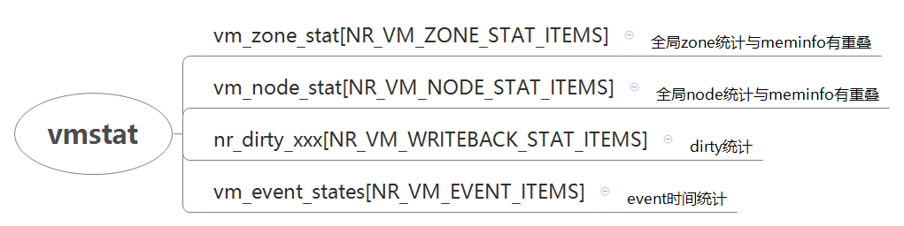
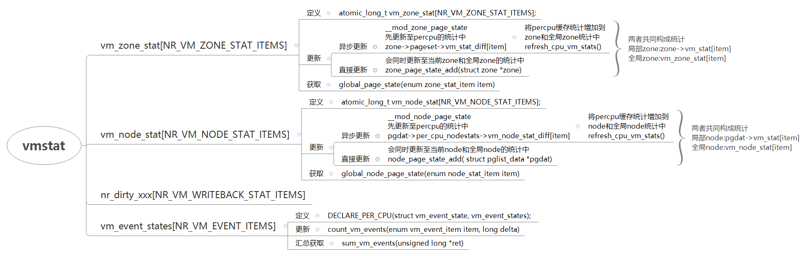

# 内存管理之vmstat统计



```
enum zone_stat_item {
        /* First 128 byte cacheline (assuming 64 bit words) */
        NR_FREE_PAGES,
        NR_ZONE_LRU_BASE, /* Used only for compaction and reclaim retry */
        NR_ZONE_INACTIVE_ANON = NR_ZONE_LRU_BASE,
        NR_ZONE_ACTIVE_ANON,
        NR_ZONE_INACTIVE_FILE,
        NR_ZONE_ACTIVE_FILE,
        NR_ZONE_UNEVICTABLE,
        NR_ZONE_WRITE_PENDING,  /* Count of dirty, writeback and unstable pages */
        NR_MLOCK,               /* mlock()ed pages found and moved off LRU */
        NR_SLAB_RECLAIMABLE,
        NR_SLAB_UNRECLAIMABLE,
        NR_PAGETABLE,           /* used for pagetables */
        NR_KERNEL_STACK_KB,     /* measured in KiB */
        NR_KAISERTABLE,
        NR_BOUNCE,
        /* Second 128 byte cacheline */
#if IS_ENABLED(CONFIG_ZSMALLOC)
        NR_ZSPAGES,             /* allocated in zsmalloc */
#endif
#ifdef CONFIG_NUMA
        NUMA_HIT,               /* allocated in intended node */
        NUMA_MISS,              /* allocated in non intended node */
        NUMA_FOREIGN,           /* was intended here, hit elsewhere */
        NUMA_INTERLEAVE_HIT,    /* interleaver preferred this zone */
        NUMA_LOCAL,             /* allocation from local node */
        NUMA_OTHER,             /* allocation from other node */
#endif
        NR_FREE_CMA_PAGES,
        NR_VM_ZONE_STAT_ITEMS };

enum node_stat_item {
        NR_LRU_BASE,
        NR_INACTIVE_ANON = NR_LRU_BASE, /* must match order of LRU_[IN]ACTIVE */
        NR_ACTIVE_ANON,         /*  "     "     "   "       "         */
        NR_INACTIVE_FILE,       /*  "     "     "   "       "         */
        NR_ACTIVE_FILE,         /*  "     "     "   "       "         */
        NR_UNEVICTABLE,         /*  "     "     "   "       "         */
        NR_ISOLATED_ANON,       /* Temporary isolated pages from anon lru */ 在shrink_page_list前后临时链表的页面
        NR_ISOLATED_FILE,       /* Temporary isolated pages from file lru */ 在shrink_page_list前后临时链表的页面
        NR_PAGES_SCANNED,       /* pages scanned since last reclaim */
        WORKINGSET_REFAULT,
        WORKINGSET_ACTIVATE,
        WORKINGSET_NODERECLAIM,
        NR_ANON_MAPPED, /* Mapped anonymous pages */
        NR_FILE_MAPPED, /* pagecache pages mapped into pagetables.
                           only modified from process context */
        NR_FILE_PAGES,
        NR_FILE_DIRTY,
        NR_WRITEBACK,
        NR_WRITEBACK_TEMP,      /* Writeback using temporary buffers */
        NR_SHMEM,               /* shmem pages (included tmpfs/GEM pages) */
        NR_SHMEM_THPS,
        NR_SHMEM_PMDMAPPED,
        NR_ANON_THPS,
        NR_UNSTABLE_NFS,        /* NFS unstable pages */
        NR_VMSCAN_WRITE,
        NR_VMSCAN_IMMEDIATE,    /* Prioritise for reclaim when writeback ends */
        NR_DIRTIED,             /* page dirtyings since bootup */
        NR_WRITTEN,             /* page writings since bootup */
        NR_VM_NODE_STAT_ITEMS
};

//统计获取
static inline unsigned long global_page_state(enum zone_stat_item item)
{
        long x = atomic_long_read(&vm_zone_stat[item]);
        return x;
}
static inline unsigned long global_node_page_state(enum node_stat_item item)
{
        long x = atomic_long_read(&vm_node_stat[item]);
        return x;
}

//将当前cpu的统计汇总至
static int refresh_cpu_vm_stats(bool do_pagesets)
{
        struct pglist_data *pgdat;
        struct zone *zone;
        int i;
        int global_zone_diff[NR_VM_ZONE_STAT_ITEMS] = { 0, };
        int global_node_diff[NR_VM_NODE_STAT_ITEMS] = { 0, };
        int changes = 0;

        //遍历zone，将per cpu统计数据汇总至zone->vm_stat
        for_each_populated_zone(zone) {
                struct per_cpu_pageset __percpu *p = zone->pageset;

                for (i = 0; i < NR_VM_ZONE_STAT_ITEMS; i++) {
                        int v;

                        v = this_cpu_xchg(p->vm_stat_diff[i], 0);
                        if (v) {

                                atomic_long_add(v, &zone->vm_stat[i]);
                                global_zone_diff[i] += v;
        }
                //遍历node，将per cpu数据汇总至pgdat->vm_stat
        for_each_online_pgdat(pgdat) {
                struct per_cpu_nodestat __percpu *p = pgdat->per_cpu_nodestats;

                for (i = 0; i < NR_VM_NODE_STAT_ITEMS; i++) {
                        int v;

                        v = this_cpu_xchg(p->vm_node_stat_diff[i], 0);
                        if (v) {
                                atomic_long_add(v, &pgdat->vm_stat[i]);
                                global_node_diff[i] += v;
                        }
                }
        }

        changes += fold_diff(global_zone_diff, global_node_diff);
        return changes;
}

//将全局的node/zone统计更新
static int fold_diff(int *zone_diff, int *node_diff)
{
        int i;
        int changes = 0;

        for (i = 0; i < NR_VM_ZONE_STAT_ITEMS; i++)
                if (zone_diff[i]) {
                        atomic_long_add(zone_diff[i], &vm_zone_stat[i]);
                        changes++;
        }

        for (i = 0; i < NR_VM_NODE_STAT_ITEMS; i++)
                if (node_diff[i]) {
                        atomic_long_add(node_diff[i], &vm_node_stat[i]);
                        changes++;
        }
        return changes;
}

//统计更新，将新增统计增加到pgdat->per_cpu_nodestats->vm_node_stat_diff[item] 中
//如果更新后的值大于阈值stat_threshold，则累进更新进全局node统计和当前node统计
void __mod_node_page_state(struct pglist_data *pgdat, enum node_stat_item item, long delta)
{
        struct per_cpu_nodestat __percpu *pcp = pgdat->per_cpu_nodestats;
        s8 __percpu *p = pcp->vm_node_stat_diff + item;
        long x;
        long t;

        x = delta + __this_cpu_read(*p);

        t = __this_cpu_read(pcp->stat_threshold);

        if (unlikely(x > t || x < -t)) {
                node_page_state_add(x, pgdat, item);
                x = 0;
        }
        __this_cpu_write(*p, x);
}
//zone统计更新至zone->pageset->vm_stat_diff[item]
//如果更新后的值大于阈值stat_threshold，则累进更新进全局zone统计和当前zone统计
void __mod_zone_page_state(struct zone *zone, enum zone_stat_item item, long delta)
{
        struct per_cpu_pageset __percpu *pcp = zone->pageset;
        s8 __percpu *p = pcp->vm_stat_diff + item;
        long x;
        long t;

        x = delta + __this_cpu_read(*p);

        t = __this_cpu_read(pcp->stat_threshold);

        if (unlikely(x > t || x < -t)) {
                zone_page_state_add(x, zone, item);
                x = 0;
        }
        __this_cpu_write(*p, x);
}
```

```
enum writeback_stat_item {      
        NR_DIRTY_THRESHOLD,     
        NR_DIRTY_BG_THRESHOLD,  
        NR_VM_WRITEBACK_STAT_ITEMS,
};
```

```
enum vm_event_item { PGPGIN, PGPGOUT, PSWPIN, PSWPOUT,
                FOR_ALL_ZONES(PGALLOC),
                FOR_ALL_ZONES(ALLOCSTALL),
                FOR_ALL_ZONES(PGSCAN_SKIP),
                PGFREE, 
                PGACTIVATE,  //从启动到现在激活的页数,一个只会增加的统计
                PGDEACTIVATE,
                PGFAULT, PGMAJFAULT,
                PGLAZYFREED,
                PGREFILL,
                PGSTEAL_KSWAPD,  //#从启动到现在kswapd后台进程扫描的页面数
                PGSTEAL_DIRECT,  //#从启动到现在直接回收扫描的的页面数
                PGSCAN_KSWAPD,   //#从启动到现在kswapd后台进程回收的页面数
                PGSCAN_DIRECT,   //#从启动到现在直接回收的页面数
                PGSCAN_DIRECT_THROTTLE,
#ifdef CONFIG_NUMA
                PGSCAN_ZONE_RECLAIM_FAILED,
#endif
                PGINODESTEAL, 
                SLABS_SCANNED,  //shrink_slab时，扫描的slab缓存对象数量
                KSWAPD_INODESTEAL,
                KSWAPD_LOW_WMARK_HIT_QUICKLY, KSWAPD_HIGH_WMARK_HIT_QUICKLY,
                PAGEOUTRUN, PGROTATED,
                DROP_PAGECACHE, //从echo 1 > /proc/sys/vm/drop_caches 入口drop pagecahe的次数，每进行一次+1
                DROP_SLAB,      // 从echo 2 > /proc/sys/vm/drop_caches 入口drop slab缓存的次数，每进行一次+1
#ifdef CONFIG_NUMA_BALANCING
                NUMA_PTE_UPDATES,
                NUMA_HUGE_PTE_UPDATES,
                NUMA_HINT_FAULTS,
                NUMA_HINT_FAULTS_LOCAL,
                NUMA_PAGE_MIGRATE,
#endif
#ifdef CONFIG_MIGRATION
                PGMIGRATE_SUCCESS, PGMIGRATE_FAIL,  //迁移成功/失败的页数量
#endif
#ifdef CONFIG_COMPACTION
                COMPACTMIGRATE_SCANNED, //扫描的可移动页面数，扫描包括非可移动页面
                COMPACTFREE_SCANNED, //扫描的空闲页面数，扫描中包括非空闲页面
                COMPACTISOLATED, //隔离的可移动和空闲页面总数

                COMPACTSTALL, //进程进行了页面规整并至少有一个zone进行了规整时加1。在__alloc_pages_direct_compact中增加，=COMPACTFAIL+COMPACTSUCCESS
                COMPACTFAIL,   //规整失败的次数
                COMPACTSUCCESS, //规整成功的次数

                KCOMPACTD_WAKE, //kcompactd后台运行规整计数
#endif
#ifdef CONFIG_HUGETLB_PAGE
                HTLB_BUDDY_PGALLOC, HTLB_BUDDY_PGALLOC_FAIL,
#endif
                UNEVICTABLE_PGCULLED,   /* culled to noreclaim list */  //从active/inactive链表进入unevictable链表
                UNEVICTABLE_PGSCANNED,  /* scanned for reclaimability */ 
                UNEVICTABLE_PGRESCUED,  /* rescued from noreclaim list */ //从unevictable链表进入active/inactive链表
                UNEVICTABLE_PGMLOCKED,
                UNEVICTABLE_PGMUNLOCKED,
                UNEVICTABLE_PGCLEARED,  /* on COW, page truncate */
                UNEVICTABLE_PGSTRANDED, /* unable to isolate on unlock */
#ifdef CONFIG_TRANSPARENT_HUGEPAGE
                THP_FAULT_ALLOC,
                THP_FAULT_FALLBACK,
                THP_COLLAPSE_ALLOC,
                THP_COLLAPSE_ALLOC_FAILED,
                THP_FILE_ALLOC,
                THP_FILE_MAPPED,
                THP_SPLIT_PAGE,
                THP_SPLIT_PAGE_FAILED,
                THP_DEFERRED_SPLIT_PAGE,
                THP_SPLIT_PMD,
                THP_ZERO_PAGE_ALLOC,
                THP_ZERO_PAGE_ALLOC_FAILED,
#endif
#ifdef CONFIG_MEMORY_BALLOON
                BALLOON_INFLATE,
                BALLOON_DEFLATE,
#ifdef CONFIG_BALLOON_COMPACTION
                BALLOON_MIGRATE,
#endif
#endif
#ifdef CONFIG_DEBUG_TLBFLUSH
                NR_TLB_REMOTE_FLUSH,    /* cpu tried to flush others' tlbs */
                NR_TLB_REMOTE_FLUSH_RECEIVED,/* cpu received ipi for flush */
                NR_TLB_LOCAL_FLUSH_ALL,
                NR_TLB_LOCAL_FLUSH_ONE,
#endif /* CONFIG_DEBUG_TLBFLUSH */
#ifdef CONFIG_DEBUG_VM_VMACACHE
                VMACACHE_FIND_CALLS,
                VMACACHE_FIND_HITS,
                VMACACHE_FULL_FLUSHES,
#endif
                NR_VM_EVENT_ITEMS
};

统计方法：
DECLARE_PER_CPU(struct vm_event_state, vm_event_states);  //定义per cpu统计数据结构

统计汇总：
static void sum_vm_events(unsigned long *ret)
{
        int cpu;
        int i;

        memset(ret, 0, NR_VM_EVENT_ITEMS * sizeof(unsigned long));

        //遍历所有cpu，将各cpu统计数据累加到ret中
        for_each_online_cpu(cpu) {
                struct vm_event_state *this = &per_cpu(vm_event_states, cpu);  

                for (i = 0; i < NR_VM_EVENT_ITEMS; i++)
                        ret[i] += this->event[i];  
        }
}

统计更新：
static inline void count_vm_events(enum vm_event_item item, long delta)
{
        //将新增delta统计数据增加到当前cpu对应的vm_event_states.event[item]中
        this_cpu_add(vm_event_states.event[item], delta);
}
```



部分统计详解

- **kswapd\_low\_wmark\_hit\_quickly**

kswapd通过调用schedule\_timeout\(HZ/10\)休眠一段时间时，如果提前被唤醒，则说明当前系统的内存又达到了low水位，因此KSWAPD\_LOW\_WMARK\_HIT\_QUICKLY统计增加。

所以该统计表明系统达到low水位以下的一个速度，如果high水位偏低和系统内存消耗速度大时，这个值都容易增大。

- **kswapd\_high\_wmark\_hit\_quickly**

kswapd进入调用schedule\_timeout\(HZ/10\)休眠一段时间时，如果剩余时间为0，说明此时的水位在high以上，因为水位平衡是以high判断的。如果第二次prepare\_kswapd\_sleep判断

返回false，说明此时水位是低于high。在这种情况下KSWAPD\_HIGH\_WMARK\_HIT\_QUICKLY统计增加

所以该统计表明系统系统达到high水位以下的一个速度。

如果两者都增长的很快，说明系统内存长期处于较低且消耗较快的水平。

```
nr_free_pages 128835
nr_zone_inactive_anon 5558
nr_zone_active_anon 20383
nr_zone_inactive_file 205661
nr_zone_active_file 501871
nr_zone_unevictable 0
nr_zone_write_pending 30791
nr_mlock 0
nr_page_table_pages 2362
nr_kernel_stack 6544
nr_bounce 0
nr_zspages 0
nr_free_cma 0
numa_hit 45458437
numa_miss 0
numa_foreign 0
numa_interleave 44540
numa_local 45458437
numa_other 0
nr_inactive_anon 5558
nr_active_anon 20383
nr_inactive_file 205661
nr_active_file 501871
nr_unevictable 0
nr_slab_reclaimable 86642
nr_slab_unreclaimable 29084
nr_isolated_anon 0
nr_isolated_file 0
workingset_refault 180
workingset_activate 180
workingset_nodereclaim 12
nr_anon_pages 25172
nr_mapped 22482
nr_file_pages 708316
nr_dirty 30791
nr_writeback 0
nr_writeback_temp 0
nr_shmem 783
nr_shmem_hugepages 0
nr_shmem_pmdmapped 0
nr_anon_transparent_hugepages 0
nr_unstable 0
nr_vmscan_write 8
nr_vmscan_immediate_reclaim 0
nr_dirtied 1494385
nr_written 1335542
nr_dirty_threshold 161210
nr_dirty_background_threshold 80506
pgpgin 4025015
pgpgout 5629376
pswpin 8
pswpout 8
pgalloc_dma 51
pgalloc_dma32 42496890
pgalloc_normal 3462422
pgalloc_movable 0
allocstall_dma 0
allocstall_dma32 0
allocstall_normal 0
allocstall_movable 0
pgskip_dma 0
pgskip_dma32 0
pgskip_normal 0
pgskip_movable 0
pgfree 46090544
pgactivate 812705
pgdeactivate 8001
pglazyfree 0
pgfault 51255454
pgmajfault 12827
pglazyfreed 0
pgrefill 8713
pgsteal_kswapd 2761
pgsteal_direct 0
pgscan_kswapd 2813
pgscan_direct 0
pgscan_direct_throttle 0
zone_reclaim_failed 0
pginodesteal 0
slabs_scanned 387310
kswapd_inodesteal 440844
kswapd_low_wmark_hit_quickly 0
kswapd_high_wmark_hit_quickly 0
pageoutrun 7
pgrotated 581
drop_pagecache 0
drop_slab 0
oom_kill 0
numa_pte_updates 0
numa_huge_pte_updates 0
numa_hint_faults 0
numa_hint_faults_local 0
numa_pages_migrated 0
pgmigrate_success 0
pgmigrate_fail 0
compact_migrate_scanned 0
compact_free_scanned 0
compact_isolated 0
compact_stall 0
compact_fail 0
compact_success 0
compact_daemon_wake 0
compact_daemon_migrate_scanned 0
compact_daemon_free_scanned 0
htlb_buddy_alloc_success 0
htlb_buddy_alloc_fail 0
unevictable_pgs_culled 2
unevictable_pgs_scanned 0
unevictable_pgs_rescued 32
unevictable_pgs_mlocked 32
unevictable_pgs_munlocked 32
unevictable_pgs_cleared 0
unevictable_pgs_stranded 0
thp_fault_alloc 154
thp_fault_fallback 0
thp_collapse_alloc 0
thp_collapse_alloc_failed 0
thp_file_alloc 0
thp_file_mapped 0
thp_split_page 0
thp_split_page_failed 0
thp_deferred_split_page 154
thp_split_pmd 0
thp_split_pud 0
thp_zero_page_alloc 0
thp_zero_page_alloc_failed 0
thp_swpout 0
thp_swpout_fallback 0
balloon_inflate 0
balloon_deflate 0
balloon_migrate 0
swap_ra 6
swap_ra_hit 4
```
