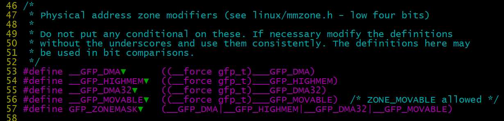
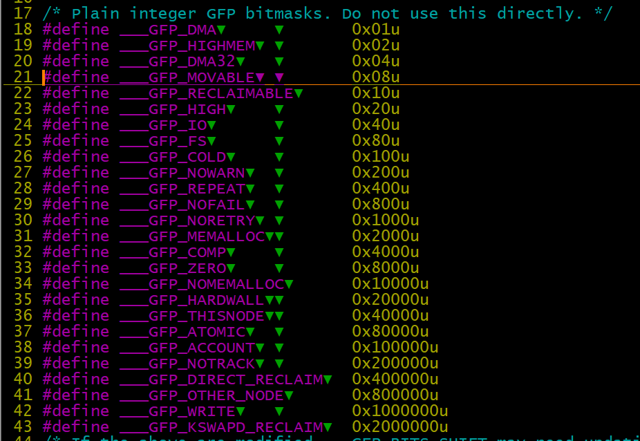
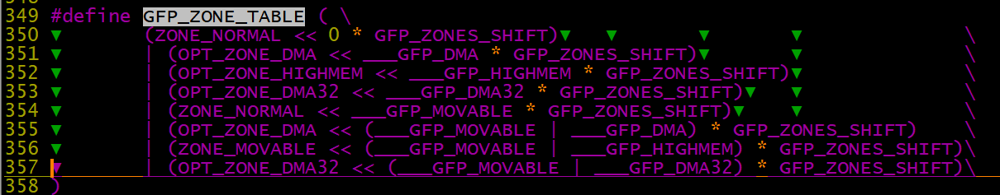
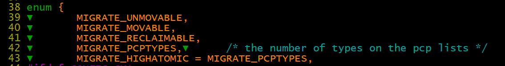
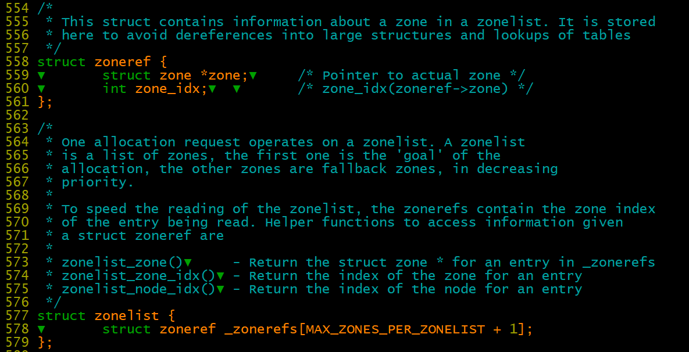
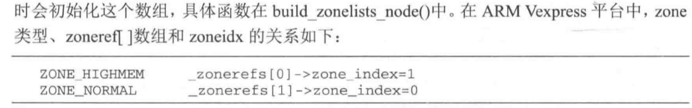

# 内存管理之伙伴系统buddy

```
struct zone {
    struct free_area▼       free_area[MAX_ORDER];
}；
 
  90 struct free_area {
  91 ▼       struct list_head▼       free_list[MIGRATE_TYPES];                                                                         
  92 ▼       unsigned long▼  ▼       nr_free;  //这个nr_free是当前order的块个数，实际的page数为nr_free << order
  93 };

//struct page中的lru元素用于将物理页链接起来，串进不同阶的free_area当中
struct page {
    //Third double word block
    struct list_head lru;▼  /* Pageout list, eg. active_list
121 ▼       ▼       ▼       ▼       ▼        * protected by zone_lru_lock !
122 ▼       ▼       ▼       ▼       ▼        * Can be used as a generic list
123 ▼       ▼       ▼       ▼       ▼        * by the page owner.
124 ▼       ▼       ▼       ▼       ▼        */
}

//buddy 迁移时使用到以下两个定义，具体如何使用。1024个page组成一个pageblock，同一个pageblock具备相同的迁移类型，用4bit的bitmap来描述迁移类型。
#define pageblock_order▼▼       (MAX_ORDER-1)
#define pageblock_nr_pages▼     (1UL << pageblock_order)

21 #define ___GFP_MOVABLE▼ ▼       0x08u
22 #define ___GFP_RECLAIMABLE▼     0x10u
```

%\!\(EXTRA markdown.ResourceType=, string=, string=\)

1、把内存按照页划分成很多阶，最大阶为MAX\_ORDER，一般设置为11，每个阶内存区的内存块数为2^n，我们称之为**内存区。**注意内核实际使用阶是0\-10，数量为11个阶，并未使用11阶，所以******free\_area\[MAX\_ORDER\]的定义其中只有11个元素，****MAX\_ORDER可以解释为阶的个数**。所以MAX\_ORDER决定了伙伴系统中，最大页面块的数量2^（MAX\_OEDER\-1），即MAX\_ORDER\_NR\_PAGES。

2、gfp\_zone根据flags的低4bit查表GFP\_ZONE\_TABLE得到对应内存分配zone\_type，低4bit为zone 域，如下：







3、\_\_alloc\_pages\_nodemask

gfpflags\_to\_migratetype\-》返回flags中的bit3\-bit4（ \_\_GFP\_MOVABLE和\_\_GFP\_RECLAIMABLE ），其具体值与以下枚举对应。



内核定义了一个内存结构，首先试图分配廉价的内存，再分配更昂贵的内存。

从廉价依次到昂贵：高端内存\-》低端内存\-》DMA内存，内核使用zonelist来描述这个层次结构。

zonelist:伙伴分配器会从zonelist开始分配内存，非NUMA结构如arm只有一个zonelist\[ZONELIST\_FALLBACK==0\],zonelist里面有一个\_zoneref\[\]数组。

zoneref数组的第一个成员指向的zone是页面分配器的第一个候选者，其他成员则是第一个候选者失败后才考虑，优先级逐渐降低。

申请内存使用zonelist：

创建初始化zonelist：

```
4501 static int build_zonelists_node(pg_data_t *pgdat, struct zonelist *zonelist,
4502 ▼       ▼       ▼       ▼       int nr_zones)
4503 {                                                                                                                                 
4504 ▼       struct zone *zone;
4505 ▼       enum zone_type zone_type = MAX_NR_ZONES;  //highmem是较大的type，因此会设置到_zonrefs数组后面的元素，因此higmem是较低优先级的内存
4507 ▼       do {
4508 ▼       ▼       zone_type--;
4509 ▼       ▼       zone = pgdat->node_zones + zone_type;
4510 ▼       ▼       if (managed_zone(zone)) {   //
4511 ▼       ▼       ▼       zoneref_set_zone(zone,
4512 ▼       ▼       ▼       ▼       &zonelist->_zonerefs[nr_zones++]);
4513 ▼       ▼       ▼       check_highest_zone(zone_type);
4514 ▼       ▼       }
4515 ▼       } while (zone_type);
4517 ▼       return nr_zones;
4518 }
4869 static void build_zonelists(pg_data_t *pgdat)
4870 {
4871 ▼       int node, local_node;
4872 ▼       enum zone_type j;
4873 ▼       struct zonelist *zonelist;
4874
4875 ▼       local_node = pgdat->node_id;
4876
4877 ▼       zonelist = &pgdat->node_zonelists[ZONELIST_FALLBACK];                                                                     
4878 ▼       j = build_zonelists_node(pgdat, zonelist, 0);
4898
4899 ▼       zonelist->_zonerefs[j].zone = NULL;
4900 ▼       zonelist->_zonerefs[j].zone_idx = 0;
4901 }
```

get\_page\_from\_freelist深入理解：该函数会通过for\_next\_zone\_zonelist\_nodemask从廉价内存zone开始遍历





```
//描述node
598 typedef struct pglist_data {
599 ▼       struct zone node_zones[MAX_NR_ZONES];
600 ▼       struct zonelist node_zonelists[MAX_ZONELISTS];                                                                            
601 ▼       int nr_zones;
}
577 struct zonelist {                                                                                                                 
578 ▼       struct zoneref _zonerefs[MAX_ZONES_PER_ZONELIST + 1];
579 };
558 struct zoneref {                                                                                                                  
559 ▼       struct zone *zone;▼     /* Pointer to actual zone */
560 ▼       int zone_idx;▼  ▼       /* zone_idx(zoneref->zone) */
561 };

__alloc_pages_nodemask：
        struct alloc_context ac = {
                .high_zoneidx = gfp_zone(gfp_mask),  //high_zoneidx通过分配标志计算出来，是最大可分配的zoneindex
                                                     //即大于此索引的zone不满足分配要求
                                                     //通常是index为 ZONE_HIGHMEM > ZONE_NORMALMEM > ZONE_DMA 
                                                     //在下面例子中high_zoneidx = 1
                .zonelist = zonelist,
                .nodemask = nodemask,
                .migratetype = gfpflags_to_migratetype(gfp_mask),
        };
        ac.preferred_zoneref = first_zones_zonelist(ac.zonelist, 
            ac.high_zoneidx, ac.nodemask); //从_zonerefs[0] 开始遍历，返回第一个小于zoneref->zone_idx小于highest_zoneidx的zoneref

//在UMA环境下，for_next_zone_zonelist_nodemask就是遍历一遍zonelist中的zone，返回小于或等于highest_zoneidx的zone
//所以整体看优先分配highmem再分配normalmem
//在get_page_from_freelist函数中起始的zoneref = ac->preferred_zonere
1016 #define for_next_zone_zonelist_nodemask(zone, z, zlist, highidx, nodemask) \                                                      
1017 ▼       for (zone = z->zone;▼   \
1018 ▼       ▼       zone;▼  ▼       ▼       ▼       ▼       ▼       ▼       \
1019 ▼       ▼       z = next_zones_zonelist(++z, highidx, nodemask),▼       \
1020 ▼       ▼       ▼       zone = zonelist_zone(z))

966 static __always_inline struct zoneref *next_zones_zonelist(struct zoneref *z,                                                     
967 ▼       ▼       ▼       ▼       ▼       enum zone_type highest_zoneidx,
968 ▼       ▼       ▼       ▼       ▼       nodemask_t *nodes)
969 {
970 ▼       if (likely(!nodes && zonelist_zone_idx(z) <= highest_zoneidx))
971 ▼       ▼       return z;
972 ▼       return __next_zones_zonelist(z, highest_zoneidx, nodes);
973 }

//从0开始遍历返回小于highest_zoneidx的zoneref，zoneref遍历核心函数
/* Returns the next zone at or below highest_zoneidx in a zonelist */
struct zoneref *__next_zones_zonelist(struct zoneref *z,
                                        enum zone_type highest_zoneidx,
                                        nodemask_t *nodes)
{
        if (likely(nodes == NULL))
                while (zonelist_zone_idx(z) > highest_zoneidx)
                        z++; //zoneref往上++
        else
                while (zonelist_zone_idx(z) > highest_zoneidx ||
                                (z->zone && !zref_in_nodemask(z, nodes)))
                        z++;
        return z;
}
static __always_inline struct zoneref *next_zones_zonelist(struct zoneref *z,
                                        enum zone_type highest_zoneidx,
                                        nodemask_t *nodes)
{
        if (likely(!nodes && zonelist_zone_idx(z) <= highest_zoneidx))
                return z;
        return __next_zones_zonelist(z, highest_zoneidx, nodes);
}

540 #define MAX_ZONES_PER_ZONELIST (MAX_NUMNODES * MAX_NR_ZONES)  //对于UMA arm 来说，等于zone的个数
542 enum {
543 ▼       ZONELIST_FALLBACK,▼     /* zonelist with fallback */  //正常arm只使用这一套zonelist，从后面的zone开始分配内存
544 #ifdef CONFIG_NUMA
549 ▼       ZONELIST_NOFALLBACK,▼   /* zonelist without fallback (__GFP_THISNODE) */
550 #endif
551 ▼       MAX_ZONELISTS
552 };
```

分配order\>1的具体实现:

\_\_rmqueue\_smallest\(zone, order, migratetype\)

```
1812 static inline
1813 struct page *__rmqueue_smallest(struct zone *zone, unsigned int order,
1814 ▼       ▼       ▼       ▼       ▼       ▼       int migratetype)
1815 {
1816 ▼       unsigned int current_order;
1817 ▼       struct free_area *area;
1818 ▼       struct page *page;
1819
1820 ▼       /* Find a page of the appropriate size in the preferred list */
1821 ▼       for (current_order = order; current_order < MAX_ORDER; ++current_order) {
1822 ▼       ▼       area = &(zone->free_area[current_order]);
1823 ▼       ▼       page = list_first_entry_or_null(&area->free_list[migratetype],
1824 ▼       ▼       ▼       ▼       ▼       ▼       ▼       struct page, lru);
1825 ▼       ▼       if (!page)
1826 ▼       ▼       ▼       continue;
1827 ▼       ▼       list_del(&page->lru);
1828 ▼       ▼       rmv_page_order(page);
1829 ▼       ▼       area->nr_free--;
1830 ▼       ▼       expand(zone, page, order, current_order, area, migratetype);
1831 ▼       ▼       set_pcppage_migratetype(page, migratetype);
1832 ▼       ▼       return page;
1833 ▼       }
1834
1835 ▼       return NULL;
1836 }

//参数migratetype表示的是申请的内存所具备的迁移特征
2204 static struct page *__rmqueue(struct zone *zone, unsigned int order,
2205 ▼       ▼       ▼       ▼       int migratetype)
2206 {
2207 ▼       struct page *page;
2208
2209 ▼       page = __rmqueue_smallest(zone, order, migratetype);
2210 ▼       if (unlikely(!page)) {                                                                                                    
2211 ▼       ▼       if (migratetype == MIGRATE_MOVABLE)  //如果申请的内存是MIGRATE_MOVABLE，则可以从CMA中分配pages
2212 ▼       ▼       ▼       page = __rmqueue_cma_fallback(zone, order);
2213
2214 ▼       ▼       if (!page)
2215 ▼       ▼       ▼       page = __rmqueue_fallback(zone, order, migratetype); //如果在migratetype对应的区域无法申请到内存。则采用降级的方法申请。
2216 ▼       }
2217
2218 ▼       trace_mm_page_alloc_zone_locked(page, order, migratetype);
2219 ▼       return page;
2220 }

降级排序的原理？
1843 static int fallbacks[MIGRATE_TYPES][4] = {                                                                                        
1844 ▼       [MIGRATE_UNMOVABLE]   = { MIGRATE_RECLAIMABLE, MIGRATE_MOVABLE,   MIGRATE_TYPES },
1845 ▼       [MIGRATE_RECLAIMABLE] = { MIGRATE_UNMOVABLE,   MIGRATE_MOVABLE,   MIGRATE_TYPES },
1846 ▼       [MIGRATE_MOVABLE]     = { MIGRATE_RECLAIMABLE, MIGRATE_UNMOVABLE, MIGRATE_TYPES },
1847 #ifdef CONFIG_CMA
1848 ▼       [MIGRATE_CMA]         = { MIGRATE_TYPES }, /* Never used */
1849 #endif
1850 #ifdef CONFIG_MEMORY_ISOLATION
1851 ▼       [MIGRATE_ISOLATE]     = { MIGRATE_TYPES }, /* Never used */
1852 #endif
1853 };
```

```
1653 static inline void expand(struct zone *zone, struct page *page, //low对应申请order，high对应实际找到的内存order
1654 ▼       int low, int high, struct free_area *area,
1655 ▼       int migratetype)
1656 {
1657 ▼       unsigned long size = 1 << high;
1658
1659 ▼       while (high > low) {
1660 ▼       ▼       area--;
1661 ▼       ▼       high--;
1662 ▼       ▼       size >>= 1;
1663 ▼       ▼       VM_BUG_ON_PAGE(bad_range(zone, &page[size]), &page[size]);
1671 ▼       ▼       if (set_page_guard(zone, &page[size], high, migratetype))
1672 ▼       ▼       ▼       continue;
1673
1674 ▼       ▼       list_add(&page[size].lru, &area->free_list[migratetype]); 
        //大块page_block分配剩下来的页，会添加到对应的分配迁移类型的列表
        //例如申请unmovable页，该pageblock剩下的页会被添加到unmovable链表中，因为已分配页会导致临近页无法迁移合并。
1675 ▼       ▼       area->nr_free++;
1676 ▼       ▼       set_page_order(&page[size], high);
1677 ▼       }
1678 }
```

migrate分析：

目标：分配页时不会导致一个不可移动的页面两边都是可移动的页面。否则该pageblock没法通过移动page实现去碎片化。

内核从来没有指定过初始大小，而是一开始将所有页面都归到“可移动”组当中，而别的组全部都是空的，等到真的有不可移动页面需求的时候再从可移动组中拨一批给不可移动组链表，想一下这也是合理的，毕竟只是一些“不可移动”的页面造成了内存的长期碎片化。

```
memmap_init_zone： 初始化struct page时，如果page为pageblock的整数倍则将该pageblock标记为MIGRATE_MOVABLE进行初始化
5117 ▼       ▼       if (!(pfn & (pageblock_nr_pages - 1))) {
5118 ▼       ▼       ▼       struct page *page = pfn_to_page(pfn);
5119
5120 ▼       ▼       ▼       __init_single_page(page, pfn, zone, nid);
5121 ▼       ▼       ▼       set_pageblock_migratetype(page, MIGRATE_MOVABLE);
5122 ▼       ▼       } else {
5123 ▼       ▼       ▼       __init_single_pfn(pfn, zone, nid);
5124 ▼       ▼       }
```

内核态申请内存时标志为GFP\_KERNEL， 没有显式传入\_\_GFP\_RECLAIMABLE或者\_\_GFP\_MOVABLE，那么gfp\_flags中关于migratetype的值就是0，就是 MIGRATE\_UNMOVABLE。

因此内核申请内存都是MIGRATE\_UNMOVABLE（毕竟比如内核态申请的lowmem，地址会记录在变量中，没办法移动的）。

增加一个index高于himem的zone\_movable，当指定\_\_GFP\_MOVABLE或\_\_GFP\_HIGHMEM时会从该zone中分配内存。否则由于zoneindex小于zone\_movable不会从该区域分配内存。

\_\_alloc\_pages\_slowpath分配主要有两种方式compact（通过迁移规整）和reclaim（页面回收）：

\_\_alloc\_pages\_direct\_compact 根据页迁移类型进行移动合并

\_\_alloc\_pages\_direct\_reclaim 根据页面回收类型进行回收

water：

```
462 #define ALLOC_WMARK_MIN▼▼       WMARK_MIN //0
463 #define ALLOC_WMARK_LOW▼▼       WMARK_LOW  //1
464 #define ALLOC_WMARK_HIGH▼       WMARK_HIGH    //2                                                                                     
465 #define ALLOC_NO_WATERMARKS▼    0x04 /* don't check watermarks at all */

water值放在zone->watermark中
mark = zone->watermark[alloc_flags & ALLOC_WMARK_MASK];

zone->vm_stat[NR_FREE_PAGES] 记录了总的freepages数
```

页面释放：

\_\_free\_pages\-》\_\_free\_pages\_ok\-》free\_one\_page\-》\_\_free\_one\_page

free\_one\_page：完成页面释放时的有相邻空闲页合并，合并条件：相邻内存块空闲且order与当前块相同

```
831 ▼       while (order < max_order - 1) {
832 ▼       ▼zone_movable原理：       buddy_idx = __find_buddy_index(page_idx, order); 
        //page_idx是在pageblock中页的序号，buddy_idx是pageblock中下一个order内存块的page序号
833 ▼       ▼       buddy = page + (buddy_idx - page_idx);  //计算得到后面相邻内存块的page地址
834 ▼       ▼       if (!page_is_buddy(page, buddy, order)) //判断下一个buddy内存块是否在order大小对应的空闲列表中
835 ▼       ▼       ▼       goto done_merging;
836 ▼       ▼       /*
837 ▼       ▼        * Our buddy is free or it is CONFIG_DEBUG_PAGEALLOC guard page,
838 ▼       ▼        * merge with it and move up one order.
839 ▼       ▼        */
840 ▼       ▼       if (page_is_guard(buddy)) {
841 ▼       ▼       ▼       clear_page_guard(zone, buddy, order, migratetype);
842 ▼       ▼       } else {
                    //符合合并条件，下一个内存块从空闲列表中摘除
843 ▼       ▼       ▼       list_del(&buddy->lru);
844 ▼       ▼       ▼       zone->free_area[order].nr_free--;
845 ▼       ▼       ▼       rmv_page_order(buddy);
846 ▼       ▼       }
847 ▼       ▼       combined_idx = buddy_idx & page_idx; 
848 ▼       ▼       page = page + (combined_idx - page_idx);
849 ▼       ▼       page_idx = combined_idx;
850 ▼       ▼       order++;
851 ▼       }

//最后将合并处理后的内存块添加进空闲列表
901 ▼       list_add(&page->lru, &zone->free_area[order].free_list[migratetype]);
903 ▼       zone->free_area[order].nr_free++;
```

GFP\_KERNEL和GFP\_ATOMIC

如果内存不够时，会等待内核释放内存，直到可以分配相应大小的内存，也就意味着会发生阻塞，因此不能使用在中断处理函数中，而GFP\_ATOMIC标记正好是用在中断处理函数中的,也就是GFP\_ATOMIC用在不能睡眠的场合\(中断处理\),而GFP\_KERNEL用在可以睡眠的场合（使用GFP\_KERNEL会引起休眠\)

zone\_movable

依据可移动性组织页是防止物理内存碎片的一种可能方法，内核还提供了另一种阻止该问题的手段：虚拟内存域ZONE\_MOVABLE，其特性必须由管理员显示激活。

基本思想：可用的物理内存划分为两个内存域，一个用于可移动分配，一个用于不可移动分配。

kernelcore参数用来指定用于不可移动分配的内存数量（用于既不能回收也不能迁移的内存数量）。参数movablecore控制用于可移动内存分配的内存数量。如果同时指定两个参数，内核会按照一定的方法进行计算，取指定值与计算值中较大的一个。

ZONE\_MOVABLE并不关联到任何硬件上有意义的内存范围，该内存域中的内存取自高端内存域或普通内存域，因此称虚拟内存域。

用于为虚拟内存域ZONE\_MOVABLE提取内存页的物理内存域，保存在全局变量movable\_zone（保存所提取的物理内存页所属的zone ，enum zone\_type类型）中；对每个结点来说，zone\_movable\_pfn\[node\_id\]表示ZONE\_MOVABLE在movable\_zone内存域中所取得内存的起始地址。
