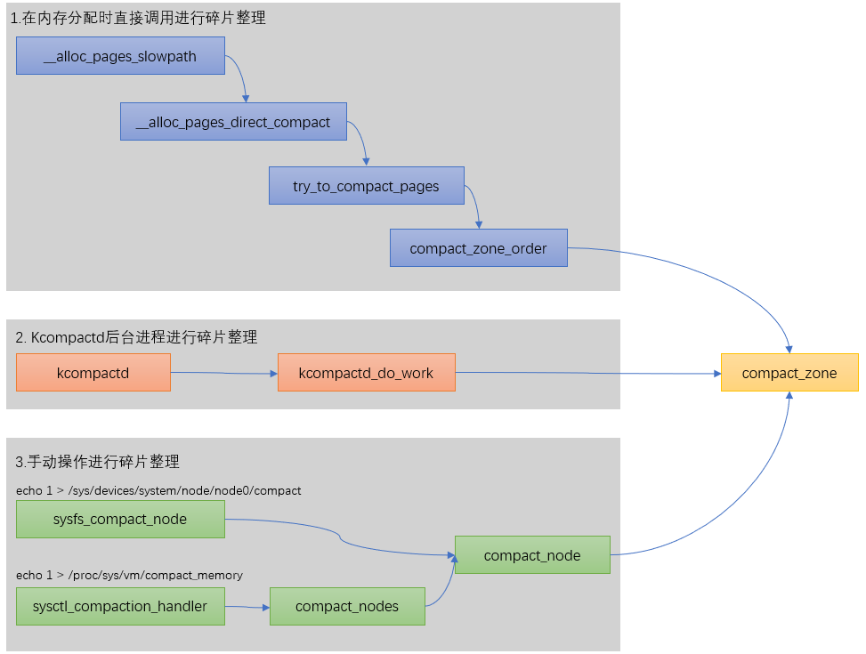
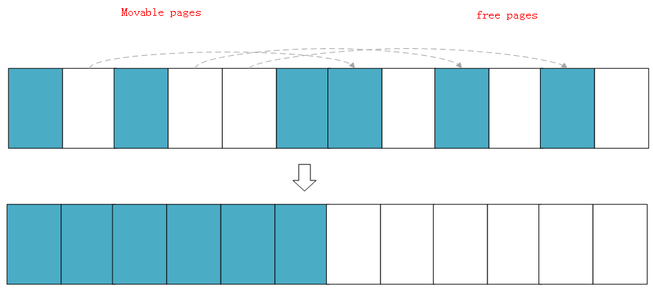

# 内存管理之内存规整

一、内存规整有3条路径



二、页面压缩控制参数

```
/*              
* compact_control is used to track pages being migrated and the free pages
* they are being migrated to during memory compaction. The free_pfn starts
* at the end of a zone and migrate_pfn begins at the start. Movable pages
* are moved to the end of a zone during a compaction run and the run
* completes when free_pfn <= migrate_pfn
*/             
struct compact_control {
        struct list_head freepages;     /* List of free pages to migrate to */ 空闲页面链表，从zone后往前扫描空闲页面加入此链表
        struct list_head migratepages;  /* List of pages being migrated */ 需要迁移的页面链表，从zone前往后扫描加入此链表
        unsigned long nr_freepages;     /* Number of isolated free pages */ 空闲链表页面数量
        unsigned long nr_migratepages;  /* Number of pages to migrate */ 需迁移链表页面数量
        unsigned long free_pfn;         /* isolate_freepages search base */ 隔离free页面的基础pfn
        unsigned long migrate_pfn;      /* isolate_migratepages search base */ 隔离迁移页面的基础pfn
        unsigned long last_migrated_pfn;/* Not yet flushed page being freed */
        enum migrate_mode mode;         /* Async or sync migration mode */ 迁移模式
        bool ignore_skip_hint;          /* Scan blocks even if marked skip */
        bool ignore_block_suitable;     /* Scan blocks considered unsuitable */
        bool direct_compaction;         /* False from kcompactd or /proc/... */
        bool whole_zone;                /* Whole zone should/has been scanned */
        int order;                      /* order a direct compactor needs */ 
        const gfp_t gfp_mask;           /* gfp mask of a direct compactor */ 
        const unsigned int alloc_flags; /* alloc flags of a direct compactor */
        const int classzone_idx;        /* zone index of a direct compactor */
        struct zone *zone;
        bool contended;                 /* Signal lock or sched contention */
};
```

三、页面规整核心代码

compact\_zone:对某个zone进行规整

```
//对某个zone进行页面规整
static enum compact_result compact_zone(struct zone *zone, struct compact_control *cc)

        while ((ret = compact_finished(zone, cc, migratetype)) == COMPACT_CONTINUE) { //判断规整是否完成
                int err;

                switch (isolate_migratepages(zone, cc)) { //寻找可迁移的页面，并放入cc->migratepages列表中，每次隔离的步长为page_block
                case ISOLATE_ABORT:
                        ret = COMPACT_CONTENDED;
                        putback_movable_pages(&cc->migratepages);
                        cc->nr_migratepages = 0;
                        goto out;
                case ISOLATE_NONE:
                        /*
                         * We haven't isolated and migrated anything, but
                         * there might still be unflushed migrations from
                         * previous cc->order aligned block.
                         */
                        goto check_drain;
                case ISOLATE_SUCCESS:
                        ;
                }

                //进行页面迁移，迁移的reason是规整，页面申请和释放使用compaction_alloc/free函数
                err = migrate_pages(&cc->migratepages, compaction_alloc,
                                compaction_free, (unsigned long)cc, cc->mode,
                                MR_COMPACTION);

                /* All pages were either migrated or will be released */
                cc->nr_migratepages = 0;
        }
```

\_\_compact\_finished：判断规整是否要继续

```
static enum compact_result __compact_finished(struct zone *zone, struct compact_control *cc,
                            const int migratetype)
{
        unsigned int order;
        unsigned long watermark;

        if (cc->contended || fatal_signal_pending(current))
                return COMPACT_CONTENDED;

        /* Compaction run completes if the migrate and free scanner meet */
        if (compact_scanners_met(cc)) {  //如果迁移页面扫描和空闲页面扫描相遇，则表示该zone压缩扫描完成了，需退出
                /* Let the next compaction start anew. */
                reset_cached_positions(zone);

                /*
                 * Mark that the PG_migrate_skip information should be cleared
                 * by kswapd when it goes to sleep. kcompactd does not set the
                 * flag itself as the decision to be clear should be directly
                 * based on an allocation request.
                 */
                if (cc->direct_compaction)
                        zone->compact_blockskip_flush = true;

                if (cc->whole_zone)
                        return COMPACT_COMPLETE;
                else
                        return COMPACT_PARTIAL_SKIPPED;
        }

        //如果是通过设置/proc/sys/vm/compact_memory进行规整，则order == -1，继续进行规整而不管是否空闲页面已经满足
        if (is_via_compact_memory(cc->order))  
                return COMPACT_CONTINUE;

        /* Compaction run is not finished if the watermark is not met */
        watermark = zone->watermark[cc->alloc_flags & ALLOC_WMARK_MASK]; //获取当前zone的低水位

        //如果规整后当前水位低于低水位，则继续进行规整
        if (!zone_watermark_ok(zone, cc->order, watermark, cc->classzone_idx, cc->alloc_flags))
                return COMPACT_CONTINUE;

        /* Direct compactor: Is a suitable page free? */ //for循环遍历目标order及以上order的空闲页面数
        for (order = cc->order; order < MAX_ORDER; order++) {
                struct free_area *area = &zone->free_area[order];
                bool can_steal;

                //如果目标migratetype迁移类型的空闲页面满足，则直接返回规整成功
                /* Job done if page is free of the right migratetype */
                if (!list_empty(&area->free_list[migratetype])) 
                        return COMPACT_SUCCESS;

#ifdef CONFIG_CMA
                //如果目标migratetype迁移类型是可移动的，并且CMA页面也有空闲，则返回成功，因为可移动页面可以从CMA中分配
                /* MIGRATE_MOVABLE can fallback on MIGRATE_CMA */
                if (migratetype == MIGRATE_MOVABLE &&
                        !list_empty(&area->free_list[MIGRATE_CMA]))
                        return COMPACT_SUCCESS;
#endif
                /*
                 * Job done if allocation would steal freepages from
                 * other migratetype buddy lists.
                 */
                //fallback到其他可以用的migratetype迁移类型页面，如果满足页返回成功
                if (find_suitable_fallback(area, order, migratetype,
                                                true, &can_steal) != -1)
                        return COMPACT_SUCCESS;
        }

        return COMPACT_NO_SUITABLE_PAGE;
}
```

isolate\_migratepages：隔离可以迁移的页面，从zone前往后，每个隔离的步长为一个pageblock，被隔离的页面符合以下要求


四、空闲页面申请和释放

compaction\_alloc：进行页面迁移时，痛过 该函数申请空闲页面，用于页面迁移的目的页面

compaction\_free：如果出现页面迁移失败，但是目的页面已经通过compaction\_alloc函数申请了，此时要调用compaction\_free将申请的目的页面返回

```
static struct page *compaction_alloc(struct page *migratepage,
                                        unsigned long data,
                                        int **result)
{
        struct compact_control *cc = (struct compact_control *)data;
        struct page *freepage;

        /*
         * Isolate free pages if necessary, and if we are not aborting due to
         * contention.
         */
        if (list_empty(&cc->freepages)) { //当前空闲的目的页面链表为空，则进入空闲页面扫描
                if (!cc->contended)
                        isolate_freepages(cc);  //从zone的后面往前扫描隔离出空闲页面至cc->freepages链表

                if (list_empty(&cc->freepages))
                        return NULL;
        }
        //取一个空闲页面，从链表中摘除，表示页面申请
        freepage = list_entry(cc->freepages.next, struct page, lru);
        list_del(&freepage->lru);
        cc->nr_freepages--;

        return freepage;
}

static void compaction_free(struct page *page, unsigned long data)
{
        struct compact_control *cc = (struct compact_control *)data;

        //释放时，直接将页面返回至cc->freepages链表即可
        list_add(&page->lru, &cc->freepages);
        cc->nr_freepages++;
}
```

六、页面规整模型

整体上页面规整是从zone的两端开始向中间扫描，前面扫描可移动的页面，后面扫描空闲的页面。然后进行页面迁移，空出大块的连续物理内存。

isolate\_migratepages 扫描可迁移页面\-\-\-\-\-\-\-\-\-\-\-\-\-\-\-\-\-\-\-\-\-\-》中间《\-\-\-\-\-\-\-\-\-\-\-\-\-\-\-\-\-\-\-\-\-\-\-\-isolate\_freepages扫描空闲页面


