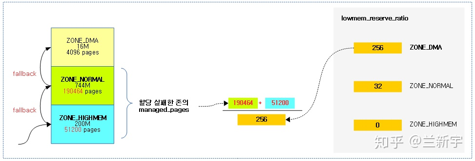
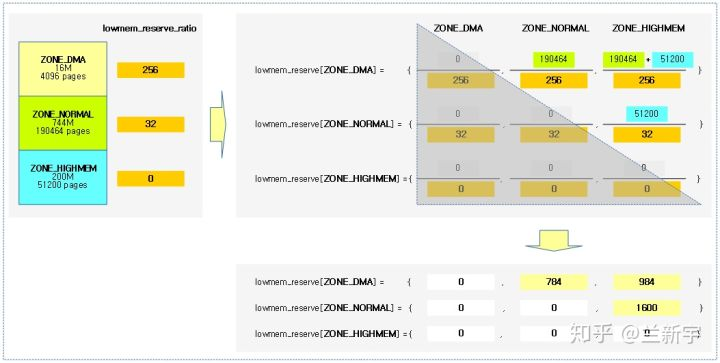
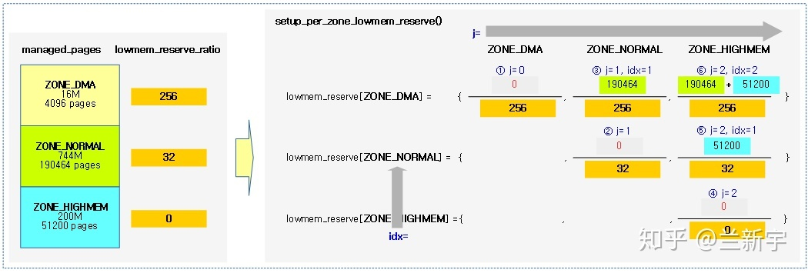
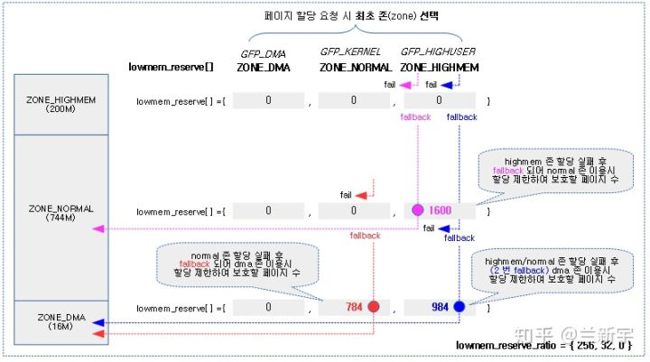
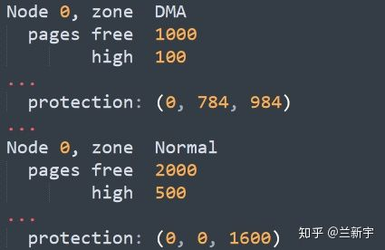
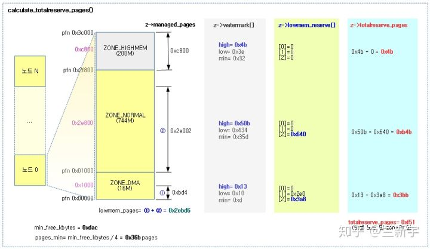

# 内存管理之内存调节lowmem_reserve

在Linux的物理内存模型中，一个内存node按照属性被划分为了多个zones，比如ZONE\_DMA和ZONE\_NORMAL，在32位系统中，还有ZONE\_HIGHMEM（参考[这篇文�](https://zhuanlan.zhihu.com/p/68465952)�）。如果没有通过[GFP标志位](https://zhuanlan.zhihu.com/p/70267219)做出限定，那么当ZONE\_HIGHMEM中内存不足时，可从更低位的ZONE\_NORMAL中分配，ZONE\_NORMAL中内存不足时，可从更低位的ZONE\_DMA中分配。这里的“低位”是指zone的物理内存的地址更小。

这里所谓的“不足”就是当前zone的空余内存低于了本次内存分配的请求大小。除了最高位的ZONE\_HIGHMEM，其他zones都会为比它更高位的zone单独划定一条内存线作为预留（针对不同的更高的zone这条线不同，如果剩余内存低于这条线，则不让高zone的内存请求从低zone分配），低于这条线的内存被称作"lowmem reserve"，控制这条线的参数则是lowmem\_reserve\[MAX\_NR\_ZONES\]。lowmem\_reserve是低zone保留内存自用而不被高zone给借光了的一个保障。

当你查看"/proc/sys/vm/lowmem\_reserve\_ratio"的值时，会得到一组类似这样的输出：

```
lilong@ubuntu:~$ cat /proc/sys/vm/lowmem_reserve_ratio
256     32      32
```

设ZONE\_DMA, ZONE\_NORMAL和ZONE\_HIGHMEM的内存大小分别是A, B和C，那么在ZONE\_DMA中，需要给ZONE\_NORMAL和ZONE\_HIGHMEM预留的内存大小分别是B/256和\(B\+C\)/256。在ZONE\_NORMAL中，需要给ZONE\_HIGHMEM预留的内存大小是C/32。分母来自于zone自己的"lowmem\_reserve\_ratio"，而分子则来自于其他的zones。

```
int sysctl_lowmem_reserve_ratio[MAX_NR_ZONES-1] = {
#ifdef CONFIG_ZONE_DMA
     256,
#endif
#ifdef CONFIG_ZONE_DMA32
     256,
#endif
#ifdef CONFIG_HIGHMEM
     32,
#endif
     32,
};

----------------------------------------------------
  ratio[DMA] |   ratio[NORMAL]   |    ratio[HIGHMEM]
----------------------------------------------------
    256      |     32            |        32
----------------------------------------------------
```

```
ZONE   | lowmem_reserve[DMA] | lowmem_reserve[NORMAL] |lowmem_reserve[HIGHMEM]
-----------------------------------------------------------------------------------------
DMA    |         0           |  mem[NORMAL]/ratio[DMA]|mem[NORMAL]+mem[HIGHMEM]/ratio[DMA]
-----------------------------------------------------------------------------------------
NORMAL |         0           |           0            |   mem[HIGHMEM]/ratio[NORMAL]
-----------------------------------------------------------------------------------------
HIGHMEM|         0           |           0            |            0
```

以上各个zone的lowmem\_reserve由setup\_per\_zone\_lowmem\_reserve函数遍历歌zone进行初始化

重点：

1、低位zone会优先保证自己的内存分配，确实有一定的富余的情况下，才可以提供给更高位的zones

2、低位DMA zone中，其针对normal的保留内存mem\[NORMAL\]/ratio\[DMA\]  小于针对highmem的保留内存mem\[NORMAL\]\+mem\[HIGHMEM\]/ratio\[DMA\]，可以理解为预留部分给normal？

3、这里的低位zone lowmem\_reserve内存不是说保留给高位zone使用，而是用于限制高位zone从低位zone借取内存的界限值，即至少低位zone有至少 wmark\+lowmem的内存时，高位zone才能从此低位zone借取。



在Linux的实现中，是以[struct zone](https://zhuanlan.zhihu.com/p/68465952)中的lowmem\_reserve\[MAX\_NR\_ZONES\]来表示这种预留内存的。同上文讲的watermark一样，也是以page为计算单位的。如果这3个zones的大小分别是16MiB, 784MiB和200MiB，且page的大小是4KiB，根据1MiB包含256个pages，那么这3个zones就分别包含4096, 190464, 51200个pages。

```
struct zone {
    long lowmem_reserve[MAX_NR_ZONES];  //每个zone中有
}
```

所以，ZONE\_DMA给ZONE\_NORMAL预留的将是190464/256=784个pages，给ZONE\_HIGHMEM预留的将是\(190464\+51200\)/256=984个pages。ZONE\_NORMAL给ZONE\_HIGHMEM预留的则是51200/32=1600个pages。这种关系可以用一个3x3的矩阵来表示：



可通过"cat /proc/zoneinfo"中的"protection"部分查看各个zones预留pages的数目，这里叫"protection"是由于历史原因，因为早期开发lowmem\_reserve功能时用的名称就是"protection"。

设置每个zone的lowmem\_reserve\[\]的函数是setup\_per\_zone\_lowmem\_reserve\(\):

```
/*
* setup_per_zone_lowmem_reserve - called whenever
*  sysctl_lowmem_reserve_ratio changes.  Ensures that each zone  //更新proc下该参数会调用该函数更新lowmem_reserve
*  has a correct pages reserved value, so an adequate number of
*  pages are left in the zone after a successful __alloc_pages().
*/
static void setup_per_zone_lowmem_reserve(void)
{
    struct pglist_data *pgdat;
    enum zone_type j, idx;

    for_each_online_pgdat(pgdat) {
        for (j = 0; j < MAX_NR_ZONES; j++) {
            struct zone *zone = pgdat->node_zones + j;
            unsigned long managed_pages = zone->managed_pages;

            zone->lowmem_reserve[j] = 0;

            idx = j;
            while (idx) {
                struct zone *lower_zone;

                idx--;

                if (sysctl_lowmem_reserve_ratio[idx] < 1)
                    sysctl_lowmem_reserve_ratio[idx] = 1;

                lower_zone = pgdat->node_zones + idx;
                lower_zone->lowmem_reserve[j] = managed_pages /
                    sysctl_lowmem_reserve_ratio[idx];
                managed_pages += lower_zone->managed_pages;
            }
        }
    }

    /* update totalreserve_pages */
    calculate_totalreserve_pages();
}
```

结合上面的示例，这段代码的逻辑可以用下图表示：



当ZONE\_HIGHMEM内存不足，分配fail的时候，就将"fallback"到ZONE\_NORMAL，尝试从ZONE\_NORMAL给它预留的1600个pages中分配，如果还不够，就要继续"fallback"到ZONE\_DMA，从ZONE\_DMA给它预留的984个pages中分配。

同理，当ZONE\_NORMAL内存不足时，就会"fallback"到ZONE\_DMA，尝试从ZONE\_DMA给它预留的784个pages中分配。



ZONE\_NORMAL和ZONE\_DMA都是线性映射，使用方便，ZONE\_DMA还可以满足一些特殊的DMA设备对地址的要求，所以我们通常是希望尽量不要动用低位zones的内存的。当不可避免地需要"fallback"时，得看下低位zones本身的空余内存是否充足。

只有一个zone空余内存的值大于它自己的watermark\[WMARK\_HIGH\]值加上给某个高位zone预留的内存值，才算是“充足”的，对应的高位zone才可以从这个低位zone中截取内存。也就是说，低位zone会优先保证自己的内存分配，确实有一定的富余的情况下，才可以提供给更高位的zones。

假设现在系统的内存统计情况如下：



因为1000\>100\+784，而2000\<500\+1600，所以此时ZONE\_NORMAL到ZONE\_DMA的"fallback"是可以成功的，而ZONE\_HIGHMEM到ZONE\_NORMAL的"fallback"则不可以。

在setup\_per\_zone\_lowmem\_reserve\(\)的代码最后，还有个calculate\_totalreserve\_pages\(\)，这里"totalreserve"是指所有zones的high watermark加上lowmem\_reserve\[\]的值，因为不管是“自留田”还是“后花园”，都是一个zone需要预留的内存。



ZONE\_DMA和ZONE\_DMA32默认的"lowmem\_reserve\_ratio"的值是256，其他zones的默认值是32。如果你的系统中低位zones的内存占比较大，那么可以将这个ratio值调小一些，也就是预留更多的内存给高位zones，反之则可以调大一些。（调小些，高位zone更容易借到低位zone内存，借的要求降低了）
