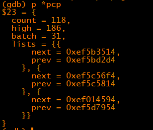

# 内存管理之冷热页

## 一、什么是冷热页？

在Linux Kernel的物理内存管理的[Buddy System](http://vinoit.me/2016/06/28/linux-buddy-system/)中，引入了冷热页的概念。冷页表示该空闲页已经不再高速缓存中了\(一般是指L2 Cache\)，热页表示该空闲页仍然在高速缓存中。冷热页是针对于每CPU的，每个zone中，都会针对于所有的CPU初始化一个冷热页的per\-cpu\-pageset.

## 二、为什么要有冷热页？

作用有3点：

1、Buddy Allocator在分配order为0的空闲页的时候，如果分配一个热页，那么由于该页已经存在于L2 Cache中了。CPU写访问的时候，不需要先把内存中的内容读到Cache中，然后再写。如果分配一个冷页，说明该页不在L2 Cache中。一般情况下，尽可能用热页，是容易理解的。什么时候用冷页呢？

While allocating a physical page frame, there is a bit specifying whether we would like a hot or a cold page \(that is, a page likely to be in the CPU cache, or a page not likely to be there\). If the page will be used by the CPU, a hot page will be faster. If the page will be used for device DMA the CPU cache would be invalidated anyway, and a cold page does not waste precious cache contents.

简单翻译一下：当内核分配一个物理页框时，有一些规范来约束我们是分配热页还是冷页。当页框是CPU使用的，则分配热页。当页框是DMA设备使用的，则分配冷页。因为DMA设备不会用到CPU高速缓存，所以没必要使用热页。

2、Buddy System在给某个进程分配某个zone中空闲页的时候，首先需要用自旋锁锁住该zone,然后分配页。这样，如果多个CPU上的进程同时进行分配页，便会竞争。引入了per\-cpu\-set后，当多个CPU上的进程同时分配页的时候，竞争便不会发生，提高了效率。另外当释放单个页面时，空闲页面首先放回到per\-cpu\-pageset中，以减少zone中自旋锁的使用。当页面缓存中的页面数量超过阀值时，再将页面放回到伙伴系统中。

3、使用每CPU冷热页还有一个好处是，能保证某个页一直黏在1个CPU上，这有助于提高Cache的命中率。

## 三、冷热页的数据结构

```
struct per_cpu_pages {
    int count;      /* number of pages in the list */
    int high;       /* high watermark, emptying needed */ //冷热页高水位，如果冷热页缓存大于这个数量则需要归还batch数给buddy
    int batch;      /* chunk size for buddy add/remove */ //冷热页缓存不足/过多时，一次从buddy中申请/归还的页数量

    /* Lists of pages, one per migrate type stored on the pcp-lists */
    struct list_head lists[MIGRATE_PCPTYPES];  //定义3条冷热页列表MIGRATE_UNMOVABLE、MIGRATE_RECLAIMABLE、MIGRATE_MOVABLE
};

struct per_cpu_pageset {
    struct per_cpu_pages pcp;
#ifdef CONFIG_NUMA
    s8 expire;
#endif
#ifdef CONFIG_SMP
    s8 stat_threshold;
    s8 vm_stat_diff[NR_VM_ZONE_STAT_ITEMS];
#endif
};
```

在Linux中，对于UMA的架构，冷热页是在一条链表上进行管理。热页在前，冷页在后。CPU每释放一个order为0的页，如果per\-cpu\-pageset中的页数少于其指定的阈值，便会将释放的页插入到冷热页链表的开始处。这样，之前插入的热页便会随着其后热页源源不断的插入向后移动，其页由热变冷的几率便大大增加。

ARM32虚拟机数据实例：



## 四、怎样分配冷热页

在分配order为0页的时候\(冷热页机制只处理单页分配的情况\)，先找到合适的zone,然后根据需要的migratetype类型定位冷热页链表（每个zone，对于每个cpu,有3条冷热页链表，对应于：MIGRATE\_UNMOVABLE、MIGRATE\_RECLAIMABLE、MIGRATE\_MOVABLE）。若需要热页，则从链表头取下一页（此页最“热”）；若需要冷页，则从链表尾取下一页（此页最“冷”）。

冷热页申请：

```
     /*
* Allocate a page from the given zone. Use pcplists for order-0 allocations.
*/
static inline
struct page *buffered_rmqueue(struct zone *preferred_zone,
            struct zone *zone, unsigned int order,
            gfp_t gfp_flags, unsigned int alloc_flags,
            int migratetype)
{
    unsigned long flags;
    struct page *page;
    bool cold = ((gfp_flags & __GFP_COLD) != 0);    //根据__GFP_COLD标志来决定是分配冷页还是热页

    if (likely(order == 0)) {    //只针对order为0的页分配做冷热页机制
        struct per_cpu_pages *pcp;
        struct list_head *list;

        local_irq_save(flags);
        do {
            pcp = &this_cpu_ptr(zone->pageset)->pcp;
            list = &pcp->lists[migratetype];
            if (list_empty(list)) {
                pcp->count += rmqueue_bulk(zone, 0,    //冷热页缓存不足时，从buddy系统中申请
                        pcp->batch, list,
                        migratetype, cold);
                if (unlikely(list_empty(list)))
                    goto failed;
            }

            if (cold)
                page = list_last_entry(list, struct page, lru);   //冷页从链表尾部取
            else
                page = list_first_entry(list, struct page, lru);  //热页从链表头部取
            list_del(&page->lru);
            pcp->count--;

        } while (check_new_pcp(page));
    } else {
                ...
    }

    __count_zid_vm_events(PGALLOC, page_zonenum(page), 1 << order);
    zone_statistics(preferred_zone, zone, gfp_flags);
    local_irq_restore(flags);

    VM_BUG_ON_PAGE(bad_range(zone, page), page);
    return page;

failed:
    local_irq_restore(flags);
    return NULL;
}
```

冷热页归还：

```
void __free_pages(struct page *page, unsigned int order)
{
    if (put_page_testzero(page)) {
        if (order == 0)
            free_hot_cold_page(page, false);
        else
            __free_pages_ok(page, order);
    }
}

/*
* Free a 0-order page
* cold == true ? free a cold page : free a hot page
*/
void free_hot_cold_page(struct page *page, bool cold)
{
    struct zone *zone = page_zone(page);
    struct per_cpu_pages *pcp;
    unsigned long flags;
    unsigned long pfn = page_to_pfn(page);
    int migratetype;

    if (!free_pcp_prepare(page))
        return;

    migratetype = get_pfnblock_migratetype(page, pfn);
    set_pcppage_migratetype(page, migratetype);
    local_irq_save(flags);
    __count_vm_event(PGFREE);

    /*
     * We only track unmovable, reclaimable and movable on pcp lists.
     * Free ISOLATE pages back to the allocator because they are being
     * offlined but treat RESERVE as movable pages so we can get those
     * areas back if necessary. Otherwise, we may have to free
     * excessively into the page allocator
     */
    if (migratetype >= MIGRATE_PCPTYPES) {
        if (unlikely(is_migrate_isolate(migratetype))) {    
        //如果非unmovable, reclaimable and movable页，且存在迁移隔离，则直接释放，不加入冷热页管理
            free_one_page(zone, page, pfn, 0, migratetype);
            goto out;
        }
        migratetype = MIGRATE_MOVABLE;
    }

    pcp = &this_cpu_ptr(zone->pageset)->pcp;
    if (!cold)
        list_add(&page->lru, &pcp->lists[migratetype]);     //热页加入链表尾部
    else
        list_add_tail(&page->lru, &pcp->lists[migratetype]); //冷页加入链表头部
    pcp->count++;
    if (pcp->count >= pcp->high) { //如果当前冷热页缓存大于high水位，则归还batch数的页给buddy
        unsigned long batch = READ_ONCE(pcp->batch);
        free_pcppages_bulk(zone, batch, pcp);
        pcp->count -= batch;
    }

out:
    local_irq_restore(flags);
}
```

**五、何时分配冷/热页**

通常情况下默认都是分配热页，较少情况需要主动申请冷页。如page\_cache\_alloc\_cold函数主动申请冷页。
