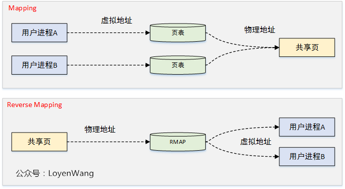
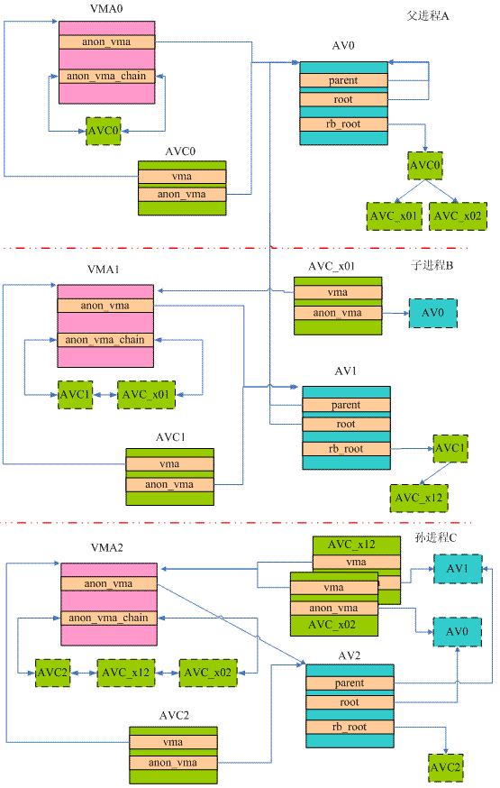
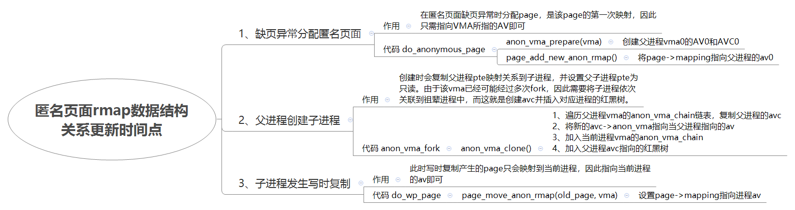
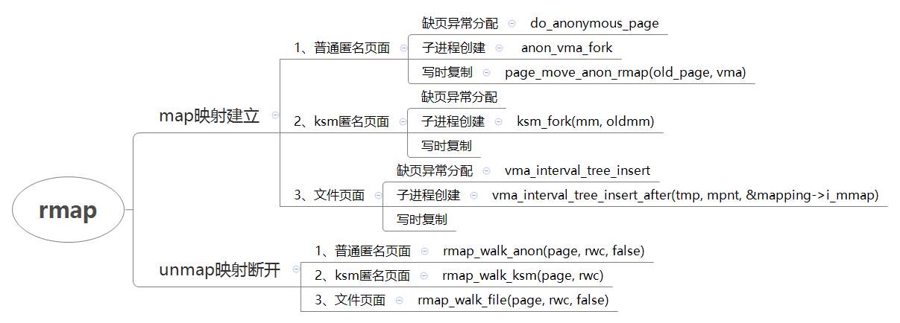

# 内存管理之反向映射rmap

RMAP反向映射是一种物理地址反向映射虚拟地址的方法。

[http://www.wowotech.net/memory\_management/reverse\_mapping.html](http://www.wowotech.net/memory_management/reverse_mapping.html)

[https://www.cnblogs.com/LoyenWang/p/12164683.html](https://www.cnblogs.com/LoyenWang/p/12164683.html)

关于degree复用补丁：

[https://www.mail\-archive.com/](https://www.mail-archive.com/)[linux\-kernel@vger.kernel.org](mailto:linux-kernel@vger.kernel.org)/msg776394.html

**一、反向映射及为何要使用反向映射**

1. 页表用于虚拟地址到物理地址映射，其中的PTE页表项记录了映射关系，同时struct page结构体中的mapcount字段保存了有多少PTE页表项映射了该物理页。
    映射
2. 当某个物理地址要进行回收或迁移时，此时需要去找到有多少虚拟地址映射在该物理地址，并断开映射处理。在没有反向映射的机制时，需要去遍历进程的页表，这个效率显然是很低下的。反向映射可以找到虚拟地址空间VMA，并仅从VMA使用的用户页表中取消映射，可以快速解决这个问题。
    反向映射



**二、数据结构**

```
AVC：
73 struct anon_vma_chain {
74 ▼       struct vm_area_struct *vma;  /*指向该avc所属的vma*/
75 ▼       struct anon_vma *anon_vma;   
76 ▼       struct list_head same_vma;   /* 用于连接本进程vma的avc，将这些avc加入到此vma的祖辈的av的红黑树中，以此表示该vma与祖辈vma共享物理页映射 */
77 ▼       struct rb_node rb;▼     /* locked by anon_vma->rwsem */  /*AV红黑树节点，加入即表示改vma和被加入的vma->av共享物理页面映射*/
78 ▼       unsigned long rb_subtree_last;
79 #ifdef CONFIG_DEBUG_VM_RB   
80 ▼       unsigned long cached_vma_start, cached_vma_last;
81 #endif
82 };   

AV：
27 struct anon_vma {
28 ▼       struct anon_vma *root;▼ ▼       /* Root of this anon_vma tree */
29 ▼       struct rw_semaphore rwsem;▼     /* W: modification, R: walking the list */
37 ▼       atomic_t refcount;
38
39 ▼       /*
40 ▼        * Count of child anon_vmas and VMAs which points to this anon_vma.
41 ▼        *
42 ▼        * This counter is used for making decision about reusing anon_vma
43 ▼        * instead of forking new one. See comments in function anon_vma_clone.
44 ▼        */
45 ▼       unsigned degree;  /*复用非父进程非root进程的AV的计数，如果degree小于2就可以复用，每复用一次++*/
46
47 ▼       struct anon_vma *parent;▼       /* Parent of this anon_vma */

57 ▼       struct rb_root rb_root;▼/* Interval tree of private "related" vmas */  /*AV红黑树根*/
58 };

struct vm_area_struct {
        struct list_head anon_vma_chain;  /*属于该vma的avc链表头*/
        struct anon_vma *anon_vma;      /*指向属于该vma的av*/
        unsigned long vm_pgoff;         /* Offset (within vm_file) in PAGE_SIZE units */
}

struct page {
                struct address_space *mapping;   /*如果是匿名页面则指向anon_vma，并且最低bit设置：PAGE_MAPPING_ANON*/
                pgoff_t index;          /* Our offset zwithin mapping. */
}
```

**三、rmap数据框架图**





vma\-\>vm\_pgoff的用途：

1、Offset in mapped file ，当前vma在文件页当中的偏移

2、or anonymous pages, it is either zero or equal to vm\_start/PAGE\_SIZE

**四、反向映射的展开使用**

反向映射的典型应用场景：

1. kswapd进行页面回收时，需要断开所有映射了该匿名页面的PTE表项；
2. 页面迁移时，需要断开所有映射了该匿名页面的PTE表项；

```
/*      
* rmap_walk_control: To control rmap traversing for specific needs
*      
* arg: passed to rmap_one() and invalid_vma()
* rmap_one: executed on each vma where page is mapped
* done: for checking traversing termination condition
* anon_lock: for getting anon_lock by optimized way rather than default
* invalid_vma: for skipping uninterested vma
*/     
struct rmap_walk_control {
        void *arg;
        int (*rmap_one)(struct page *page, struct vm_area_struct *vma,  /*断开页面映射*/
                                        unsigned long addr, void *arg);
        int (*done)(struct page *page); /*判断页面是否完全断开*/
        struct anon_vma *(*anon_lock)(struct page *page);
        bool (*invalido_vma)(struct vm_area_struct *vma, void *arg); /*判断是否页面与vma是否有映射关系*/
};
```

**五、ksm和文件反向映射**



rmap文件映射：


