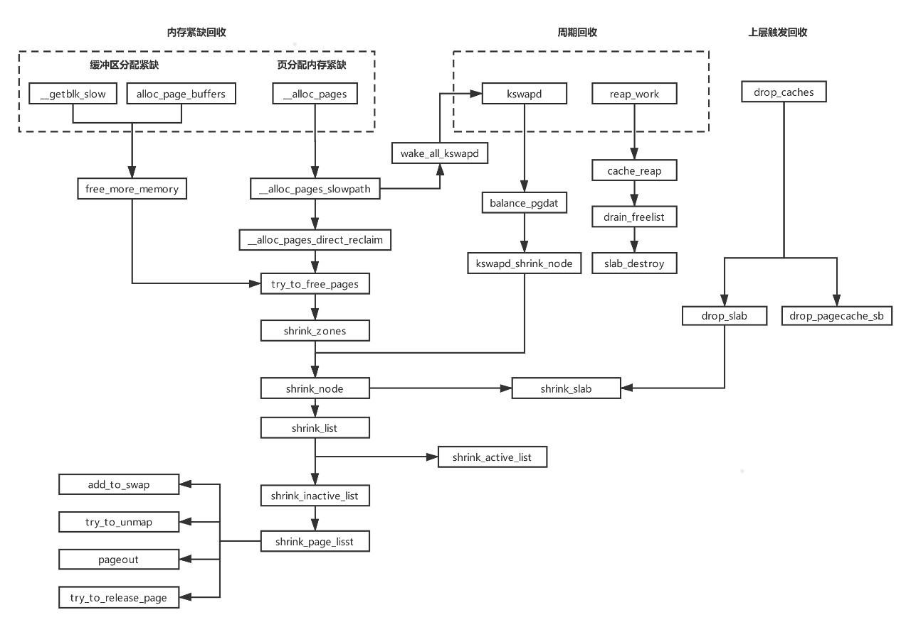
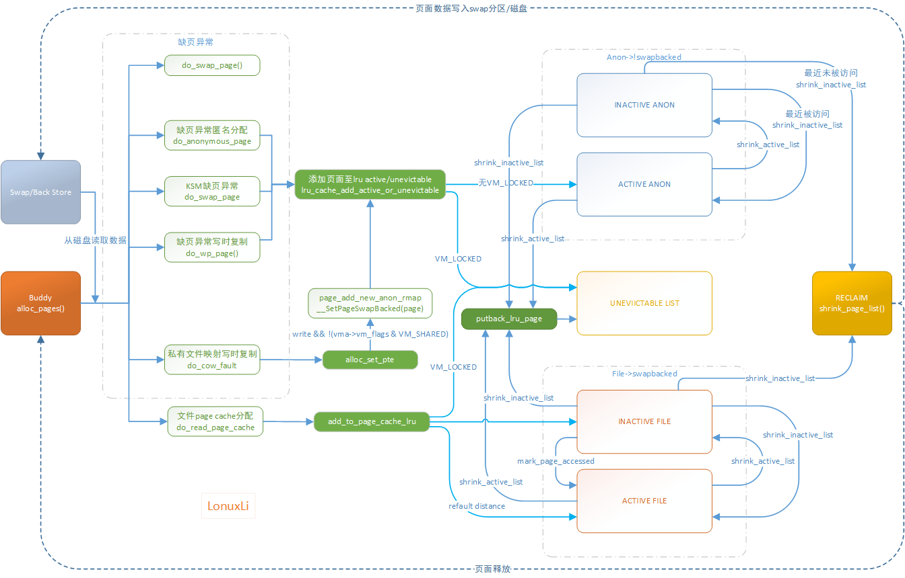
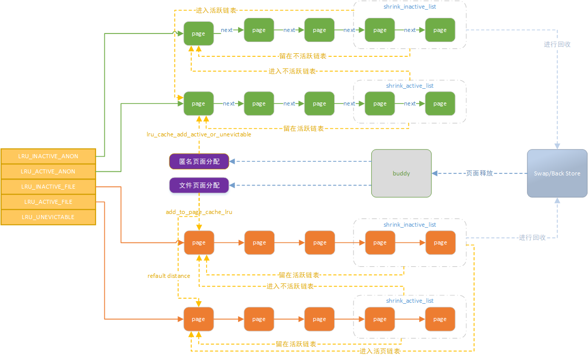

# 内存管理之回收框架

**一、页面回收框架**

**二、代码分析**

1、shrink\_node

按照LRU\_INACTIVE\_ANON\-\>LRU\_ACTIVE\_ANON\-\>LRU\_INACTIVE\_FILE\-\>LRU\_ACTIVE\_FILE的顺序进行lru链表收缩

先对inactive链表收缩，再对active链表收缩，这样是先将inavtive链表中的page回收，再将active链表中的page移到inactive中

static void shrink\_node\_memcg\(struct pglist\_data \*pgdat, struct mem\_cgroup \*memcg,

                              struct scan\_control \*sc, unsigned long \*lru\_pages\)

{

                for\_each\_evictable\_lru\(lru\) {

                        if \(nr\[lru\]\) {

                                nr\_to\_scan = min\(nr\[lru\], SWAP\_CLUSTER\_MAX\);

                                nr\[lru\] \-= nr\_to\_scan;

                                nr\_reclaimed \+= shrink\_list\(lru, nr\_to\_scan,

                                                            lruvec, sc\);

                        }

                }

}

static unsigned long shrink\_list\(enum lru\_list lru, unsigned long nr\_to\_scan,

                                 struct lruvec \*lruvec, struct scan\_control \*sc\)

{

        //只有当inactive链表中page比较少时，才需要调用shrink\_active\_list将active链表中page移到inactive中

        if \(is\_active\_lru\(lru\)\) {

                if \(inactive\_list\_is\_low\(lruvec, is\_file\_lru\(lru\), sc\)\)  

                        shrink\_active\_list\(nr\_to\_scan, lruvec, sc, lru\);

                return 0;

        }

        return shrink\_inactive\_list\(nr\_to\_scan, lruvec, sc, lru\);

}

2、shrink\_inactive\_list

shrink\_inactive\_list从lru中分离nr\_taken个页面到page\_list中，并调用shrink\_page\_list回收进行真正的回收动作，回收的数量通过nr\_reclaimed

static noinline\_for\_stack unsigned long

shrink\_inactive\_list\(unsigned long nr\_to\_scan, struct lruvec \*lruvec,

                     struct scan\_control \*sc, enum lru\_list lru\)

{

        spin\_lock\_irq\(&pgdat\-\>lru\_lock\);

        //从lru链表中分离出nr\_taken个页面

        nr\_taken = isolate\_lru\_pages\(nr\_to\_scan, lruvec, &page\_list,

                                     &nr\_scanned, sc, isolate\_mode, lru\);

        \_\_mod\_node\_page\_state\(pgdat, NR\_ISOLATED\_ANON \+ file, nr\_taken\);

        reclaim\_stat\-\>recent\_scanned\[file\] \+= nr\_taken;

        if \(global\_reclaim\(sc\)\) {

                \_\_mod\_node\_page\_state\(pgdat, NR\_PAGES\_SCANNED, nr\_scanned\);

                if \(current\_is\_kswapd\(\)\)

                        \_\_count\_vm\_events\(PGSCAN\_KSWAPD, nr\_scanned\);

                else

                        \_\_count\_vm\_events\(PGSCAN\_DIRECT, nr\_scanned\);

        }

        spin\_unlock\_irq\(&pgdat\-\>lru\_lock\);

        if \(nr\_taken == 0\)

                return 0;

        //进行页面回收，并返回回收的页面数量，回收的页面从page\_list中摘除

        nr\_reclaimed = shrink\_page\_list\(&page\_list, pgdat, sc, TTU\_UNMAP,

                                &nr\_dirty, &nr\_unqueued\_dirty, &nr\_congested,

                                &nr\_writeback, &nr\_immediate,

                                false\);

        spin\_lock\_irq\(&pgdat\-\>lru\_lock\);

        if \(global\_reclaim\(sc\)\) {

                if \(current\_is\_kswapd\(\)\)

                        \_\_count\_vm\_events\(PGSTEAL\_KSWAPD, nr\_reclaimed\);

                else

                        \_\_count\_vm\_events\(PGSTEAL\_DIRECT, nr\_reclaimed\);

        }

        //将page\_list中未回收的页面放回lru链表

        putback\_inactive\_pages\(lruvec, &page\_list\); 

        \_\_mod\_node\_page\_state\(pgdat, NR\_ISOLATED\_ANON \+ file, \-nr\_taken\);

        spin\_unlock\_irq\(&pgdat\-\>lru\_lock\);

}

3、shrink\_page\_list中执行真正的页面回收动作

unsigned long shrink\_page\_list\(\)

{

        /\*遍历page\_list中的页面\*/

       while \(\!list\_empty\(page\_list\)\) {

                page = lru\_to\_page\(page\_list\);

                list\_del\(&page\-\>lru\);  /\*从lru链表中取出一个page并删除page\*/

                if \(\!trylock\_page\(page\)\) /\*如果page已经被锁住，则不对page处理\*/

                        goto keep;

                sc\-\>nr\_scanned\+\+;

                if \(unlikely\(\!page\_evictable\(page\)\)\) /\*如果page是不可换出，则跳转进入cull\_mlocked处理\*/

                        goto cull\_mlocked;

                if \(\!sc\-\>may\_unmap && page\_mapped\(page\)\) /\*如果扫描控制参数不对mapped页面处理，则特殊处理\*/

                        goto keep\_locked;

                /\* Double the slab pressure for mapped and swapcache pages \*/

                if \(page\_mapped\(page\) || PageSwapCache\(page\)\)

                        sc\-\>nr\_scanned\+\+;

                if \(\!force\_reclaim\)

                        /\*如果不是强制回收，则获取通过page\_check\_references返回具体的处理策略\*/

                        references = page\_check\_references\(page, sc\);

                switch \(references\) {

                case PAGEREF\_ACTIVATE:

                        goto activate\_locked;

                case PAGEREF\_KEEP:

                        goto keep\_locked;

                case PAGEREF\_RECLAIM:

                case PAGEREF\_RECLAIM\_CLEAN:

                        ; /\* try to reclaim the page below \*/ 回收处理

                }

                /\*

                 \* The page is mapped into the page tables of one or more

                 \* processes. Try to unmap it here.

                 \*/ 如果页面存在pte映射并且存在后备存储mapping\(匿名页面指向swap文件\)，解除pte映射

                if \(page\_mapped\(page\) && mapping\) {

                        switch \(ret = try\_to\_unmap\(page, lazyfree ?

                                \(ttu\_flags | TTU\_BATCH\_FLUSH | TTU\_LZFREE\) :

                                \(ttu\_flags | TTU\_BATCH\_FLUSH\)\)\) {

                        case SWAP\_FAIL:

                                goto activate\_locked;

                        case SWAP\_AGAIN:

                                goto keep\_locked;

                        case SWAP\_MLOCK:

                                goto cull\_mlocked;

                        case SWAP\_LZFREE:

                                goto lazyfree;

                        case SWAP\_SUCCESS: //解除pte映射成功，继续回收流程

                                ; /\* try to free the page below \*/

                        }

                }

               /\*\* Anonymous process memory has backing store?

                 \* Try to allocate it some swap space here.

                 \*/ 如果是匿名页面并且没有分配对应的swap空间，则分配swap空间

                if \(PageAnon\(page\) && \!PageSwapCache\(page\)\) {

                        /\* Adding to swap updated mapping \*/ 

                        mapping = page\_mapping\(page\); //为匿名页面分配swap空间

               }

                /\*如果页面还是脏页，则继续尝试将页面刷出内存\*/

               if \(PageDirty\(page\)\) {

                        /\*

                         \* Page is dirty. Flush the TLB if a writable entry

                         \* potentially exists to avoid CPU writes after IO

                         \* starts and then write it out here.

                         \*/

                        try\_to\_unmap\_flush\_dirty\(\);

                        switch \(pageout\(page, mapping, sc\)\) {

                        case PAGE\_KEEP:

                                goto keep\_locked;

                        case PAGE\_ACTIVATE:

                                goto activate\_locked;

                        case PAGE\_SUCCESS:

                                if \(PageWriteback\(page\)\)

                                        goto keep;

                                if \(PageDirty\(page\)\)

                                        goto keep;

                                /\*

                                 \* A synchronous write \- probably a ramdisk.  Go

                                 \* ahead and try to reclaim the page.

                                 \*/

                                if \(\!trylock\_page\(page\)\)

                                        goto keep;

                                if \(PageDirty\(page\) || PageWriteback\(page\)\)

                                        goto keep\_locked;

                                mapping = page\_mapping\(page\);

                        case PAGE\_CLEAN:  页面回写成功，进入页面释放流程

                                ; /\* try to free the page below \*/

                        }

                }

//1、页面回收成功释放

lazyfree:

                if \(\!mapping || \!\_\_remove\_mapping\(mapping, page, true\)\)

                        goto keep\_locked;

                \_\_ClearPageLocked\(page\);

free\_it: 

                if \(ret == SWAP\_LZFREE\)

                        count\_vm\_event\(PGLAZYFREED\);

                nr\_reclaimed\+\+;

                list\_add\(&page\-\>lru, &free\_pages\);

                continue;

//2、mlcoked页面，将其保留在page\_list中，在其他函数流程中将该页面移动到unevictable链表中

cull\_mlocked:

                if \(PageSwapCache\(page\)\)

                        try\_to\_free\_swap\(page\);

                unlock\_page\(page\);

                list\_add\(&page\-\>lru, &ret\_pages\);

                continue;

//3、将页面添加至active链表

activate\_locked:

                /\* Not a candidate for swapping, so reclaim swap space. \*/

                if \(PageSwapCache\(page\) && mem\_cgroup\_swap\_full\(page\)\)

                        try\_to\_free\_swap\(page\);

                VM\_BUG\_ON\_PAGE\(PageActive\(page\), page\);

                SetPageActive\(page\);

                pgactivate\+\+;

//4、保持页面在inactive 链表中

keep\_locked:

                unlock\_page\(page\);

keep:

                list\_add\(&page\-\>lru, &ret\_pages\);

                VM\_BUG\_ON\_PAGE\(PageLRU\(page\) || PageUnevictable\(page\), page\);

        }

        

        return nr\_reclaimed;

}

**三、内存分配到回收循环流程**

1、do\_cow\_fault私有映射修改后申请的页面添加到匿名页面链表

进程的私有映射用于映射修改后不向底层块设备回写的文件，通常换出到交换区。因为这种情况下文件不能再用作后备存储器，因而在物理内存较少时，需要将相关页换出到交换区，因为此时不能从文件恢复页的内容。

2、第二次机会算法

页面回收中所谓的第二次机会法，其实是指基于PG\_active和PG\_referenced标志进行的页面在inactive和active链表间移动的算法。如上图shrink\_active\_list\(\)和shrink\_inactive\_list\(\)推动页面在链表中的移动，避免页面直接因为先进先出而被换出。

3、文件页面添加

新分配file页面添加到lru链表的添加路径，其中最终也是调用到list\_add，添加到链表头。

add\_to\_page\_cache\_lru\-\>lru\_cache\_add\-\>\_\_lru\_cache\_add\(page\)\-\>\_\_pagevec\_lru\_add\_fn\-\>add\_page\_to\_lru\_list\-\>list\_add\(&page\-\>lru, &lruvec\-\>lists\[lru\]\)

file文件在插入基数树之后，会设置mapping，但是未设置active位，因此文件页面是添加至inactive file lru链表。至于为何文件页面是先加入inactive链表？因为文件页面有大量存在一次访问的页面。（ 一个进程运行过程中经常只会对某个文件访问一次；所以将 file\-backed page 先放在 inactive list 有助于内核快速回收这些只会被访问一次的页框，如果一个 file\-backed page 在加入 inactive list 后又被访问了一次内核自然会将其移入 active list）

add\_to\_page\_cache\_lru\-\>\_\_add\_to\_page\_cache\_locked\-\>page\-\>mapping = mapping

4、匿名页面添加

新分配匿名页面添加至lru时，已设置active标志，加入至active lru链表 

lru\_cache\_add\_active\_or\_unevictable\-\>lru\_cache\_add\-\>\_\_lru\_cache\_add\(page\)\-\>\_\_pagevec\_lru\_add\_fn\-\>add\_page\_to\_lru\_list\-\>list\_add\(&page\-\>lru, &lruvec\-\>lists\[lru\]\)

5、shrink\_inactive\_list扫描后，不需要回收并放回lru链表的页面，依然放入链表头部

shrink\_inactive\_list\-\>putback\_inactive\_pages\-\>add\_page\_to\_lru\_list\(\)\-\>list\_add\(&page\-\>lru, &lruvec\-\>lists\[lru\]\)

6、shrink\_active\_list扫描活跃链表时，需要放入active/inactive链表的页面，放入相应链表的表头

shrink\_active\_list\-\>move\_active\_pages\_to\_lru\-\>list\_add\(list, head\)

7、页面扫描（隔离）isolate\_lru\_pages方向

shrink\_active\_list/shrink\_inactive\_list 扫描都需要用到隔离函数isolate\_lru\_pages，其扫描路径都是从链表尾部开始的。

struct list\_head \*src = &lruvec\-\>lists\[lru\];

page = lru\_to\_page\(src\);

\#取链表的尾部页面

\#define lru\_to\_page\(head\) \(list\_entry\(\(head\)\-\>prev, struct page, lru\)\)

\#将取得的page从原lru链表中删除，并添加到dst链表的头部

list\_move\(&page\-\>lru, dst\);

\#或者将取得的page移动到链表头部，此时page可能处于busy状态

list\_move\(&page\-\>lru, src\);

