# 内存管理之基本内存结构

一、NODE 和ZONE


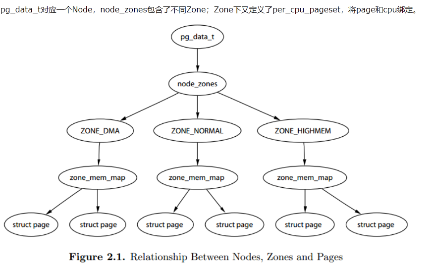

[https://www.cnblogs.com/arnoldlu/p/8060121.html](https://www.cnblogs.com/arnoldlu/p/8060121.html)

include/linux/mmzone.h

typedef struct pglist\_data {}pg\_data\_t;

表示比区域\(ZONE\_NORMAL或ZONE\_HIGHMEM\)表示的更高级别的内存区域（NODE），NUMA架构中的每一块内存用一个实体表示，UMA架构的arm只有一个pg\_data\_t实体。 

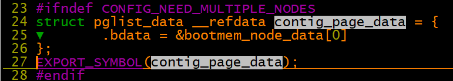

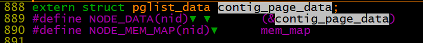

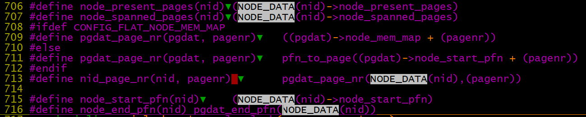

     

start\_kernel\-》build\_all\_zonelists\-》build\_all\_zonelists\_init\-》\_\_build\_all\_zonelists\-》    

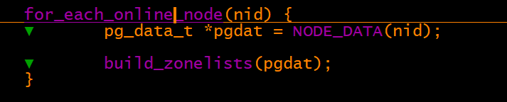

UMA架构上实质只有NODE\_DATA（0）

```
#define for_each_online_node(node) for_each_node_state(node, N_ONLINE)
#define for_each_node_state(node, __state) \
       for ( (node) = 0; (node) == 0; (node) = 1)
```

build\_thisnode\_zonelists主要是将pg\_data\_t中的 node\_zonelist 指向 node\_zones实体，那么node\_zones实体的初始化在哪？

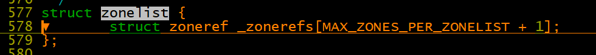

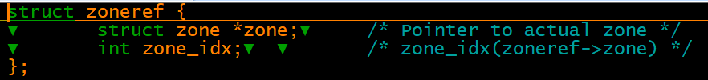

&zonelist\-\>\_zonerefs\[0\] \-\>pgdat\-\>node\_zones\[3\]

```
597 struct bootmem_data;
598 typedef struct pglist_data {
599 ▼       struct zone node_zones[MAX_NR_ZONES];
600 ▼       struct zonelist node_zonelists[MAX_ZONELISTS];                                                                            
601 ▼       int nr_zones;
}
542 enum {
543 ▼       ZONELIST_FALLBACK,▼     /* zonelist with fallback */  zonelist影响内存分配zone的顺序，不同的list可以研究下有啥区别
544 #ifdef CONFIG_NUMA
545 ▼       /*
546 ▼        * The NUMA zonelists are doubled because we need zonelists that
547 ▼        * restrict the allocations to a single node for __GFP_THISNODE.
548 ▼        */
549 ▼       ZONELIST_NOFALLBACK,▼   /* zonelist without fallback (__GFP_THISNODE) */
550 #endif
551 ▼       MAX_ZONELISTS                                                                                                             
552 };
```

bootmem\_init\-》zone\_sizes\_init\-》free\_area\_init\_node\-》

bootmem\_init\- 》find\_limits\(&min, &max\_low, &max\_high\);  获取当前物理内存大小信息，然后可以根据这些信息初始化zone

zone\_sizes\_init：确定各个zone区域的大小和hole大小

free\_area\_init\_core：初始化设置node\_zones\[\]元素

free\_area\_init\_node：

nr\_kernel\_pages：低端内存可用内存数（低端内存页数\-低端内存page结构体占用的页\-高端内存page结构体占用）

nr\_all\_pages：node区所有内存页数\-低端内存page结构体占用的页

zone\-\>managed\_pages：如果是高端内存zone，指zone对应的全部物理内存物理页 ；如果是低端内存zone，指低端内存zone 内存页数\-dma页数\-    低端内存page结构体占用的页数


memmap\_init\_zone\-\> \_\_init\_single\_pfn\(pfn, zone, nid\)：将page中元素初始化，如使用计数和修改标志指向正确的zone和node

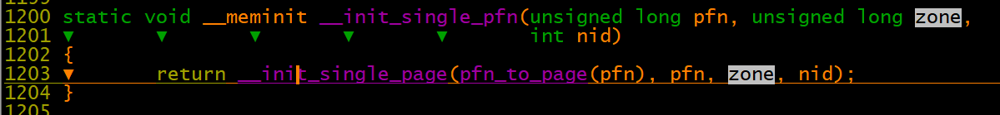

二、page

PGD：Page Global Directory

PUD：Page Upper Directory

PMD：Page Middle Directory、

PTE：Page Table Entry

arm32一般采用两级页表 pgd内\[31\-20\]\- pte内\[19\-12\] \-page内\[11\-0\]  这个是arm32硬件的方法，linux软件是采用pgd\[31\-21\]

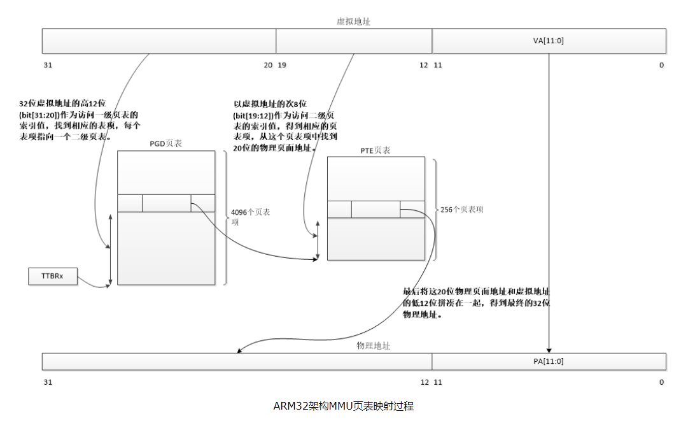

```
static struct mem_type mem_types[]

41 struct mem_type {
42 ▼       pteval_t prot_pte;
43 ▼       pteval_t prot_pte_s2;
44 ▼       pmdval_t prot_l1;
45 ▼       pmdval_t prot_sect;
46 ▼       unsigned int domain;
47 };

24 typedef u32 pteval_t;
25 typedef u32 pmdval_t;
 
//表示页表项（pte页的表项，pgd页的表项）   
51 typedef pteval_t pte_t;
52 typedef pmdval_t pmd_t;
53 typedef pmdval_t pgd_t[2]; //为何这里是数组，两个pgd表项指向同一个4kpte页，模拟linux的2048*512*4096的映射关系
54 typedef pteval_t pgprot_t;

//将页表项转换成unsigned long
56 #define pte_val(x)      (x)
57 #define pmd_val(x)      (x)
58 #define pgd_val(x)▼     ((x)[0])
59 #define pgprot_val(x)   (x)
//与上面相反，将unsigned long转换成pte_t等
61 #define __pte(x)        (x)
62 #define __pmd(x)        (x)
63 #define __pgprot(x)     (x)

//根据地址和上一层的目录信息获取下一层级目录项，由于arm32只有pgd/pte两级页表，因此pud/pmd的表项是将pgd的表项强制转换下
189 static inline pmd_t *pmd_offset(pud_t *pud, unsigned long addr)                                                                    
190 {
191 ▼       return (pmd_t *)pud;
192 }
38 static inline pud_t * pud_offset(pgd_t * pgd, unsigned long address)
39 {
40 ▼       return (pud_t *)pgd;
41 }

43 #define pud_val(x)▼     ▼       ▼       ▼       (pgd_val((x).pgd))
44 #define __pud(x)▼       ▼       ▼       ▼       ((pud_t) { __pgd(x) } )
45
46 #define pgd_page(pgd)▼  ▼       ▼       ▼       (pud_page((pud_t){ pgd }))
47 #define pgd_page_vaddr(pgd)▼    ▼       ▼       (pud_page_vaddr((pud_t){ pgd }))
```

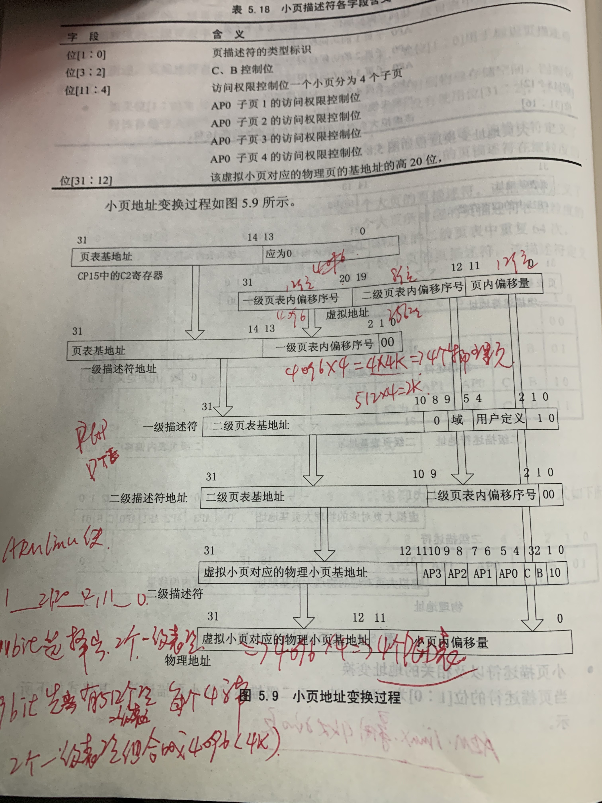

pte（4K） =  pgd\[0\]  \(256项1K大小用于arm mmu硬件 \+  256项1k大小用于linux软件存放标志\) \+ pgd\[1\]  \(256项1K大小用于arm mmu硬件 \+  256项1k大小用于linux软件存放标志\)

pte （4k）= 前2k（存放总共512项目linux 软件标志项）\+ 后2k（存放总共512项 arm 硬件描述符，包括物理页基地址和AP等标志）

```
33  * This leads to the page tables having the following layout:位置关系
34  *
35  *    pgd             pte
    4096项总共16K        1024项总共4K
36  * |        |
37  * +--------+
38  * |        |       +------------+ +0
39  * +- - - - +       | Linux pt 0 |
40  * |        |       +------------+ +1024
41  * +--------+ +0    | Linux pt 1 |
42  * |        |-----> +------------+ +2048
43  * +- - - - + +4    |  h/w pt 0  |
44  * |        |-----> +------------+ +3072
45  * +--------+ +8    |  h/w pt 1  |
46  * |        |       +------------+ +4096
```

```
L_PTE_xxx用于linux版本pte标志，PTE_xxx用于arm32硬件版本pte标志，PMD_xxx用于第一级页表的标志
linux版本pte表项标志位：
120 #define L_PTE_VALID▼    ▼       (_AT(pteval_t, 1) << 0)▼▼       /* Valid */
121 #define L_PTE_PRESENT▼  ▼       (_AT(pteval_t, 1) << 0)
122 #define L_PTE_YOUNG▼    ▼       (_AT(pteval_t, 1) << 1)         //表示该页刚刚被使用过，只有L_PTE_YOUNG被标记，页才能正常访问。否则该标记被清除，相应的arm32 硬件pte页表项页表项也会被清除。放cpu再次访问该页时，会触发缺页异常。缺页异常处理中可以标记L_PTE_YOUNG表示该页刚刚被访问，同时重新设置硬件pte表项。
123 #define L_PTE_DIRTY▼    ▼       (_AT(pteval_t, 1) << 6)         //表示脏页，已经被写。只有page is marked "writable" and "dirty"，才会授予硬件写权限，其他情况如一个干净的页被写了，由于其不具备写权限，会触发缺页异常，handle_pte_fault函数中将其标记为脏页。那这个硬件写权限是如何控制的？
124 #define L_PTE_RDONLY▼   ▼       (_AT(pteval_t, 1) << 7)
125 #define L_PTE_USER▼     ▼       (_AT(pteval_t, 1) << 8)
126 #define L_PTE_XN▼       ▼       (_AT(pteval_t, 1) << 9)
127 #define L_PTE_SHARED▼   ▼       (_AT(pteval_t, 1) << 10)▼       /* shared(v6), coherent(xsc3) */
128 #define L_PTE_NONE▼     ▼       (_AT(pteval_t, 1) << 11)

在x86中L_PTE_DIRTY L_PTE_PRESENT L_PTE_YOUNG都是由硬件完成，arm中需要通过软件模拟

arm32硬件版本标志位
72 #define PTE_EXT_XN▼     ▼       (_AT(pteval_t, 1) << 0)▼▼       /* v6 */
73 #define PTE_EXT_AP_MASK▼▼       (_AT(pteval_t, 3) << 4)
74 #define PTE_EXT_AP0▼    ▼       (_AT(pteval_t, 1) << 4)
75 #define PTE_EXT_AP1▼    ▼       (_AT(pteval_t, 2) << 4)
76 #define PTE_EXT_AP_UNO_SRO▼     (_AT(pteval_t, 0) << 4)
77 #define PTE_EXT_AP_UNO_SRW▼     (PTE_EXT_AP0)
78 #define PTE_EXT_AP_URO_SRW▼     (PTE_EXT_AP1)
79 #define PTE_EXT_AP_URW_SRW▼     (PTE_EXT_AP1|PTE_EXT_AP0)
80 #define PTE_EXT_TEX(x)▼ ▼       (_AT(pteval_t, (x)) << 6)▼      /* v5 */
81 #define PTE_EXT_APX▼    ▼       (_AT(pteval_t, 1) << 9)▼▼       /* v6 */
82 #define PTE_EXT_COHERENT▼       (_AT(pteval_t, 1) << 9)▼▼       /* XScale3 */
83 #define PTE_EXT_SHARED▼ ▼       (_AT(pteval_t, 1) << 10)▼       /* v6 */
84 #define PTE_EXT_NG▼     ▼       (_AT(pteval_t, 1) << 11)▼       /* v6 */
```

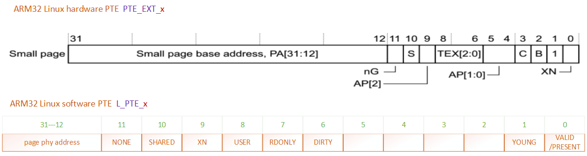

arm32内核设置pte表项都要通过cpu\_v7\_set\_pte\_ext函数

```
/*
*      cpu_v7_set_pte_ext(ptep, pte)
*
*      Set a level 2 translation table entry.
*
*      - ptep  - pointer to level 2 translation table entry
*                (hardware version is stored at +2048 bytes)   /*r0*/
*      - pte   - PTE value to store                            /*r1*/
*      - ext   - value for extended PTE bits                   /*r2*/
*/
81 ENTRY(cpu_v7_set_pte_ext)
82 #ifdef CONFIG_MMU
83 ▼       str▼    r1, [r0]   @ linux version     //先将一份pte存在linux软件pte表项中
84
85 ▼       bic▼    r3, r1, #0x000003f0            //清除r1的bit[9:4]，存入r3
86 ▼       bic▼    r3, r3, #PTE_TYPE_MASK         // PTE_TYPE_MASK ->(_AT(pteval_t, 3) << 0) 清除低两位
87 ▼       orr▼    r3, r3, r2                     //置上硬件pte bit 入参
88 ▼       orr▼    r3, r3, #PTE_EXT_AP0 | 2       //这里将bit1和bit4置位，所以是Small page PTE_EXT_AP0=0x10
89
90 ▼       tst▼    r1, #1 << 4                   //判断r1的bit4是否为0
91 ▼       orrne▼  r3, r3, #PTE_EXT_TEX(1)       //设置TEX为1  PTE_EXT_TEX=0x40
92
93 ▼       eor▼    r1, r1, #L_PTE_DIRTY          //如果L_PTE_DIRTY位为1时，则清0；如果为0时，则置1  L_PTE_DIRTY=bit6
94 ▼       tst▼    r1, #L_PTE_RDONLY | L_PTE_DIRTY  //L_PTE_RDONLY=bit7
95 ▼       orrne▼  r3, r3, #PTE_EXT_APX          //测试L_PTE_RDONLY | L_PTE_DIRTY两位，如果其中有置位，则设置 硬件PTE_EXT_APX
                                                //PTE_EXT_APX=0x200
96
97 ▼       tst▼    r1, #L_PTE_USER                //L_PTE_USER=bit8
98 ▼       orrne▼  r3, r3, #PTE_EXT_AP1         //PTE_EXT_AP1=0x20
99
100 ▼       tst▼    r1, #L_PTE_XN                //L_PTE_XN=bit9
101 ▼       orrne▼  r3, r3, #PTE_EXT_XN         //PTE_EXT_XN=1  
102
103 ▼       tst▼    r1, #L_PTE_YOUNG            //测试r1 的 L_PTE_YOUNG=bit1
104 ▼       tstne▼  r1, #L_PTE_VALID            //如果L_PTE_YOUNG置位，则测试L_PTE_VALID=bit0
105 ▼       eorne▼  r1, r1, #L_PTE_NONE         //如果L_PTE_YOUNG、L_PTE_VALID都置位，则取反L_PTE_NONE位
106 ▼       tstne▼  r1, #L_PTE_NONE            //L_PTE_NONE=bit11
107 ▼       moveq▼  r3, #0                      //1、如果L_PTE_YOUNG未置位， 清掉r3
                                                //2、如果L_PTE_YOUNG置位、L_PTE_VALID未置位，r3清0  L_PTE_NONE位干啥用的？？？
108
109  ARM(▼  str▼    r3, [r0, #2048]! )  //将r3写入硬件pte表项
110  THUMB(▼add▼    r0, r0, #2048 )
111  THUMB(▼str▼    r3, [r0] )
112 ▼       ALT_SMP(W(nop))
113 ▼       ALT_UP (mcr▼    p15, 0, r0, c7, c10, 1)▼▼       @ flush_pte
114 #endif
115 ▼       bx▼     lr
116 ENDPROC(cpu_v7_set_pte_ext)                   
```

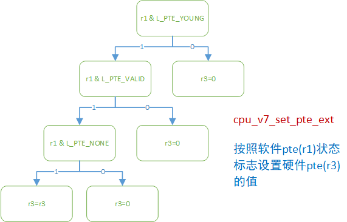

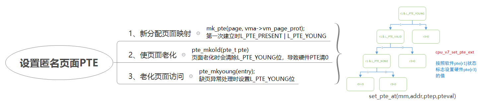

PTE项中，linux软件使用的标志

include/linux/mm\_types.h

page\-\>flag

预留字段用于存放node和zone等信息，以节省内存

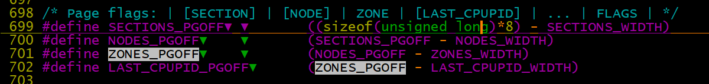

1、vm\_area\_struct 描述了一段虚拟内存区

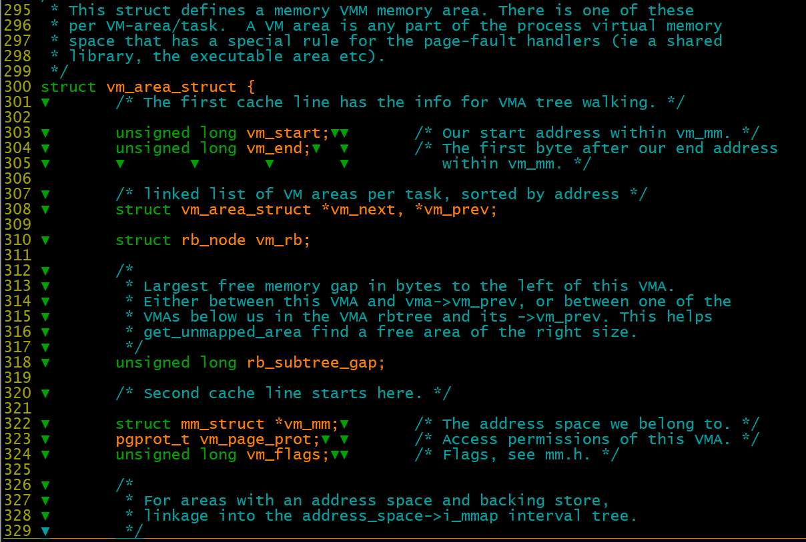

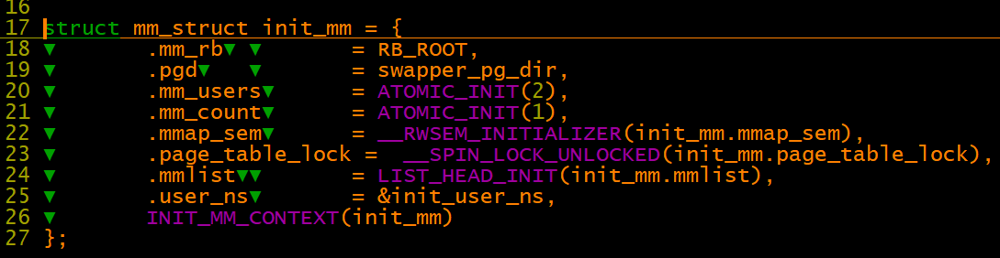

```
vmalloc_limit = (u64)(uintptr_t)vmalloc_min - PAGE_OFFSET + PHYS_OFFSET;
lowmem_limit = min_t(u64, vmalloc_limit, block_end);
arm_lowmem_limit = lowmem_limit;
high_memory = __va(arm_lowmem_limit - 1) + 1;
```

arm\_lowmem\_limit：normal内存的上边界（物理地址）

high\_memory：highmem内存的下边界，（虚拟地址）

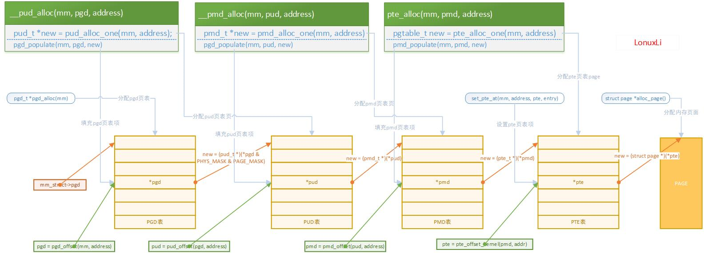
