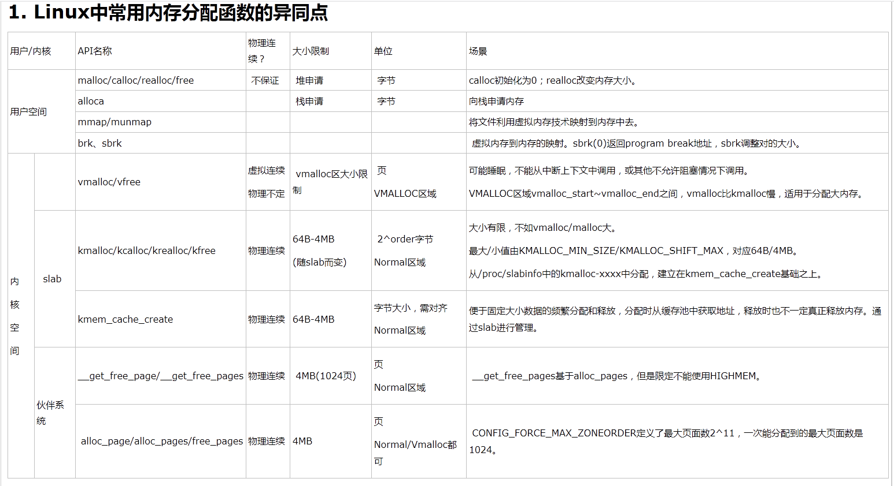
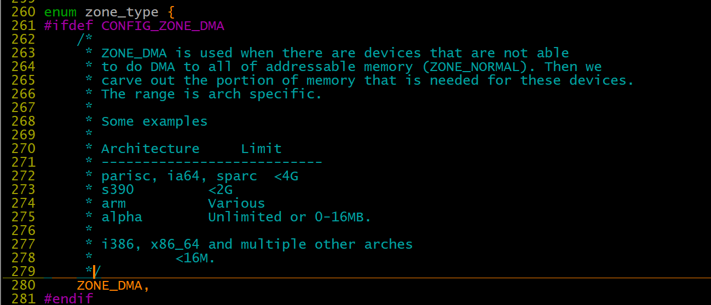
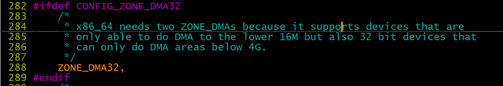

# 内存管理之基础内存知识

1、**Buffer cache是针对磁盘块的缓存，也就是在没有文件系统的情况下，直接对磁盘进行操作的数据会缓存到buffer cache中，例如，文件系统的元数据都会缓存到buffer cache中。** **简单说来，page cache用来缓存文件数据（cache），buffer cache用来缓存磁盘数据。（buffer）**

**Mem行used表示已经分配的内存，free表示尚未分配的内存，shared表示共享内存。**

**计算方法：缓存统计行free=Mem\(free\)\+Mem\(buffers\)\+Mem\(cached\)**

**2、**

****cat /proc/meminfo**    读出的内核信息进行解释，**

**下篇文章会简单对读出该信息的代码进行简单的分析。**

**\# cat /proc/meminfo**

**MemTotal:     16438852 kB**

**MemFree:      10980184 kB**

**Buffers:         95884 kB**

**Cached:         224108 kB**

**SwapCached:          0 kB**

**Active:        5161616 kB**

**Inactive:       217660 kB**

**HighTotal:           0 kB**

**HighFree:            0 kB**

**LowTotal:     16438852 kB**

**LowFree:      10980184 kB**

**SwapTotal:     1048536 kB**

**SwapFree:      1048536 kB**

**Dirty:             424 kB**

**Writeback:           0 kB**

**AnonPages:     5059312 kB**

**Mapped:          20424 kB**

**Slab:            38176 kB**

**PageTables:      13480 kB**

**NFS\_Unstable:        0 kB**

**Bounce:              0 kB**

**CommitLimit:   9267960 kB**

**Committed\_AS: 10073960 kB**

**VmallocTotal: 34359738367 kB**

**VmallocUsed:    263672 kB**

**VmallocChunk: 34359473751 kB**

**HugePages\_Total:     0**

**HugePages\_Free:      0**

**HugePages\_Rsvd:      0**

**Hugepagesize:     2048 kB**

**MemTotal: 所有可用RAM大小 （即物理内存减去一些预留位和内核的二进制代码大小）**

**MemFree: LowFree与HighFree的总和，被系统留着未使用的内存**

**Buffers: 用来给文件做缓冲大小**

**Cached: 被高速缓冲存储器（cache memory）用的内存的大小（等于 diskcache minus SwapCache ）.**

**SwapCached:被高速缓冲存储器（cache memory）用的交换空间的大小** **已经被交换出来的内存，但仍然被存放在swapfile中。用来在需要的时候很快的被替换而不需要再次打开I/O端口。**

**Active: 在活跃使用中的缓冲或高速缓冲存储器页面文件的大小，除非非常必要否则不会被移作他用.**

**Inactive: 在不经常使用中的缓冲或高速缓冲存储器页面文件的大小，可能被用于其他途径.**

****HighTotal:**�**�

**HighFree: 该区域不是直接映射到内核空间。内核必须使用不同的手法使用该段内存。**

****LowTotal:**�**�

**LowFree: 低位可以达到高位内存一样的作用，而且它还能够被内核用来记录一些自己的数据结构。Among many**

**              other things, it is where everything from the Slab is**

**              allocated.  Bad things happen when you're out of lowmem.**

**SwapTotal: 交换空间的总大小**

**SwapFree: 未被使用交换空间的大小**

**Dirty: 等待被写回到磁盘的内存大小。**

**Writeback: 正在被写回到磁盘的内存大小。**

**AnonPages：未映射页的内存大小**

**Mapped: 设备和文件等映射的大小。**

**Slab: 内核数据结构缓存的大小，可以减少申请和释放内存带来的消耗。**

**SReclaimable:可收回Slab的大小                                                                            �**�

**SUnreclaim：不可收回Slab的大小（SUnreclaim\+SReclaimable＝Slab）**

**PageTables：管理内存分页页面的索引表的大小。**

**NFS\_Unstable:不稳定页表的大小**

**Bounce:**

** CommitLimit: Based on the overcommit ratio \('vm.overcommit\_ratio'\),**

**              this is the total amount of  memory currently available to**

**              be allocated on the system. This limit is only adhered to**

**              if strict overcommit accounting is enabled \(mode 2 in**

**              'vm.overcommit\_memory'\).**

**              The CommitLimit is calculated with the following formula:**

**              CommitLimit = \('vm.overcommit\_ratio' \* Physical RAM\) \+ Swap**

**              For example, on a system with 1G of physical RAM and 7G**

**              of swap with a \`vm.overcommit\_ratio\` of 30 it would**

**              yield a CommitLimit of 7.3G.**

**              For more details, see the memory overcommit documentation**

**              in vm/overcommit\-accounting.**

             

**Committed\_AS: The amount of memory presently allocated on the system.**

**              The committed memory is a sum of all of the memory which**

**              has been allocated by processes, even if it has not been**

**              "used" by them as of yet. A process which malloc\(\)'s 1G**

**              of memory, but only touches 300M of it will only show up**

**              as using 300M of memory even if it has the address space**

**              allocated for the entire 1G. This 1G is memory which has**

**              been "committed" to by the VM and can be used at any time**

**              by the allocating application. With strict overcommit**

**              enabled on the system \(mode 2 in 'vm.overcommit\_memory'\),**

**              allocations which would exceed the CommitLimit \(detailed**

**              above\) will not be permitted. This is useful if one needs**

**              to guarantee that processes will not fail due to lack of**

**              memory once that memory has been successfully allocated.**

**VmallocTotal: 可以vmalloc虚拟内存大小**

**VmallocUsed: 已经被使用的虚拟内存大小。**

**VmallocChunk: largest contigious block of vmalloc area which is free**

在x86结构中，三种类型的区域如下：

ZONE\_DMA        内存开始的16MB

ZONE\_NORMAL       16MB~896MB

ZONE\_HIGHMEM       896MB ~ 结束

Linux内核高端内存的划分

内核将高端内存划分为3部分：VMALLOC\_START~VMALLOC\_END、KMAP\_BASE~FIXADDR\_START和FIXADDR\_START~4G。

对 于高端内存，可以通过 alloc\_page\(\) 或者其它函数获得对应的 page，但是要想访问实际物理内存，还得把 page 转为线性地址才行（为什么？想想 MMU 是如何访问物理内存的），也就是说，我们需要为高端内存对应的 page 找一个线性空间，这个过程称为高端内存映射。

对应高端内存的3部分，高端内存映射有三种方式：

映射到”内核动态映射空间”（noncontiguous memory allocation）

这种方式很简单，因为通过 vmalloc\(\) ，在”内核动态映射空间”申请内存的时候，就可能从高端内存获得页面（参看 vmalloc 的实现），因此说高端内存有可能映射到”内核动态映射空间”中。（vmalloc可能分配到不连续的物理内存）

持久内核映射（permanent kernel mapping）

如果是通过 alloc\_page\(\) 获得了高端内存对应的 page，如何给它找个线性空间？

内核专门为此留出一块线性空间，从 PKMAP\_BASE 到 FIXADDR\_START ，用于映射高端内存。在 2.6内核上，这个地址范围是 4G\-8M 到 4G\-4M 之间。这个空间起叫”内核永久映射空间”或者”永久内核映射空间”。这个空间和其它空间使用同样的页目录表，对于内核来说，就是 swapper\_pg\_dir，对普通进程来说，通过 CR3 寄存器指向。通常情况下，这个空间是 4M 大小，因此仅仅需要一个页表即可，内核通过来 pkmap\_page\_table 寻找这个页表。通过 kmap\(\)，可以把一个 page 映射到这个空间来。由于这个空间是 4M 大小，最多能同时映射 1024 个 page。因此，对于不使用的的 page，及应该时从这个空间释放掉（也就是解除映射关系），通过 kunmap\(\) ，可以把一个 page 对应的线性地址从这个空间释放出来。

临时映射（temporary kernel mapping）

内核在 FIXADDR\_START 到 FIXADDR\_TOP 之间保留了一些线性空间用于特殊需求。这个空间称为”固定映射空间”在这个空间中，有一部分用于高端内存的临时映射。

这块空间具有如下特点：

（1）每个 CPU 占用一块空间

（2）在每个 CPU 占用的那块空间中，又分为多个小空间，每个小空间大小是 1 个 page，每个小空间用于一个目的，这些目的定义在 kmap\_types.h 中的 km\_type 中。

当要进行一次临时映射的时候，需要指定映射的目的，根据映射目的，可以找到对应的小空间，然后把这个空间的地址作为映射地址。这意味着一次临时映射会导致以前的映射被覆盖。通过 kmap\_atomic\(\) 可实现临时映射。

5、为什么不把所有的地址空间都分配给内核？

若把所有地址空间都给内存，那么用户进程怎么使用内存？怎么保证内核使用内存和用户进程不起冲突？

（1）让我们忽略Linux对段式内存映射的支持。 在保护模式下，我们知道无论CPU运行于用户态还是核心态，CPU执行程序所访问的地址都是虚拟地址，MMU 必须通过读取控制寄存器CR3中的值作为当前页面目录的指针，进而根据分页内存映射机制（参看相关文档）将该虚拟地址转换为真正的物理地址才能让CPU真 正的访问到物理地址。

（2）对于32位的Linux，其每一个进程都有4G的寻址空间，但当一个进程访问其虚拟内存空间中的某个地址时又是怎样实现不与其它进程的虚拟空间混淆 的呢？每个进程都有其自身的页面目录PGD，Linux将该目录的指针存放在与进程对应的内存结构task\_struct.\(struct mm\_struct\)mm\-\>pgd中。每当一个进程被调度（schedule\(\)）即将进入运行态时，Linux内核都要用该进程的PGD指针设 置CR3（switch\_mm\(\)）。

（3）当创建一个新的进程时，都要为新进程创建一个新的页面目录PGD，并从内核的页面目录swapper\_pg\_dir中复制内核区间页面目录项至新建进程页面目录PGD的相应位置，具体过程如下：

do\_fork\(\) \-\-\> copy\_mm\(\) \-\-\> mm\_init\(\) \-\-\> pgd\_alloc\(\) \-\-\> set\_pgd\_fast\(\) \-\-\> get\_pgd\_slow\(\) \-\-\> memcpy\(&PGD \+ USER\_PTRS\_PER\_PGD, swapper\_pg\_dir \+ USER\_PTRS\_PER\_PGD, \(PTRS\_PER\_PGD \- USER\_PTRS\_PER\_PGD\) \* sizeof\(pgd\_t\)\)

这样一来，每个进程的页面目录就分成了两部分，第一部分为“用户空间”，用来映射其整个进程空间（0x0000 0000－0xBFFF FFFF）即3G字节的虚拟地址；第二部分为“系统空间”，用来映射（0xC000 0000－0xFFFF FFFF）1G字节的虚拟地址。可以看出Linux系统中每个进程的页面目录的第二部分是相同的，所以从进程的角度来看，每个进程有4G字节的虚拟空间， 较低的3G字节是自己的用户空间，最高的1G字节则为与所有进程以及内核共享的系统空间。

（4）现在假设我们有如下一个情景：

在进程A中通过系统调用sethostname\(const char \*name,seze\_t len\)设置计算机在网络中的“主机名”.

在该情景中我们势必涉及到从用户空间向内核空间传递数据的问题，name是用户空间中的地址，它要通过系统调用设置到内核中的某个地址中。让我们看看这个 过程中的一些细节问题：系统调用的具体实现是将系统调用的参数依次存入寄存器ebx,ecx,edx,esi,edi（最多5个参数，该情景有两个 name和len），接着将系统调用号存入寄存器eax，然后通过中断指令“int 80”使进程A进入系统空间。由于进程的CPU运行级别小于等于为系统调用设置的陷阱门的准入级别3，所以可以畅通无阻的进入系统空间去执行为int 80设置的函数指针system\_call\(\)。由于system\_call\(\)属于内核空间，其运行级别DPL为0，CPU要将堆栈切换到内核堆栈，即 进程A的系统空间堆栈。我们知道内核为新建进程创建task\_struct结构时，共分配了两个连续的页面，即8K的大小，并将底部约1k的大小用于 task\_struct（如\#define alloc\_task\_struct\(\) \(\(struct task\_struct \*\) \_\_get\_free\_pages\(GFP\_KERNEL,1\)\)）,而其余部分内存用于系统空间的堆栈空间，即当从用户空间转入系统空间时，堆栈指针 esp变成了（alloc\_task\_struct\(\)\+8192），这也是为什么系统空间通常用宏定义current（参看其实现）获取当前进程的 task\_struct地址的原因。每次在进程从用户空间进入系统空间之初，系统堆栈就已经被依次压入用户堆栈SS、用户堆栈指针ESP、EFLAGS、 用户空间CS、EIP，接着system\_call\(\)将eax压入，再接着调用SAVE\_ALL依次压入ES、DS、EAX、EBP、EDI、ESI、 EDX、ECX、EBX，然后调用sys\_call\_table\+4\*%EAX，本情景为sys\_sethostname\(\)。

（5）在sys\_sethostname\(\)中，经过一些保护考虑后，调用copy\_from\_user\(to,from,n），其中to指向内核空间 system\_utsname.nodename，譬如0xE625A000，from指向用户空间譬如0x8010FE00。现在进程A进入了内核，在 系统空间中运行，MMU根据其PGD将虚拟地址完成到物理地址的映射，最终完成从用户空间到系统空间数据的复制。准备复制之前内核先要确定用户空间地址和 长度的合法性，至于从该用户空间地址开始的某个长度的整个区间是否已经映射并不去检查，如果区间内某个地址未映射或读写权限等问题出现时，则视为坏地址， 就产生一个页面异常，让页面异常服务程序处理。过程如 下：copy\_from\_user\(\)\-\>generic\_copy\_from\_user\(\)\-\>access\_ok\(\)\+\_\_copy\_user\_zeroing\(\).

（6）小结：

\*进程寻址空间0~4G  

\*进程在用户态只能访问0~3G，只有进入内核态才能访问3G~4G  

\*进程通过系统调用进入内核态

\*每个进程虚拟空间的3G~4G部分是相同的  

\*进程从用户态进入内核态不会引起CR3的改变但会引起堆栈的改变

1、ZONE\_DMA，从这里可以看出有些平台对DMA的地址有要求，arm平台是可变的，x86平台这需要小于16M

2、ZONE\_DMA32 在x86\_64需要用到，其可能会支持32位的外设，只能访问到0\-4G的内存区域

内存节点：单个节点用来描述NUMA中一片访问速度一致的内存，UMA中只有一个节点，arm/x86都是UMA结构

UMA：一致内存访问系统     NUMA：非一致内存反问系统

冷页：页没有加载到高速缓存  热页：页加载到高速缓存

1、内存域水印值：需要为关键性分配保留的内存空间的最小值；该值保存在全局变量min\_free\_kbytes中

内存水线的大小影响保留内存和内存回收的阈值

页框：虚拟地址的概念，框是固定的，装的页帧是变化的

页帧：实地址的概念，描述具体的物理内存页

页描述符：

页表：

页目录：

页：
