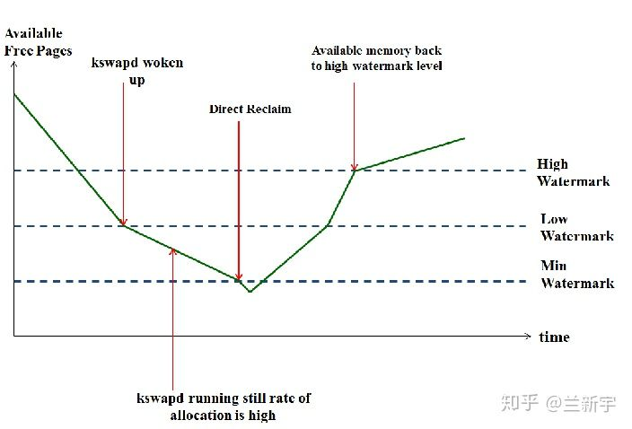
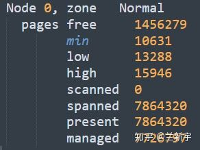
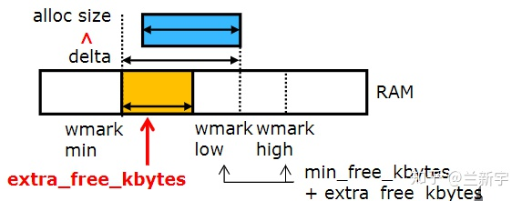
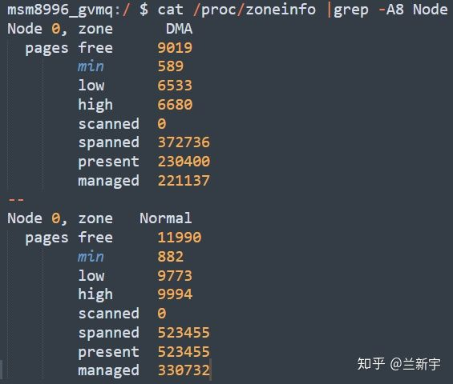
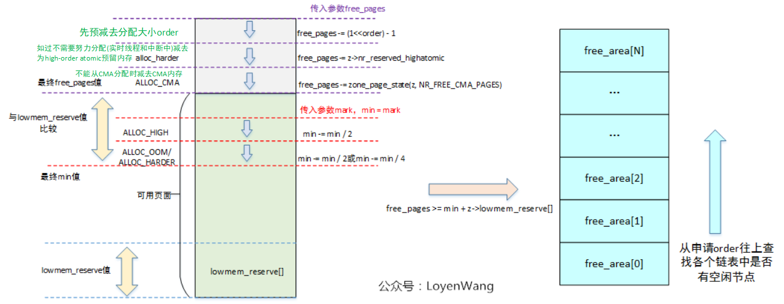

# 内存管理之水位wmark

**一、Kswapd与Watermark**

Linux中物理内存的每个zone都有自己独立的min, low和high三个档位的watermark值，在代码中以[struct zone](https://zhuanlan.zhihu.com/p/68465952)中的\_watermark\[NR\_WMARK\]来表示。

在进行内存分配的时候，如果分配器（比如buddy allocator）发现当前空余内存的值低于"low"但高于"min"，说明现在内存面临一定的压力，那么在此次内存分配完成后，kswapd将被唤醒，以执行内存回收操作。在这种情况下，内存分配虽然会触发内存回收，但不存在被内存回收所阻塞的问题，两者的执行关系是异步的。

这里所说的"空余内存"其实是一个zone总的空余内存减去其[lowmem\_reserve](https://zhuanlan.zhihu.com/p/81961211)的值。对于kswapd来说，要回收多少内存才算完成任务呢？只要把空余内存的大小恢复到"high"对应的watermark值就可以了，当然，这取决于当前空余内存和"high"值之间的差距，差距越大，需要回收的内存也就越多。"low"可以被认为是一个警戒水位线，而"high"则是一个安全的水位线。

1、低于low watermark时，唤醒kswapd进行异步内存回收

2、低于min watermark时，进行同步直接内存回收

3、回收内存，直到高于high watermark为止



如果内存分配器发现空余内存的值低于了"min"，说明现在内存严重不足。这里要分两种情况来讨论，一种是默认的操作，此时分配器将同步等待内存回收完成，再进行内存分配，也就是**direct reclaim**。还有一种特殊情况，如果内存分配的请求是带了PF\_MEMALLOC标志位的，并且现在空余内存的大小可以满足本次内存分配的需求，那么也将是先分配，再回收。

使用PF\_MEMALLOC\("PF"表示per\-process flag\)相当于是忽略了watermark，因此它对应的内存分配的标志是ALLOC\_NO\_WATERMARK。能够获取"min"值以下的内存，也意味着该process有动用几乎所有内存的权利，因此它也对应GFP的标志\_\_GFP\_MEMALLOC。

```
if (gfp_mask & __GFP_MEMALLOC)
    return ALLOC_NO_WATERMARKS;

if (alloc_flags & ALLOC_NO_WATERMARKS)
    set_page_pfmemalloc(page);
```

那谁有这样的权利，可以在内存严重短缺的时候，不等待回收而强行分配内存呢？其中的一个人物就是kswapd啦，因为kswapd本身就是负责回收内存的（kswapd本身运行过程中申请内存使用PF\_MEMALLOC标志，因为其本身不能再次去触发回收动作），它只需要占用一小部分内存支撑其正常运行\(就像启动资金一样\)，就可以去回收更多的内存\(赚更多的钱回来\)。

```
#define PF_MEMALLOC     0x00000800      /* Allocating memory */

__alloc_pages_direct_compact
{
        current->flags |= PF_MEMALLOC; //直接回收会临时修改将PF_MEMALLOC标志置上
        *compact_result = try_to_compact_pages(gfp_mask, order, alloc_flags, ac,
                                                                        prio);
        current->flags = (current->flags & ~PF_MEMALLOC) | noreclaim_flag;
}

#define ALLOC_NO_WATERMARKS     0x04 /* don't check watermarks at all */
bool gfp_pfmemalloc_allowed(gfp_t gfp_mask)
{
        if (unlikely(gfp_mask & __GFP_NOMEMALLOC))
                return false;

        if (gfp_mask & __GFP_MEMALLOC)
                return true;
        if (in_serving_softirq() && (current->flags & PF_MEMALLOC))
                return true;
        if (!in_interrupt() &&
                        ((current->flags & PF_MEMALLOC) ||
                         unlikely(test_thread_flag(TIF_MEMDIE))))
                return true;

        return false;
}

__alloc_pages_slowpath
{
        if (gfp_pfmemalloc_allowed(gfp_mask))
                alloc_flags = ALLOC_NO_WATERMARKS;  //检查路径是否可以分配内存，如果置有__GFP_MEMALLOC PF_MEMALLOC标志的场景
                                                    //急需内存，则不管水位直接分配
}
```

虽然kswapd是在"low"到"min"的这段区间被唤醒加入调度队列的，但当它真正执行的时候，空余内存的值可能已经掉到"low"以下了。可见，"min"值存在的一个意义是保证像kswapd这样的特殊任务能够在需要的时候立刻获得所需内存。

**二、Watermark的取值**

水位的初始化在core\_initcall\(init\_per\_zone\_wmark\_min\)中进行。

那么这三个watermark值的大小又是如何确定的呢？ZONE\_HIGHMEM的watermark值比较特殊，但因为现在64位系统已经不再使用ZONE\_HIGHMEM了，为了简化讨论，以下将以不含ZONE\_HIGHMEM，且只有一个[node](https://zhuanlan.zhihu.com/p/68473428)的64位系统为例进行讲解。

在这种系统中，总的"min"值约等于所有zones可用内存的总和乘以16再开平方的大小，可通过"/proc/sys/vm/min\_free\_kbytes"查看和修改。假设可用内存的大小是4GiB，那么其对应的"min"值就是8MiB \(  \)。

```
int __meminit init_per_zone_wmark_min(void){
        unsigned long lowmem_kbytes;
        int new_min_free_kbytes;

        lowmem_kbytes = nr_free_buffer_pages() * (PAGE_SIZE >> 10);
        new_min_free_kbytes = int_sqrt(lowmem_kbytes * 16);

                min_free_kbytes = int_sqrt(lowmem_kbytes * 16);
                min_free_kbytes = new_min_free_kbytes;
                if (min_free_kbytes < 128)
                        min_free_kbytes = 128;
                if (min_free_kbytes > 65536)
                        min_free_kbytes = 65536;
...}
```

这里的"min"值有个下限和上限，就是最小不能低于128KiB，最大不能超过65536KiB。在实际应用中，通常建议为不低于1024KiB。

得到总的"min"值后，我们就可以根据各个zone在总内存中的占比，通过do\_div\(\)计算出它们各自的"min"值。假设总的"min"值是8MiB，有ZONE\_DMA和ZONE\_NORMAL两个zones，大小分别是128MiB和896MiB，那么ZONE\_DMA和ZONE\_NORMAL的"min"值就分别是1MiB和7MiB。

```
void __setup_per_zone_wmarks(void){
    unsigned long pages_min = min_free_kbytes >> (PAGE_SHIFT - 10);   //计算出系统总的min page数量

for_each_zone(zone) {
    tmp = (u64)pages_min * zone->managed_pages;
    do_div(tmp, lowmem_pages);        //根据各个zone的内存占比计算各zone的min 水位内存

    zone->watermark[WMARK_MIN] = tmp;
    zone->watermark[WMARK_LOW] = min_wmark_pages(zone) + (tmp >> 2);  // 相当于=  min_wmark_pages(zone) * 5/4
    zone->watermark[WMARK_HIGH] = min_wmark_pages(zone) + (tmp >> 1); // 相当于=  min_wmark_pages(zone) * 6/4
...}
```

一个zone的"low"和"high"的值都是根据它的"min"值算出来的，"low"比"min"的值大1/4左右，"high"比"min"的值大1/2左右，三者的比例关系大致是4:5:6。

使用"cat /proc/zoneinfo"可以查看这三个值的大小（注意这里是以page为单位的）：



你可以把"/proc/zoneinfo"中所有zones的"min"值加起来乘以4\(如果page size是4KiB的话\)，看一下是不是基本等于"/proc/sys/vm"中的"min\_free\_kbytes"的值。

**三、Watermark的调节**

为了尽量避免出现direct reclaim，我们需要空余内存的大小一直保持在"min"值之上。在网络收发的时候，数据量可能突然增大，需要临时申请大量的内存，这种场景被称为"**burst allocation**"。此时kswapd回收内存的速度可能赶不上内存分配的速度，造成direct reclaim被触发，影响系统性能。


在内存分配时，只有"low"与"min"之间之间的这段区域才是kswapd的活动空间，低于了"min"会触发direct reclaim，高于了"low"又不会唤醒kswapd，而Linux中默认的"low"与"min"之间的差值确实显得小了点。

为此，Android的设计者在Linux的内存watermark的基础上，增加了一个"**extra\_free\_kbytes**"的变量，这个"extra"是额外加在"low"与"min"之间的，它在保持"min"值不变的情况下，让"low"值有所增大。假设你的"burst allocation"需要100MiB\(100\*1024KiB\)的空间，那么你就可以把"extra\_free\_kbytes"的值设为102400。



于是，设置各个zone的watermark的代码变成了这样：

```
void __setup_per_zone_wmarks(void){
unsigned long pages_min = min_free_kbytes >> (PAGE_SHIFT - 10);
unsigned long pages_low = extra_free_kbytes >> (PAGE_SHIFT - 10);

for_each_zone(zone) {
min = (u64)pages_min * zone->managed_pages;
do_div(min, lowmem_pages);
low = (u64)pages_low * zone->managed_pages;
do_div(low, vm_total_pages);

zone->watermark[WMARK_MIN] = min;
zone->watermark[WMARK_LOW] = min + low + (min >> 2);
zone->watermark[WMARK_HIGH] = min + low + (min >> 1)
...}
```

和Linux中对应的代码相比，主要就是多了这样一个"extra\_free\_kbytes"，该参数可通过设置"/proc/sys/vm/extra\_free\_kbytes"来调节。关于Andoird这个patch的详细信息，请参考这个[提交记录](https://link.zhihu.com/?target=https%3A//lkml.org/lkml/2013/2/17/210)。

在Android的机器\(基于4.4的Linux内核\)上用"cat /proc/zoneinfo"查看一下：



可见，这里"low"和"high"已经不再是"min"值的5/4和6/4了，而是多出了一大截。想要知道调节有没有取得预期的效果，可以通过"/proc/vmstat"中的"pageoutrun"和"allocstall"来查看，两者分别代表了kswapd和direct reclaim启动的次数。


在Linux内核4.6版本中，诞生了一种新的调节watermark的方式。具体做法是引入一个叫做"**watermark\_scale\_factor**"的系数，其默认值为10，对应内存占比0.1%\(10/10000\)，可通过"/proc/ sys/vm/watermark\_scale\_factor"设置，最大为1000。当它的值被设定为1000时，意味着"low"与"min"之间的差值，以及"high"与"low"之间的差值都将是内存大小的10%\(1000/10000\)。

```
tmp = max_t(u64, tmp >> 2, mult_frac(zone_managed_pages(zone),
watermark_scale_factor, 10000));

zone->_watermark[WMARK_LOW] = min_wmark_pages(zone) + tmp;zone->_watermark[WMARK_HIGH] = min_wmark_pages(zone) + tmp * 2;
```

关于这个patch的详细信息，请参考这个[提交记录](https://link.zhihu.com/?target=https%3A//git.kernel.org/pub/scm/linux/kernel/git/stable/linux.git/diff/%3Fid%3D795ae7a0de6b834a0cc202aa55c190ef81496665)。前面讲到的"extra\_free\_kbytes"的方式只增大了"low"与"min"之间的差值，而"watermark\_scale\_factor"的方式同时增大了"low"与"min"之间，以及"high"与"low"之间的差值。现在的Android代码已经合并了4.6内核的这个改动，不再单独提供通过"extra\_free\_kbytes"来调节watermark的方式了。

**四、min/low水位的使用场景**

```
__alloc_pages_nodemask(gfp_t gfp_mask, unsigned int order,
            struct zonelist *zonelist, nodemask_t *nodemask)
{
    unsigned int alloc_flags = ALLOC_WMARK_LOW;

    /* First allocation attempt */
    page = get_page_from_freelist(alloc_mask, order, alloc_flags, &ac);  //第一次快速分配利用low水位进行判断 ，如果内存充足则直接分配，否则进行异步回收

    page = __alloc_pages_slowpath(alloc_mask, order, &ac);
return page;
}

static inline struct page *
__alloc_pages_slowpath(gfp_t gfp_mask, unsigned int order,
                        struct alloc_context *ac)
{
    bool can_direct_reclaim = gfp_mask & __GFP_DIRECT_RECLAIM;
    struct page *page = NULL;
    unsigned int alloc_flags;

    alloc_flags = gfp_to_alloc_flags(gfp_mask); //第二次慢速分配使用min水位标志，在内存不足时使用直接回收方式

    page = get_page_from_freelist(gfp_mask, order, alloc_flags, ac)
    if (!page) {
        page = __alloc_pages_direct_compact(gfp_mask, order,
                        alloc_flags, ac,
                        INIT_COMPACT_PRIORITY,
                        &compact_result);
    }
    return page;
}

static inline unsigned int
gfp_to_alloc_flags(gfp_t gfp_mask)
{
    unsigned int alloc_flags = ALLOC_WMARK_MIN | ALLOC_CPUSET; //初始化为min水位标志

    /* __GFP_HIGH is assumed to be the same as ALLOC_HIGH to save a branch. */
    BUILD_BUG_ON(__GFP_HIGH != (__force gfp_t) ALLOC_HIGH);

    /*
     * The caller may dip into page reserves a bit more if the caller
     * cannot run direct reclaim, or if the caller has realtime scheduling
     * policy or is asking for __GFP_HIGH memory.  GFP_ATOMIC requests will
     * set both ALLOC_HARDER (__GFP_ATOMIC) and ALLOC_HIGH (__GFP_HIGH).
     */
    alloc_flags |= (__force int) (gfp_mask & __GFP_HIGH);

    if (gfp_mask & __GFP_ATOMIC) {
        /*
         * Not worth trying to allocate harder for __GFP_NOMEMALLOC even
         * if it can't schedule.
         */
        if (!(gfp_mask & __GFP_NOMEMALLOC))
            alloc_flags |= ALLOC_HARDER;
        /*
         * Ignore cpuset mems for GFP_ATOMIC rather than fail, see the
         * comment for __cpuset_node_allowed().
         */
        alloc_flags &= ~ALLOC_CPUSET;
    } else if (unlikely(rt_task(current)) && !in_interrupt())
        alloc_flags |= ALLOC_HARDER;

#ifdef CONFIG_CMA
    if (gfpflags_to_migratetype(gfp_mask) == MIGRATE_MOVABLE)
        alloc_flags |= ALLOC_CMA;
#endif
    return alloc_flags;
}
```

buddy分页过程中使用的分配标志

```
//bit0-bit1 用于水位标志
/* The ALLOC_WMARK bits are used as an index to zone->watermark */
#define ALLOC_WMARK_MIN     WMARK_MIN
#define ALLOC_WMARK_LOW     WMARK_LOW
#define ALLOC_WMARK_HIGH    WMARK_HIGH
#define ALLOC_NO_WATERMARKS 0x04 /* don't check watermarks at all */

/* Mask to get the watermark bits */
#define ALLOC_WMARK_MASK    (ALLOC_NO_WATERMARKS-1)

#define ALLOC_HARDER        0x10 /* try to alloc harder */ //分配困难，则会降低内存分配要求
#define ALLOC_HIGH      0x20 /* __GFP_HIGH set */
#define ALLOC_CPUSET        0x40 /* check for correct cpuset */
#define ALLOC_CMA       0x80 /* allow allocations from CMA areas */
```

**五、水位判断**

水位判断在多个地方使用，判断当前zone \*z的内存在限制水位mark情况下是否能满足分配目标order大小、目标zone index、分配标志alloc\_falgs内存分配请求。

```
bool __zone_watermark_ok(struct zone *z, unsigned int order, unsigned long mark,
                         int classzone_idx, unsigned int alloc_flags,
                         long free_pages)
{
        long min = mark;
        int o;
        const bool alloc_harder = (alloc_flags & ALLOC_HARDER);

        /* free_pages may go negative - that's OK */
        free_pages -= (1 << order) - 1;

        if (alloc_flags & ALLOC_HIGH)
                min -= min / 2;
        /*
         * If the caller does not have rights to ALLOC_HARDER then subtract
         * the high-atomic reserves. This will over-estimate the size of the
         * atomic reserve but it avoids a search.
         */
        if (likely(!alloc_harder))
                free_pages -= z->nr_reserved_highatomic;
        else
                min -= min / 4;

#ifdef CONFIG_CMA
        /* If allocation can't use CMA areas don't use free CMA pages */
        if (!(alloc_flags & ALLOC_CMA))
                free_pages -= zone_page_state(z, NR_FREE_CMA_PAGES);
#endif

        /*
         * Check watermarks for an order-0 allocation request. If these
         * are not met, then a high-order request also cannot go ahead
         * even if a suitable page happened to be free.
         */
        if (free_pages <= min + z->lowmem_reserve[classzone_idx])
                return false;

        /* If this is an order-0 request then the watermark is fine */
        if (!order)
                return true;
        /* For a high-order request, check at least one suitable page is free */
        for (o = order; o < MAX_ORDER; o++) {
                struct free_area *area = &z->free_area[o];
                int mt;
                if (!area->nr_free)
                        continue;
                for (mt = 0; mt < MIGRATE_PCPTYPES; mt++) {
                        if (!list_empty(&area->free_list[mt]))
                                return true;
                }
#ifdef CONFIG_CMA
                if ((alloc_flags & ALLOC_CMA) &&
                    !list_empty(&area->free_list[MIGRATE_CMA])) {
                        return true;
                }
#endif
                if (alloc_harder &&
                        !list_empty(&area->free_list[MIGRATE_HIGHATOMIC]))
                        return true;
        }
        return false;
}
```

代码实现中，分配标志控制着free\_pages和min值\(当前水位要求mark下的最低限制\)，共同决定这剩余内存是否满足要求

设置ALLOC\_HARDER的场景：

```
1、慢速分配__alloc_pages_slowpath中设置了non-failing标志
2、atomic方式分配时并且未设置__GFP_NOMEMALLOC明确指明不使用紧急reserves内存 <gfp_to_alloc_flags>
3、实时线程中使用非atomic方式分配 <gfp_to_alloc_flags>
```

设置ALLOC\_HIGH标志的场景\(ALLOC\_HIGH 等价于\_\_\_GFP\_HIGH标志\)：

```
1、atomic分配时会设置 <#define GFP_ATOMIC (__GFP_HIGH|__GFP_ATOMIC|__GFP_KSWAPD_RECLAIM)>
2、其他内核模块内存申请时自己设置 如<mm/ksm.c [<alloc_stable_node>>>
```



**六、high\-order atominc预留内存**

\<mm, page\_alloc: reserve pageblocks for high\-order atomic allocations on demand\>

commit：0aaa29a56e4fb0fc9e24edb649e2733a672ca099

Linux 4.4\-rc1

[https://lwn.net/Articles/422291/](https://lwn.net/Articles/422291/)
