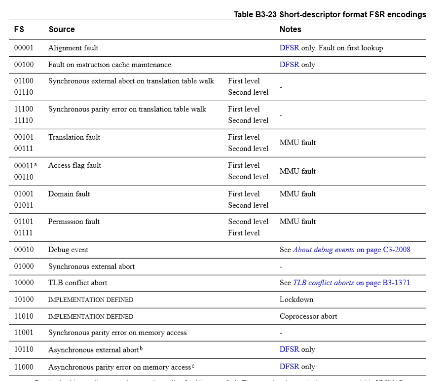
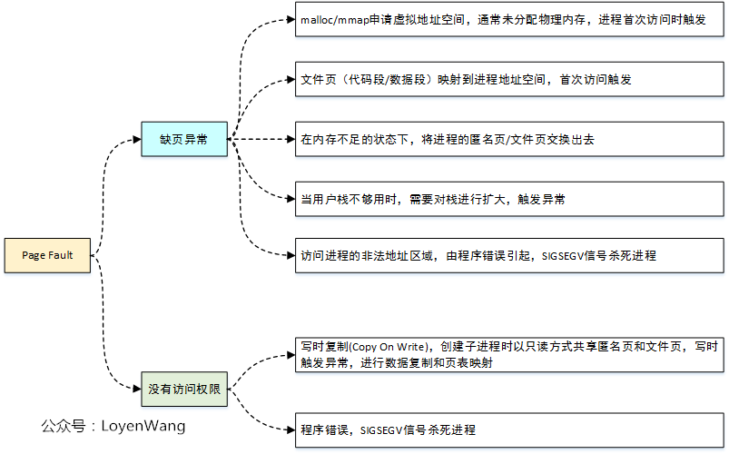

# 内存管理之缺页异常

armv7 数据访问异常流程：

```
207 __dabt_svc:
208 ▼       svc_entry uaccess=0
209 ▼       mov▼    r2, sp
210 ▼       dabt_helper                                                                                                               
211  THUMB(▼ldr▼    r5, [sp, #S_PSR]▼       )▼      @ potentially updated CPSR
212 ▼       svc_exit r5▼    ▼       ▼       ▼       @ return from exception
213  UNWIND(.fnend▼ ▼       )
214 ENDPROC(__dabt_svc)

451 __dabt_usr:
452 ▼       usr_entry uaccess=0
453 ▼       kuser_cmpxchg_check
454 ▼       mov▼    r2, sp
455 ▼       dabt_helper                                                                                                               
456 ▼       b▼      ret_from_exception
457  UNWIND(.fnend▼ ▼       )
458 ENDPROC(__dabt_usr)  

  64 ▼       .macro▼ dabt_helper
  65
  66 ▼       @
  67 ▼       @ Call the processor-specific abort handler:
  68 ▼       @
  69 ▼       @  r2 - pt_regs
  70 ▼       @  r4 - aborted context pc
  71 ▼       @  r5 - aborted context psr
  72 ▼       @
  73 ▼       @ The abort handler must return the aborted address in r0, and
  74 ▼       @ the fault status register in r1.  r9 must be preserved.
  75 ▼       @
  76 #ifdef MULTI_DABORT
  77 ▼       ldr▼    ip, .LCprocfns
  78 ▼       mov▼    lr, pc
  79 ▼       ldr▼    pc, [ip, #PROCESSOR_DABT_FUNC]
  80 #else
  81 ▼       bl▼     CPU_DABORT_HANDLER
  82 #endif
  83 ▼       .endm

86:#  define CPU_DABORT_HANDLER v7_early_abort

15 ENTRY(v7_early_abort)
16 ▼       mrc▼    p15, 0, r1, c5, c0, 0▼  ▼       @ get FSR  失效状态寄存器
17 ▼       mrc▼    p15, 0, r0, c6, c0, 0▼  ▼       @ get FAR  失效地址寄存器
18 ▼       uaccess_disable ip▼     ▼       ▼       @ disable userspace access
45 ▼       b▼      do_DataAbort
46 ENDPROC(v7_early_abort)

544 /*
545  * Dispatch a data abort to the relevant handler.
546  */
547 asmlinkage void __exception
548 do_DataAbort(unsigned long addr, unsigned int fsr, struct pt_regs *regs)
549 {
550 ▼       const struct fsr_info *inf = fsr_info + fsr_fs(fsr);  // fsr_fs(fsr) = (fsr & 0x3f);                                                                    
551 ▼       struct siginfo info;
552
553 ▼       if (!inf->fn(addr, fsr & ~FSR_LNX_PF, regs)) //此处的错误分发处理是根据FSR状态来的，从FSR的描述可以看到细节
554 ▼       ▼       return;
555
556 ▼       pr_alert("Unhandled fault: %s (0x%03x) at 0x%08lx\n",
557 ▼       ▼       inf->name, fsr, addr);
558 ▼       show_pte(current->mm, addr);
559
560 ▼       info.si_signo = inf->sig;
561 ▼       info.si_errno = 0;
562 ▼       info.si_code  = inf->code;
563 ▼       info.si_addr  = (void __user *)addr;
564 ▼       arm_notify_die("", regs, &info, fsr, 0);
565 }

  1 static struct fsr_info fsr_info[] = {
  2 ▼       /*
  3 ▼        * The following are the standard ARMv3 and ARMv4 aborts.  ARMv5
  4 ▼        * defines these to be "precise" aborts.
  5 ▼        */
  6 ▼       { do_bad,▼      ▼       SIGSEGV, 0,▼    ▼       "vector exception"▼     ▼          },
  7 ▼       { do_bad,▼      ▼       SIGBUS,▼ BUS_ADRALN,▼   "alignment exception"▼  ▼          },
  8 ▼       { do_bad,▼      ▼       SIGKILL, 0,▼    ▼       "terminal exception"▼   ▼          },
  9 ▼       { do_bad,▼      ▼       SIGBUS,▼ BUS_ADRALN,▼   "alignment exception"▼  ▼          },
10 ▼       { do_bad,▼      ▼       SIGBUS,▼ 0,▼    ▼       "external abort on linefetch"▼     },
11 ▼       { do_translation_fault,▼SIGSEGV, SEGV_MAPERR,▼  "section translation fault"▼       },
12 ▼       { do_bad,▼      ▼       SIGBUS,▼ 0,▼    ▼       "external abort on linefetch"▼     },
13 ▼       { do_page_fault,▼       SIGSEGV, SEGV_MAPERR,▼  "page translation fault"▼          },
14 ▼       { do_bad,▼      ▼       SIGBUS,▼ 0,▼    ▼       "external abort on non-linefetch"  },
15 ▼       { do_bad,▼      ▼       SIGSEGV, SEGV_ACCERR,▼  "section domain fault"▼ ▼          },
16 ▼       { do_bad,▼      ▼       SIGBUS,▼ 0,▼    ▼       "external abort on non-linefetch"  },
17 ▼       { do_bad,▼      ▼       SIGSEGV, SEGV_ACCERR,▼  "page domain fault"▼    ▼          },
18 ▼       { do_bad,▼      ▼       SIGBUS,▼ 0,▼    ▼       "external abort on translation"▼   },
19 ▼       { do_sect_fault,▼       SIGSEGV, SEGV_ACCERR,▼  "section permission fault"▼        },                                      
20 ▼       { do_bad,▼      ▼       SIGBUS,▼ 0,▼    ▼       "external abort on translation"▼   },
21 ▼       { do_page_fault,▼       SIGSEGV, SEGV_ACCERR,▼  "page permission fault"▼▼          },
            ......
}
```

FSR \(CP15 C5寄存器\)



出现缺页异常的可能场景：



do\_page\_fault

```
static int __kprobes
do_page_fault(unsigned long addr, unsigned int fsr, struct pt_regs *regs)
{
    struct task_struct *tsk;
    struct mm_struct *mm;
    int fault, sig, code;
    unsigned int flags = FAULT_FLAG_ALLOW_RETRY | FAULT_FLAG_KILLABLE;

    if (notify_page_fault(regs, fsr))
        return 0;

    tsk = current;
    mm  = tsk->mm;

    /* Enable interrupts if they were enabled in the parent context. */
    if (interrupts_enabled(regs))
        local_irq_enable();

    /*
     * If we're in an interrupt or have no user
     * context, we must not take the fault..
     */
    if (faulthandler_disabled() || !mm)  //不能在中断上下文、软中断上下文、关抢占上下文以及内核线程中进行缺页异常处理。即在这些地方不能访问用户空间。
        goto no_context;

    if (user_mode(regs))
        flags |= FAULT_FLAG_USER;
    if (fsr & FSR_WRITE)
        flags |= FAULT_FLAG_WRITE;

    if (!down_read_trylock(&mm->mmap_sem)) {
        if (!user_mode(regs) && !search_exception_tables(regs->ARM_pc))
            goto no_context;
retry:
        down_read(&mm->mmap_sem);
    } else {
        might_sleep();
    }

    fault = __do_page_fault(mm, addr, fsr, flags, tsk);  //缺页异常修复函数

    if ((fault & VM_FAULT_RETRY) && fatal_signal_pending(current)) {
        if (!user_mode(regs))
            goto no_context;
        return 0;
    }

    up_read(&mm->mmap_sem);

    /*
     * Handle the "normal" case first - VM_FAULT_MAJOR
     */
    if (likely(!(fault & (VM_FAULT_ERROR | VM_FAULT_BADMAP | VM_FAULT_BADACCESS))))
        return 0; //如果用户态或内核态缺页异常处理完毕，无以上错误直接从此处退出，正常情况下的退出口

    //下面是缺页异常处理异常处理部分
    /*
     * If we are in kernel mode at this point, we
     * have no context to handle this fault with.
     */
    if (!user_mode(regs))
        goto no_context;  //如果此时内核态缺页异常，说明地址处理存在错误如用户空间未分配地址，则直接进入__do_kernel_fault。
                            //这种场景一般是在进程系统调用中调用copy_to/from_user时，传入的用户空间地址存在异常如未分配

    if (fault & VM_FAULT_OOM) {
        /*
         * We ran out of memory, call the OOM killer, and return to
         * userspace (which will retry the fault, or kill us if we
         * got oom-killed)
         */
        pagefault_out_of_memory();
        return 0;
    }

    if (fault & VM_FAULT_SIGBUS) {
        /*
         * We had some memory, but were unable to
         * successfully fix up this page fault.
         */
        sig = SIGBUS;
        code = BUS_ADRERR;
    } else {
        /*
         * Something tried to access memory that
         * isn't in our memory map..
         */
        sig = SIGSEGV;
        code = fault == VM_FAULT_BADACCESS ?
            SEGV_ACCERR : SEGV_MAPERR;
    }

    __do_user_fault(tsk, addr, fsr, sig, code, regs);  //用户态缺页异常处理存在异常
    return 0;

no_context:
    __do_kernel_fault(mm, addr, fsr, regs);  //1、进行exception_tables查表，进行地址修复，来解决内核态存在访问用户地址空间异常
                                            //2、内核态访问地址错误，或者是exception_tables表中没有找到异常处理表项，直接引发内核崩溃
    return 0;
}
```

关于缺页异常中的\_\_do\_kernel\_fault\-》fixup\_exception处理目的

1、如果不采用fixup\_exceptio方式，如果在内核态访问用户态异常地址之前，则需要提前对地址进行vma检查，否则内核态会崩溃，而这个检查就稍显麻烦

2、fixup\_exceptio的的本质是 A内核态访问异常用户空间地址\-\>B进入缺页异常处理\-\>C调用fixup\_exception进行查表\-\>D根据匹配表内容进行返回地址跳转

```

316 #define __get_user_asm(x, addr, err, instr)▼    ▼       ▼       \
317 ▼       __asm__ __volatile__(▼  ▼       ▼       ▼       ▼       \
318 ▼       "1:▼    " TUSER(instr) " %1, [%2], #0\n"▼       ▼       \  //访问用户空间地址，如果用户空间地址异常，从此处进入缺页异常处理
319 ▼       "2:\n"▼ ▼       ▼       ▼       ▼       ▼       ▼       \
320 ▼       "▼      .pushsection .text.fixup,\"ax\"\n"▼     ▼       \
321 ▼       "▼      .align▼ 2\n"▼   ▼       ▼       ▼       ▼       \
322 ▼       "3:▼    mov▼    %0, %3\n"▼      ▼       ▼       ▼       \  //将返回值放进r0,r1。如果用户空间地址异常，查表，直接从1b跳转至此处运行
323 ▼       "▼      mov▼    %1, #0\n"▼      ▼       ▼       ▼       \
324 ▼       "▼      b▼      2b\n"▼  ▼       ▼       ▼       ▼       \
325 ▼       "▼      .popsection\n"▼ ▼       ▼       ▼       ▼       \
326 ▼       "▼      .pushsection __ex_table,\"a\"\n"▼       ▼       \  //在section __ex_table中增加一个表项，该表项：1b的地址（fixup地址）, 3b的地址（fixuop处理时跳转地址）
327 ▼       "▼      .align▼ 3\n"▼   ▼       ▼       ▼       ▼       \
328 ▼       "▼      .long▼  1b, 3b\n"▼      ▼       ▼       ▼       \
329 ▼       "▼      .popsection"▼   ▼       ▼       ▼       ▼       \
330 ▼       : "+r" (err), "=&r" (x)▼▼       ▼       ▼       ▼       \
331 ▼       : "r" (addr), "i" (-EFAULT)▼    ▼       ▼       ▼       \
332 ▼       : "cc")
333

do_page_fault
    __do_kernel_fault
        fixup_exception(regs)

7 int fixup_exception(struct pt_regs *regs)
8 {
9 ▼       const struct exception_table_entry *fixup;
10
11 ▼       fixup = search_exception_tables(instruction_pointer(regs));
12 ▼       if (fixup) {
13 ▼       ▼       regs->ARM_pc = fixup->fixup;  //修改返回的pc值，直接跳转至fixup->fixup处运行
18 ▼       }
20 ▼       return fixup != NULL;
21 }

从此处看，内核态访问用户空间地址一定要用copy_to/from_user，而不要用memcpy，因为前者在exception_tables表中有调用__get_user_asm类似接口访问用户空间。
如果在内核态处理异常用户空间地址只是返回错误码，后者会造成内核 
```

handle\_pte\_fault 函数处理：

```
static int handle_pte_fault(struct fault_env *fe)
{
    pte_t entry;

    if (unlikely(pmd_none(*fe->pmd))) {
        fe->pte = NULL;      //PTE表项不存在分支
    } else {
        fe->pte = pte_offset_map(fe->pmd, fe->address);
        entry = *fe->pte;      //PTE表项存在分支
        barrier();
        if (pte_none(entry)) {
            pte_unmap(fe->pte);
            fe->pte = NULL;
        }
    }

    if (!fe->pte) {        //pte表项不存在处理分支
        if (vma_is_anonymous(fe->vma))
            return do_anonymous_page(fe);   //匿名页缺页异常处理
        else
            return do_fault(fe);   //文件页缺页异常处理
    }

    if (!pte_present(entry))
        return do_swap_page(fe, entry);  //内存页被交换出去处理

    if (pte_protnone(entry) && vma_is_accessible(fe->vma))
        return do_numa_page(fe, entry);

    fe->ptl = pte_lockptr(fe->vma->vm_mm, fe->pmd);
    spin_lock(fe->ptl);
    if (unlikely(!pte_same(*fe->pte, entry)))  
        goto unlock;        //从此处退出只有一种情况，即同进程中其他线程也处理了该地址，并在本线程之前完成处理，从而导致pte表项已经被修改，则直接退出
    if (fe->flags & FAULT_FLAG_WRITE) {
        if (!pte_write(entry))
            return do_wp_page(fe, entry);  //写时复制处理，即写共享的匿名页面，由于该页面不具备写权限而进入处理
        entry = pte_mkdirty(entry);
    }
    entry = pte_mkyoung(entry);  //1、如果是arm page_referenced清除硬件pte表项导致的缺页异常，此处设置L_PTE_YOUNG位，首次修改pte表项内容
                                 //2、如果是其他原因导致的缺页异常，则pte表项内容在前面就可能已经修改了
    if (ptep_set_access_flags(fe->vma, fe->address, fe->pte, entry,
                fe->flags & FAULT_FLAG_WRITE)) {
        update_mmu_cache(fe->vma, fe->address, fe->pte);   //内存中pte表项被修改，更新cache
    } else {
        if (fe->flags & FAULT_FLAG_WRITE)
            flush_tlb_fix_spurious_fault(fe->vma, fe->address);  //如果是写保护，则更新tlb缓存。。什么场景使用？
    }
unlock:
    pte_unmap_unlock(fe->pte, fe->ptl);
    return 0;
}

47 int ptep_set_access_flags(struct vm_area_struct *vma,
48 ▼       ▼       ▼         unsigned long address, pte_t *ptep,
49 ▼       ▼       ▼         pte_t entry, int dirty)
50 {
51 ▼       int changed = !pte_same(*ptep, entry);
52 ▼       if (changed) {
                    //pte表项被修改，回写pte表项内容到内存中
53 ▼       ▼       set_pte_at(vma->vm_mm, address, ptep, entry);
54 ▼       ▼       flush_tlb_fix_spurious_fault(vma, address);
55 ▼       }
56 ▼       return changed;
57 }
```

匿名页和非匿名页的区分方法：vma\_is\_anonymous 实质是否有vm\_ops

```
3507 ▼       ▼       if (vma_is_anonymous(fe->vma))                                                                                    
3508 ▼       ▼       ▼       return do_anonymous_page(fe);
3509 ▼       ▼       else
3510 ▼       ▼       ▼       return do_fault(fe);

1373 static inline bool vma_is_anonymous(struct vm_area_struct *vma)
1374 {
1375 ▼       return !vma->vm_ops;                                                                                                      
1376 }
```

do\_anonymous\_page

```
        /* File mapping without ->vm_ops ? */
        if (vma->vm_flags & VM_SHARED)
                return VM_FAULT_SIGBUS;  //不管是匿名共享映射还是文件共享映射，vma都有相应的文件，匿名共享映射的文件是/dev/zero

Use the zero-page for reads
2736 ▼       if (!(fe->flags & FAULT_FLAG_WRITE) &&
2737 ▼       ▼       ▼       !mm_forbids_zeropage(vma->vm_mm)) {                                                                       
2738 ▼       ▼       entry = pte_mkspecial(pfn_pte(my_zero_pfn(fe->address),
2739 ▼       ▼       ▼       ▼       ▼       ▼       vma->vm_page_prot));
2740 ▼       ▼       fe->pte = pte_offset_map_lock(vma->vm_mm, fe->pmd, fe->address,
2741 ▼       ▼       ▼       ▼       &fe->ptl);
2742 ▼       ▼       if (!pte_none(*fe->pte))
2743 ▼       ▼       ▼       goto unlock;
2744 ▼       ▼       /* Deliver the page fault to userland, check inside PT lock */
2745 ▼       ▼       if (userfaultfd_missing(vma)) {
2746 ▼       ▼       ▼       pte_unmap_unlock(fe->pte, fe->ptl);
2747 ▼       ▼       ▼       return handle_userfault(fe, VM_UFFD_MISSING);
2748 ▼       ▼       }
2749 ▼       ▼       goto setpte;
2750 ▼       }

zero_page的初始化：paging_init
1635 ▼       /* allocate the zero page. */
1636 ▼       zero_page = early_alloc(PAGE_SIZE);
1640 ▼       empty_zero_page = virt_to_page(zero_page);
在执行缺页异常时并没有发生真正的读写，此时如果是只读的话，由于缺页说明该虚拟地址对应的内容并未初始化，理论上也只能读到全零的数据。
使用零页的方式可以将这种只读全零页的场景映射到，同一物理内存，降低真正物理内存的使用，如果需要写时，会再次触发缺页异常并分配新的物理内存页（cow 写时复制）。
这种场景应该是很少的，更多的是不同的vma映射到同一块物理地址，并且属性是只读。  
只读标记从do_page_fault函数传下来，来源于vma结构：
126 ▼       if (write) {
127 ▼       ▼       if (!(vma->vm_flags & VM_WRITE))
128 ▼       ▼       ▼       goto bad_area;
129 ▼       ▼       flags |= FAULT_FLAG_WRITE;
130 ▼       } else {
131 ▼       ▼       if (!(vma->vm_flags & (VM_READ | VM_EXEC)))
132 ▼       ▼       ▼       goto bad_area;
133 ▼       }    
```

    do\_fault 文件映射缺页异常。文件映射缺页异常，核心是文件内容是虚拟地址对应的物理页缺失，需要从文件中拷贝内容至物理页中，并完成pte页表项的填充，实现虚拟地址到物理地址的映射。这些物理页通常在\_\_do\_fault函数中实现真正的分配，并且在统计上这些物理页为非匿名页，被称为page  cache，当物理内存不足时这些物理页应该是可以回收的。

```
vma->vm_ops：
342 /*
343  * These are the virtual MM functions - opening of an area, closing and
344  * unmapping it (needed to keep files on disk up-to-date etc), pointer
345  * to the functions called when a no-page or a wp-page exception occurs.
346  */
347 struct vm_operations_struct {
348 ▼       void (*open)(struct vm_area_struct * area);
349 ▼       void (*close)(struct vm_area_struct * area);
350 ▼       int (*split)(struct vm_area_struct * area, unsigned long addr);
351 ▼       int (*mremap)(struct vm_area_struct * area);
352 ▼       int (*fault)(struct vm_area_struct *vma, struct vm_fault *vmf);
353 ▼       int (*pmd_fault)(struct vm_area_struct *, unsigned long address,
354 ▼       ▼       ▼       ▼       ▼       ▼       pmd_t *, unsigned int flags);
355 ▼       void (*map_pages)(struct fault_env *fe,
356 ▼       ▼       ▼       pgoff_t start_pgoff, pgoff_t end_pgoff);
357
358 ▼       /* notification that a previously read-only page is about to become
359 ▼        * writable, if an error is returned it will cause a SIGBUS */
360 ▼       int (*page_mkwrite)(struct vm_area_struct *vma, struct vm_fault *vmf);
361
362 ▼       /* same as page_mkwrite when using VM_PFNMAP|VM_MIXEDMAP */
363 ▼       int (*pfn_mkwrite)(struct vm_area_struct *vma, struct vm_fault *vmf);
364
365 ▼       /* called by access_process_vm when get_user_pages() fails, typically
366 ▼        * for use by special VMAs that can switch between memory and hardware
367 ▼        */
368 ▼       int (*access)(struct vm_area_struct *vma, unsigned long addr,
369 ▼       ▼             void *buf, int len, int write);
370
371 ▼       /* Called by the /proc/PID/maps code to ask the vma whether it
372 ▼        * has a special name.  Returning non-NULL will also cause this
373 ▼        * vma to be dumped unconditionally. */
374 ▼       const char *(*name)(struct vm_area_struct *vma);
    }
具体的->fault处理时传入vm_fault结构，并可能通过page返回新分配的物理页page，例如实例filemap_fault
294 struct vm_fault {
295 ▼       unsigned int flags;▼    ▼       /* FAULT_FLAG_xxx flags */
296 ▼       gfp_t gfp_mask;▼▼       ▼       /* gfp mask to be used for allocations */
297 ▼       pgoff_t pgoff;▼ ▼       ▼       /* Logical page offset based on vma */
298 ▼       void __user *virtual_address;▼  /* Faulting virtual address */
299
300 ▼       struct page *cow_page;▼ ▼       /* Handler may choose to COW */
301 ▼       struct page *page;▼     ▼       /* ->fault handlers should return a
302 ▼       ▼       ▼       ▼       ▼        * page here, unless VM_FAULT_NOPAGE
303 ▼       ▼       ▼       ▼       ▼        * is set (which is also implied by
304 ▼       ▼       ▼       ▼       ▼        * VM_FAULT_ERROR).
305 ▼       ▼       ▼       ▼       ▼        */
306 ▼       void *entry;▼   ▼       ▼       /* ->fault handler can alternatively
307 ▼       ▼       ▼       ▼       ▼        * return locked DAX entry. In that
308 ▼       ▼       ▼       ▼       ▼        * case handler should return
309 ▼       ▼       ▼       ▼       ▼        * VM_FAULT_DAX_LOCKED and fill in
310 ▼       ▼       ▼       ▼       ▼        * entry here.
311 ▼       ▼       ▼       ▼       ▼        */
312 };

```

对于文件映射的几种处理方式

1、do\_read\_fault  只读映射处理

2、do\_cow\_fault 写时复制处理

3、do\_share\_fault 共享文件映射

%\!\(EXTRA markdown.ResourceType=, string=, string=\)

do\_fault\_around：将当前出现缺页的地址附近的地址调用map\_pages方法进行映射，前提是这些附近地址对应的page已经存在，并未被锁住

\_\_do\_fault：使用fault方法真正进行分配page，并通过参数struct page \*\*page传出，后面函数完成pte表项的设置

进程rss统计

```
374 enum {
375 ▼       MM_FILEPAGES,▼  /* Resident file mapping pages */
376 ▼       MM_ANONPAGES,▼  /* Resident anonymous pages */
377 ▼       MM_SWAPENTS,▼   /* Anonymous swap entries */
378 ▼       MM_SHMEMPAGES,▼ /* Resident shared memory pages */
379 ▼       NR_MM_COUNTERS
380 };

391 struct mm_rss_stat {
392 ▼       atomic_long_t count[NR_MM_COUNTERS];                                                                                       
393 };
do_anonymous_page：
inc_mm_counter_fast(vma->vm_mm, MM_ANONPAGES); //分配匿名页之后，增加统计
```

查看缺页异常的次数：cat /proc/vmstat  |  grep pgfault

Linux系统将vm相关的统计信息放在vm\_event\_states中，通过/proc/vmstat可以导出

```
24 struct vm_event_state {
25 ▼       unsigned long event[NR_VM_EVENT_ITEMS];
26 };
27
28 DECLARE_PER_CPU(struct vm_event_state, vm_event_states);

handle_mm_fault：
count_vm_event(PGFAULT);
```


**重点备注：**

1、分配页表时，需要设置页表项，此时操作的是虚拟地址。需要能将物理地址直接转换成虚拟地址，因此该物理地址通常是需要在低端物理内存。

     否则的话如果使用高端物理内存，需要使用kmap进行映射。

```
arm64：
#define PGALLOC_GFP     (GFP_KERNEL | __GFP_NOTRACK | __GFP_ZERO)
ARM32：
#define PGALLOC_GFP     (GFP_KERNEL | __GFP_NOTRACK | __GFP_ZERO)

static inline pgtable_t
pte_alloc_one(struct mm_struct *mm, unsigned long addr)
{
        struct page *pte;

#ifdef CONFIG_HIGHPTE
        pte = alloc_pages(PGALLOC_GFP | __GFP_HIGHMEM, 0);
#else
        pte = alloc_pages(PGALLOC_GFP, 0);
#endif
        if (!pte)
                return NULL;
        if (!PageHighMem(pte))
                clean_pte_table(page_address(pte));
        if (!pgtable_page_ctor(pte)) {
                __free_page(pte);
                return NULL;
        }
        return pte;
}
```
