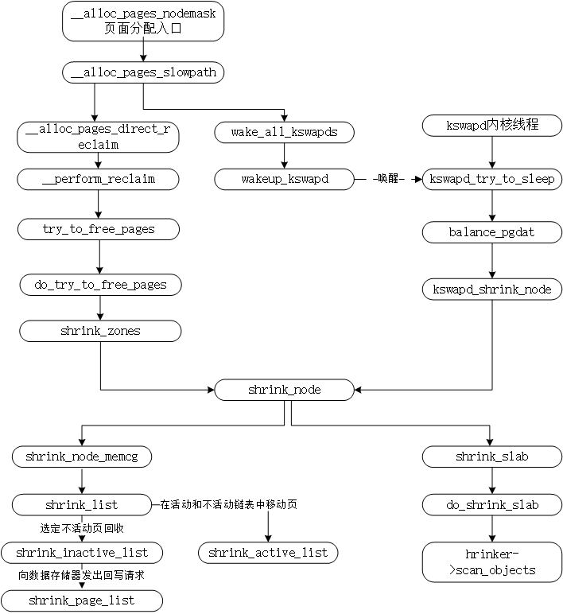

# 内存管理之页面回收

[https://www.cnblogs.com/tolimit/p/5447448.html](https://www.cnblogs.com/tolimit/p/5447448.html)

[https://www.cnblogs.com/tolimit/p/5435068.html](https://www.cnblogs.com/tolimit/p/5435068.html)

一、页面回收LRU

```
185 #define LRU_BASE 0
186 #define LRU_ACTIVE 1
187 #define LRU_FILE 2
188
189 enum lru_list {
190 ▼       LRU_INACTIVE_ANON = LRU_BASE,
191 ▼       LRU_ACTIVE_ANON = LRU_BASE + LRU_ACTIVE,
192 ▼       LRU_INACTIVE_FILE = LRU_BASE + LRU_FILE,
193 ▼       LRU_ACTIVE_FILE = LRU_BASE + LRU_FILE + LRU_ACTIVE,
194 ▼       LRU_UNEVICTABLE,  //此链表中保存的是此zone中所有禁止换出的页的描述符。
195 ▼       NR_LRU_LISTS
196 };

225 struct lruvec {                                                                                                                   
226 ▼       struct list_head▼       ▼       lists[NR_LRU_LISTS];
227 ▼       struct zone_reclaim_stat▼       reclaim_stat;
228 ▼       /* Evictions & activations on the inactive file list */
229 ▼       atomic_long_t▼  ▼       ▼       inactive_age;
230 #ifdef CONFIG_MEMCG
231 ▼       struct pglist_data *pgdat;
232 #endif
233 };

598 typedef struct pglist_data {
688 ▼       /* Fields commonly accessed by the page reclaim scanner */
689 ▼       struct lruvec▼  ▼       lruvec;  
704 } pg_data_t;
```

通过调用mlock\(\)将一些内存页锁在内存中时，这些内存页就会被加入到它们锁在的zone的LRU\_UNEVICTABLE链表中，在LRU\_UNEVICTABLE链表中的页可能是文件页也可能是匿名页。

```
11 /* 14 pointers + two long's align the pagevec structure to a power of two */
12 #define PAGEVEC_SIZE▼   14
17 struct pagevec {                                                                                                                   
18 ▼       unsigned long nr;
19 ▼       unsigned long cold;
20 ▼       struct page *pages[PAGEVEC_SIZE];
21 };
```

page的lru类型判断返回：

```
106 static __always_inline enum lru_list page_lru(struct page *page)
107 {
108 ▼       enum lru_list lru;
109
110 ▼       if (PageUnevictable(page))
111 ▼       ▼       lru = LRU_UNEVICTABLE;
112 ▼       else {
113 ▼       ▼       lru = page_lru_base_type(page);
114 ▼       ▼       if (PageActive(page))
115 ▼       ▼       ▼       lru += LRU_ACTIVE;
116 ▼       }
117 ▼       return lru;
118 }
```

```
74 enum pageflags {
75 ▼       PG_locked,▼     ▼       /* Page is locked. Don't touch. */
76 ▼       PG_error,
77 ▼       PG_referenced,
78 ▼       PG_uptodate,
79 ▼       PG_dirty,
80 ▼       PG_lru,
81 ▼       PG_active,
82 ▼       PG_slab,
83 ▼       PG_owner_priv_1,▼       /* Owner use. If pagecache, fs may use*/
84 ▼       PG_arch_1,
85 ▼       PG_reserved,
86 ▼       PG_private,▼    ▼       /* If pagecache, has fs-private data */
87 ▼       PG_private_2,▼  ▼       /* If pagecache, has fs aux data */
88 ▼       PG_writeback,▼  ▼       /* Page is under writeback */
89 ▼       PG_head,▼       ▼       /* A head page */
90 ▼       PG_swapcache,▼  ▼       /* Swap page: swp_entry_t in private */
91 ▼       PG_mappedtodisk,▼       /* Has blocks allocated on-disk */
92 ▼       PG_reclaim,▼    ▼       /* To be reclaimed asap */
93 ▼       PG_swapbacked,▼ ▼       /* Page is backed by RAM/swap */
94 ▼       PG_unevictable,▼▼       /* Page is "unevictable"  */
95 #ifdef CONFIG_MMU
96 ▼       PG_mlocked,▼    ▼       /* Page is vma mlocked */
97 #endif
98 #ifdef CONFIG_ARCH_USES_PG_UNCACHED
99 ▼       PG_uncached,▼   ▼       /* Page has been mapped as uncached */
100 #endif
101 #ifdef CONFIG_MEMORY_FAILURE
102 ▼       PG_hwpoison,▼   ▼       /* hardware poisoned page. Don't touch */
103 #endif
104 #if defined(CONFIG_IDLE_PAGE_TRACKING) && defined(CONFIG_64BIT)
105 ▼       PG_young,
106 ▼       PG_idle,
107 #endif
108 ▼       __NR_PAGEFLAGS,
109
110 ▼       /* Filesystems */
111 ▼       PG_checked = PG_owner_priv_1,
112
113 ▼       /* Two page bits are conscripted by FS-Cache to maintain local caching
114 ▼        * state.  These bits are set on pages belonging to the netfs's inodes
115 ▼        * when those inodes are being locally cached.
116 ▼        */
117 ▼       PG_fscache = PG_private_2,▼     /* page backed by cache */
118
119 ▼       /* XEN */
120 ▼       /* Pinned in Xen as a read-only pagetable page. */
121 ▼       PG_pinned = PG_owner_priv_1,
122 ▼       /* Pinned as part of domain save (see xen_mm_pin_all()). */
123 ▼       PG_savepinned = PG_dirty,
124 ▼       /* Has a grant mapping of another (foreign) domain's page. */
125 ▼       PG_foreign = PG_owner_priv_1,
126
127 ▼       /* SLOB */
128 ▼       PG_slob_free = PG_private,
129
130 ▼       /* Compound pages. Stored in first tail page's flags */
131 ▼       PG_double_map = PG_private_2,
132
133 ▼       /* non-lru isolated movable page */
134 ▼       PG_isolated = PG_reclaim,
135 };
```


/\* 在lru算法中主要用到的page标志

\* PG\_active: 表示此页当前是否活跃，当放到或者准备    放到活动lru链表时，被置位

\* PG\_referenced: 表示此页最近是否被访问，每次页面访问都会被置位

\* PG\_lru: 表示此页是处于lru链表中的

\* PG\_mlocked: 表示此页被mlock\(\)锁在内存中，禁止换出和释放

\* PG\_swapbacked: 表示此页依靠swap，可能是进程的匿名页\(堆、栈、数据段\)，匿名mmap共享内存映射，shmem共享内存映射

\*/


```
从lru链表尾部取page，摘除掉，此处的pages入参是lru链表头list_head
struct page *page = lru_to_page(pages);
list_del(&page->lru);
```

mark\_page\_accessed体现的是一个状态机

inactive,unreferenced      \-\>      inactive,referenced

inactive,referenced          \-\>      active,unreferenced

active,unreferenced         \-\>      active,referenced

```
/* 这部分的lru缓存是用于那些原来不属于lru链表的，新加入进来的页 */
46 static DEFINE_PER_CPU(struct pagevec, lru_add_pvec); 
/* 在这个lru_rotate_pvecs中的页都是非活动页并且在非活动lru链表中，将这些页移动到非活动lru链表的末尾 */
47 static DEFINE_PER_CPU(struct pagevec, lru_rotate_pvecs);
48 static DEFINE_PER_CPU(struct pagevec, lru_deactivate_file_pvecs);
/* 在这个lru缓存的页原本应属于活动lru链表中的页，会强制清除PG_activate和PG_referenced，并加入到非活动lru链表的链表表头
49 static DEFINE_PER_CPU(struct pagevec, lru_deactivate_pvecs);
50 #ifdef CONFIG_SMP
/* 将此lru缓存中的页放到活动页lru链表头中，这些页原本属于非活动lru链表的页 */
51 static DEFINE_PER_CPU(struct pagevec, activate_page_pvecs);
52 #endif

static void __lru_cache_add(struct page *page)  ==>lru_add_pvec
void rotate_reclaimable_page(struct page *page)  ==> lru_rotate_pvecs
void deactivate_page(struct page *page) ==>lru_deactivate_pvecs
void activate_page(struct page *page)  ==>activate_page_pvecs
```

页面PG\_active 和 PG\_referenced处理主要函数

```
1表示mark_page_accessed()：当一个页面被访问时，则调用该函数相应地修改 PG_active 和 PG_referenced。
2表示page_referenced()：返回访问引用pte个数。对于每个PTE项并清除L_PTE_YOUNG位，通过缺页异常的方式来实现该虚拟地址页是否最近访问。
  page_check_references():通过调用TestClearPageReferenced清除该page的PG_referenced位，并实现PG_active 和 PG_referenced状态转移判断逻辑。
3表示activate_page()：该函数将页面放到 active 链表上去。
4表示shrink_active_list()：该函数将页面移动到 inactive 链表上去。
```


二、页面回收策略框架




struct scan\_control 用于回收内存函数shrink\_node的参数

```
  62 struct scan_control {
  63 ▼       /* How many pages shrink_list() should reclaim */
  64 ▼       unsigned long nr_to_reclaim;

  66 ▼       /* This context's GFP mask */
  67 ▼       gfp_t gfp_mask;

  69 ▼       /* Allocation order */
  70 ▼       int order;
  76 ▼       nodemask_t▼     *nodemask;
  82 ▼       struct mem_cgroup *target_mem_cgroup;
  83
  84 ▼       /* Scan (total_size >> priority) pages at once */
  85 ▼       int priority;
  86
  87 ▼       /* The highest zone to isolate pages for reclaim from */
  88 ▼       enum zone_type reclaim_idx;
  89
  90 ▼       unsigned int may_writepage:1;
  91
  92 ▼       /* Can mapped pages be reclaimed? */
  93 ▼       unsigned int may_unmap:1;
  94
  95 ▼       /* Can pages be swapped as part of reclaim? */
  96 ▼       unsigned int may_swap:1;               
  98 ▼       /* Can cgroups be reclaimed below their normal consumption range? */
  99 ▼       unsigned int may_thrash:1;
100
101 ▼       unsigned int hibernation_mode:1;
102
103 ▼       /* One of the zones is ready for compaction */
104 ▼       unsigned int compaction_ready:1;
105
106 ▼       /* Incremented by the number of inactive pages that were scanned */
107 ▼       unsigned long nr_scanned;
108
109 ▼       /* Number of pages freed so far during a call to shrink_zones() */
110 ▼       unsigned long nr_reclaimed;
111 };
```

三、收缩其他缓存

```
49 struct shrinker {
50 ▼       unsigned long (*count_objects)(struct shrinker *,
51 ▼       ▼       ▼       ▼              struct shrink_control *sc); //count_objects返回cache中的空闲项 单位是page还是slab？？
52 ▼       unsigned long (*scan_objects)(struct shrinker *,
53 ▼       ▼       ▼       ▼             struct shrink_control *sc); //scan_objects尝试释放cache中的空闲项
54
55 ▼       int seeks;▼     /* seeks to recreate an obj */
56 ▼       long batch;▼    /* reclaim batch size, 0 = default */
57 ▼       unsigned long flags;
58
59 ▼       /* These are for internal use */
60 ▼       struct list_head list;                //将所有的shrinker加入shrinker_list链表进行串联起来
61 ▼       /* objs pending delete, per node */
62 ▼       atomic_long_t *nr_deferred;
63 };
```

 

inode/dentry 缓存收缩

inode/dentry 高速缓存用于提高linux对象处理效率，那么什么时候会需要申请呢？？

```

253 ▼       s->s_shrink.seeks = DEFAULT_SEEKS;
254 ▼       s->s_shrink.scan_objects = super_cache_scan;
255 ▼       s->s_shrink.count_objects = super_cache_count;
256 ▼       s->s_shrink.batch = 1024;
257 ▼       s->s_shrink.flags = SHRINKER_NUMA_AWARE | SHRINKER_MEMCG_AWARE;
522 ▼       err = register_shrinker(&s->s_shrink);

//注册一个收缩函数
register_shrinker(&s->s_shrink);

super_cache_scan
    prune_dcache_sb
        dentry_free(dentry)  //通过kmem_cache_free释放将内存返回给slab系统中，slab中缓存page多了会将page返回给buddy系统
    prune_icache_sb
        evict(inode);        //通过kmem_cache_free释放将内存返回给slab系统中，slab中缓存page多了会将page返回给buddy系统
    fs_objects = sb->s_op->nr_cached_objects(sb, sc)
    freed += sb->s_op->free_cached_objects(sb, sc)    //释放超级块的缓存

//注销一个收缩函数
unregister_shrinker(struct shrinker *shrinker)
```
